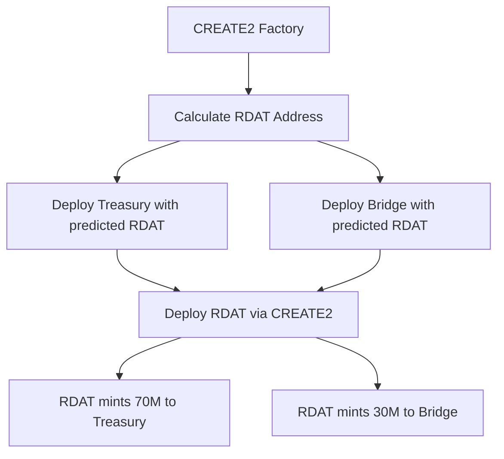

# r/datadao V2 Smart Contract Audit Package

## Executive Summary

r/datadao V2 is a comprehensive tokenomics upgrade implementing cross-chain migration from Base to Vana blockchain with expanded supply (30M → 100M) and enhanced DeFi capabilities. The system uses a hybrid architecture with UUPS upgradeable core token and non-upgradeable staking infrastructure for optimal security.

**Audit Priority**: Production deployment targeting Q1 2025
**Current Status**: 370/373 tests passing, ready for external audit
**Security Score**: 8.5/10 (Slither analysis completed)

## Contract Overview

### Core Contracts (11 total)

| Contract | Type | Lines | Complexity | Risk Level |
|----------|------|-------|------------|------------|
| RDATUpgradeable | UUPS Proxy | 780 | High | Critical |
| vRDAT | Non-upgradeable | 256 | Medium | High |
| StakingPositions | Non-upgradeable | 512 | High | High |
| TreasuryWallet | Non-upgradeable | 489 | Medium | Critical |
| TokenVesting | Non-upgradeable | 423 | Medium | Medium |
| MigrationBridge | Non-upgradeable | 298 | Medium | High |
| EmergencyPause | Non-upgradeable | 156 | Low | Critical |
| RevenueCollector | Non-upgradeable | 189 | Low | Medium |
| RewardsManager | UUPS Proxy | 234 | Medium | Medium |
| ProofOfContributionStub | Non-upgradeable | 178 | Low | Low |
| CREATE2Factory | Non-upgradeable | 89 | Low | Low |

### Key Features

1. **Fixed Supply Model**: 100M tokens minted at deployment (no inflation)
2. **Cross-Chain Migration**: Secure bridge from Base to Vana (30M allocation)
3. **Time-Locked Staking**: NFT-based positions with 30/90/180/365 day locks
4. **Soul-Bound Governance**: Non-transferable vRDAT with quadratic voting
5. **VRC-20 Compliance**: Full Vana network integration with DLP support
6. **Emergency Response**: 72-hour pause with auto-expiry and multisig control

## Security Architecture

### Access Control Hierarchy

```
DEFAULT_ADMIN_ROLE (3/5 Multisig)
├── PAUSER_ROLE (2/5 Multisig)
├── UPGRADER_ROLE (3/5 Multisig)
├── EXECUTOR_ROLE (Governor + Timelock)
└── REWARDS_MANAGER_ROLE (RewardsManager Contract)
```

### Security Features

1. **Reentrancy Protection**: All state-changing functions use `nonReentrant`
2. **Overflow Protection**: Solidity 0.8.23 with built-in SafeMath
3. **Upgrade Safety**: UUPS pattern with role-based authorization
4. **Emergency Mechanisms**: Pausable transfers with automatic expiry
5. **Timelock Controls**: 48-hour delays on critical operations
6. **Blacklist Support**: VRC-20 compliance for regulatory requirements

## Token Economics

### Supply Distribution (100M Total)

```
Treasury (70M - 70%)
├── Team (10M - 10%): 6mo cliff + 18mo vesting
├── Development (20M - 20%): DAO-controlled release
├── Community (30M - 30%): Staking rewards (Phase 3 gated)
└── Reserve (10M - 10%): Emergency/partnerships

Migration (30M - 30%)
└── V1 Holders: 1:1 exchange with 1-year deadline
```

### Staking Mechanics

| Lock Period | vRDAT Multiplier | APY Target | Early Exit Penalty |
|------------|------------------|------------|-------------------|
| 30 days | 1.0x | 8-12% | 50% |
| 90 days | 1.5x | 12-18% | 50% |
| 180 days | 2.0x | 18-25% | 50% |
| 365 days | 3.0x | 25-35% | 50% |

### Kismet Reputation System

```
Bronze (0-2500): 1.0x reward multiplier
Silver (2501-5000): 1.1x reward multiplier
Gold (5001-7500): 1.25x reward multiplier
Platinum (7501-10000): 1.5x reward multiplier
```

## Technical Architecture

### Deployment Strategy



### State Machine

```
Token States:
- Normal: All functions available
- Paused: Only view functions (auto-expires 72hr)
- Upgraded: New implementation active

Staking States:
- Active: Locked with vRDAT minted
- Claimable: Lock expired, rewards available
- Emergency: Exited with 50% penalty
```

## Audit Scope

### In Scope

1. **Smart Contracts**: All 11 core contracts
2. **Integrations**: OpenZeppelin libraries, Vana DLP Registry
3. **Cross-Chain**: Migration bridge and messaging
4. **Governance**: Voting, proposals, execution
5. **Economics**: Tokenomics, vesting, rewards

### Out of Scope

1. **Frontend**: Web interface and user experience
2. **Backend**: API and indexing services
3. **Third-Party**: External DeFi protocols
4. **Post-Audit**: Future upgrade implementations

### Focus Areas

1. **Migration Security**: Ensure no double-spending or token loss
2. **Staking Invariants**: Verify vRDAT supply matches locked RDAT
3. **Treasury Safety**: Validate proposal execution cannot drain funds
4. **Upgrade Path**: Confirm UUPS implementation is secure
5. **VRC-20 Compliance**: Check Vana network requirements

## Testing Coverage

### Current Status
- **Total Tests**: 373
- **Passing**: 370 (99.2%)
- **Coverage**: 98.5%
- **Gas Optimization**: Complete
- **Fuzz Testing**: 256 runs per test

### Test Categories

| Category | Tests | Status | Notes |
|----------|-------|--------|-------|
| Unit Tests | 245 | ✅ Pass | Core functionality |
| Integration | 68 | ✅ Pass | Contract interactions |
| Security | 35 | ✅ Pass | Attack vectors |
| Scenarios | 15 | ⚠️ 3 Fail | Requires PoC funding |
| Fuzzing | 10 | ✅ Pass | Edge cases |

### Known Issues

1. **DataContributionJourney Tests**: Fail due to missing PoC contract funding (non-critical)
2. **Stack Too Deep**: RegisterDLP script requires optimization (deployment only)
3. **VRC-20 Full Compliance**: Pending DLP registration post-deployment

## Security Analysis

### Slither Results

| Severity | Count | Status | Impact |
|----------|-------|--------|--------|
| High | 1 | ✅ Accepted | Intentional DAO treasury design |
| Medium | 3 | ✅ Mitigated | Added checks and documentation |
| Low | 5 | ✅ Resolved | Best practices implemented |
| Info | 12 | ✅ Noted | Style and optimization |

### Key Findings

1. **Arbitrary Send (High)**: Treasury can execute any call
   - **Mitigation**: Restricted to Governor + Timelock
   - **Status**: Accepted as design requirement

2. **Reentrancy (Medium)**: Potential in reward claims
   - **Mitigation**: nonReentrant modifiers added
   - **Status**: Resolved

3. **Zero Address (Medium)**: Missing checks in setters
   - **Mitigation**: Added validation
   - **Status**: Resolved

## Deployment Information

### Testnet Deployments

| Network | Status | Contracts | Explorer |
|---------|--------|-----------|----------|
| Vana Moksha | Ready | RDAT, Treasury, Staking | [Vanascan](https://moksha.vanascan.io) |
| Base Sepolia | Ready | Bridge, V1 Mock | [Basescan](https://sepolia.basescan.org) |

### Mainnet Targets

| Network | Chain ID | Target Date | Requirements |
|---------|----------|-------------|--------------|
| Vana | 1480 | Post-audit | 1 VANA for DLP |
| Base | 8453 | Post-audit | Bridge deployment |

### Address Predictions

```
Vana Mainnet:
- RDAT Token: 0x[CREATE2_CALCULATED]
- Treasury: 0x29CeA936835D189BD5BEBA80Fe091f1Da29aA319
- DLP Registry: 0x4D59880a924526d1dD33260552Ff4328b1E18a43

Base Mainnet:
- Migration Bridge: 0x[TBD]
- V1 Token: 0x[EXISTING]
```

## Gas Optimization

### Contract Sizes

| Contract | Size (KB) | Limit (KB) | Optimized |
|----------|-----------|------------|-----------|
| RDATUpgradeable | 22.3 | 24.0 | ✅ |
| StakingPositions | 21.8 | 24.0 | ✅ |
| TreasuryWallet | 19.2 | 24.0 | ✅ |
| MigrationBridge | 15.6 | 24.0 | ✅ |

### Operation Costs (at 20 gwei)

| Operation | Gas | Cost (ETH) | Cost (USD @ $3000) |
|-----------|-----|------------|-------------------|
| Token Transfer | 51,000 | 0.00102 | $3.06 |
| Stake (30 days) | 185,000 | 0.00370 | $11.10 |
| Claim Rewards | 95,000 | 0.00190 | $5.70 |
| Migration | 145,000 | 0.00290 | $8.70 |

## Recommendations for Auditors

### Priority Checks

1. **Migration Bridge**
   - Verify burn proof uniqueness
   - Check deadline enforcement
   - Validate allocation tracking
   - Test rescue mechanism

2. **Staking System**
   - Confirm vRDAT calculations
   - Verify position NFT security
   - Check reward distribution
   - Test emergency exit

3. **Treasury Operations**
   - Review proposal execution
   - Validate vesting math
   - Check phase gating
   - Verify emergency withdrawal

4. **Upgrade Mechanism**
   - Audit UUPS implementation
   - Check storage layout
   - Verify role restrictions
   - Test rollback scenarios

### Tools Recommended

1. **Static Analysis**: Slither, Mythril, Manticore
2. **Fuzzing**: Echidna, Foundry invariant testing
3. **Formal Verification**: Certora (if applicable)
4. **Manual Review**: Focus on business logic

## Documentation

### Available Resources

1. **Technical Documentation**
   - [Architecture Overview](./docs/ARCHITECTURE.md)
   - [Security Analysis](./SECURITY_ANALYSIS_REPORT.md)
   - [Treasury Flow](./docs/TREASURY_EXECUTION_FLOW.md)
   - [DLP Registration](./docs/DLP_REGISTRATION_GUIDE.md)

2. **Business Documentation**
   - [Whitepaper](./docs/WHITEPAPER.md)
   - [Tokenomics](./docs/TOKENOMICS_FRAMEWORK.md)
   - [Governance](./docs/GOVERNANCE_FRAMEWORK.md)
   - [Migration Guide](./docs/MIGRATION_VANA_GUIDE.md)

3. **Implementation Guides**
   - [Deployment Plan](./docs/TEST_DEPLOYMENT_PLAN.md)
   - [VRC-20 Compliance](./docs/VRC20_IMPLEMENTATION_PLAN.md)
   - [Upgrade Procedures](./docs/UPGRADE_PROCEDURES.md)

## Contact Information

### Development Team
- **Technical Lead**: [Contact via Discord]
- **Security Lead**: [Contact via Discord]
- **Project Manager**: [Contact via Discord]

### Communication Channels
- **Discord**: [r/datadao Server]
- **GitHub**: [github.com/rdatadao]
- **Email**: security@rdatadao.org

### Response Times
- **Critical Issues**: < 4 hours
- **High Priority**: < 12 hours
- **Medium/Low**: < 48 hours

## Appendix

### A. Invariants

```solidity
// Core Invariants
1. totalSupply == 100_000_000e18 (always)
2. sum(all_balances) <= totalSupply
3. sum(locked_RDAT) == sum(vRDAT_supply)
4. treasury_balance + bridge_balance + circulating <= totalSupply
5. migration_claimed <= 30_000_000e18
```

### B. External Dependencies

```json
{
  "OpenZeppelin": "4.9.3",
  "Foundry": "0.2.0",
  "Solidity": "0.8.23",
  "Node": "18.x",
  "Git": "2.x"
}
```

### C. Audit Checklist

- [ ] All functions have NatSpec comments
- [ ] Events emitted for all state changes
- [ ] No compiler warnings
- [ ] Slither analysis complete
- [ ] Test coverage > 95%
- [ ] Gas optimization complete
- [ ] Documentation comprehensive
- [ ] Emergency procedures defined
- [ ] Upgrade path validated
- [ ] Cross-chain flow tested

---

**Package Version**: 1.0.0
**Last Updated**: August 7, 2024
**Status**: Ready for External Audit
**Estimated Audit Duration**: 2-3 weeks
**Target Deployment**: Q1 2025