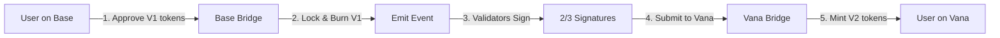

# Frontend Integration Guide V2 - Production Ready
## Complete Guide for Mainnet & Testnet Integration

Last Updated: September 20, 2025
Status: **MAINNET DEPLOYED** ✅

---

## 🚀 Critical Information - Mainnet Deployment

### Mainnet Contract Addresses

#### Vana Mainnet (Chain ID: 1480)
```javascript
const VANA_MAINNET = {
  chainId: 1480,
  rpcUrl: 'https://rpc.vana.org',
  explorer: 'https://vanascan.io',
  contracts: {
    // Core Contracts
    rdatToken: '0x2c1CB448cAf3579B2374EFe20068Ea97F72A996E',        // Main RDAT V2 Token
    treasury: '0x77D2713972af12F1E3EF39b5395bfD65C862367C',         // Treasury Wallet (70M RDAT)
    migrationBridge: '0x9d4aB2d3fb25D414dba1d9D22200356b5984D35E',  // Vana Migration Bridge (30M RDAT)
    rdatDataDAO: '0xBbB0B59163b850dDC5139e98118774557c5d9F92',      // DLP Contract

    // Implementation Addresses (for upgrades)
    rdatImplementation: '0xaA77d23Df97C0693308B9A6560d50d376794C8f5',
    treasuryImplementation: '0xb8E3f2A01819f2A66b1667DB271568AD2f7BD9Be',

    // DLP Registration
    dlpId: 40,  // CRITICAL: Use this ID for Vana rewards
    dlpRegistry: '0x4D59880a924526d1dD33260552Ff4328b1E18a43'
  },
  multisigs: {
    admin: '0xe4F7Eca807C57311e715C3Ef483e72Fa8D5bCcDF'  // Vana Multisig (3/5 signers)
  }
}
```

#### Base Mainnet (Chain ID: 8453)
```javascript
const BASE_MAINNET = {
  chainId: 8453,
  rpcUrl: 'https://mainnet.base.org',
  explorer: 'https://basescan.org',
  contracts: {
    rdatV1: '0x4498cd8Ba045E00673402353f5a4347562707e7D',         // Original RDAT V1 Token
    migrationBridge: '0xa4435b45035a483d364de83B9494BDEFA8322626'  // Base Migration Bridge
  },
  multisigs: {
    admin: '0x90013583c66D2bf16327cB5Bc4a647AcceCF4B9A'  // Base Multisig
  }
}
```

### Token Economics
- **Total Supply**: 100,000,000 RDAT (fixed, no minting)
- **Treasury Allocation**: 70,000,000 RDAT
- **Migration Pool**: 30,000,000 RDAT (for V1→V2 migration)
- **Migration Ratio**: 1:1 (1 RDAT V1 = 1 RDAT V2)

---

## 👥 Wallet Management & Admin Features

### Required Wallet Types

#### 1. User Wallets (Standard Features)
- View RDAT balance
- Transfer tokens
- Initiate migration from V1 to V2
- Contribute data (future feature)
- Stake tokens (future feature)

#### 2. Multisig Admin Wallets (Enhanced Features)

**Vana Multisig (`0xe4F7Eca807C57311e715C3Ef483e72Fa8D5bCcDF`)**
- Treasury management
- Vesting schedule administration
- Emergency pause capability
- Contract upgrades (UUPS pattern)
- DLP management
- Validator management

**Base Multisig (`0x90013583c66D2bf16327cB5Bc4a647AcceCF4B9A`)**
- Migration bridge administration
- Emergency pause on Base side

#### 3. Validator Wallets (Migration Signatures)
```javascript
const VALIDATORS = {
  validator1: '0xd36B49f2DB6aA708Ce7245e8ab2453C6DfFc9d6f',  // Angela (dev)
  validator2: '0xC9Af4E56741f255743e8f4877d4cfa9971E910C2',  // monkfenix.eth
  validator3: '0x08Cc5ed1bA3C95AA741f8AaEf631f716b037444b'   // Base multisig
}
// Requires 2 of 3 signatures for migration approval
```

### Admin Feature Requirements

```typescript
interface AdminFeatures {
  // Treasury Management
  executeDAOProposal: (to: string, amount: BigNumber, reason: string) => Transaction;
  updateVestingSchedule: (scheduleId: string, params: VestingParams) => Transaction;
  withdrawPenalties: () => Transaction;  // Recover slashed tokens

  // Access Control
  grantRole: (role: string, account: string) => Transaction;
  revokeRole: (role: string, account: string) => Transaction;

  // Emergency Controls
  pause: () => Transaction;
  unpause: () => Transaction;

  // DLP Management
  updateDLPRegistration: (dlpId: number) => Transaction;
  setDLPRegistry: (registryAddress: string) => Transaction;

  // Migration Bridge
  addValidator: (address: string) => Transaction;
  removeValidator: (address: string) => Transaction;
  setRequiredSignatures: (count: number) => Transaction;
}
```

---

## 🔄 Migration Flow Implementation

### Complete V1 to V2 Migration Process



### Frontend Implementation

```typescript
// Step 1: Check V1 Balance on Base
async function checkV1Balance(userAddress: string): Promise<BigNumber> {
  const v1Contract = new Contract(BASE_MAINNET.contracts.rdatV1, ERC20_ABI, provider);
  return await v1Contract.balanceOf(userAddress);
}

// Step 2: Approve Migration on Base
async function approveMigration(amount: BigNumber): Promise<TransactionResponse> {
  const v1Contract = new Contract(BASE_MAINNET.contracts.rdatV1, ERC20_ABI, signer);
  return await v1Contract.approve(BASE_MAINNET.contracts.migrationBridge, amount);
}

// Step 3: Initiate Migration on Base
async function initiateMigration(amount: BigNumber): Promise<TransactionResponse> {
  const bridgeContract = new Contract(
    BASE_MAINNET.contracts.migrationBridge,
    BRIDGE_ABI,
    signer
  );
  return await bridgeContract.initiateMigration(amount);
}

// Step 4: Wait for Validator Signatures (Backend Process)
async function waitForSignatures(migrationId: string): Promise<string[]> {
  // Poll backend API for validator signatures
  // Requires 2 of 3 validators to sign
  return await fetchSignaturesFromAPI(migrationId);
}

// Step 5: Complete Migration on Vana
async function completeMigration(
  userAddress: string,
  amount: BigNumber,
  migrationId: string,
  signatures: string[]
): Promise<TransactionResponse> {
  const vanaBridge = new Contract(
    VANA_MAINNET.contracts.migrationBridge,
    VANA_BRIDGE_ABI,
    vanaSigner
  );
  return await vanaBridge.processMigration(
    userAddress,
    amount,
    migrationId,
    signatures
  );
}
```

---

## 📊 Testnet Configuration

### Vana Moksha Testnet (Chain ID: 14800)
```javascript
const VANA_TESTNET = {
  chainId: 14800,
  rpcUrl: 'https://rpc.moksha.vana.org',
  explorer: 'https://moksha.vanascan.io',
  contracts: {
    rdatToken: '0xEb0c43d5987de0672A22e350930F615Af646e28c',
    treasury: '0x31C3e3F091FB2A25d4dac82474e7dc709adE754a',
    // ... other testnet contracts
  },
  multisigs: {
    admin: '0x29CeA936835D189BD5BEBA80Fe091f1Da29aA319'
  }
}
```

### Base Sepolia Testnet (Chain ID: 84532)
```javascript
const BASE_TESTNET = {
  chainId: 84532,
  rpcUrl: 'https://sepolia.base.org',
  explorer: 'https://sepolia.basescan.org',
  contracts: {
    mockRDATv1: '0xEb0c43d5987de0672A22e350930F615Af646e28c',
    migrationBridge: '0xF73c6216d7D6218d722968e170Cfff6654A8936c'
  }
}
```

---

## 🛠️ ABI Files & Contract Interfaces

### Required ABIs
```bash
# Generate ABIs from compiled contracts
forge inspect RDATUpgradeable abi > abi/RDATUpgradeable.json
forge inspect TreasuryWallet abi > abi/TreasuryWallet.json
forge inspect VanaMigrationBridge abi > abi/VanaMigrationBridge.json
forge inspect BaseMigrationBridge abi > abi/BaseMigrationBridge.json
forge inspect RDATDataDAO abi > abi/RDATDataDAO.json
```

### Key Contract Methods

#### RDAT Token (ERC-20/VRC-20)
```typescript
interface IRDATToken {
  // Standard ERC-20
  balanceOf(address: string): Promise<BigNumber>;
  transfer(to: string, amount: BigNumber): Promise<Transaction>;
  approve(spender: string, amount: BigNumber): Promise<Transaction>;
  allowance(owner: string, spender: string): Promise<BigNumber>;
  totalSupply(): Promise<BigNumber>;

  // DLP Integration
  dlpId(): Promise<number>;  // Returns 40 on mainnet
  dlpRegistered(): Promise<boolean>;

  // Access Control
  hasRole(role: bytes32, account: string): Promise<boolean>;
  getRoleAdmin(role: bytes32): Promise<bytes32>;
}
```

#### Treasury Wallet
```typescript
interface ITreasuryWallet {
  // Vesting Management
  getAllVestingSchedules(): Promise<VestingSchedule[]>;
  getCurrentPhase(): Promise<number>;
  isPhaseActive(phase: number): Promise<boolean>;

  // DAO Operations
  executeDAOProposal(to: string, amount: BigNumber, reason: string): Promise<Transaction>;

  // View Functions
  rdatBalance(): Promise<BigNumber>;
  totalDistributed(): Promise<BigNumber>;
  withdrawPenalties(): Promise<Transaction>;  // Admin only - recover slashed tokens
}
```

#### Migration Bridges
```typescript
interface IMigrationBridge {
  // Base Side
  initiateMigration(amount: BigNumber): Promise<Transaction>;
  userMigrationTotal(user: string): Promise<BigNumber>;

  // Vana Side
  processMigration(
    user: string,
    amount: BigNumber,
    migrationId: bytes32,
    signatures: string[]
  ): Promise<Transaction>;
  remainingAllocation(): Promise<BigNumber>;
  totalMigrated(): Promise<BigNumber>;
}
```

---

## 🎨 UI Components Checklist

### Essential Pages

#### 1. Dashboard
- [ ] Total RDAT V2 Supply: 100M
- [ ] User's RDAT balance
- [ ] Migration status (if applicable)
- [ ] DLP rewards earned
- [ ] Network switcher (Base/Vana)

#### 2. Migration Center
- [ ] V1 balance on Base
- [ ] V2 balance on Vana
- [ ] Migration form with amount input
- [ ] Migration history table
- [ ] Status tracker (pending/completed)
- [ ] Network indicator

#### 3. Treasury Overview
- [ ] Total treasury balance (70M RDAT)
- [ ] Vesting schedule visualization
- [ ] Distribution history
- [ ] Current phase indicator
- [ ] Penalty pool balance

#### 4. Admin Panel (Multisig Only)
- [ ] Treasury management interface
- [ ] Vesting schedule editor
- [ ] Emergency pause controls
- [ ] Validator management
- [ ] Role management
- [ ] Penalty withdrawal

#### 5. DLP/Rewards (Future)
- [ ] Data contribution form
- [ ] Contribution history
- [ ] Reward tracking
- [ ] DLP statistics
- [ ] Leaderboard

### Component Library

```typescript
// Core Components
<TokenBalance address={userAddress} />
<MigrationWidget />
<TreasuryStats />
<VestingSchedule />
<NetworkSwitcher networks={[VANA_MAINNET, BASE_MAINNET]} />

// Admin Components (render conditionally based on wallet)
<AdminPanel isMultisig={isMultisigWallet} />
<EmergencyControls />
<ValidatorManager validators={VALIDATORS} />
<PenaltyWithdrawal />

// Transaction Components
<TransactionHistory />
<PendingTransaction tx={pendingTx} />
<TransactionStatus txHash={hash} />
```

---

## 🔐 Security Considerations

### Input Validation
```typescript
// Always validate amounts
function validateAmount(amount: string, decimals = 18): BigNumber {
  if (!amount || isNaN(Number(amount))) {
    throw new Error('Invalid amount');
  }

  const parsed = parseUnits(amount, decimals);
  if (parsed.lte(0)) {
    throw new Error('Amount must be greater than 0');
  }

  return parsed;
}

// Check sufficient balance
async function checkSufficientBalance(
  tokenAddress: string,
  userAddress: string,
  amount: BigNumber
): Promise<boolean> {
  const contract = new Contract(tokenAddress, ERC20_ABI, provider);
  const balance = await contract.balanceOf(userAddress);
  return balance.gte(amount);
}
```

### Role Verification
```typescript
// Check if user is admin
async function isAdmin(address: string): Promise<boolean> {
  const contract = new Contract(VANA_MAINNET.contracts.rdatToken, TOKEN_ABI, provider);
  const DEFAULT_ADMIN_ROLE = '0x00...'; // Get from contract
  return await contract.hasRole(DEFAULT_ADMIN_ROLE, address);
}

// Check if address is multisig
function isMultisig(address: string): boolean {
  return address.toLowerCase() === VANA_MAINNET.multisigs.admin.toLowerCase() ||
         address.toLowerCase() === BASE_MAINNET.multisigs.admin.toLowerCase();
}
```

### Error Handling
```typescript
const ERROR_MESSAGES = {
  'ERC20: transfer amount exceeds balance': 'Insufficient RDAT balance',
  'AccessControl: account': 'You do not have permission for this action',
  'Migration already completed': 'This migration has already been processed',
  'Pausable: paused': 'Contract is currently paused for maintenance',
  'Invalid signature count': 'Not enough validator signatures',
  'Amount exceeds remaining allocation': 'Migration pool exhausted'
};

function parseContractError(error: any): string {
  const message = error?.data?.message || error?.message || '';

  for (const [key, value] of Object.entries(ERROR_MESSAGES)) {
    if (message.includes(key)) {
      return value;
    }
  }

  return 'Transaction failed. Please try again.';
}
```

---

## 📡 Event Monitoring

### Critical Events to Monitor

```typescript
// Token Events
rdatContract.on('Transfer', (from, to, amount, event) => {
  console.log(`Transfer: ${from} -> ${to}: ${formatUnits(amount, 18)} RDAT`);
  // Update UI balances
});

// Migration Events
baseBridge.on('MigrationInitiated', (user, amount, migrationId) => {
  console.log(`Migration started: ${user} - ${formatUnits(amount, 18)} RDAT`);
  // Show pending migration
});

vanaBridge.on('MigrationProcessed', (user, amount, migrationId) => {
  console.log(`Migration completed: ${user} - ${formatUnits(amount, 18)} RDAT`);
  // Show success notification
});

// DLP Events
rdatDataDAO.on('DataContributed', (contributor, dataHash, score) => {
  console.log(`Data contributed by ${contributor}, score: ${score}`);
  // Update leaderboard
});

// Admin Events
treasury.on('RoleGranted', (role, account, sender) => {
  console.log(`Role granted: ${role} to ${account} by ${sender}`);
  // Update admin panel
});

treasury.on('Paused', (account) => {
  console.log(`Contract paused by ${account}`);
  // Show maintenance mode
});
```

---

## 🧪 Testing Guide

### Test Wallet Setup
```typescript
// Mainnet - Use real wallets with appropriate funds
// Testnet - Use these test wallets (Anvil standard keys)

const TEST_WALLETS = {
  wallet1: {
    address: '0x70997970C51812dc3A010C7d01b50e0d17dc79C8',
    privateKey: '0x59c6995e998f97a5a0044966f0945389dc9e86dae88c7a8412f4603b6b78690d'
  },
  wallet2: {
    address: '0x3C44CdDdB6a900fa2b585dd299e03d12FA4293BC',
    privateKey: '0x5de4111afa1a4b94908f83103eb1f1706367c2e68ca870fc3fb9a804cdab365a'
  }
};

// WARNING: Never use test keys on mainnet!
```

### Integration Tests
```typescript
describe('RDAT V2 Integration', () => {
  it('should display correct token balance', async () => {
    const balance = await rdatContract.balanceOf(userAddress);
    expect(balance).to.be.gte(0);
  });

  it('should initiate migration from Base', async () => {
    const amount = parseUnits('100', 18);
    await rdatV1.approve(baseBridge.address, amount);
    const tx = await baseBridge.initiateMigration(amount);
    expect(tx.hash).to.be.a('string');
  });

  it('should check multisig permissions', async () => {
    const isMultisig = await isAdmin(VANA_MAINNET.multisigs.admin);
    expect(isMultisig).to.be.true;
  });
});
```

---

## 📋 Deployment Checklist

### Frontend Requirements
- [ ] Network configuration for Vana (1480) and Base (8453)
- [ ] Contract ABIs imported and typed
- [ ] Wallet connection (MetaMask, WalletConnect, etc.)
- [ ] Network switching capability
- [ ] Balance display for both V1 and V2
- [ ] Migration interface
- [ ] Treasury information display
- [ ] Admin panel (for multisig wallets)
- [ ] Error handling and user feedback
- [ ] Transaction status tracking
- [ ] Event monitoring setup

### API Requirements (Backend)
- [ ] Validator signature collection endpoint
- [ ] Migration status tracking
- [ ] Historical data queries
- [ ] DLP reward calculations
- [ ] Admin action logging

### Security Checklist
- [ ] Input validation on all forms
- [ ] Amount boundary checks
- [ ] Network verification before transactions
- [ ] Role-based UI rendering
- [ ] Secure key management
- [ ] Rate limiting on API calls

---

## 📞 Support & Resources

### Documentation
- Smart Contracts: `/docs` in this repository
- Audit Report: `/docs/audit/RDAT_V2_FINAL_AUDIT.pdf`
- Technical Specs: `/docs/SPECIFICATIONS.md`

### Contract Verification
**Mainnet Contracts**:
- [RDAT Token on Vanascan](https://vanascan.io/address/0x2c1CB448cAf3579B2374EFe20068Ea97F72A996E)
- [RDAT V1 on Basescan](https://basescan.org/token/0x4498cd8Ba045E00673402353f5a4347562707e7D)

**Testnet Contracts**:
- [Vana Moksha Explorer](https://moksha.vanascan.io)
- [Base Sepolia Explorer](https://sepolia.basescan.org)

### Quick Links
- Vana RPC: `https://rpc.vana.org`
- Base RPC: `https://mainnet.base.org`
- DLP Registry: `0x4D59880a924526d1dD33260552Ff4328b1E18a43`
- DLP ID: `40`

---

## 🚦 Go-Live Checklist

### Phase 1: Basic Functionality (Week 1)
- [ ] Token balance display
- [ ] Network switching
- [ ] Basic transfers
- [ ] Migration initiation

### Phase 2: Enhanced Features (Week 2)
- [ ] Migration completion flow
- [ ] Treasury information
- [ ] Transaction history
- [ ] Admin panel (multisig only)

### Phase 3: Advanced Features (Week 3-4)
- [ ] DLP integration
- [ ] Rewards tracking
- [ ] Vesting visualization
- [ ] Analytics dashboard

### Phase 4: Future Features (Post-Launch)
- [ ] Staking interface (when deployed)
- [ ] Governance voting (when deployed)
- [ ] Advanced treasury management
- [ ] Mobile app support

---

**Document Version**: 2.0
**Last Updated**: September 20, 2025
**Status**: Production Ready
**Deployment**: Mainnet Active

For questions or support, please refer to the documentation in this repository or contact the development team.