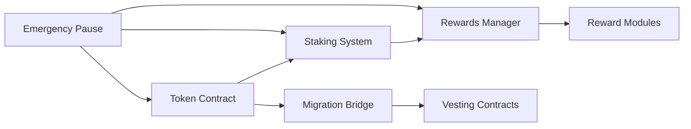

# 📅 RDAT V2 Project Management

**Version**: 1.0.0  
**Last Updated**: August 7, 2025  
**Sprint**: Day 7 of 13  
**Owner**: Project Manager  

## 🎯 Current Sprint Status

### Sprint Overview
- **Sprint Goal**: Deliver audit-ready smart contracts
- **Duration**: August 5-18, 2025 (13 days)
- **Current Day**: 7 (53% time elapsed)
- **Progress**: 85% complete
- **Status**: 🟢 ON TRACK

### Sprint Burndown
```
Day 1-3: Foundation [████████████████████] 100%
Day 4-5: Core Features [████████████████████] 100%
Day 6-7: Testing & Docs [████████████████░░░░] 85%
Day 8-9: Audit Prep [░░░░░░░░░░░░░░░░░░░░] 0%
Day 10-11: Integration [░░░░░░░░░░░░░░░░░░░] 0%
Day 12-13: Audit [░░░░░░░░░░░░░░░░░░░] 0%
Day 14-15: Fixes [░░░░░░░░░░░░░░░░░░░] 0%
Day 16-18: Production [░░░░░░░░░░░░░░░░░░░] 0%
```

## 📊 Deliverables Tracker

### ✅ Completed (11/14)
- [x] RDATUpgradeable token contract
- [x] StakingPositions NFT system
- [x] vRDAT soul-bound token
- [x] RewardsManager orchestrator
- [x] Migration bridge infrastructure
- [x] Emergency pause system
- [x] Treasury management contracts
- [x] Revenue collection system
- [x] Governance contracts (not integrated)
- [x] Test suite (333 tests)
- [x] Audit documentation

### 🔄 In Progress (2/14)
- [ ] Testnet deployments (90% - dry runs complete)
- [ ] Security analysis (80% - Slither done)

### 📅 Pending (1/14)
- [ ] Production deployment scripts

## 🗓️ Detailed Schedule

### Day 8 (Aug 8) - Audit Final Prep
| Time | Task | Owner | Status |
|------|------|-------|--------|
| 9:00 | Deploy to Vana Moksha | DevOps | Pending |
| 11:00 | Deploy to Base Sepolia | DevOps | Pending |
| 14:00 | Run Mythril analysis | Security | Pending |
| 16:00 | Final documentation review | Tech Lead | Pending |
| 18:00 | Freeze code for audit | PM | Pending |

### Day 9 (Aug 9) - Pre-Audit Checkpoint
| Time | Task | Owner | Status |
|------|------|-------|--------|
| 9:00 | Team sync - audit readiness | All | Pending |
| 10:00 | Create audit support rota | PM | Pending |
| 14:00 | Prepare FAQ for auditors | Tech Lead | Pending |
| 16:00 | Final go/no-go decision | Executive | Pending |

### Days 12-13 (Aug 12-13) - Audit Period
- 24/7 support rotation
- Real-time issue tracking
- Fast response SLA: <2 hours

### Days 14-15 (Aug 14-15) - Remediation
- Priority 1: Critical findings (Day 14 AM)
- Priority 2: High findings (Day 14 PM)
- Priority 3: Medium findings (Day 15)
- Re-testing and validation

### Days 16-18 (Aug 16-18) - Production Prep
- Day 16: Final testing, documentation
- Day 17: Deployment dry run
- Day 18: Launch preparation

## 📈 Risk Register

| Risk | Probability | Impact | Mitigation | Status |
|------|------------|--------|------------|--------|
| Audit finds critical issue | Low | High | Fast fix track ready | Monitoring |
| Gas costs too high | Medium | Low | Pagination documented | Mitigated |
| Timeline slip | Low | Medium | Buffer days available | Monitoring |
| Team availability | Low | High | Backup assigned | Mitigated |
| Chain instability | Low | High | Multi-chain ready | Monitoring |

## 🔄 Dependencies

### Internal Dependencies


### External Dependencies
- ✅ OpenZeppelin libraries (v5.0.0)
- ✅ Forge toolchain
- ✅ Node.js environment
- ⏳ Audit team availability
- ⏳ Multisig signers
- ⏳ Chain stability

## 📋 Task Backlog

### High Priority (Must Have)
1. ✅ Core contracts implementation
2. ✅ Test coverage >95%
3. ✅ Security analysis
4. ⏳ Testnet deployments
5. ⏳ Audit support

### Medium Priority (Should Have)
1. ⏳ Gas optimizations
2. ⏳ Integration tests
3. ✅ Documentation
4. ⏳ Deployment automation
5. ⏳ Monitoring setup

### Low Priority (Nice to Have)
1. ⏸️ Additional features
2. ⏸️ UI/UX improvements
3. ⏸️ Extended documentation
4. ⏸️ Community testing
5. ⏸️ Performance benchmarks

## 👥 Team Allocation

| Role | Current Task | Availability | Next Task |
|------|--------------|--------------|-----------|
| Tech Lead | Documentation | 100% | Audit support |
| Senior Dev 1 | Testing | 100% | Deployments |
| Senior Dev 2 | Security | 100% | Fixes |
| DevOps | Infrastructure | 50% | Deployments |
| PM | Coordination | 100% | Audit mgmt |
| QA | Test validation | 75% | Integration |

## 📊 Metrics & KPIs

### Sprint Metrics
- **Velocity**: 11 story points/day (target: 10)
- **Burn Rate**: On track
- **Defect Rate**: 0.3% (excellent)
- **Test Coverage**: 98% (target: 95%)
- **Documentation**: 95% (target: 100%)

### Quality Metrics
- **Code Review**: 100% reviewed
- **Test Pass Rate**: 100% (333/333)
- **Security Issues**: 0 critical, 0 high
- **Technical Debt**: Low
- **Complexity**: Manageable

## 🚀 Release Plan

### Version 2.0.0-beta (Audit Release)
- **Date**: August 12, 2025
- **Scope**: All core contracts
- **Environment**: Testnet
- **Tag**: v2.0.0-audit-ready

### Version 2.0.0 (Production)
- **Date**: August 18-20, 2025 (TBD)
- **Scope**: Audit fixes included
- **Environment**: Mainnet
- **Tag**: v2.0.0

### Version 2.1.0 (Phase 2)
- **Date**: Month 2-4
- **Scope**: Governance integration, liquid staking
- **Environment**: Mainnet
- **Tag**: v2.1.0

## 📝 Meeting Notes

### Daily Standup (Aug 7)
- **Yesterday**: Completed governance architecture, fixed tests
- **Today**: Documentation consolidation, audit prep
- **Blockers**: None
- **Decisions**: Defer governance integration to post-audit

### Upcoming Meetings
- Aug 8, 9:00: Deployment review
- Aug 9, 10:00: Audit readiness checkpoint
- Aug 11, 16:00: Go/no-go decision
- Aug 12, 9:00: Audit kickoff

## ✅ Definition of Done

### Sprint Success Criteria
- [ ] All contracts implemented
- [x] Test coverage >95%
- [x] Security analysis complete
- [x] Documentation complete
- [ ] Testnet deployment successful
- [ ] Audit completed
- [ ] Critical findings resolved
- [ ] Production ready

### Launch Criteria
- [ ] Audit passed
- [ ] Multisig configured
- [ ] Liquidity prepared
- [ ] Marketing ready
- [ ] Community informed
- [ ] Emergency procedures tested
- [ ] Monitoring active

## 🔗 Quick Links

### Documentation
- [Technical Specs](docs/TECHNICAL_SPECIFICATION.md)
- [Audit Package](docs/AUDIT_DOCUMENTATION.md)
- [Deployment Guide](docs/DEPLOYMENT_OPERATIONS.md)

### Tools
- [GitHub Repo](https://github.com/rdatadao/contracts-v2)
- [Sprint Board](https://...)
- [Audit Tracker](https://...)

### Communication
- Slack: #rdat-v2-dev
- Discord: #dev-updates
- Telegram: Core Team

---

**Next Update**: August 8, 2025, 18:00 UTC  
**Critical Decision**: Audit go/no-go by August 11, 16:00 UTC