# 🚀 r/DataDAO Quick Reference

## Mainnet Deployment (September 20, 2025)

### 🔗 Contract Addresses

#### Vana Mainnet (1480)
```
RDAT Token:        0x2c1CB448cAf3579B2374EFe20068Ea97F72A996E
Treasury:          0x77D2713972af12F1E3EF39b5395bfD65C862367C
Migration Bridge:  0x9d4aB2d3fb25D414dba1d9D22200356b5984D35E
RDATDataDAO:       0xBbB0B59163b850dDC5139e98118774557c5d9F92
DLP ID:            40
```

#### Base Mainnet (8453)
```
RDAT V1:           0x4498cd8Ba045E00673402353f5a4347562707e7D
Migration Bridge:  0xa4435b45035a483d364de83B9494BDEFA8322626
```

### 👛 Multisig Wallets
```
Vana Multisig:     0xe4F7Eca807C57311e715C3Ef483e72Fa8D5bCcDF
Base Multisig:     0x90013583c66D2bf16327cB5Bc4a647AcceCF4B9A
```

### 🔑 Validators (2/3 Required)
```
Angela:            0xd36B49f2DB6aA708Ce7245e8ab2453C6DfFc9d6f
monkfenix.eth:     0xC9Af4E56741f255743e8f4877d4cfa9971E910C2
Base Multisig:     0x08Cc5ed1bA3C95AA741f8AaEf631f716b037444b
```

### 📊 Token Distribution


### 🔄 Migration Flow


### 🌐 Network Configuration

```javascript
// Vana Mainnet
const vana = {
  chainId: 1480,
  rpc: 'https://rpc.vana.org',
  explorer: 'https://vanascan.io'
}

// Base Mainnet
const base = {
  chainId: 8453,
  rpc: 'https://mainnet.base.org',
  explorer: 'https://basescan.org'
}
```

### 📝 Key Contract Methods

```typescript
// Token Operations
balanceOf(address) → uint256
transfer(to, amount) → bool
approve(spender, amount) → bool
totalSupply() → uint256 // 100M RDAT

// Migration (Base)
initiateMigration(amount) → bytes32

// Migration (Vana)
processMigration(user, amount, id, signatures) → bool
hasMigrated(address) → bool
totalMigrated() → uint256

// Treasury
executeDAOProposal(to, amount, reason)
withdrawPenalties() // Admin only
totalAllocated() → uint256

// DLP Integration
dlpId() → uint256 // Returns: 40
dlpRegistered() → bool
totalContributions() → uint256
```

### 📊 System Status

```mermaid
graph TD
    subgraph "Production Status"
        A[Contracts: LIVE ✅]
        B[Migration: OPEN ✅]
        C[DLP: ACTIVE ✅]
        D[Audit: COMPLETE ✅]
        E[Tests: 382/382 ✅]
    end
```



### 🛠️ Quick Commands

```bash
# Check token balance
cast call 0x2c1CB448cAf3579B2374EFe20068Ea97F72A996E \
  "balanceOf(address)" YOUR_ADDRESS \
  --rpc-url https://rpc.vana.org

# Check migration status
cast call 0x9d4aB2d3fb25D414dba1d9D22200356b5984D35E \
  "hasMigrated(address)" YOUR_ADDRESS \
  --rpc-url https://rpc.vana.org

# Check total migrated
cast call 0x9d4aB2d3fb25D414dba1d9D22200356b5984D35E \
  "totalMigrated()" \
  --rpc-url https://rpc.vana.org

# Generate ABIs
forge inspect RDATUpgradeable abi > abi/RDAT.json
forge inspect TreasuryWallet abi > abi/Treasury.json
forge inspect VanaMigrationBridge abi > abi/VanaBridge.json
```

### 🔐 Admin Roles

| Role | Permissions | Required Signers |
|------|-------------|------------------|
| DEFAULT_ADMIN_ROLE | Full control, upgrades | 3/5 multisig |
| PAUSER_ROLE | Emergency pause/unpause | 2/5 multisig |
| UPGRADER_ROLE | Contract upgrades | 3/5 multisig |
| TREASURY_ROLE | Treasury operations | Treasury only |
| VALIDATOR_ROLE | Sign migrations | 2/3 validators |

### 🧪 Testnet Addresses

#### Vana Moksha (14800)
```
RDAT Token:        0xEb0c43d5987de0672A22e350930F615Af646e28c
Treasury:          0x31C3e3F091FB2A25d4dac82474e7dc709adE754a
Admin Multisig:    0x29CeA936835D189BD5BEBA80Fe091f1Da29aA319
```

#### Base Sepolia (84532)
```
Mock RDAT V1:      0xEb0c43d5987de0672A22e350930F615Af646e28c
Migration Bridge:  0xF73c6216d7D6218d722968e170Cfff6654A8936c
```

### 🌍 Useful Links

| Resource | URL |
|----------|-----|
| **Migration dApp** | [migration.rdatadao.org](https://migration.rdatadao.org) |
| **Documentation** | [GitHub Docs](./docs/) |
| **Discord** | [discord.gg/rdatadao](https://discord.gg/rdatadao) |
| **GitHub** | [github.com/rdatadao/contracts-v2](https://github.com/rdatadao/contracts-v2) |
| **Vana Explorer** | [vanascan.io](https://vanascan.io) |
| **Base Explorer** | [basescan.org](https://basescan.org) |
| **Twitter** | [@rdatadao](https://twitter.com/rdatadao) |

### 📞 Emergency Contacts

- **Security Issues**: security@rdatadao.org
- **Technical Support**: dev@rdatadao.org
- **Discord Emergency**: #emergency-support (private channel)

### ⚡ Phase 2 Preview (Coming Q4 2025)


**Key Features**:
- NFT-based staking positions
- 30/90/180/365 day lock periods
- 1x - 1.75x reward multipliers
- Soul-bound vRDAT governance tokens
- On-chain voting with timelock