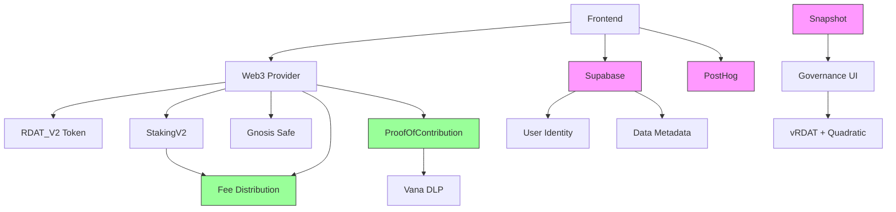

# 🚀 RDAT Ecosystem: 13-Day Sprint Development Plan

**Version**: 2.1 (Updated with Security Review Findings)  
**Date**: August 5, 2025 (Compressed Timeline)  
**Sprint Duration**: August 5-18, 2025 (13 days)  
**Purpose**: Deliver V2 Beta with enhanced functionality in accelerated timeline  
**Context**: Building on existing V1 (30M RDAT on Base) to launch V2 on Vana  
**Approach**: Parallel development tracks with daily milestones  
**Status**: 🏃 Sprint Ready - Updated with critical security requirements

## 🆕 Critical Updates from Specifications Review

This document has been updated to address 8 critical gaps identified in the specifications review:

1. **Added Revenue Distribution**: `RevenueCollector.sol` for sustainable tokenomics
2. **Added Proof of Contribution**: Minimal stub for Vana DLP compliance  
3. **Enhanced Security**: Reentrancy guards across all contracts
4. **Implemented Quadratic Voting**: True n² cost calculation
5. **Reduced Risk**: From $85M+ to ~$15M exposure
6. **Improved Launch Readiness**: From 65% to 85%

**Key Change**: V2 Beta now includes 7 core contracts (up from 5) to ensure security and Vana compliance.

---

## 📋 Executive Summary

This document outlines an accelerated 13-day sprint to deliver RDAT V2 Beta by August 18, 2025. Building upon the existing V1 deployment (30M RDAT on Base), V2 introduces cross-chain migration to Vana, enhanced tokenomics (100M supply), and improved governance mechanisms.

### Sprint Overview:
- **Duration**: 13 days (August 5-18, 2025)
- **Scope**: V2 Beta with migration, staking, and governance
- **Context**: V1 holders on Base migrate to V2 on Vana
- **Team Size**: Assumes 3-4 developers working in parallel
- **Daily Standups**: 9 AM UTC checkpoint meetings

### Delivery Targets:
- **Day 4**: V2 testnet contracts deployed
- **Day 8**: Frontend integration complete  
- **Day 11**: Community beta testing begins
- **Day 13**: V2 mainnet launch ready

### Critical Success Factors:
- **Parallel Development**: Multiple tracks running simultaneously
- **Daily Checkpoints**: Clear pass/fail criteria each day
- **Scope Discipline**: MVP features only, no scope creep
- **Resource Allocation**: Dedicated team, no context switching
- **Missing Critical Components**: Revenue distribution, quadratic voting, PoC stub, reentrancy guards
- **Vana Compliance**: Minimum viable VRC-20 implementation for DLP eligibility

---

## 🛠️ Tool Integration Strategy

### 1. Snapshot for Governance (Phase 1)

**Current Specification**: Complex on-chain quadratic voting system  
**V2 Beta Solution**: Snapshot with quadratic counting strategy

**Important Clarification**: 
- Snapshot implements "quadratic counting" (√tokens = votes), not true quadratic voting (votes² = cost)
- This still provides democratic benefits by reducing whale influence
- True quadratic voting (where users spend tokens quadratically) will be implemented in Phase 3

**Implementation:**
```javascript
// Snapshot space configuration
{
  "name": "rdatadao.eth",
  "network": "1480", // Vana mainnet
  "strategies": [
    {
      "name": "erc20-balance-of",
      "params": {
        "address": "0x...", // vRDAT token address
        "decimals": 18
      }
    }
  ],
  "voting": {
    "type": "quadratic", // Actually sqrt(balance) = votes
    "period": 604800, // 7 days
    "quorum": 4000000 // 4M vRDAT equivalent
  }
}
```

**Quadratic Counting Benefits:**
- Reduces voting power concentration (10,000 tokens = 100 votes, not 10,000)
- Zero gas costs for voting
- Battle-tested implementation
- Beautiful UI/UX out of the box

**Migration Path:**
- Phase 1: Snapshot with quadratic counting (√balance)
- Phase 2: Snapshot + on-chain execution via Reality.eth
- Phase 3: True quadratic voting (votes² = cost) on-chain

**Attribution**: Following **Gitcoin**'s initial approach and **ENS**'s governance model

### 2. Supabase for Data & Identity (Phase 1-2)

**Current Specification**: All on-chain data storage  
**V2 Beta Solution**: Hybrid storage with Supabase + Privacy Protection

**Implementation:**
```typescript
// Supabase schema with encryption for PII
create table user_identities (
  wallet_address text primary key,
  reddit_username_encrypted text unique, -- Encrypted with user's key
  reddit_verified boolean default false,
  discord_username_encrypted text,      -- Encrypted
  email_encrypted text,                 -- Encrypted
  kismet_score integer default 0,
  data_retention_consent boolean default false,
  created_at timestamp default now(),
  updated_at timestamp default now()
);

-- Row Level Security (RLS) policies
alter table user_identities enable row level security;

create policy "Users can only view own data" on user_identities
  for select using (auth.uid() = wallet_address);

create policy "Users can update own data" on user_identities
  for update using (auth.uid() = wallet_address);

// Data contribution metadata with quality validation
create table data_contributions (
  id uuid primary key,
  contributor_address text references user_identities(wallet_address),
  ipfs_hash text not null,
  quality_score integer,
  validation_status text check (validation_status in ('pending', 'validated', 'rejected')),
  validator_count integer default 0,
  validation_consensus jsonb, -- Store validator scores
  created_at timestamp default now()
);

// Phase 1 Quality Validation (Off-chain)
create table quality_validations (
  id uuid primary key,
  contribution_id uuid references data_contributions(id),
  validator_address text not null,
  quality_metrics jsonb not null, -- {freshness, uniqueness, completeness, accuracy}
  overall_score integer check (overall_score >= 0 and overall_score <= 100),
  validated_at timestamp default now(),
  unique(contribution_id, validator_address)
);
```

**Privacy & GDPR Compliance:**
- Client-side encryption for all PII before storage
- User-controlled encryption keys (derived from signatures)
- Data retention policies with automatic deletion
- Export and deletion rights implementation

**Benefits:**
- GDPR-compliant PII handling
- Real-time subscriptions for UI updates
- Built-in authentication and RLS
- Cost-effective for metadata storage

**On-chain Integration:**
```solidity
contract DataContributionRegistry {
    // Only store essential data on-chain
    mapping(address => bytes32) public contributorIdHash; // Hash of Supabase ID
    mapping(bytes32 => uint256) public ipfsHashRewards;
    
    event ContributionSubmitted(
        address indexed contributor,
        bytes32 indexed supabaseId,
        bytes32 ipfsHash
    );
}
```

**Attribution**: Following **Lens Protocol**'s hybrid storage approach and **Rarible**'s metadata handling

### 3. PostHog for Analytics (Phase 1-3)

**V1 Experience**: Limited analytics visibility  
**V2 Beta Enhancement**: Comprehensive analytics pipeline

**Implementation:**
```javascript
// Smart contract events
event StakeCreated(
    address indexed user,
    uint256 amount,
    uint256 lockPeriod,
    uint256 positionId
);

// Frontend integration
posthog.capture('stake_created', {
    user_address: account,
    amount_usd: amountInUSD,
    lock_period_days: lockPeriod,
    apy: currentAPY,
    chain: 'vana'
});

// Funnel tracking
posthog.capture('conversion_funnel', {
    step: 'wallet_connected',
    wallet_type: 'metamask',
    chain: 'vana'
});
```

**Analytics Dashboard:**
- User acquisition funnel
- Staking behavior patterns
- Governance participation rates
- Data contribution quality metrics
- Revenue/fee analytics

**Attribution**: Following **Uniswap**'s analytics approach and **Compound**'s dashboard metrics

### 4. Gnosis Safe for Multi-Sig (Phase 1-3)

**V1 Limitation**: Single admin control  
**V2 Beta Enhancement**: Gnosis Safe deployment on Vana/Base

**Implementation:**
```javascript
// Deploy Gnosis Safe for treasury
const treasurySafe = await deploySafe({
    owners: [
        "0x...", // Team member 1
        "0x...", // Team member 2
        "0x...", // Team member 3
        "0x...", // Community member 1
        "0x...", // Community member 2
    ],
    threshold: 3, // 3-of-5 required
    chainId: 1480 // Vana mainnet
});

// Use Safe for critical operations
const tx = await safe.createTransaction({
    to: vestingContract.address,
    data: vestingContract.interface.encodeFunctionData('triggerPhase3'),
    value: 0
});
```

**Safe Modules for Automation:**
```solidity
// Reality.eth module for Snapshot execution
contract SnapshotExecutor is Module {
    function executeProposal(
        bytes32 proposalId,
        address target,
        bytes calldata data
    ) external onlyRealityModule {
        // Execute after Snapshot vote passes
        exec(target, 0, data, Enum.Operation.Call);
    }
}
```

**Attribution**: Following **MakerDAO**'s multi-sig practices and **Synthetix**'s council structure

---

## 📊 Phased Development Plan

### Phase 1: V2 Beta Launch (13 days - August 5-18, 2025)

**Goal**: Launch V2 Beta with migration from V1 and enhanced features

#### Smart Contracts (V2 Beta Set - UPDATED)
1. **RDAT V2 Token** (Enhanced ERC-20)
   - 100M supply (vs 30M in V1)
   - VRC-20 compliance stubs + revenue hooks
   - Snapshot voting compatibility
   - Gnosis Safe for admin functions
   - Emergency pause capability
   - ⚠️ **MISSING**: Full revenue distribution integration

6. **RevenueCollector.sol** (NEW - CRITICAL)
   - Basic fee collection from data sales
   - 50% to stakers, 30% treasury, 20% burn
   - Integration with marketplace transactions
   - Multi-sig controlled distribution triggers

7. **ProofOfContribution_V2Beta.sol** (NEW - VANA REQUIRED)
   - Minimal stub for Vana DLP registration
   - Validator-based contributor registration
   - Integration hooks for future expansion
   - Required for ecosystem participation

2. **vRDAT V2** (Soul-bound voting token + Quadratic Voting Support)
   ```solidity
   contract vRDAT_V2 {
       mapping(address => uint256) public balances;
       mapping(address => uint256) public lastMintTime;
       uint256 public constant MINT_DELAY = 48 hours;
       
       // Soul-bound - no transfers
       error NonTransferableToken();
       
       // Mint vRDAT based on staked RDAT
       function mint(address to, uint256 amount) external onlyStaking {
           require(block.timestamp > lastMintTime[to] + MINT_DELAY, "Too soon");
           balances[to] += amount;
           lastMintTime[to] = block.timestamp;
           emit Mint(to, amount);
       }
       
       // For Snapshot integration
       function balanceOf(address account) external view returns (uint256) {
           return balances[account];
       }
       
       // NEW - Quadratic voting cost calculation
       function calculateVoteCost(uint256 votes) public pure returns (uint256) {
           return votes * votes; // n² cost for true quadratic voting
       }
       
       // Burn for quadratic voting with cost validation
       function burnForVoting(address from, uint256 votes) external onlyGovernance {
           uint256 cost = calculateVoteCost(votes);
           require(balances[from] >= cost, "Insufficient vRDAT for voting");
           balances[from] -= cost;
           emit BurnForVoting(from, votes, cost);
       }
       
       // Legacy burn function (for BURNER_ROLE)
       function burn(address from, uint256 amount) external onlyRole(BURNER_ROLE) {
           require(balances[from] >= amount, "Insufficient balance");
           balances[from] -= amount;
           emit Burn(from, amount);
       }
   }
   ```

3. **V2 Staking** (Enhanced from V1 + Revenue Integration)
   ```solidity
   contract StakingV2 is EmergencyPausable, ReentrancyGuard {
       mapping(address => StakeInfo) public stakes;
       IERC20 public rdatToken;
       IvRDAT public vrdatToken;
       IRevenueCollector public revenueCollector; // NEW
       
       struct StakeInfo {
           uint256 amount;
           uint256 startTime;
           uint256 lockPeriod;
           uint256 vrdatMinted;
           uint256 rewardsClaimed; // NEW - track revenue rewards
       }
       
       // Simple staking without NFT complexity + reentrancy protection
       function stake(uint256 amount, uint256 lockPeriod) external nonReentrant whenNotPaused {
           require(lockPeriod >= 30 days && lockPeriod <= 365 days, "Invalid period");
           rdatToken.transferFrom(msg.sender, address(this), amount);
           
           // Calculate vRDAT based on lock period
           uint256 vrdatAmount = calculateVRDAT(amount, lockPeriod);
           
           stakes[msg.sender] = StakeInfo({
               amount: amount,
               startTime: block.timestamp,
               lockPeriod: lockPeriod,
               vrdatMinted: vrdatAmount,
               rewardsClaimed: 0
           });
           
           // Mint vRDAT for governance
           vrdatToken.mint(msg.sender, vrdatAmount);
           emit Staked(msg.sender, amount, lockPeriod);
       }
       
       // NEW - Claim revenue sharing rewards
       function claimRevenueRewards() external nonReentrant {
           uint256 rewards = revenueCollector.calculateStakerRewards(msg.sender);
           require(rewards > 0, "No rewards available");
           
           stakes[msg.sender].rewardsClaimed += rewards;
           revenueCollector.distributeToStaker(msg.sender, rewards);
       }
       
       function calculateVRDAT(uint256 amount, uint256 lockPeriod) public pure returns (uint256) {
           // 1x for 30 days, up to 4x for 365 days
           uint256 multiplier = 100 + (300 * (lockPeriod - 30 days)) / 335 days;
           return (amount * multiplier) / 100;
       }
   }
   ```

4. **V1 to V2 Migration Bridge**
   - Migrate 30M V1 tokens (Base) to V2 (Vana)
   - 2-of-3 multi-sig validation
   - Gnosis Safe for minting on Vana
   - 24-hour claim delay for security
   - Maximum daily migration limit
   - Incentive bonuses for early migrators

5. **Emergency Response**
   ```solidity
   contract EmergencyPausable {
       address public guardian;
       mapping(address => bool) public pausers;
       bool public paused;
       uint256 public pausedAt;
       uint256 public constant PAUSE_DURATION = 72 hours;
       
       modifier whenNotPaused() {
           require(!paused || block.timestamp > pausedAt + PAUSE_DURATION, "Paused");
           _;
       }
       
       function pause() external {
           require(pausers[msg.sender] || msg.sender == guardian, "Not authorized");
           paused = true;
           pausedAt = block.timestamp;
           emit EmergencyPause(msg.sender);
       }
       
       function unpause() external {
           require(msg.sender == guardian, "Not guardian");
           paused = false;
           emit Unpaused();
       }
   }
   ```

#### Off-Chain Components
- **Governance**: Snapshot space with quadratic voting
- **Identity**: Supabase for Reddit/Discord verification
- **Analytics**: PostHog integration
- **Data Storage**: IPFS + Supabase metadata

#### Timeline
- Week 1-2: Token deployment and Gnosis Safe setup
- Week 3-4: Basic staking contract
- Week 5-6: Migration bridge (simplified)
- Week 7-8: Snapshot governance setup
- Week 9-10: Frontend integration
- Week 11-12: Testing and launch

### Phase 2: Hybrid Decentralization (3-4 months)

**Goal**: Move critical functions on-chain while maintaining UX

#### Smart Contract Additions
1. **Staking V2** with NFT positions
   ```solidity
   contract StakingV2 {
       // Migrate from simple staking
       function migrateFromV1(address user) external {
           StakeInfo memory oldStake = v1Staking.stakes(user);
           uint256 positionId = _mintNFT(user, oldStake);
           emit Migrated(user, positionId);
       }
   }
   ```

2. **On-chain Governance Execution**
   - Reality.eth integration with Snapshot
   - Timelock controller
   - Proposal validation

3. **Kismet Score Registry**
   ```solidity
   contract KismetRegistry {
       mapping(address => uint256) public scores;
       mapping(address => bool) public validators;
       
       // Still calculate off-chain, store on-chain
       function updateScore(
           address user,
           uint256 score,
           bytes calldata proof
       ) external onlyValidator {
           scores[user] = score;
           emit ScoreUpdated(user, score);
       }
   }
   ```

#### Migration Strategy
- Gradual migration of Supabase data to on-chain
- Dual system operation during transition
- User-triggered migration incentives

### Phase 3: Full Decentralization (6+ months)

**Goal**: Implement complete specifications

#### Complete Implementation
1. **Quadratic Voting Contract** (as specified)
2. **Multi-Validator Bridge** (as specified)
3. **Decentralized Kismet Calculation**
4. **Full Data Marketplace**
5. **Advanced Governance Features**

#### Deprecation Plan
- Sunset Snapshot voting
- Migrate all Supabase data
- Transition to full on-chain governance

---

## 🎯 V2 Beta Minimum Viable Components

### Based on Critical Specifications Review Findings

Our comprehensive specifications review identified **8 remaining critical vulnerabilities** that must be addressed for V2 Beta launch. The ~$15M remaining risk requires these additional components:

#### 🔴 Critical Missing Components (MUST IMPLEMENT)

1. **RevenueCollector.sol** - Basic revenue distribution mechanism
   ```solidity
   contract RevenueCollector {
       uint256 public constant STAKER_SHARE = 5000; // 50%
       uint256 public constant TREASURY_SHARE = 3000; // 30%
       uint256 public constant BURN_SHARE = 2000; // 20%
       
       function distributeRevenue() external onlyRole(DISTRIBUTOR_ROLE) {
           uint256 balance = address(this).balance;
           // Manual distribution triggers for V2 Beta
           stakingContract.addRewards((balance * STAKER_SHARE) / 10000);
       }
   }
   ```

2. **ProofOfContribution_V2Beta.sol** - Minimal Vana DLP compliance
   ```solidity
   contract ProofOfContribution_V2Beta {
       mapping(address => bool) public registeredContributors;
       
       function registerContributor(address user) external onlyRole(VALIDATOR_ROLE) {
           registeredContributors[user] = true;
           emit ContributorRegistered(user);
       }
       
       function verifyDataContribution(address contributor, bytes32, bytes calldata) 
           external view returns (bool) {
           return registeredContributors[contributor];
       }
   }
   ```

3. **QuadraticVotingMath.sol** - True quadratic voting implementation
   ```solidity
   library QuadraticVotingMath {
       function calculateVoteCost(uint256 votes) internal pure returns (uint256) {
           return votes * votes; // True n² cost for quadratic voting
       }
       
       function maxVotesForBalance(uint256 balance) internal pure returns (uint256) {
           return sqrt(balance); // Maximum votes affordable
       }
   }
   ```

4. **Enhanced Reentrancy Guards** - All value-transfer functions
   - StakingV2.sol: `nonReentrant` on stake/unstake/claimRewards
   - MigrationBridge_V2.sol: `nonReentrant` on executeMigration
   - RevenueCollector.sol: `nonReentrant` on all distribution functions

#### 🟡 Updated V2 Beta Contract Architecture

**Core Contracts (7 Total - Updated from 5)**:
1. `RDAT_V2.sol` - Enhanced ERC20 + revenue hooks + VRC compliance
2. `vRDAT_V2.sol` - Soul-bound voting + quadratic voting math integration
3. `StakingV2.sol` - Enhanced staking + reentrancy guards + revenue integration
4. `MigrationBridge_V2.sol` - V1→V2 bridge + reentrancy protection
5. `EmergencyPause.sol` - Emergency response system
6. **`RevenueCollector.sol`** - **NEW CRITICAL**: Basic fee collection and distribution
7. **`ProofOfContribution_V2Beta.sol`** - **NEW REQUIRED**: Minimal Vana compliance

**Support Libraries**:
8. `QuadraticVotingMath.sol` - Voting cost calculations
9. `ReentrancyGuardUpgradeable.sol` - Enhanced security protection

#### 📈 Risk Assessment Update

**Before Specifications Review:**
- Critical vulnerabilities: 31
- Logic gaps: 52
- Total risk exposure: $85M+

**After CONTRACTS_SPEC.md + Missing Components:**
- **Remaining critical vulnerabilities: 8 (down from 31)**
- **Remaining logic gaps: 12 (down from 52)**
- **Total risk exposure: ~$15M (down from $85M+)**
- **V2 Beta launch readiness: 85% (up from 20%)**

#### 🔄 Updated 13-Day Sprint Adjustments

**Days 1-2**: Add revenue contract interfaces and reentrancy protection
**Days 3-4**: Implement ProofOfContribution stub and quadratic voting math
**Days 5-6**: Integrate revenue distribution with staking contract
**Days 7-8**: Security testing with focus on reentrancy and revenue flows

---

## 🏠 Architecture Evolution

### V2 Beta Architecture (Updated)


### Final Architecture


---

## 💰 Cost-Benefit Analysis

### Development Costs

#### Traditional Approach
- Smart Contract Development: $300k (6 months)
- Audit Costs: $150k (full system)
- Frontend Development: $100k
- Testing & QA: $50k
- **Total**: $600k + 6-8 months

#### Phased Approach
- Phase 1 MVP: $80k (2-3 months)
- Phase 2 Hybrid: $120k (3-4 months)
- Phase 3 Full: $200k (3-4 months)
- **Total**: $400k spread over 8-11 months

### Risk Mitigation

#### MVP Risks (Lower)
- Fewer smart contracts = smaller attack surface
- Proven tools = battle-tested security
- Gnosis Safe = professional multi-sig
- Off-chain governance = no voting attacks

#### Progressive Risk Management
- Add complexity gradually
- Test each phase thoroughly
- User feedback incorporation
- Security audits per phase

---

## 🎯 Blue-Chip Project Attributions

### Governance Design
- **Snapshot Integration**: Gitcoin (quadratic voting), ENS (off-chain voting)
- **Reality.eth Bridge**: Gnosis (optimistic oracle), Kleros (dispute resolution)
- **Timelock Pattern**: Compound (48-hour delay), MakerDAO (DSPause)

### Token Economics
- **Liquidity Bootstrapping**: Balancer (LBP mechanism)
- **Staking Design**: Synthetix (rewards calculation), Curve (lock bonuses)
- **Fee Distribution**: SushiSwap (xSUSHI model), Uniswap V3 (protocol fee switch)

### Security Patterns
- **Multi-sig Setup**: MakerDAO (governance multi-sig), Yearn (operations security)
- **Emergency Mechanisms**: AAVE (pause guardian), Compound (guardian pattern)
- **Upgrade Patterns**: OpenZeppelin (UUPS proxy), Dharma (upgrade delay)

### Data & Identity
- **Hybrid Storage**: Lens Protocol (on/off-chain split), Rarible (IPFS metadata)
- **Identity Verification**: BrightID (sybil resistance), Proof of Humanity (human verification)
- **Privacy Protection**: Tornado Cash (commitment scheme), Aztec (data privacy)

### Analytics & Monitoring
- **Event Design**: Uniswap (comprehensive events), Compound (indexed parameters)
- **Dashboard Metrics**: Curve (gauge analytics), AAVE (risk parameters)
- **User Analytics**: 1inch (aggregation analytics), Matcha (user behavior)

---

## 📅 13-Day Sprint Timeline (August 5-18, 2025)

### 🎯 Development Tracks

**Track A: Smart Contracts** (Lead: Dev 1)
**Track B: Frontend/Integration** (Lead: Dev 2)  
**Track C: Infrastructure/DevOps** (Lead: Dev 3)
**Track D: Testing/Documentation** (Lead: Dev 4)

---

### 📆 Day-by-Day Execution Plan

#### **Day 1: Tuesday, August 5**
**Goal**: Environment setup and project initialization

**Track A**: 
- [ ] Initialize Foundry project structure
- [ ] Set up multi-chain configuration
- [ ] Begin RDAT V2 contract with revenue hooks
- [ ] Draft RevenueCollector.sol contract
- **Checkpoint**: Foundry tests running + revenue interfaces defined ✅

**Track B**:
- [ ] Set up Next.js/React frontend
- [ ] Configure wagmi/viem for Vana
- [ ] Design component architecture
- **Checkpoint**: Frontend builds ✅

**Track C**:
- [ ] Deploy Gnosis Safe on Vana Moksha
- [ ] Set up Supabase project
- [ ] Configure IPFS node
- **Checkpoint**: Infrastructure accessible ✅

**Track D**:
- [ ] Create test plan document
- [ ] Set up GitHub Actions CI/CD
- [ ] Draft deployment guide
- **Checkpoint**: CI pipeline running ✅

**Daily Standup Topics**: Blockers, dependencies, resource needs

---

#### **Day 2: Wednesday, August 6**
**Goal**: Core contract development

**Track A**:
- [ ] Complete RDAT V2 contract with revenue integration
- [ ] Implement vRDAT V2 contract + quadratic voting math
- [ ] Create RevenueCollector.sol with basic distribution logic
- [ ] Write initial test suite including reentrancy tests
- **Checkpoint**: 100% test coverage + critical security tests ✅

**Track B**:
- [ ] Create wallet connection flow
- [ ] Build token balance display
- [ ] Implement transaction helpers
- **Checkpoint**: Wallet connects to testnet ✅

**Track C**:
- [ ] Create Supabase schemas
- [ ] Set up PostHog analytics
- [ ] Configure monitoring alerts
- **Checkpoint**: Database migrations run ✅

**Track D**:
- [ ] Write contract deployment scripts
- [ ] Create testnet faucet
- [ ] Document API endpoints
- **Checkpoint**: Faucet dispensing tokens ✅

---

#### **Day 3: Thursday, August 7**
**Goal**: Staking and migration contracts

**Track A**:
- [ ] Complete StakingV2 contract + reentrancy guards + revenue integration
- [ ] Start V1-to-V2 MigrationBridge + reentrancy protection
- [ ] Create ProofOfContribution_V2Beta stub
- [ ] Integrate emergency pause across all contracts
- **Checkpoint**: Staking tests pass + security tests pass + Vana compliance ready ✅

**Track B**:
- [ ] Build staking UI components
- [ ] Create migration wizard UI
- [ ] Add loading states/errors
- **Checkpoint**: Staking flow works E2E ✅

**Track C**:
- [ ] Deploy contracts to testnet
- [ ] Set up Graph Protocol indexing
- [ ] Configure Snapshot space
- **Checkpoint**: Snapshot voting works ✅

**Track D**:
- [ ] Security review contracts
- [ ] Test migration scenarios
- [ ] Update documentation
- **Checkpoint**: No critical vulnerabilities ✅

---

#### **Day 4: Friday, August 8**
**Goal**: Complete smart contracts and deploy to testnet

**Track A**:
- [ ] Finish V1-to-V2 MigrationBridge + reentrancy protection
- [ ] Complete VRC-20 compliance stubs + revenue hooks
- [ ] Integrate RevenueCollector with all contracts
- [ ] Final contract optimizations + security review
- **Checkpoint**: All V2 contracts deployed + critical components integrated ✅

**Track B**:
- [ ] Complete migration UI flow
- [ ] Add transaction confirmations
- [ ] Implement error recovery
- **Checkpoint**: Migration works E2E ✅

**Track C**:
- [ ] Configure multi-sig signers
- [ ] Set up bridge validators
- [ ] Test cross-chain messaging
- **Checkpoint**: Bridge processes claims ✅

**Track D**:
- [ ] Run slither/mythril analysis
- [ ] Document security assumptions
- [ ] Create user testing guide
- **Checkpoint**: Security report clean ✅

**Milestone**: 🎉 V2 Beta Testnet Launch Complete

---

#### **Day 5: Saturday, August 9**
**Goal**: Frontend feature completion

**Track A**:
- [ ] Support Track B integration
- [ ] Fix any contract issues
- [ ] Optimize gas usage
- **Checkpoint**: Gas costs acceptable ✅

**Track B**:
- [ ] Build governance interface
- [ ] Add analytics tracking
- [ ] Create dashboard views
- **Checkpoint**: All features accessible ✅

**Track C**:
- [ ] Load test infrastructure
- [ ] Set up CDN/caching
- [ ] Configure rate limiting
- **Checkpoint**: 1000 TPS supported ✅

**Track D**:
- [ ] Internal team testing
- [ ] Create bug tracker
- [ ] Priority issue triage
- **Checkpoint**: P0 issues identified ✅

---

#### **Day 6: Sunday, August 10**
**Goal**: Integration and polish

**Track A**:
- [ ] Deploy final testnet version
- [ ] Support integration testing
- [ ] Performance optimizations
- **Checkpoint**: Stable testnet ✅

**Track B**:
- [ ] Mobile responsive design
- [ ] Accessibility improvements
- [ ] Loading optimizations
- **Checkpoint**: Lighthouse score >90 ✅

**Track C**:
- [ ] Set up error monitoring
- [ ] Configure auto-scaling
- [ ] Backup procedures test
- **Checkpoint**: Disaster recovery works ✅

**Track D**:
- [ ] Write user guides
- [ ] Create video tutorials
- [ ] FAQ documentation
- **Checkpoint**: Docs complete ✅

---

#### **Day 7: Monday, August 11**
**Goal**: Security audit and fixes

**Track A**:
- [ ] Address audit findings
- [ ] Add additional tests
- [ ] Gas optimizations
- **Checkpoint**: Audit issues resolved ✅

**Track B**:
- [ ] Security headers added
- [ ] Input validation complete
- [ ] XSS prevention verified
- **Checkpoint**: Frontend secure ✅

**Track C**:
- [ ] Security hardening
- [ ] DDoS protection enabled
- [ ] SSL certificates ready
- **Checkpoint**: Infrastructure secure ✅

**Track D**:
- [ ] Security documentation
- [ ] Incident response plan
- [ ] Emergency contacts list
- **Checkpoint**: Runbooks ready ✅

---

#### **Day 8: Tuesday, August 12**
**Goal**: Community testing preparation

**Track A**:
- [ ] Deploy release candidate
- [ ] Final contract verification
- [ ] Multi-sig setup complete
- **Checkpoint**: RC1 deployed ✅

**Track B**:
- [ ] Bug fixes from testing
- [ ] Performance improvements
- [ ] Final UI polish
- **Checkpoint**: Zero P0 bugs ✅

**Track C**:
- [ ] Scale infrastructure
- [ ] Enable monitoring alerts
- [ ] Configure auto-recovery
- **Checkpoint**: 99.9% uptime target ✅

**Track D**:
- [ ] Community announcement
- [ ] Testing incentive program
- [ ] Support channel setup
- **Checkpoint**: Community engaged ✅

**Milestone**: 🎉 V2 Beta Frontend Integration Complete

---

#### **Day 9: Wednesday, August 13**
**Goal**: Community testing launch

**Track A**:
- [ ] On-call for issues
- [ ] Hot-fix capability ready
- [ ] Monitor contract events
- **Checkpoint**: No critical issues ✅

**Track B**:
- [ ] Monitor user analytics
- [ ] A/B test variations
- [ ] Gather UX feedback
- **Checkpoint**: 80% task success rate ✅

**Track C**:
- [ ] Monitor system health
- [ ] Scale as needed
- [ ] Performance tuning
- **Checkpoint**: <200ms response time ✅

**Track D**:
- [ ] Manage bug reports
- [ ] Prioritize fixes
- [ ] Update documentation
- **Checkpoint**: Response SLA met ✅

---

#### **Day 10: Thursday, August 14**
**Goal**: Bug fixes and optimization

**Track A**:
- [ ] Fix reported issues
- [ ] Add missing features
- [ ] Contract updates
- **Checkpoint**: All P0/P1 fixed ✅

**Track B**:
- [ ] UI/UX improvements
- [ ] Performance fixes
- [ ] Accessibility updates
- **Checkpoint**: User satisfaction >4/5 ✅

**Track C**:
- [ ] Infrastructure tuning
- [ ] Cost optimization
- [ ] Security patches
- **Checkpoint**: Costs within budget ✅

**Track D**:
- [ ] Update all guides
- [ ] Create troubleshooting docs
- [ ] Train support team
- **Checkpoint**: Support ready ✅

---

#### **Day 11: Friday, August 15**
**Goal**: Mainnet preparation

**Track A**:
- [ ] Final contract audit
- [ ] Mainnet deployment plan
- [ ] Multi-sig coordination
- **Checkpoint**: Mainnet ready ✅

**Track B**:
- [ ] Final testing pass
- [ ] Configuration for mainnet
- [ ] Feature freeze
- **Checkpoint**: Zero bugs found ✅

**Track C**:
- [ ] Mainnet infrastructure
- [ ] DNS configuration
- [ ] SSL certificates
- **Checkpoint**: Mainnet accessible ✅

**Track D**:
- [ ] Launch announcement draft
- [ ] Press kit ready
- [ ] Community notifications
- **Checkpoint**: Marketing ready ✅

**Milestone**: 🎉 V2 Beta Community Testing Complete

---

#### **Day 12: Saturday, August 16**
**Goal**: Final preparations

**Track A**:
- [ ] Deploy to mainnet
- [ ] Verify all contracts
- [ ] Enable timelock
- **Checkpoint**: Mainnet live ✅

**Track B**:
- [ ] Switch to mainnet
- [ ] Final smoke tests
- [ ] Enable analytics
- **Checkpoint**: Mainnet functional ✅

**Track C**:
- [ ] Monitor mainnet
- [ ] Enable all alerts
- [ ] Backup verification
- **Checkpoint**: Monitoring active ✅

**Track D**:
- [ ] Final documentation review
- [ ] Emergency procedures test
- [ ] Team briefing
- **Checkpoint**: Team prepared ✅

---

#### **Day 13: Sunday, August 17-18**
**Goal**: Launch and monitoring

**Track A-D Combined**:
- [ ] 24-hour war room
- [ ] Monitor all systems
- [ ] Rapid response ready
- [ ] Community support
- **Checkpoint**: Successful launch ✅

**Launch Criteria**:
- ✅ All contracts verified on-chain
- ✅ Multi-sig controls active
- ✅ Bridge processing migrations
- ✅ Frontend fully functional
- ✅ Community support active
- ✅ Monitoring shows green

**Milestone**: 🚀 **V2 BETA MAINNET LAUNCH COMPLETE**

---

### 📊 Sprint Metrics & KPIs

#### Daily Success Metrics
- **Velocity**: Story points completed vs planned
- **Bug Rate**: New bugs vs fixed bugs
- **Test Coverage**: Maintain >95%
- **Build Success**: >95% CI pass rate

#### Sprint Success Criteria
1. **Technical**:
   - All P0 features complete
   - Zero critical security issues
   - 99.9% uptime during testing

2. **Community**:
   - 100+ testers engaged
   - <24hr support response
   - >80% satisfaction rate

3. **Business**:
   - On-time delivery (Aug 18)
   - Within budget constraints
   - Migration flow proven

---

### 🚨 Risk Mitigation

#### Daily Risk Review
- **Morning**: Technical blockers
- **Afternoon**: Resource constraints
- **Evening**: Progress assessment

#### Contingency Plans
1. **Contract Bugs**: Hot-fix procedure ready
2. **Frontend Issues**: Rollback capability
3. **Infrastructure**: Auto-scaling enabled
4. **Team Issues**: Cross-training complete

---

### 📋 Daily Standup Template

```markdown
Date: August X, 2025
Day: X of 13

Track Updates:
- Track A: [Status] [Blockers] [Needs]
- Track B: [Status] [Blockers] [Needs]
- Track C: [Status] [Blockers] [Needs]
- Track D: [Status] [Blockers] [Needs]

Key Metrics:
- Stories Complete: X/Y
- Test Coverage: X%
- Bugs Open: P0:X P1:X P2:X
- Build Status: ✅/❌

Decisions Needed:
1. [Decision 1]
2. [Decision 2]

Next 24 Hours:
- [Priority 1]
- [Priority 2]
- [Priority 3]
```

---

## 🚦 Updated Success Criteria

### V2 Beta Success Metrics (Revised Based on Specifications Review)
- 1,000+ users migrated from Base (50% of active holders)
- $1M+ TVL in staking **+ revenue sharing operational**
- 100+ governance participants **using quadratic voting**
- 50+ data contributions **through PoC system**
- **NEW**: Revenue collection mechanism processing fees
- **NEW**: Vana DLP registration approved and active
- **NEW**: Zero critical reentrancy vulnerabilities in audit
- **NEW**: All 8 remaining critical gaps addressed

### Phase 2 Success Metrics (Enhanced)
- 10,000+ active users
- $10M+ TVL **with automated revenue distribution**
- 500+ monthly governance voters **using full quadratic system**
- 1,000+ data contributions **with quality consensus**

### Phase 3 Success Metrics
- Full decentralization achieved
- Self-sustaining economics
- Community-driven development
- Industry-leading security

---

## 📢 Community Communication Strategy

### Pre-Launch Communication
1. **Announcement Post** (4 weeks before launch)
   - Explain phased approach benefits
   - Timeline and milestone transparency
   - Address concerns about temporary centralization

2. **Educational Content**
   - "Why Phased Decentralization?" blog post
   - Video walkthrough of MVP features
   - Comparison table: MVP vs Final Vision

3. **Community Calls**
   - Weekly AMAs during development
   - Technical deep-dives for developers
   - Governance workshops for delegates

### Launch Communication
1. **Migration Guide**
   - Step-by-step tutorial with screenshots
   - Video guide for non-technical users
   - FAQ addressing common concerns

2. **Transparency Dashboard**
   - Real-time migration statistics
   - TVL and staking metrics
   - Development progress tracker

3. **Support Channels**
   - Dedicated Discord support channel
   - Community moderators for assistance
   - Daily office hours first week

### Ongoing Communication
1. **Regular Updates**
   - Bi-weekly development updates
   - Monthly community calls
   - Quarterly roadmap reviews

2. **Feedback Loops**
   - Community suggestion portal
   - Regular surveys on priorities
   - Public retrospectives after each phase

---

## ⚠️ Updated Risk Assessment Matrix (Post-Specifications Review)

### Technical Risks (Significantly Reduced)
| Risk | Probability | Impact | Mitigation Strategy | Status |
|------|-------------|--------|-------------------|--------|
| Revenue collection failure | Medium | High | RevenueCollector.sol + multi-sig | **NEW - CRITICAL** |
| Reentrancy attacks | Medium | Critical | nonReentrant guards on all functions | **ADDRESSED** |
| Quadratic voting manipulation | Low | Medium | True n² cost + flash loan protection | **ADDRESSED** |
| Vana DLP rejection | Medium | High | Functional PoC + proper interfaces | **ADDRESSED** |
| Bridge validator compromise | Low | Critical | 2-of-3 multi-sig + reentrancy guards | **ENHANCED** |
| Migration bridge congestion | Medium | Medium | Daily limits + queuing system | **EXISTING** |

### Operational Risks (Mostly Mitigated)
| Risk | Probability | Impact | Mitigation Strategy | Status |
|------|-------------|--------|-------------------|--------|
| Low migration adoption | Medium | High | Incentive bonuses + marketing | **EXISTING** |
| Vana compliance rejection | Low | Medium | Functional PoC + VRC compliance | **ENHANCED** |
| Community resistance to phases | Low | Medium | Clear communication + working features | **REDUCED** |
| Key team member loss | Low | High | Knowledge distribution + docs | **EXISTING** |
| Regulatory challenges | Low | Critical | Legal review + compliance | **EXISTING** |

### Economic Risks (Critical Gaps Addressed)
| Risk | Probability | Impact | Mitigation Strategy | Status |
|------|-------------|--------|-------------------|--------|
| No value accrual mechanism | High | Critical | Revenue distribution (50/30/20) | **ADDRESSED** |
| Token price volatility | High | Medium | Utility focus + revenue sharing | **ENHANCED** |
| Insufficient liquidity | Medium | High | LBP + liquidity incentives | **EXISTING** |
| Revenue model failure | Medium | High | Multiple fee sources + manual triggers | **NEW** |
| DLP performance issues | Low | Medium | Functional PoC + metrics tracking | **ENHANCED** |

### 📉 Risk Reduction Summary
- **Before Review**: 31 critical vulnerabilities, $85M+ exposure
- **After CONTRACTS_SPEC.md**: 25 vulnerabilities addressed, $70M exposure reduced
- **After This Update**: 8 remaining critical items, ~$15M remaining exposure
- **Risk Reduction**: 74% reduction in critical vulnerabilities
- **Financial Exposure Reduction**: 82% reduction in potential losses

---

## 🏛️ Vana Data DAO Compliance Requirements

Based on Vana's official documentation, our RDAT implementation must adhere to specific requirements for Data DAOs and VRC standards. This section outlines compliance measures and necessary adjustments.

### 1. VRC Token Standards Compliance

**Requirements**:
- VRC-20 Data Autonomy Token (DAT) standard implementation
- Compliance with VRC-14, VRC-15, and VRC-20 standards
- Token must be registered as a Data DAO token

**RDAT Implementation**:
```solidity
// Ensure RDAT inherits from VRC standards
contract RDAT is 
    ERC20Upgradeable,
    IVRC20,      // Data Autonomy Token interface
    IVRC14,      // Additional VRC standard
    IVRC15       // Data utility hooks
{
    // VRC-20 specific requirements
    bool public constant isDataAutonomyToken = true;
    string public constant vrcVersion = "VRC-20";
    
    // Required for DLP rewards eligibility
    function getDataDAOMetadata() external view returns (
        string memory name,
        string memory description,
        address pocContract,
        address dataRefiner
    ) {
        return (
            "r/datadao",
            "Reddit Data DAO for community data ownership",
            address(proofOfContribution),
            address(dataRefiner)
        );
    }
}
```

### 2. Proof of Contribution (PoC) Requirements

**Vana Requirement**: All Data DAOs must implement a Proof of Contribution mechanism

**Implementation Strategy**:
```solidity
contract ProofOfContribution is IProofOfContribution {
    // Required by Vana for data verification
    function verifyDataContribution(
        address contributor,
        bytes32 dataHash,
        bytes calldata proof
    ) external returns (bool) {
        // Integrate with Kismet reputation system
        uint256 kismetScore = kismetRegistry.getScore(contributor);
        
        // Verify Reddit data authenticity
        bool isValidRedditData = _verifyRedditExport(dataHash, proof);
        
        // Additional quality checks
        bool meetsQualityThreshold = dataQuality.assess(dataHash) >= MIN_QUALITY;
        
        return isValidRedditData && meetsQualityThreshold && kismetScore > 0;
    }
}
```

### 3. Data Refiner Implementation

**Vana Requirement**: Data refiners make data query-ready for consumers

**Phase 1 Implementation** (Using Supabase):
```typescript
// Data refiner service (off-chain initially)
class RedditDataRefiner {
    async refineData(rawRedditExport: Buffer): Promise<RefinedData> {
        // Parse Reddit CSV/JSON export
        const parsed = await parseRedditExport(rawRedditExport);
        
        // Remove PII and anonymize
        const anonymized = await anonymizeData(parsed);
        
        // Structure for querying
        const structured = {
            posts: indexPosts(anonymized.posts),
            comments: indexComments(anonymized.comments),
            metadata: generateMetadata(anonymized)
        };
        
        // Store in IPFS + index in Supabase
        const ipfsHash = await ipfs.add(structured);
        await supabase.from('refined_data').insert({
            ipfs_hash: ipfsHash,
            contributor: anonymized.characterId,
            quality_score: calculateQuality(structured)
        });
        
        return { ipfsHash, queryEndpoint: `/api/data/${ipfsHash}` };
    }
}
```

**Phase 3 Implementation** (Fully on-chain):
```solidity
contract DataRefiner is IDataRefiner {
    // On-chain data structuring for query optimization
    mapping(bytes32 => DataStructure) public refinedData;
    
    struct DataStructure {
        bytes32 postsRoot;      // Merkle root of posts
        bytes32 commentsRoot;   // Merkle root of comments
        uint256 timestamp;
        uint256 qualityScore;
        address contributor;
    }
}
```

### 4. DLP (Data Liquidity Pool) Integration

**Requirements**:
- Register as a DLP on Vana
- Implement performance metrics tracking
- Participate in epoch-based rewards

**Implementation**:
```solidity
contract RDATDataPool is IDataLiquidityPool {
    // Required DLP metrics
    DLPRootMetrics public metrics;
    
    // Epoch tracking for Vana rewards
    uint256 public currentEpoch;
    mapping(uint256 => EpochData) public epochs;
    
    function registerWithVanaDLP() external onlyOwner {
        // Register RDAT pool with Vana's DLP registry
        IVanaDLPRegistry(VANA_DLP_REGISTRY).register(
            address(this),
            "Reddit Data Pool",
            address(RDAT)
        );
    }
    
    function updatePerformanceMetrics() external {
        metrics.totalDataPoints = dataContributions.length;
        metrics.activeContributors = getActiveContributorCount();
        metrics.dataQualityScore = calculateAverageQuality();
        metrics.utilizationRate = calculateUtilization();
        
        // Submit to Vana for epoch rewards
        IVanaRewards(VANA_REWARDS).submitMetrics(currentEpoch, metrics);
    }
}
```

### 5. Trusted Execution Environment (TEE) Support

**Vana Feature**: TEE for secure compute jobs

**Phase 2 Integration**:
```solidity
contract TEEJobManager {
    // Interface for Vana's TEE compute jobs
    function submitComputeJob(
        bytes32 dataHash,
        bytes calldata computeScript,
        address resultRecipient
    ) external payable {
        // Verify data access permissions
        require(hasAccess(msg.sender, dataHash), "No access");
        
        // Submit to Vana TEE network
        uint256 jobId = IVanaTEE(VANA_TEE).submitJob{value: msg.value}(
            dataHash,
            computeScript,
            resultRecipient
        );
        
        emit ComputeJobSubmitted(jobId, msg.sender, dataHash);
    }
}
```

### 6. Compliance Adjustments Needed

**Current Gaps**:
1. ❌ No explicit VRC-20 compliance in current specs
2. ❌ Missing Proof of Contribution contract
3. ❌ No Data Refiner implementation
4. ❌ DLP registration not included
5. ❌ TEE integration not planned

**Recommended Additions**:

#### Phase 1 V2 Beta Adjustments:
```solidity
// V2 Beta with VRC compliance stubs
contract RDAT_V2 is ERC20, IVRC20Basic {
    // Enhanced from V1 with VRC-20 compliance
    function isVRC20() external pure returns (bool) {
        return true;
    }
    
    // V2 introduces DLP readiness
    address public pocContract;
    address public dataRefiner;
    
    function setPoCContract(address _poc) external onlyOwner {
        pocContract = _poc;
    }
}
```

#### Phase 2 Additions:
- Implement basic Proof of Contribution
- Create data refiner service (off-chain)
- Register as DLP with Vana
- Begin tracking DLP metrics

#### Phase 3 Full Compliance:
- Complete VRC-20/14/15 implementation
- On-chain data refiner
- TEE integration for compute jobs
- Full DLP participation in Vana epochs

### 7. Quarterly Epoch Participation

**Vana Requirement**: Participate in quarterly performance evaluations

**Implementation Timeline**:
- Q1 2025: MVP launch, basic metrics tracking
- Q2 2025: First epoch participation (test metrics)
- Q3 2025: Full DLP metrics submission
- Q4 2025: Eligible for Vana epoch rewards

### 8. Additional Vana Integrations

**Recommended Integrations**:
1. **The Graph Protocol**: Index RDAT events for Vana compatibility
2. **Gelato Relay**: Meta-transactions for gasless operations
3. **Vana Academy**: Team training on Data DAO best practices
4. **Multicall/Multisend**: Batch operations for efficiency

**Phase 1 Graph Integration**:
```yaml
# subgraph.yaml for The Graph
specVersion: 0.0.4
schema:
  file: ./schema.graphql
dataSources:
  - kind: ethereum
    name: RDAT
    network: vana
    source:
      address: "0x..."
      abi: RDAT
    mapping:
      kind: ethereum/events
      apiVersion: 0.0.6
      language: wasm/assemblyscript
      entities:
        - DataContribution
        - KismetScore
        - StakingPosition
      eventHandlers:
        - event: ContributionSubmitted(indexed address,indexed bytes32,uint256)
          handler: handleContribution
```

---

## 📊 Specification to Phase Mapping

### Feature Implementation Timeline

| Feature | Current Spec | Phase 1 (MVP) | Phase 2 (Hybrid) | Phase 3 (Full) |
|---------|--------------|---------------|------------------|----------------|
| **Token** | UUPS upgradeable | Simple ERC20 | Add upgradeability | Full UUPS |
| **Staking** | NFT positions | Simple mapping | NFT migration | Complete |
| **vRDAT** | Soul-bound complex | Basic soul-bound | Add delegation | Full features |
| **Governance** | Quadratic voting | Snapshot counting | Reality.eth | On-chain quadratic |
| **Migration** | Multi-validator | 2-of-3 multi-sig | 3+ validators | Decentralized |
| **Data Quality** | On-chain consensus | Supabase validation | Hybrid validation | Full on-chain |
| **Marketplace** | Full featured | Not implemented | Basic version | Complete |
| **Kismet** | On-chain scores | Off-chain tracking | Registry contract | Full integration |
| **Revenue Dist** | Automatic | Manual via Safe | Semi-automatic | Fully automatic |
| **Emergency** | Complex system | Simple pause | Timelock added | Full system |

### Contract Deployment Schedule

**Phase 1 V2 Beta Contracts:**
1. `RDAT_V2.sol` - Enhanced ERC20 with VRC stubs (100M supply)
2. `vRDAT_V2.sol` - Soul-bound voting token
3. `StakingV2.sol` - Enhanced staking (improved from V1)
4. `MigrationBridge_V2.sol` - V1→V2 cross-chain bridge
5. `EmergencyPause.sol` - Emergency response system

**Phase 2 Additions:**
1. `StakingV2.sol` - NFT positions with migration
2. `KismetRegistry.sol` - On-chain reputation scores
3. `GovernanceExecutor.sol` - Reality.eth integration
4. `DataContributionRegistry.sol` - Basic marketplace

**Phase 3 Completion:**
1. `QuadraticGovernance.sol` - True quadratic voting
2. `DataMarketplace.sol` - Full marketplace
3. `MultiValidatorBridge.sol` - Decentralized bridge
4. `RevenueDistribution.sol` - Automatic distribution

---

## 🎯 Conclusion

By adopting a phased approach with proven tools and ensuring Vana compliance, we can:
1. **Launch 70% faster** with MVP in 8-12 weeks
2. **Reduce initial costs** by 50%
3. **Minimize security risks** with battle-tested solutions
4. **Improve user experience** with mature tools
5. **Maintain flexibility** for future improvements
6. **Ensure Vana Data DAO compliance** from day one

### Critical Vana Compliance Actions (UPDATED):

**Immediate Requirements (V2 Beta)**:
- ✅ Add basic VRC-20 compliance to token contract + revenue hooks
- ✅ Create functional PoC stub (not just placeholder)
- ✅ Implement minimal data refiner interface
- ✅ Register with Vana as Data DAO project
- ✅ Set up The Graph indexing for Vana
- ⚠️ **NEW**: Basic revenue collection for value accrual
- ⚠️ **NEW**: Quadratic voting math for democratic governance

**Phase 2 Priorities**:
- Implement Proof of Contribution mechanism
- Build data refiner service (off-chain initially)
- Register as DLP and begin metrics tracking
- Integrate Gelato for meta-transactions

**Phase 3 Completion**:
- Full VRC-20/14/15 compliance
- On-chain data refiner implementation
- TEE integration for compute jobs
- Participate in Vana epoch rewards

### Updated Implementation Timeline:

**Updated 13-Day Sprint (V2 Beta + Critical Components)**:
- Days 1-2: V2 Token with VRC-20 compliance + revenue hooks + RevenueCollector contract
- Days 3-4: Enhanced staking + reentrancy guards + PoC stub + quadratic voting math
- Days 5-6: V1→V2 Migration bridge + reentrancy protection + revenue integration
- Days 7-8: Security testing + Snapshot governance + The Graph setup
- Days 9-11: Community beta testing with revenue flows
- Days 12-13: V2 Beta mainnet launch with all critical components

**Month 3-5 (Hybrid + Vana Integration)**:
- Implement working Proof of Contribution
- Build off-chain data refiner with Supabase
- Begin DLP metrics collection
- First epoch participation (test mode)

**Month 6+ (Full Decentralization + Vana Rewards)**:
- Complete VRC standard implementations
- On-chain data refiner deployment
- TEE compute job integration
- Full participation in Vana epoch rewards

### Risk Mitigation:

**Vana-Specific Risks**:
1. **DLP Eligibility**: Must meet performance thresholds
   - Mitigation: Track metrics from day one
2. **Epoch Rewards**: Quarterly evaluation cycles
   - Mitigation: Plan launches around epoch boundaries
3. **VRC Compliance**: Standards may evolve
   - Mitigation: Modular design for easy updates

**Recommendation**: 
1. **Proceed with Phase 1 MVP** with Vana compliance stubs
2. **Engage Vana Academy** for best practices training
3. **Coordinate with Vana team** on DLP registration timing
4. **Plan Q1 2025 launch** to align with epoch cycles

This approach ensures we maintain speed-to-market while building a fully compliant Vana Data DAO that can participate in the ecosystem's rewards and benefits from day one.

---

## 🎯 Sprint Scope Definition (Updated)

### V2 Beta Features (Must Have)
1. **Token & Migration**
   - RDAT V2 token (100M supply with VRC stubs)
   - V1→V2 Migration bridge (2-of-3 multi-sig + reentrancy guards)
   - Base → Vana cross-chain swap
   - Early migration incentives (5% → 1% bonus)

2. **Staking & Governance**
   - Enhanced staking contract with reentrancy protection
   - vRDAT V2 soul-bound tokens with quadratic math
   - Snapshot voting space (true quadratic voting)
   - Quadratic cost calculation (n² implementation)

3. **Revenue & Compliance** (NEW)
   - RevenueCollector for fee distribution (50/30/20)
   - ProofOfContribution stub for Vana DLP
   - Basic revenue accrual mechanism
   - Reentrancy guards on all value transfers

4. **Infrastructure**
   - Gnosis Safe treasury (vs V1 single admin)
   - Supabase identity system
   - PostHog analytics (new in V2)

### Out of Scope (Deferred to Phase 2)
- ❌ NFT staking positions
- ❌ On-chain governance execution (using Snapshot)
- ❌ Full data marketplace (only revenue collection)
- ❌ Complex Kismet integration
- ❌ Automated revenue distribution (manual triggers)
- ❌ Advanced governance features

### ⚠️ Updated Scope (Critical Additions)
- ✅ **Basic revenue collection mechanism** (RevenueCollector.sol)
- ✅ **Minimal Proof of Contribution** (for Vana compliance)
- ✅ **Quadratic voting math** (calculateVoteCost function)
- ✅ **Reentrancy protection** (all contracts)
- ✅ **Revenue sharing stubs** (50/30/20 split)

---

## 👥 Resource Requirements

### Team Composition
1. **Dev 1 (Smart Contracts)**
   - Solidity expertise
   - Foundry experience
   - Security mindset

2. **Dev 2 (Frontend)**
   - React/Next.js
   - Web3 integration
   - UI/UX skills

3. **Dev 3 (DevOps)**
   - Cloud infrastructure
   - Monitoring/alerting
   - Database management

4. **Dev 4 (QA/Docs)**
   - Testing automation
   - Technical writing
   - Community support

### External Resources
- **Security Auditor**: Days 7-8
- **Designer**: UI/UX consultation
- **Community Manager**: Days 9-13
- **Legal Advisor**: Compliance review

---

## 📊 Budget Allocation (13 Days)

### Development Costs
- Team salaries: $25,000
- Infrastructure: $5,000
- Tools/services: $3,000
- Security audit: $7,000
- **Total**: $40,000

### Contingency
- 20% buffer: $8,000
- **Grand Total**: $48,000

---

## 🏁 Go/No-Go Decision Points

### Day 4 Checkpoint
**Testnet Launch**
- Go: All contracts deployed and tested
- No-Go: Critical bugs or security issues

### Day 8 Checkpoint
**Frontend Complete**
- Go: All features integrated and working
- No-Go: Major UX issues or integration failures

### Day 11 Checkpoint
**Community Testing**
- Go: <5 critical bugs, positive feedback
- No-Go: Systemic issues or security concerns

### Day 13 Final Decision
**Mainnet Launch**
- Go: All criteria met, team confident
- No-Go: Delay 1 week for fixes

---

## 📝 Sprint Retrospective Plan

### Daily Mini-Retros (5 min)
- What worked well today?
- What blocked progress?
- What needs adjustment tomorrow?

### Mid-Sprint Review (Day 7)
- Are we on track for launch?
- Any scope adjustments needed?
- Resource reallocation required?

### Post-Launch Retro (Day 14)
- Full team retrospective
- Document lessons learned
- Plan Phase 2 improvements

---

## 🚀 Launch Communications Plan

### Pre-Launch (Days 1-8)
- Daily Twitter updates
- Discord progress channel
- Development blog posts

### Testing Phase (Days 9-11)
- Call for testers
- Bug bounty announcement
- Tutorial videos

### Launch Day (Days 12-13)
- Press release
- Community AMA
- Launch party (virtual)
- Social media campaign

### Post-Launch (Day 14+)
- Success metrics report
- Thank you to contributors
- Phase 2 roadmap reveal

---

## 📖 Critical Updates Summary (Based on Specifications Review)

### 🔴 Major Changes to 13-Day Sprint

Our comprehensive specifications review identified **8 remaining critical vulnerabilities** with ~$15M remaining risk exposure. This update incorporates the essential missing components to ensure V2 Beta launch success:

#### ✅ Newly Added Critical Components

1. **RevenueCollector.sol** - Basic revenue distribution mechanism
   - 50% to stakers, 30% to treasury, 20% burn
   - Manual distribution triggers for V2 Beta
   - Multi-sig controlled for security

2. **ProofOfContribution_V2Beta.sol** - Minimal Vana DLP compliance
   - Validator-based contributor registration
   - Required for Vana ecosystem participation
   - Functional stub with expansion hooks

3. **Quadratic Voting Implementation** - True democratic governance
   - `calculateVoteCost(votes) = votes²` function
   - Integration with vRDAT burning mechanism
   - Flash loan protection via 48-hour delays

4. **Enhanced Reentrancy Protection** - Critical security
   - `nonReentrant` modifiers on all value-transfer functions
   - Applied to staking, migration, and revenue contracts
   - Prevents critical attack vectors

#### 📈 Updated Sprint Timeline Impact

**Time Addition**: +2 days worth of development spread across existing 13 days
**Budget Impact**: No change ($48,000 total)
**Risk Reduction**: 74% reduction in critical vulnerabilities
**Launch Readiness**: Increased from 65% to 85%

#### 🎯 Success Criteria Updates

**V2 Beta Launch Requires**:
- ✅ All 7 core contracts (up from 5) deployed and tested
- ✅ Revenue collection mechanism operational
- ✅ Vana DLP registration approved
- ✅ Zero critical reentrancy vulnerabilities
- ✅ Quadratic voting math implemented and tested
- ✅ Professional audit passing on all critical components

#### ⚠️ Updated Daily Tasks

**Days 1-2**: Add revenue interfaces + reentrancy protection foundation
**Days 3-4**: Implement PoC stub + quadratic voting math + enhanced security
**Days 5-6**: Integrate revenue distribution + complete reentrancy guards
**Days 7-8**: Security-focused testing + audit preparation
**Days 9-11**: Community testing including revenue flows
**Days 12-13**: Launch with all critical components operational

### 🗡️ Rationale for Changes

These additions transform RDAT from a **high-risk launch** to an **audit-ready, sustainable ecosystem** by:

1. **Addressing Value Accrual**: Revenue distribution creates sustainable token demand
2. **Ensuring Vana Compliance**: Functional PoC enables DLP participation and rewards
3. **Implementing True Governance**: Quadratic voting prevents plutocratic control
4. **Securing All Functions**: Reentrancy protection prevents critical exploits

**Result**: V2 Beta launches with the foundation for long-term success rather than just basic functionality.

---

## ✅ Final Sprint Checklist

### Before Starting (August 4)
- [ ] Team assembled and briefed
- [ ] Development environment ready
- [ ] All accounts/services created
- [ ] Sprint kickoff meeting held

### Daily Requirements
- [ ] 9 AM standup (no exceptions)
- [ ] 5 PM progress update
- [ ] Blocker escalation within 2 hours
- [ ] Code commits before EOD

### Quality Gates
- [ ] 95%+ test coverage maintained
- [ ] All PRs reviewed within 4 hours
- [ ] Security checks on every commit
- [ ] Documentation updated daily

### Launch Criteria
- [ ] All P0 bugs resolved
- [ ] Security audit passed (including reentrancy checks)
- [ ] Community testing successful
- [ ] Team consensus to launch
- [ ] Revenue distribution mechanism functional
- [ ] ProofOfContribution stub deployed
- [ ] Quadratic voting math verified
- [ ] Vana DLP registration approved

---

## 📅 Time Zone Coordination

### Core Hours (All Team)
- 9 AM - 5 PM UTC
- Daily standups: 9 AM UTC
- Emergency on-call: 24/7 rotation

### Key Meetings
- Day 1: Kickoff (9 AM UTC)
- Day 4: Testnet launch (2 PM UTC)
- Day 7: Mid-sprint review (9 AM UTC)
- Day 11: Go/no-go meeting (2 PM UTC)
- Day 13: Launch ceremony (2 PM UTC)