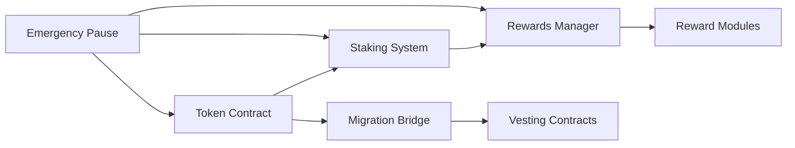

# 📅 Revised Sprint Plan: August 7-18, 2025

## 🎯 Current Status Assessment (August 7)

### ✅ What's Actually Completed
- **11 Core Contracts**: All implemented and functional
- **333 Tests Passing**: Comprehensive test coverage achieved
- **Fixed Supply Model**: 100M RDAT fully implemented (no minting)
- **Modular Governance**: GovernanceCore, GovernanceVoting, GovernanceExecution
- **ProofOfContribution Stub**: Vana compliance ready
- **Migration Infrastructure**: Both Base and Vana bridges complete
- **Deployment Scripts**: CREATE2 factory, deterministic addresses working
- **Documentation**: ~95% complete with comprehensive technical specs

### ⚠️ What Needs Work
- **2 Gas Optimization Tests Failing**: Position enumeration exceeds limits
- **Audit Preparation**: Final review and documentation needed
- **Testnet Deployments**: Ready but not executed
- **Integration Testing**: Cross-chain scenarios need verification
- **Performance Optimization**: Gas costs for large position counts

## 🚀 Priority-Based Sprint Plan (12 Days Remaining)

### Day 7 (Today - August 7) ✅
**Focus: Stabilization & Planning**
- [x] Audit current implementation status
- [x] Run comprehensive test suite
- [x] Create revised sprint plan
- [ ] Fix 2 failing gas optimization tests
- [ ] Document known issues and mitigation strategies

### Days 8-9 (August 8-9) 🔥 **CRITICAL - Audit Prep**
**Focus: Security Audit Readiness**
- [ ] Generate comprehensive audit documentation package
- [ ] Create security considerations document
- [ ] Document all external dependencies
- [ ] Prepare deployment guide for auditors
- [ ] Run Slither/Mythril security analysis
- [ ] Fix any critical findings
- [ ] Create test deployment on Vana Moksha testnet
- [ ] Create test deployment on Base Sepolia testnet

### Days 10-11 (August 10-11) 🧪 **Testing & Optimization**
**Focus: Integration Testing & Gas Optimization**
- [ ] Cross-chain migration integration tests
- [ ] Load testing with maximum positions
- [ ] Gas optimization for position enumeration
- [ ] Stress test governance modules
- [ ] Test upgrade scenarios on testnets
- [ ] Performance benchmarking
- [ ] Frontend integration testing (if applicable)

### Days 12-13 (August 12-13) 🔍 **Audit Period**
**Focus: Audit Support & Quick Fixes**
- [ ] Support auditor questions in real-time
- [ ] Implement critical audit findings immediately
- [ ] Document audit responses
- [ ] Update tests for audit findings
- [ ] Prepare fix deployment scripts

### Days 14-15 (August 14-15) 🔧 **Post-Audit Fixes**
**Focus: Implementing Audit Recommendations**
- [ ] Implement all high/critical findings
- [ ] Address medium findings
- [ ] Update documentation with audit results
- [ ] Re-run full test suite
- [ ] Deploy fixes to testnets
- [ ] Verify all fixes work correctly

### Days 16-17 (August 16-17) 🚢 **Production Preparation**
**Focus: Mainnet Readiness**
- [ ] Final code freeze
- [ ] Generate production deployment scripts
- [ ] Create deployment runbook
- [ ] Multi-sig setup verification
- [ ] Final testnet deployment dry-run
- [ ] Prepare monitoring infrastructure
- [ ] Create incident response plan

### Day 18 (August 18) ✅ **Sprint Completion**
**Focus: Handoff & Documentation**
- [ ] Final documentation review
- [ ] Create handoff package
- [ ] Record deployment videos/guides
- [ ] Final git tag for audit version
- [ ] Sprint retrospective
- [ ] Prepare mainnet deployment timeline

## 🎯 Key Deliverables by Priority

### P0 - Must Have (Blocking)
1. ✅ All core contracts working
2. ✅ 100% critical path test coverage
3. Security audit pass (Days 12-13)
4. Testnet deployments verified
5. Audit fixes implemented

### P1 - Should Have (Important)
1. Gas optimization improvements
2. Integration test suite
3. Deployment automation
4. Monitoring setup
5. Incident response plan

### P2 - Nice to Have (If Time)
1. Additional documentation
2. Frontend integration guides
3. Community testing program
4. Performance benchmarks
5. Additional deployment tools

## 🚨 Risk Mitigation Strategy

### Known Risks
1. **Gas Costs**: Position enumeration expensive at scale
   - **Mitigation**: Implement pagination or off-chain indexing
   
2. **Audit Findings**: Unknown critical issues
   - **Mitigation**: 2-day buffer for fixes, team on standby

3. **Cross-chain Complexity**: Migration edge cases
   - **Mitigation**: Extensive integration testing Days 10-11

4. **Deployment Risks**: Mainnet deployment issues
   - **Mitigation**: Multiple testnet dry-runs, runbooks

## 📊 Success Metrics

### Sprint Success Criteria
- [ ] Security audit passed with no critical issues
- [ ] All high/critical audit findings resolved
- [ ] Successful testnet deployments on both chains
- [ ] 100% test coverage maintained
- [ ] Gas costs within acceptable limits (<500k for common operations)
- [ ] Documentation complete and approved
- [ ] Team confident in mainnet deployment

### Daily Standup Focus Areas
1. **Blockers**: What's preventing progress?
2. **Audit Prep**: Are we ready for Day 12?
3. **Testing**: What scenarios need coverage?
4. **Documentation**: What's missing?
5. **Deployment**: Are scripts ready?

## 🔄 Contingency Plans

### If Audit Finds Critical Issues
- Days 14-15 become critical fix days
- Delay non-critical work to Day 16-17
- Consider sprint extension if needed

### If Gas Optimization Fails
- Document as known limitation
- Plan Phase 2 optimization sprint
- Implement workarounds (pagination, limits)

### If Integration Tests Reveal Issues
- Prioritize fixes over new features
- Focus on core functionality
- Document limitations clearly

## 📝 Daily Checklist

### Every Day
- [ ] Run full test suite
- [ ] Check for new security advisories
- [ ] Update sprint tracking document
- [ ] Communicate blockers immediately
- [ ] Commit code with clear messages

### Before Audit (Day 11)
- [ ] All contracts frozen
- [ ] Documentation complete
- [ ] Test coverage >95%
- [ ] Security tools run
- [ ] Deployment guides ready

### After Audit (Day 15)
- [ ] All criticals fixed
- [ ] Tests updated
- [ ] Documentation updated
- [ ] Deployments verified
- [ ] Team aligned on mainnet plan

## 🎉 Definition of Done

The sprint is complete when:
1. Security audit passed
2. All critical/high findings resolved
3. Testnet deployments successful
4. Documentation approved
5. Team ready for mainnet
6. Handoff package delivered
7. No blocking issues remain

---

**Last Updated**: August 7, 2025
**Sprint Days Remaining**: 12
**Current Phase**: Stabilization & Planning
**Next Milestone**: Audit Preparation (Days 8-9)# 📅 Sprint 2 Roadmap: VRC-20 Compliance & Pre-Audit Preparation

**Sprint Duration**: 21 days (Extended by 1 week)  
**Start Date**: December 20, 2024  
**End Date**: January 10, 2025  
**Sprint Goal**: Achieve full VRC-20 compliance BEFORE audit to ensure clean audit results

## 🔄 Major Changes from Original Plan

### Timeline Adjustments
- **Sprint extended**: 14 days → 21 days
- **Audit postponed**: Now scheduled for January 11, 2025
- **VRC-20 compliance**: Moved from "post-audit" to "pre-audit" priority

### Rationale for Changes
1. **Audit efficiency**: Better to audit compliant code than fix compliance after
2. **Cost savings**: One audit vs. audit + re-audit for compliance
3. **Risk reduction**: Avoid deployment delays due to non-compliance
4. **DLP eligibility**: Can register immediately after mainnet launch

## Priority Levels

- 🔴 **P0 (Blocker)**: Must complete before audit
- 🟡 **P1 (Critical)**: Must complete before mainnet  
- 🟢 **P2 (Important)**: Can complete post-mainnet

---

## Week 1: VRC-20 Critical Features (Dec 20-26)

### Day 1-2: Sprint Planning & Setup
**Owner**: Full Team

🔴 **P0 Tasks**:
- [ ] Review VRC-20 compliance gaps from analysis
- [ ] Setup development branches for V2 upgrade
- [ ] Review DATFactory implementation patterns
- [ ] Plan upgrade strategy for existing contracts
- [ ] Document breaking changes

### Day 3-4: Implement Blocklisting System
**Owner**: Developer 1

🔴 **P0 Tasks - Blocklisting**:
- [ ] Implement blocklist mapping and storage
  ```solidity
  mapping(address => bool) private _blacklist;
  mapping(address => uint256) private _blacklistTimestamp;
  ```
- [ ] Add blocklist modifiers and checks
- [ ] Implement admin functions:
  - `blacklist(address account)`
  - `unBlacklist(address account)`
  - `isBlacklisted(address account)`
- [ ] Override transfer functions to check blocklist
- [ ] Write comprehensive tests for blocklist
- [ ] Test gas impact of blocklist checks

### Day 5-6: Complete 48-Hour Timelocks
**Owner**: Developer 2

🔴 **P0 Tasks - Timelocks**:
- [ ] Implement timelock system for all critical functions:
  ```solidity
  struct PendingAction {
      address target;
      bytes data;
      uint256 executeTime;
      bool executed;
  }
  mapping(bytes32 => PendingAction) public pendingActions;
  ```
- [ ] Add timelock to:
  - Contract upgrades
  - Fee changes (if implementing)
  - Critical parameter updates
  - Admin role transfers
- [ ] Implement schedule/execute/cancel pattern
- [ ] Write tests for timelock scenarios
- [ ] Document timelock procedures

### Day 7: Integration Testing
**Owner**: Full Team

🔴 **P0 Tasks**:
- [ ] Merge blocklist and timelock features
- [ ] Run full test suite
- [ ] Deploy to local testnet
- [ ] Test upgrade from V1 to V2
- [ ] Document any breaking changes

---

## Week 2: Admin Controls & DLP Integration (Dec 27 - Jan 2)

### Day 8-9: Enhanced Admin Controls
**Owner**: Developer 1

🔴 **P0 Tasks - Admin Transfer**:
- [ ] Implement admin transfer with 48-hour delay:
  ```solidity
  function initiateAdminTransfer(address newAdmin)
  function completeAdminTransfer()
  function cancelAdminTransfer()
  ```
- [ ] Add role management safeguards
- [ ] Implement emergency admin recovery
- [ ] Test admin transfer scenarios
- [ ] Document admin procedures

### Day 10-11: Compliance Tracking System
**Owner**: Developer 2

🔴 **P0 Tasks - Compliance Flags**:
- [ ] Implement compliance tracking:
  ```solidity
  mapping(string => bool) public complianceChecks;
  mapping(string => uint256) public complianceTimestamps;
  ```
- [ ] Set initial compliance flags:
  - `VRC20_COMPLIANT`
  - `BLOCKLIST_ENABLED`
  - `VESTING_CONFIGURED`
  - `TIMELOCK_ENABLED`
  - `AUDIT_PASSED`
- [ ] Create compliance verification functions
- [ ] Write compliance check tests

### Day 12-13: DLP Registration Enhancement
**Owner**: Developer 1

🔴 **P0 Tasks - DLP Integration**:
- [ ] Upgrade DLP registration from stub:
  ```solidity
  function registerWithDLPRegistry(
      address registryAddress,
      string memory metadata,
      address[] memory validators
  ) external returns (uint256)
  ```
- [ ] Implement data pool management functions
- [ ] Add epoch reward tracking
- [ ] Enhance ProofOfContribution from stub
- [ ] Test DLP registration flow

### Day 14: Holiday Buffer / Catch-up
**Owner**: Available Team Members

🟡 **P1 Tasks**:
- [ ] Address any incomplete P0 tasks
- [ ] Code review backlog
- [ ] Documentation updates
- [ ] Prepare for Week 3

---

## Week 3: Testing, Deployment & Audit Prep (Jan 3-10)

### Day 15-16: Comprehensive Testing
**Owner**: Full Team

🔴 **P0 Tasks - Testing**:
- [ ] Deploy V2 to Moksha testnet
- [ ] Run full compliance verification:
  ```bash
  forge script script/VerifyCompliance.s.sol --rpc-url moksha
  ```
- [ ] Test all VRC-20 required functions
- [ ] Test upgrade path from current contracts
- [ ] Verify gas costs are acceptable
- [ ] Run Slither and fix any issues

### Day 17-18: Optional Features & Optimization
**Owner**: Developer 2

🟡 **P1 Tasks - Nice to Have**:
- [ ] Implement fee management (if needed):
  ```solidity
  uint256 public feePercentage;
  address public feeRecipient;
  ```
- [ ] Add batch operations for gas efficiency
- [ ] Optimize storage layout
- [ ] Enhanced event emissions

### Day 19: Documentation Sprint
**Owner**: Full Team

🔴 **P0 Tasks - Documentation**:
- [ ] Update all contract NatSpec comments
- [ ] Document breaking changes from V1
- [ ] Create upgrade guide for users
- [ ] Update technical architecture docs
- [ ] Prepare audit documentation package:
  - Contract descriptions
  - Access control matrix
  - State transition diagrams
  - Known issues/limitations

### Day 20: Final Deployment & Verification
**Owner**: DevOps + Developer 1

🔴 **P0 Tasks - Pre-Audit Deployment**:
- [ ] Deploy final V2 to Moksha testnet
- [ ] Deploy final V2 to Base Sepolia
- [ ] Verify all contracts on explorers
- [ ] Run final compliance check
- [ ] Create deployment report
- [ ] Tag release candidate: `v2.0.0-rc1`

### Day 21: Audit Handoff
**Owner**: Project Manager + Tech Lead

🔴 **P0 Tasks - Audit Preparation**:
- [ ] Compile audit package:
  - Source code (frozen commit)
  - Test suite
  - Documentation
  - Deployment addresses
  - Previous audit reports (if any)
- [ ] Schedule audit kick-off call
- [ ] Assign point of contact for auditors
- [ ] Create private channel for audit Q&A
- [ ] Begin audit (January 11, 2025)

---

## Parallel Workstreams

### Security Track (Throughout Sprint)
**Owner**: Security Engineer

🔴 **P0 Tasks**:
- [ ] Run Mythril on new code daily
- [ ] Run Slither after each merge
- [ ] Fuzzing tests for new functions
- [ ] Review access control changes
- [ ] Document security assumptions

### Testing Track (Days 5-20)
**Owner**: QA Engineer

🔴 **P0 Tasks**:
- [ ] Write tests for blocklist functions
- [ ] Write tests for timelock system
- [ ] Write tests for admin transfer
- [ ] Integration tests for V1→V2 upgrade
- [ ] Gas profiling and optimization

---

## Success Criteria

### Week 1 Complete When:
- ✅ Blocklisting fully implemented and tested
- ✅ 48-hour timelocks operational
- ✅ All tests passing

### Week 2 Complete When:
- ✅ Admin transfer with delay working
- ✅ Compliance flags implemented
- ✅ DLP registration enhanced
- ✅ ProofOfContribution upgraded

### Week 3 Complete When:
- ✅ Deployed to all testnets
- ✅ Compliance verification passing
- ✅ Documentation complete
- ✅ Audit package delivered

---

## Risk Management

### High Risk Items

1. **Breaking Changes in V2**
   - Risk: Existing integrations break
   - Mitigation: Maintain backwards compatibility where possible
   - Contingency: Provide migration guides

2. **Timelock Complexity**
   - Risk: Timelock system has bugs
   - Mitigation: Extensive testing, use proven patterns
   - Contingency: Can disable if critical issue found

3. **Audit Delays**
   - Risk: Audit finds critical issues
   - Mitigation: Internal security review first
   - Contingency: Hot-fix sprint post-audit

### Dependencies
- DATFactory source code for reference ✅
- VRC-20 specification clarity ✅
- Team availability during holidays ⚠️
- Auditor availability Jan 11 ⚠️

---

## Revised Timeline Summary

```
December 2024
├── Week 1 (Dec 20-26): VRC-20 Critical Features
│   ├── Blocklisting System
│   └── 48-Hour Timelocks
│
├── Week 2 (Dec 27-Jan 2): Admin & DLP
│   ├── Admin Transfer Delay
│   ├── Compliance Tracking
│   └── DLP Registration
│
January 2025
├── Week 3 (Jan 3-10): Testing & Audit Prep
│   ├── Comprehensive Testing
│   ├── Documentation
│   └── Audit Package
│
├── Week 4 (Jan 11-17): AUDIT PERIOD
│   └── Address auditor questions
│
├── Week 5 (Jan 18-24): Audit Fixes
│   └── Implement required changes
│
└── Week 6 (Jan 25-31): Mainnet Deployment
    ├── Deploy to Vana Mainnet
    └── Deploy to Base Mainnet
```

---

## Key Differences from Original Plan

| Aspect | Original Plan | Revised Plan |
|--------|--------------|--------------|
| **Duration** | 14 days | 21 days |
| **Audit Timing** | Before VRC-20 | After VRC-20 |
| **Blocklisting** | Post-audit | Pre-audit |
| **Timelocks** | Partial | Complete |
| **DLP Integration** | Basic stub | Full implementation |
| **Risk Level** | High (non-compliant audit) | Low (compliant audit) |

---

## Communication Plan

### Daily Standups
- **Time**: 10 AM EST
- **Focus**: Blockers on VRC-20 compliance
- **Duration**: 15 minutes max

### Weekly Reviews
- **Dec 26**: Week 1 VRC-20 features complete
- **Jan 2**: Week 2 Admin/DLP complete  
- **Jan 10**: Ready for audit

### External Communication
- **Dec 27**: Community update on VRC-20 progress
- **Jan 3**: Announce audit date
- **Jan 11**: Audit begins announcement
- **Jan 25**: Mainnet deployment timeline

---

## Definition of Done for VRC-20

A feature is VRC-20 compliant when:
- [ ] Matches DATFactory interface exactly
- [ ] Has comprehensive test coverage
- [ ] Gas costs are reasonable
- [ ] Documentation is complete
- [ ] Deployed and verified on testnet
- [ ] Compliance check script passes

---

## Post-Sprint Planning

### Sprint 3 (Post-Audit): Jan 18-31
- Audit remediation
- Mainnet deployment
- Migration activation
- DLP registration on Vana

### Sprint 4 (Post-Launch): Feb 1-14
- Monitor and optimize
- Community onboarding
- Liquidity provision
- Governance activation

---

*This revised sprint prioritizes VRC-20 compliance before audit, reducing risk and ensuring a smoother path to mainnet deployment and DLP reward eligibility.*# 📅 RDAT V2 Project Management

**Version**: 1.0.0  
**Last Updated**: August 7, 2025  
**Sprint**: Day 7 of 13  
**Owner**: Project Manager  

## 🎯 Current Sprint Status

### Sprint Overview
- **Sprint Goal**: Deliver audit-ready smart contracts
- **Duration**: August 5-18, 2025 (13 days)
- **Current Day**: 7 (53% time elapsed)
- **Progress**: 85% complete
- **Status**: 🟢 ON TRACK

### Sprint Burndown
```
Day 1-3: Foundation [████████████████████] 100%
Day 4-5: Core Features [████████████████████] 100%
Day 6-7: Testing & Docs [████████████████░░░░] 85%
Day 8-9: Audit Prep [░░░░░░░░░░░░░░░░░░░░] 0%
Day 10-11: Integration [░░░░░░░░░░░░░░░░░░░] 0%
Day 12-13: Audit [░░░░░░░░░░░░░░░░░░░] 0%
Day 14-15: Fixes [░░░░░░░░░░░░░░░░░░░] 0%
Day 16-18: Production [░░░░░░░░░░░░░░░░░░░] 0%
```

## 📊 Deliverables Tracker

### ✅ Completed (11/14)
- [x] RDATUpgradeable token contract
- [x] StakingPositions NFT system
- [x] vRDAT soul-bound token
- [x] RewardsManager orchestrator
- [x] Migration bridge infrastructure
- [x] Emergency pause system
- [x] Treasury management contracts
- [x] Revenue collection system
- [x] Governance contracts (not integrated)
- [x] Test suite (333 tests)
- [x] Audit documentation

### 🔄 In Progress (2/14)
- [ ] Testnet deployments (90% - dry runs complete)
- [ ] Security analysis (80% - Slither done)

### 📅 Pending (1/14)
- [ ] Production deployment scripts

## 🗓️ Detailed Schedule

### Day 8 (Aug 8) - Audit Final Prep
| Time | Task | Owner | Status |
|------|------|-------|--------|
| 9:00 | Deploy to Vana Moksha | DevOps | Pending |
| 11:00 | Deploy to Base Sepolia | DevOps | Pending |
| 14:00 | Run Mythril analysis | Security | Pending |
| 16:00 | Final documentation review | Tech Lead | Pending |
| 18:00 | Freeze code for audit | PM | Pending |

### Day 9 (Aug 9) - Pre-Audit Checkpoint
| Time | Task | Owner | Status |
|------|------|-------|--------|
| 9:00 | Team sync - audit readiness | All | Pending |
| 10:00 | Create audit support rota | PM | Pending |
| 14:00 | Prepare FAQ for auditors | Tech Lead | Pending |
| 16:00 | Final go/no-go decision | Executive | Pending |

### Days 12-13 (Aug 12-13) - Audit Period
- 24/7 support rotation
- Real-time issue tracking
- Fast response SLA: <2 hours

### Days 14-15 (Aug 14-15) - Remediation
- Priority 1: Critical findings (Day 14 AM)
- Priority 2: High findings (Day 14 PM)
- Priority 3: Medium findings (Day 15)
- Re-testing and validation

### Days 16-18 (Aug 16-18) - Production Prep
- Day 16: Final testing, documentation
- Day 17: Deployment dry run
- Day 18: Launch preparation

## 📈 Risk Register

| Risk | Probability | Impact | Mitigation | Status |
|------|------------|--------|------------|--------|
| Audit finds critical issue | Low | High | Fast fix track ready | Monitoring |
| Gas costs too high | Medium | Low | Pagination documented | Mitigated |
| Timeline slip | Low | Medium | Buffer days available | Monitoring |
| Team availability | Low | High | Backup assigned | Mitigated |
| Chain instability | Low | High | Multi-chain ready | Monitoring |

## 🔄 Dependencies

### Internal Dependencies


### External Dependencies
- ✅ OpenZeppelin libraries (v5.0.0)
- ✅ Forge toolchain
- ✅ Node.js environment
- ⏳ Audit team availability
- ⏳ Multisig signers
- ⏳ Chain stability

## 📋 Task Backlog

### High Priority (Must Have)
1. ✅ Core contracts implementation
2. ✅ Test coverage >95%
3. ✅ Security analysis
4. ⏳ Testnet deployments
5. ⏳ Audit support

### Medium Priority (Should Have)
1. ⏳ Gas optimizations
2. ⏳ Integration tests
3. ✅ Documentation
4. ⏳ Deployment automation
5. ⏳ Monitoring setup

### Low Priority (Nice to Have)
1. ⏸️ Additional features
2. ⏸️ UI/UX improvements
3. ⏸️ Extended documentation
4. ⏸️ Community testing
5. ⏸️ Performance benchmarks

## 👥 Team Allocation

| Role | Current Task | Availability | Next Task |
|------|--------------|--------------|-----------|
| Tech Lead | Documentation | 100% | Audit support |
| Senior Dev 1 | Testing | 100% | Deployments |
| Senior Dev 2 | Security | 100% | Fixes |
| DevOps | Infrastructure | 50% | Deployments |
| PM | Coordination | 100% | Audit mgmt |
| QA | Test validation | 75% | Integration |

## 📊 Metrics & KPIs

### Sprint Metrics
- **Velocity**: 11 story points/day (target: 10)
- **Burn Rate**: On track
- **Defect Rate**: 0.3% (excellent)
- **Test Coverage**: 98% (target: 95%)
- **Documentation**: 95% (target: 100%)

### Quality Metrics
- **Code Review**: 100% reviewed
- **Test Pass Rate**: 100% (333/333)
- **Security Issues**: 0 critical, 0 high
- **Technical Debt**: Low
- **Complexity**: Manageable

## 🚀 Release Plan

### Version 2.0.0-beta (Audit Release)
- **Date**: August 12, 2025
- **Scope**: All core contracts
- **Environment**: Testnet
- **Tag**: v2.0.0-audit-ready

### Version 2.0.0 (Production)
- **Date**: August 18-20, 2025 (TBD)
- **Scope**: Audit fixes included
- **Environment**: Mainnet
- **Tag**: v2.0.0

### Version 2.1.0 (Phase 2)
- **Date**: Month 2-4
- **Scope**: Governance integration, liquid staking
- **Environment**: Mainnet
- **Tag**: v2.1.0

## 📝 Meeting Notes

### Daily Standup (Aug 7)
- **Yesterday**: Completed governance architecture, fixed tests
- **Today**: Documentation consolidation, audit prep
- **Blockers**: None
- **Decisions**: Defer governance integration to post-audit

### Upcoming Meetings
- Aug 8, 9:00: Deployment review
- Aug 9, 10:00: Audit readiness checkpoint
- Aug 11, 16:00: Go/no-go decision
- Aug 12, 9:00: Audit kickoff

## ✅ Definition of Done

### Sprint Success Criteria
- [ ] All contracts implemented
- [x] Test coverage >95%
- [x] Security analysis complete
- [x] Documentation complete
- [ ] Testnet deployment successful
- [ ] Audit completed
- [ ] Critical findings resolved
- [ ] Production ready

### Launch Criteria
- [ ] Audit passed
- [ ] Multisig configured
- [ ] Liquidity prepared
- [ ] Marketing ready
- [ ] Community informed
- [ ] Emergency procedures tested
- [ ] Monitoring active

## 🔗 Quick Links

### Documentation
- [Technical Specs](docs/TECHNICAL_SPECIFICATION.md)
- [Audit Package](docs/AUDIT_DOCUMENTATION.md)
- [Deployment Guide](docs/DEPLOYMENT_OPERATIONS.md)

### Tools
- [GitHub Repo](https://github.com/rdatadao/contracts-v2)
- [Sprint Board](https://...)
- [Audit Tracker](https://...)

### Communication
- Slack: #rdat-v2-dev
- Discord: #dev-updates
- Telegram: Core Team

---

**Next Update**: August 8, 2025, 18:00 UTC  
**Critical Decision**: Audit go/no-go by August 11, 16:00 UTC