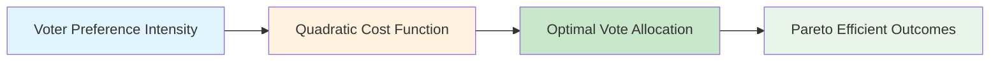
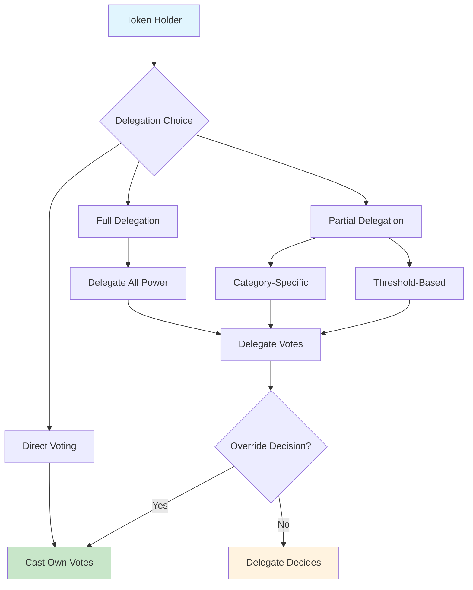
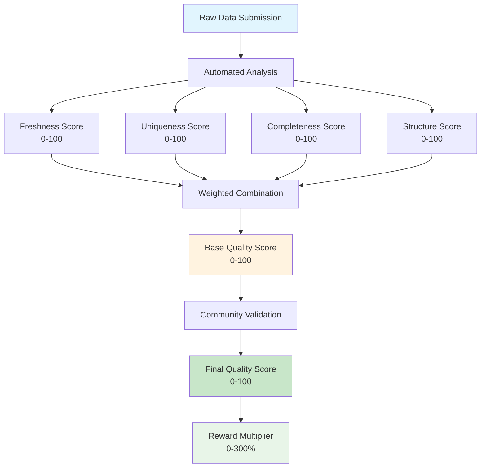
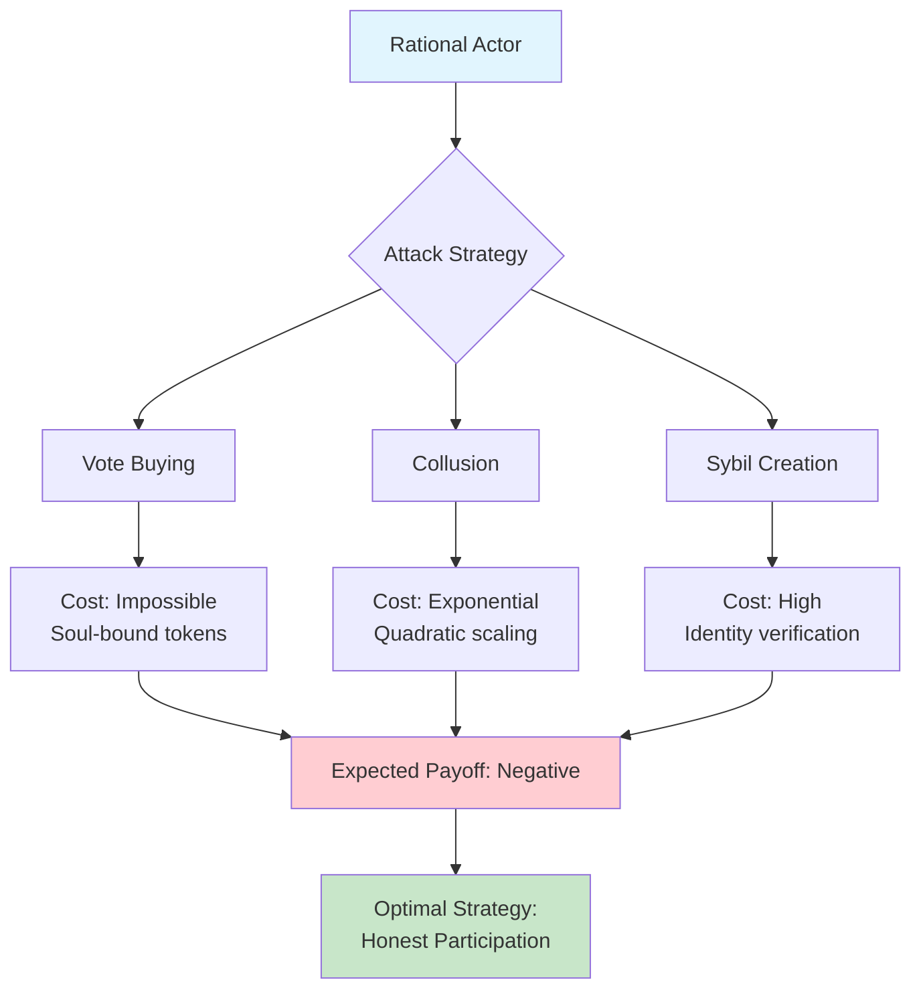
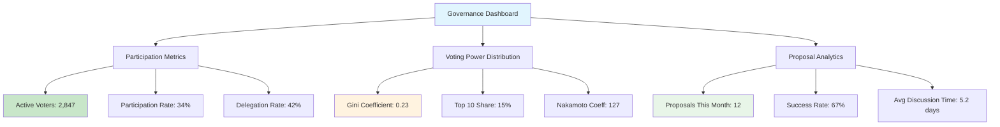

# 🏛️ r/datadao Governance Framework: Quadratic Democracy & Fair Systems Design

**Version**: 1.1 (Updated for V2 Beta Implementation)  
**Date**: August 2025  
**Focus**: Technical analysis of governance mechanisms, quadratic voting implementation, and fair reward systems  
**Companion to**: r/datadao Whitepaper v1.0  
**Implementation Status**: V2 Beta with vRDAT quadratic voting

---

## 🎯 Executive Summary: Mathematical Fairness in Digital Governance

r/datadao implements the first production-scale quadratic voting system in the data economy, combining soul-bound tokens with merit-based participation to create mathematically fair governance that prevents plutocratic capture while incentivizing quality contributions.

### Core Innovation: Quadratic Cost Democracy

Traditional governance systems suffer from the "one dollar, one vote" problem where wealth concentration leads to disproportionate influence. r/datadao solves this through quadratic cost scaling:

```
Cost to cast N votes = N²
```

This mathematical relationship ensures that while everyone can participate affordably in governance, attempting to dominate decisions becomes exponentially expensive, creating natural democratic equilibrium.

---

## 🧮 Mathematical Foundation of Fair Governance

### Quadratic Voting Theory

#### The Problem with Linear Systems
In traditional voting systems, influence scales linearly with resources:
- Alice with 100 tokens = 100 votes
- Bob with 10,000 tokens = 10,000 votes  
- Result: Bob has 100x the influence despite potentially having different stake in outcomes

#### Quadratic Solution (Implemented in vRDAT)
With quadratic voting, the cost scales quadratically with desired influence:
- Alice wants 10 votes: Cost = 10² = 100 vRDAT (burned)
- Bob wants 100 votes: Cost = 100² = 10,000 vRDAT (burned)
- Result: Bob has 10x the influence, but paid 100x the cost

**V2 Beta Implementation**:
```solidity
// In vRDAT.sol
function calculateVoteCost(uint256 votes) public pure returns (uint256) {
    return votes * votes; // n² cost for quadratic voting
}
```

#### Economic Efficiency Properties



**Key Properties:**
1. **Incentive Compatible**: Voters optimally reveal their true preferences
2. **Budget Constraint**: Limited resources force prioritization
3. **Diminishing Returns**: Expensive to dominate single issues
4. **Broad Participation**: Cheap for many to express moderate preferences

### vRDAT: Soul-Bound Voting Rights

#### Non-Transferability Enforcement

```solidity
// Complete transfer prevention at multiple levels with flash loan protection
contract SecurevRDAT is ERC20Votes, ERC20Permit, AccessControl, ReentrancyGuard {
    error NonTransferableToken();
    
    mapping(address => uint256) public lastStakeTimestamp;
    uint256 public constant VOTING_DELAY = 48 hours;
    uint256 public constant MAX_VRDAT_PER_ADDRESS = 10_000_000e18; // 10M cap
    
    // Block all ERC20 transfer methods
    function transfer(address, uint256) public pure override returns (bool) {
        revert NonTransferableToken();
    }
    
    function transferFrom(address, address, uint256) public pure override returns (bool) {
        revert NonTransferableToken();
    }
    
    function approve(address, uint256) public pure override returns (bool) {
        revert NonTransferableToken();
    }
    
    // Override internal transfer mechanisms
    function _transfer(address, address, uint256) internal pure override {
        revert NonTransferableToken();
    }
    
    // Mint with flash loan protection
    function mint(address to, uint256 amount) external onlyRole(MINTER_ROLE) {
        require(balanceOf(to) + amount <= MAX_VRDAT_PER_ADDRESS, "Exceeds cap");
        lastStakeTimestamp[to] = block.timestamp;
        _mint(to, amount);
    }
    
    // Only allow delegation with loop prevention
    function delegate(address delegatee) public override {
        require(!_hasDelegationLoop(msg.sender, delegatee), "Loop detected");
        _delegate(msg.sender, delegatee);
    }
    
    // Flash loan protection for voting
    modifier flashLoanProtection() {
        require(
            block.timestamp > lastStakeTimestamp[msg.sender] + VOTING_DELAY,
            "Recent stake, voting disabled"
        );
        _;
    }
}
```

#### Distribution Based on Merit, Not Purchase

vRDAT tokens cannot be bought—only earned through productive participation:

```
vRDAT_Earned = Staked_RDAT × Time_Multiplier × Lock_Multiplier × Quality_Factor
```

Where:
- **Staked_RDAT**: Base stake demonstrating skin-in-the-game
- **Time_Multiplier**: 1.1^months staked (capped at 2.0x)  
- **Lock_Multiplier**: 1x to 4x based on commitment period
- **Quality_Factor**: Data contribution quality bonus (1x to 1.5x)

This ensures voting power correlates with productive ecosystem participation rather than financial resources.

---

## 🎭 Delegation: Representative Democracy Layer

### Flexible Mandate System

r/datadao implements sophisticated delegation allowing voters to:

1. **Full Delegation**: Delegate all governance participation to trusted expert
2. **Categorical Delegation**: Delegate specific topics (technical, economic, social)
3. **Threshold Delegation**: Delegate only proposals above certain importance
4. **Override Rights**: Vote directly on specific proposals despite delegation



### Delegation Loop Prevention

```solidity
function _hasDelegationLoop(address delegator, address delegatee) 
    internal view returns (bool) {
    address current = delegatee;
    uint256 depth = 0;
    uint256 constant MAX_DEPTH = 10;
    
    while (current != address(0) && depth < MAX_DEPTH) {
        if (current == delegator) return true;
        current = delegates(current);
        depth++;
    }
    
    return depth >= MAX_DEPTH; // Prevent infinite chains
}
```

### Delegate Accountability

#### Performance Metrics
- **Participation Rate**: Percentage of proposals voted on
- **Alignment Score**: How well delegate votes match delegator preferences  
- **Response Time**: Speed of engagement with new proposals
- **Community Standing**: Peer review of delegate quality

#### Reputation System
```solidity
struct DelegateMetrics {
    uint256 proposalsVoted;      // Total participation
    uint256 totalProposals;      // Available opportunities  
    uint256 alignmentScore;      // Weighted preference matching
    uint256 communityRating;     // Peer-reviewed performance
    uint256 averageResponseTime; // Engagement speed
}
```

---

## 📊 Merit-Based Data Contribution Rewards

### Multi-Dimensional Quality Assessment

#### Quality Scoring Matrix



#### Algorithmic Quality Detection

**Freshness Scoring:**
```solidity
function calculateFreshnessScore(uint256 dataTimestamp, uint256 submissionTime) 
    internal pure returns (uint256) {
    uint256 age = submissionTime - dataTimestamp;
    uint256 maxAge = 30 days; // Configurable per data type
    
    if (age > maxAge) return 0;
    return 100 - (age * 100) / maxAge;
}
```

**Uniqueness Detection:**
```solidity
function calculateUniquenessScore(bytes32 dataHash) 
    internal view returns (uint256) {
    uint256 similarity = _calculateSimilarity(dataHash);
    return similarity < 80 ? 100 - similarity : 0; // Reject duplicates
}
```

**Completeness Analysis:**
```solidity
function calculateCompletenessScore(DataStructure memory data) 
    internal pure returns (uint256) {
    uint256 requiredFields = _getRequiredFieldCount(data.dataType);
    uint256 populatedFields = _getPopulatedFieldCount(data);
    
    return (populatedFields * 100) / requiredFields;
}
```

### Economic Incentive Alignment

#### Reward Calculation Engine

```solidity
function calculateTotalReward(
    uint256 dataSize,
    QualityScore memory quality,
    address contributor
) internal view returns (uint256) {
    // Base reward: 1 RDAT per MB
    uint256 baseReward = (dataSize * BASE_REWARD_PER_MB) / 1e6;
    
    // Quality multiplier: 0-300% based on score
    uint256 qualityMultiplier = (quality.overallScore * 3);
    uint256 qualityBonus = (baseReward * qualityMultiplier) / 100;
    
    // Size bonus for large contributions
    uint256 sizeBonus = dataSize > LARGE_DATA_THRESHOLD ? 
        baseReward / 10 : 0; // 10% bonus
    
    // Consistency bonus for regular contributors
    uint256 consistencyBonus = _getConsistencyBonus(contributor, baseReward);
    
    return baseReward + qualityBonus + sizeBonus + consistencyBonus;
}
```

#### Anti-Gaming Mechanisms

**Sybil Resistance:**
```solidity
contract SybilResistance {
    mapping(address => IdentityProof) public identityProofs;
    mapping(bytes32 => bool) public usedProofs;
    
    struct IdentityProof {
        bytes32 redditAccountHash;
        uint256 accountAge;
        uint256 karma;
        bool verified;
    }
    
    function verifyIdentity(
        string calldata redditUsername,
        bytes calldata signature
    ) external {
        bytes32 accountHash = keccak256(abi.encode(redditUsername, msg.sender));
        require(!usedProofs[accountHash], "Account already used");
        
        // Verify Reddit account ownership
        require(_verifyRedditSignature(redditUsername, signature), "Invalid proof");
        
        identityProofs[msg.sender] = IdentityProof({
            redditAccountHash: accountHash,
            accountAge: _getAccountAge(redditUsername),
            karma: _getAccountKarma(redditUsername),
            verified: true
        });
        
        usedProofs[accountHash] = true;
    }
}
```

**Quality Staking:**
```solidity
contract QualityStaking {
    mapping(uint256 => uint256) public contributionStakes;
    mapping(address => uint256) public contributorStakes;
    
    function stakeForQuality(uint256 contributionId, uint256 amount) external {
        RDAT.transferFrom(msg.sender, address(this), amount);
        contributionStakes[contributionId] += amount;
        contributorStakes[msg.sender] += amount;
        
        emit QualityStaked(contributionId, msg.sender, amount);
    }
    
    function slashForLowQuality(uint256 contributionId, uint256 amount) 
        external onlyRole(QUALITY_VALIDATOR_ROLE) {
        require(contributionStakes[contributionId] >= amount, "Insufficient stake");
        
        contributionStakes[contributionId] -= amount;
        // Slash goes to treasury for ecosystem development
        RDAT.transfer(treasury, amount);
        
        emit QualitySlashed(contributionId, amount);
    }
}
```

---

## 🔒 Security Model: Game-Theoretic Protections

### Economic Security Analysis

#### Attack Vectors & Defenses

**Vote Buying Attacks:**
- **Attack**: Wealthy actors attempt to purchase voting influence
- **Defense**: Soul-bound tokens prevent transfers; 48-hour voting delay prevents flash loans
- **Cost**: Would require controlling majority of productive ecosystem participants
- **Additional Protection**: 10M vRDAT cap per address prevents concentration

**Flash Loan Attacks:**
- **Attack**: Borrow RDAT, stake, vote, unstake, repay in single transaction
- **Defense**: 48-hour mandatory delay between staking and voting eligibility
- **Implementation**: lastStakeTimestamp tracking with flashLoanProtection modifier
- **Result**: Economically infeasible to hold loans for 48+ hours

**Collusion Attacks:**
- **Attack**: Coordinated groups attempt to manipulate outcomes
- **Defense**: Quadratic costs make large-scale coordination expensive
- **Detection**: Pattern analysis identifies suspicious voting correlations
- **Proposal Bonds**: 1000 RDAT required, preventing spam proposals

**Sybil Attacks:**
- **Attack**: Creating multiple identities to gain disproportionate influence
- **Defense**: Identity verification through Reddit account + Kismet reputation
- **Barriers**: Limited Reddit accounts with sufficient age/karma for verification
- **Economic Cost**: Must stake RDAT and maintain positions across multiple accounts

#### Game-Theoretic Analysis



**Nash Equilibrium Analysis:**
Under r/datadao's mechanisms, the dominant strategy for rational actors is honest participation:

1. **Honest Participation Payoff**: Positive expected returns through rewards and governance influence
2. **Attack Payoff**: Negative expected returns due to exponential costs and limited success probability
3. **Equilibrium**: All rational actors choose honest participation

### Technical Security Measures

#### Smart Contract Security
```solidity
abstract contract SecurityFramework is 
    AccessControl, 
    ReentrancyGuard, 
    Pausable,
    EmergencyPausable {
    
    // Timelocked role changes prevent rapid privilege escalation
    modifier timelockedOnly(bytes32 role) {
        require(hasRole(role, msg.sender), "Unauthorized");
        require(block.timestamp >= roleChangeTime[role], "Timelock active");
        _;
    }
    
    // Rate limiting prevents DOS attacks
    modifier rateLimited(bytes4 selector) {
        require(_checkRateLimit(selector), "Rate limit exceeded");
        _;
        _updateRateLimit(selector);
    }
    
    // Emergency pause for critical vulnerabilities
    modifier whenNotEmergencyPaused() {
        require(
            !paused() || block.timestamp > emergencyPauseExpiry,
            "Emergency pause active"
        );
        _;
    }
}
```

#### Oracle Security
```solidity
contract SecureOracle {
    function getSecurePrice() external view returns (uint256, bool) {
        uint256[] memory prices = new uint256[](oracles.length);
        uint256 validCount = 0;
        
        // Query multiple oracles
        for (uint256 i = 0; i < oracles.length; i++) {
            try oracles[i].latestPrice() returns (uint256 price) {
                if (_isValidPrice(price)) {
                    prices[validCount++] = price;
                }
            } catch {
                // Skip failed oracle
            }
        }
        
        require(validCount >= MIN_ORACLES, "Insufficient oracles");
        
        uint256 medianPrice = _calculateMedian(prices, validCount);
        bool isReliable = _checkPriceDeviation(medianPrice);
        
        return (medianPrice, isReliable);
    }
}
```

---

## 📈 Governance Analytics & Optimization

### Real-Time Governance Health Metrics

#### Participation Metrics
```solidity
contract GovernanceAnalytics {
    struct ParticipationStats {
        uint256 totalEligibleVoters;
        uint256 activeVoters; 
        uint256 delegatedVoters;
        uint256 participationRate;
    }
    
    struct ConcentrationMetrics {
        uint256 giniCoefficient;      // 0-10000 (0 = perfect equality)
        uint256 top10Concentration;   // % of power held by top 10
        uint256 nakamotoCoefficient;  // Min entities for 51% control
    }
    
    function getGovernanceHealth() external view returns (
        ParticipationStats memory participation,
        ConcentrationMetrics memory concentration,
        uint256 proposalSuccessRate
    ) {
        // Calculate real-time governance health metrics
    }
}
```

#### Dashboard Visualization



### Optimization Mechanisms

#### Dynamic Parameter Adjustment
```solidity
contract ParameterOptimization {
    struct GovernanceParameters {
        uint256 proposalThreshold;    // Min vRDAT to create proposal
        uint256 quorumRequirement;    // Min participation for valid vote
        uint256 votingPeriod;         // Duration of voting window
        uint256 timelockDelay;        // Delay before execution
    }
    
    function optimizeParameters() external onlyRole(OPTIMIZER_ROLE) {
        GovernanceParameters memory current = getCurrentParameters();
        GovernanceMetrics memory metrics = getRecentMetrics();
        
        // Adjust based on participation patterns
        if (metrics.participationRate < 20) {
            // Reduce barriers to participation
            current.proposalThreshold = current.proposalThreshold * 90 / 100;
            current.quorumRequirement = current.quorumRequirement * 95 / 100;
        } else if (metrics.participationRate > 50) {
            // Increase quality requirements
            current.proposalThreshold = current.proposalThreshold * 110 / 100;
        }
        
        updateParameters(current);
    }
}
```

#### A/B Testing Framework
```solidity
contract GovernanceExperiments {
    mapping(uint256 => ExperimentConfig) public experiments;
    
    struct ExperimentConfig {
        string name;
        uint256 startTime;
        uint256 endTime;
        uint256 treatmentGroup;  // % of users in treatment
        bytes parameterChanges;  // Encoded parameter modifications
        bool active;
    }
    
    function runExperiment(
        string calldata name,
        uint256 duration,
        uint256 treatmentPercent,
        bytes calldata parameters
    ) external onlyRole(GOVERNANCE_RESEARCHER_ROLE) {
        uint256 experimentId = ++nextExperimentId;
        
        experiments[experimentId] = ExperimentConfig({
            name: name,
            startTime: block.timestamp,
            endTime: block.timestamp + duration,
            treatmentGroup: treatmentPercent,
            parameterChanges: parameters,
            active: true
        });
        
        emit ExperimentStarted(experimentId, name);
    }
}
```

---

## 🌍 Cross-Chain Governance Architecture

### Multi-Chain Coordination

```mermaid
sequenceStart
    participant Vana as Vana Mainnet<br/>(Primary Governance)
    participant Base as Base Mainnet<br/>(Legacy Support)
    participant L2 as Layer 2<br/>(Scaling)
    participant Oracle as Cross-Chain Oracle
    
    Note over Vana: Proposal Created
    Vana->>Oracle: Broadcast Proposal
    Oracle->>Base: Sync Proposal
    Oracle->>L2: Sync Proposal
    
    Note over Base,L2: Voting Period
    Base->>Oracle: Submit Votes
    L2->>Oracle: Submit Votes
    Oracle->>Vana: Aggregate Votes
    
    Note over Vana: Calculate Results
    Vana->>Oracle: Broadcast Results
    Oracle->>Base: Execute if Applicable
    Oracle->>L2: Execute if Applicable
```

### Cross-Chain Security Model

```solidity
contract CrossChainGovernance {
    mapping(uint256 => ChainConfig) public supportedChains;
    mapping(bytes32 => CrossChainProposal) public crossChainProposals;
    
    struct ChainConfig {
        uint256 chainId;
        address governanceContract;
        uint256 votingWeight;      // Relative weight in aggregation
        bool active;
    }
    
    struct CrossChainProposal {
        uint256 proposalId;
        mapping(uint256 => uint256) chainVotes;  // chainId => vote count
        uint256 totalVotes;
        bool executed;
    }
    
    function aggregateCrossChainVotes(uint256 proposalId) 
        external onlyRole(ORACLE_ROLE) {
        CrossChainProposal storage proposal = crossChainProposals[
            keccak256(abi.encode(proposalId))
        ];
        
        uint256 weightedTotal = 0;
        for (uint256 i = 0; i < supportedChainCount; i++) {
            ChainConfig memory chain = supportedChains[i];
            if (chain.active) {
                weightedTotal += proposal.chainVotes[chain.chainId] * chain.votingWeight;
            }
        }
        
        proposal.totalVotes = weightedTotal;
        emit CrossChainVotesAggregated(proposalId, weightedTotal);
    }
}
```

---

## 🔬 Research & Future Developments

### Governance Innovation Pipeline

#### Quadratic Funding Integration
Extend quadratic principles beyond voting to funding allocation:

```solidity
contract QuadraticFunding {
    function calculateFunding(uint256 projectId) 
        external view returns (uint256) {
        uint256 totalContributions = projectContributions[projectId];
        uint256 contributorCount = projectContributors[projectId];
        
        // Quadratic funding: (sum of sqrt(contributions))²
        uint256 quadraticSum = 0;
        for (uint256 i = 0; i < contributorCount; i++) {
            address contributor = getContributor(projectId, i);
            uint256 contribution = contributions[projectId][contributor];
            quadraticSum += sqrt(contribution);
        }
        
        return quadraticSum * quadraticSum;
    }
}
```

#### Prediction Markets for Governance
Integrate prediction markets to improve decision quality:

```solidity
contract GovernancePredictionMarkets {
    struct PredictionMarket {
        uint256 proposalId;
        uint256 totalStaked;
        mapping(bool => uint256) stakes;  // outcome => total staked
        uint256 resolutionTime;
        bool resolved;
        bool outcome;
    }
    
    function createPredictionMarket(uint256 proposalId) 
        external returns (uint256 marketId) {
        // Create prediction market for proposal outcome
        // Allows community to signal confidence in decisions
    }
}
```

#### Liquid Democracy Evolution
Dynamic delegation based on expertise and performance:

```solidity
contract LiquidDemocracy {
    mapping(address => mapping(string => address)) public categoryDelegates;
    mapping(address => mapping(string => uint256)) public expertise;
    
    function delegate(string calldata category, address expert) external {
        require(expertise[expert][category] > MIN_EXPERTISE, "Insufficient expertise");
        categoryDelegates[msg.sender][category] = expert;
    }
    
    function updateExpertise(address expert, string calldata category) external {
        // Update based on prediction market performance, community ratings
        expertise[expert][category] = calculateExpertise(expert, category);
    }
}
```

### Academic Partnerships

#### Research Collaborations
- **MIT**: Quadratic voting implementation studies  
- **Stanford**: Game-theoretic analysis of tokenomic mechanisms
- **Oxford**: Democratic theory applications in digital governance
- **Berkeley**: Economic modeling and sustainability analysis

#### Publication Pipeline
- **"Quadratic Voting in Practice: Lessons from r/datadao"** - Democratic theory journal
- **"Soul-Bound Tokens for Governance: Technical Implementation"** - Blockchain conference
- **"Merit-Based Reward Systems in Decentralized Networks"** - Economics journal
- **"Cross-Chain Governance Coordination Mechanisms"** - Computer science conference

---

## 🎯 Conclusion: Blueprint for Democratic Digital Systems

r/datadao's governance framework represents a comprehensive solution to the fundamental challenges of digital democracy:

### Key Innovations Validated

1. **Mathematical Fairness**: Quadratic voting provides provable democratic properties
2. **Economic Alignment**: Merit-based rewards create sustainable participation incentives  
3. **Technical Security**: Multi-layer protection against known attack vectors
4. **Operational Excellence**: Real-time analytics enable continuous optimization
5. **Research Foundation**: Academic partnerships ensure theoretical rigor

### Broader Implications

The systems developed for r/datadao provide a template for:
- **Corporate Governance**: Shareholder voting with democratic protections
- **Public Policy**: Citizen participation in government decisions
- **Open Source**: Maintainer selection and project direction
- **Social Networks**: Community moderation and platform governance
- **Educational Institutions**: Student and faculty decision-making

### Future Vision

r/datadao governance framework establishes the foundation for:
- **Scalable Democracy**: Participation mechanisms that work at global scale
- **Expertise Integration**: Efficient use of domain knowledge in complex decisions
- **Cultural Adaptation**: Governance systems that evolve with community values
- **Economic Sustainability**: Self-funding through value creation rather than extraction

The future of digital governance is democratic, fair, and mathematically sound. r/datadao proves it's possible.

---

**Document Information**
- **Version**: 1.0
- **Date**: November 2024  
- **Authors**: r/datadao Governance Working Group
- **Technical Review**: [Pending]
- **Academic Review**: [Pending]
- **Implementation Status**: Specifications Complete

**References**
1. Weyl, E. G. (2017). "The Robustness of Quadratic Voting." Public Choice, 172(1-2), 75-107.
2. Lalley, S. P., & Weyl, E. G. (2018). "Quadratic Voting: How Mechanism Design Can Radicalize Democracy." American Economic Review, 108(4-5), 1284-1318.
3. Buterin, V., Hitzig, Z., & Weyl, E. G. (2018). "Liberal Radicalism: A Flexible Design for Philanthropic Matching Funds." SSRN.
4. Posner, E. A., & Weyl, E. G. (2018). "Radical Markets: Uprooting Capitalism and Democracy for a Just Society." Princeton University Press.

---

## 🚀 V2 Beta Implementation Details

### Phase 1: Snapshot Integration (Days 1-13)
- **Platform**: Snapshot with quadratic voting strategy
- **Token**: vRDAT (soul-bound governance token)
- **Voting Cost**: n² vRDAT burned per vote
- **Quorum**: 4M vRDAT equivalent participation
- **Proposal Bond**: 1000 RDAT (prevents spam)

### V2 Beta Smart Contracts (7 Total)
1. **vRDAT.sol**: Implements quadratic voting math
2. **ProofOfContribution.sol**: Tracks contributor quality scores
3. **RevenueCollector.sol**: Distributes fees to governance participants
4. **Staking.sol**: Mints vRDAT based on RDAT lock duration

### Governance Security Measures
- 48-hour mint delay prevents flash loan attacks
- Soul-bound tokens prevent vote trading
- Reentrancy guards on all value transfers
- Multi-sig control of critical parameters

### Phase 2-3 Evolution
- On-chain governance execution via Reality.eth
- Full quadratic funding for data contributions
- Cross-chain governance coordination
- Automated treasury management

---

*This framework document provides technical specifications and theoretical analysis supporting r/datadao's governance implementation. All mechanisms are subject to community governance and continuous improvement based on empirical performance data.*