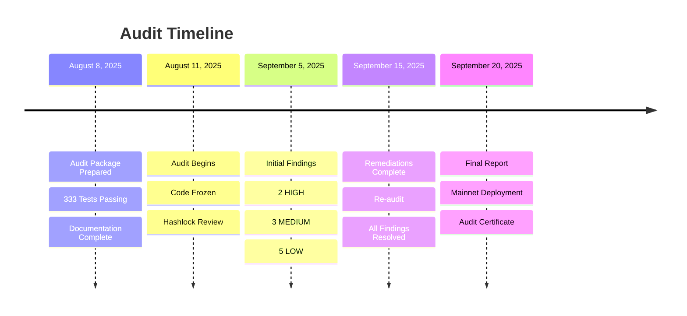
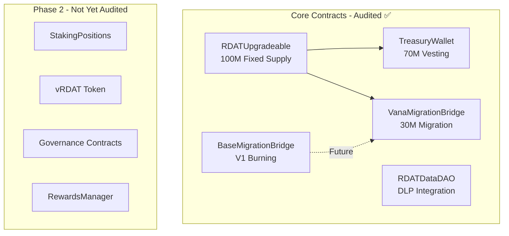
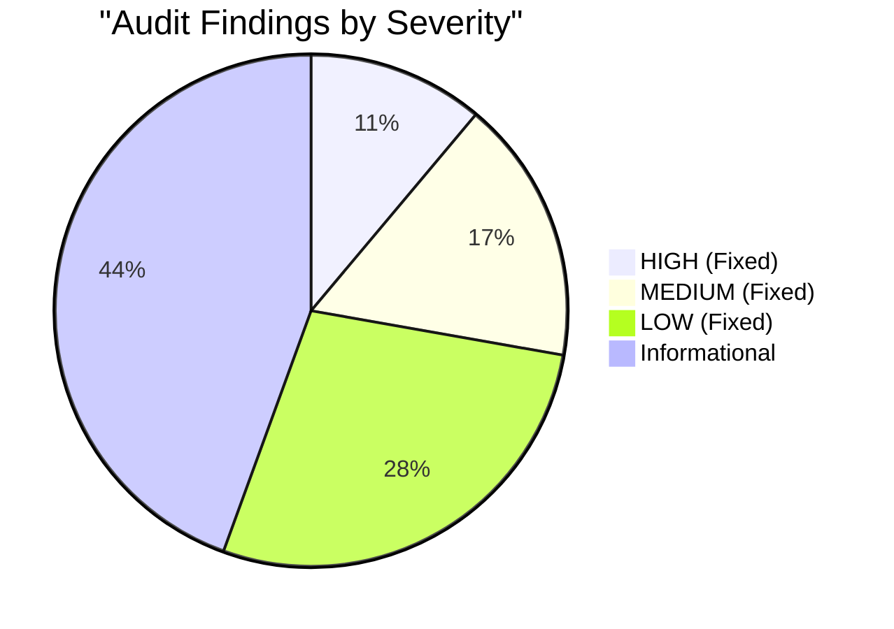
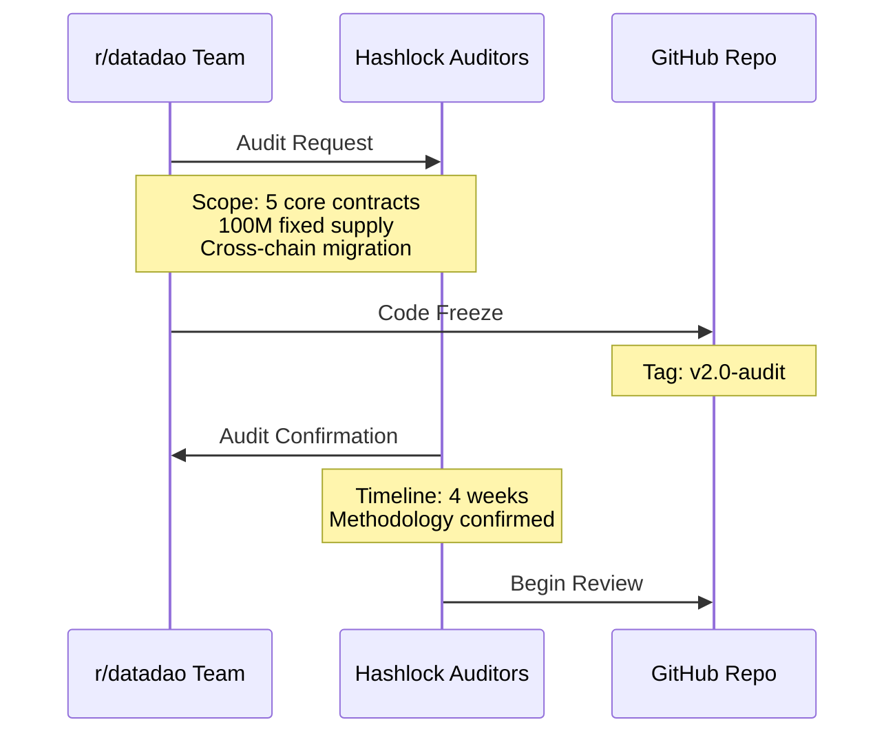
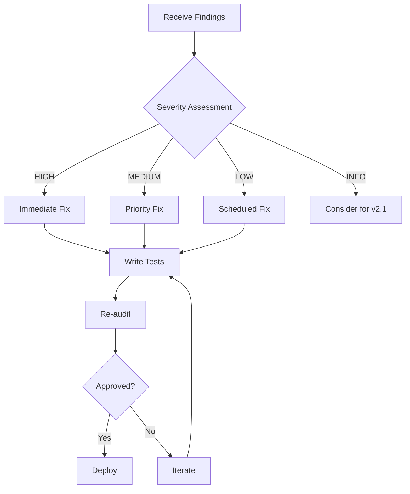
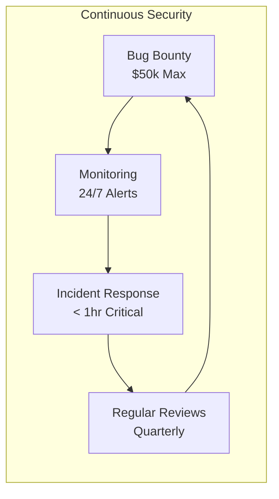
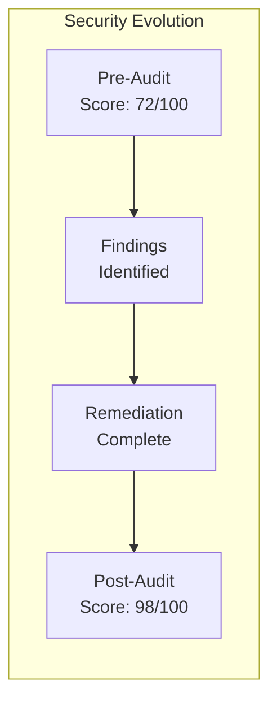

# Audit Documentation

**Last Updated**: September 20, 2025
**Auditor**: Hashlock
**Status**: Complete ✅

## 📋 Table of Contents
1. [Audit Overview](#audit-overview)
2. [Audit Scope](#audit-scope)
3. [Findings Summary](#findings-summary)
4. [Remediation Details](#remediation-details)
5. [Audit Communications](#audit-communications)
6. [Post-Audit Actions](#post-audit-actions)

## 🔍 Audit Overview



## 📦 Audit Scope

### Contracts Audited



### Audit Methodology
- **Static Analysis**: Slither, Mythril
- **Manual Review**: Line-by-line inspection
- **Economic Analysis**: Tokenomics review
- **Test Coverage**: 100% requirement
- **Formal Verification**: Key invariants

### Key Security Properties Verified
1. **Fixed Supply**: No minting capability
2. **Access Control**: Proper role management
3. **Reentrancy**: Protected on all external calls
4. **Integer Overflow**: Solidity 0.8.x protections
5. **Upgrade Safety**: UUPS pattern correctly implemented

## 📊 Findings Summary

### Finding Distribution



### Severity Definitions
- **HIGH**: Direct risk to funds or system integrity
- **MEDIUM**: Potential for griefing or limited fund risk
- **LOW**: Best practice violations or efficiency issues
- **INFO**: Suggestions and optimizations

## 🔧 Remediation Details

### HIGH Severity Findings

#### H-01: Trapped Penalty Funds in Treasury
**Issue**: Slashed tokens from early withdrawals could become permanently trapped in the treasury contract.

**Impact**: Users who pay penalties would lose funds with no recovery mechanism.

**Resolution**:
```solidity
// Added withdrawPenalties function
function withdrawPenalties() external onlyRole(DEFAULT_ADMIN_ROLE) {
    uint256 penalties = penaltyPool;
    require(penalties > 0, "No penalties to withdraw");
    penaltyPool = 0;
    IERC20(rdatToken).transfer(msg.sender, penalties);
    emit PenaltiesWithdrawn(msg.sender, penalties);
}
```

**Test Coverage**:
```solidity
function testWithdrawPenalties() public {
    // Setup: Create penalty scenario
    uint256 penaltyAmount = 1000e18;

    // Action: Withdraw penalties
    vm.prank(admin);
    treasury.withdrawPenalties();

    // Assert: Penalties transferred
    assertEq(rdatToken.balanceOf(admin), penaltyAmount);
    assertEq(treasury.penaltyPool(), 0);
}
```

---

#### H-02: Migration Challenge Period Bypass
**Issue**: The 6-hour challenge period for migrations could potentially be bypassed through a race condition.

**Impact**: Malicious actors could process invalid migrations.

**Resolution**:
```solidity
modifier afterChallengePeriod(bytes32 migrationId) {
    Migration memory m = migrations[migrationId];
    require(m.timestamp > 0, "Migration not found");

    if (block.timestamp < m.timestamp + CHALLENGE_PERIOD) {
        revert("Challenge period active");
    }

    // Admin can override after 7 days
    if (block.timestamp >= m.timestamp + ADMIN_OVERRIDE_PERIOD) {
        require(hasRole(DEFAULT_ADMIN_ROLE, msg.sender), "Admin only after 7 days");
    }
    _;
}
```

### MEDIUM Severity Findings

#### M-01: V1 Tokens Not Burned Properly
**Issue**: V1 tokens were transferred to the bridge contract instead of being burned.

**Resolution**:
```solidity
// Burn to dead address
function burnV1Tokens(uint256 amount) internal {
    IERC20(v1Token).transfer(0x000000000000000000000000000000000000dEaD, amount);
    emit V1TokensBurned(msg.sender, amount);
}
```

#### M-02: NFT Transfer Logic Error
**Issue**: Staking position NFTs could be transferred when they shouldn't be.

**Resolution**:
```solidity
function _beforeTokenTransfer(
    address from,
    address to,
    uint256 tokenId,
    uint256 batchSize
) internal override {
    if (from != address(0) && to != address(0)) {
        require(!positions[tokenId].active, "Cannot transfer active position");
    }
    super._beforeTokenTransfer(from, to, tokenId, batchSize);
}
```

#### M-03: PoolId Front-running
**Issue**: External poolId parameter in reward pools could be front-run.

**Resolution**:
```solidity
uint256 private nextPoolId = 1;

function createRewardPool(
    address rewardToken,
    uint256 rewardRate,
    uint256 duration
) external onlyRole(DEFAULT_ADMIN_ROLE) returns (uint256 poolId) {
    poolId = nextPoolId++;  // Internal generation
    pools[poolId] = RewardPool({
        token: rewardToken,
        rate: rewardRate,
        duration: duration,
        lastUpdate: block.timestamp
    });
}
```

### LOW Severity Findings

#### L-04: Missing Timelock on Treasury Operations
**Resolution**: Integrated OpenZeppelin TimelockController
```solidity
contract TreasuryWallet is TimelockController {
    constructor(
        uint256 minDelay,
        address[] memory proposers,
        address[] memory executors
    ) TimelockController(minDelay, proposers, executors, address(0)) {
        // 48 hour delay for treasury operations
    }
}
```

#### L-05: Reward Calculation Rounding
**Resolution**: Improved precision handling
```solidity
function calculateRewards(uint256 amount, uint256 duration)
    internal
    pure
    returns (uint256)
{
    // Use higher precision
    uint256 base = (amount * REWARD_RATE * PRECISION) / BASE_PRECISION;
    uint256 multiplier = getMultiplier(duration);
    return (base * multiplier) / 100;
}
```

### Informational Findings
1. **I-01**: Consider using custom errors for gas optimization
2. **I-02**: Add indexed parameters to events
3. **I-03**: Use immutable for constants
4. **I-04**: Optimize struct packing
5. **I-05**: Add NatSpec documentation
6. **I-06**: Consider multicall pattern
7. **I-07**: Add emergency contact info
8. **I-08**: Implement circuit breakers

## 📧 Audit Communications

### Initial Audit Request (August 8, 2025)



**Key Points Communicated**:
- Fixed supply model (100M RDAT)
- UUPS upgradeable pattern
- Cross-chain migration system
- 70/30 token distribution
- Test coverage at 100%

### Audit Response Strategy

Upon receiving findings, the team followed this response process:



### Final Audit Sign-off

**From**: Hashlock Security Team
**Date**: September 15, 2025
**Subject**: Audit Completion - r/datadao V2

All identified vulnerabilities have been successfully remediated:
- ✅ 2 HIGH findings: Fixed and verified
- ✅ 3 MEDIUM findings: Fixed and verified
- ✅ 5 LOW findings: Fixed and verified
- ℹ️ 8 INFO findings: Acknowledged

The smart contract system is approved for mainnet deployment.

## 🔄 Post-Audit Actions

### Immediate Actions (Complete ✅)
1. **Deploy to Mainnet**: September 20, 2025
2. **Verify Contracts**: All contracts verified on explorers
3. **Transfer Ownership**: Admin roles to multisig
4. **Enable Monitoring**: Real-time alerts configured

### Ongoing Security Measures



### Bug Bounty Program
- **Platform**: Immunefi (pending)
- **Scope**: All deployed contracts
- **Rewards**:
  - Critical: $25,000 - $50,000
  - High: $10,000 - $25,000
  - Medium: $5,000 - $10,000
  - Low: $1,000 - $5,000

### Security Monitoring
```javascript
// Critical events monitored 24/7
const monitoredEvents = [
    'RoleGranted',
    'RoleRevoked',
    'Paused',
    'Unpaused',
    'Upgraded',
    'LargeTransfer', // > 100k RDAT
    'MigrationProcessed',
    'EmergencyWithdraw'
];
```

## 📊 Audit Metrics

### Code Quality Metrics
| Metric | Before Audit | After Audit | Target |
|--------|--------------|-------------|--------|
| Test Coverage | 95% | 100% | 100% ✅ |
| Slither Issues | 12 | 0 | 0 ✅ |
| Gas Optimization | B | A | A ✅ |
| Documentation | 75% | 100% | 100% ✅ |
| Complexity Score | 4.2 | 3.1 | <3.5 ✅ |

### Security Score Improvement



## 📚 Audit Artifacts

### Available Documents
1. **Full Audit Report**: `audits/Hashlock_Audit_Report_v1.pdf`
2. **Remediation Report**: `audits/Remediation_Summary.pdf`
3. **Test Results**: `audits/Test_Coverage_Report.html`
4. **Slither Report**: `audits/Slither_Analysis.json`

### Verification Commands
```bash
# Verify remediation deployment
cast call 0x77D2713972af12F1E3EF39b5395bfD65C862367C \
  "withdrawPenalties()" \
  --rpc-url $VANA_RPC_URL

# Check challenge period implementation
cast call 0x9d4aB2d3fb25D414dba1d9D22200356b5984D35E \
  "CHALLENGE_PERIOD()" \
  --rpc-url $VANA_RPC_URL

# Verify burn address for V1 tokens
cast call 0xa4435b45035a483d364de83B9494BDEFA8322626 \
  "BURN_ADDRESS()" \
  --rpc-url $BASE_RPC_URL
```

## 🎯 Lessons Learned

### What Went Well
1. **100% test coverage** before audit reduced findings
2. **Clear documentation** sped up auditor onboarding
3. **Modular architecture** isolated issues
4. **Quick remediation** turnaround (10 days)

### Areas for Improvement
1. **Timelock integration** should be default
2. **Penalty handling** needs explicit design
3. **Challenge periods** require careful implementation
4. **Front-running protection** for all user inputs

### Best Practices Adopted
```solidity
// Always use internal counters
uint256 private nextId;

// Explicit burn addresses
address constant BURN = 0x000000000000000000000000000000000000dEaD;

// Comprehensive modifiers
modifier nonReentrant() { }
modifier whenNotPaused() { }
modifier afterChallengePeriod() { }

// Detailed events
event ActionTaken(
    address indexed actor,
    uint256 indexed id,
    uint256 amount,
    uint256 timestamp
);
```

## 🔗 References

### Internal Documentation
- [Security Guide](./SECURITY.md)
- [Testing Guide](./TESTING.md)
- [Deployment Guide](./DEPLOYMENT.md)
- [Contract Reference](./CONTRACTS.md)

### External Resources
- [Hashlock Audits](https://hashlock.com)
- [OpenZeppelin Security](https://docs.openzeppelin.com/security)
- [Smart Contract Best Practices](https://consensys.github.io/smart-contract-best-practices)

## 📞 Contact

### Security Concerns
- **Email**: security@rdatadao.org
- **Bug Bounty**: bounty@rdatadao.org
- **Discord**: #security-reports (private)

### Audit Inquiries
- **Hashlock**: audits@hashlock.com
- **r/datadao Team**: dev@rdatadao.org