# Deployment Documentation

**Last Updated**: September 20, 2025
**Status**: Mainnet Deployed ✅

## 📋 Table of Contents
1. [Deployment Overview](#deployment-overview)
2. [Network Configurations](#network-configurations)
3. [Deployment Addresses](#deployment-addresses)
4. [Deployment Process](#deployment-process)
5. [Gas Estimates](#gas-estimates)
6. [Deployment Commands](#deployment-commands)
7. [Post-Deployment](#post-deployment)

## 🌐 Deployment Overview


## 🔗 Network Configurations

### Production Networks

| Network | Chain ID | RPC URL | Explorer | Status |
|---------|----------|---------|----------|--------|
| **Vana Mainnet** | 1480 | https://rpc.vana.org | https://vanascan.io | Live ✅ |
| **Base Mainnet** | 8453 | https://mainnet.base.org | https://basescan.org | Live ✅ |

### Test Networks

| Network | Chain ID | RPC URL | Explorer | Status |
|---------|----------|---------|----------|--------|
| **Vana Moksha** | 14800 | https://rpc.moksha.vana.org | https://moksha.vanascan.io | Active ✅ |
| **Base Sepolia** | 84532 | https://sepolia.base.org | https://sepolia.basescan.org | Active ✅ |

## 📍 Deployment Addresses

### Mainnet Contracts (September 20, 2025)


### Testnet Contracts

#### Vana Moksha (Chain 14800)
```yaml
RDAT Token:        0xEb0c43d5987de0672A22e350930F615Af646e28c
Treasury:          0x31C3e3F091FB2A25d4dac82474e7dc709adE754a
Migration Bridge:  0x31C3e3F091FB2A25d4dac82474e7dc709adE754a
Admin Multisig:    0x29CeA936835D189BD5BEBA80Fe091f1Da29aA319
```

#### Base Sepolia (Chain 84532)
```yaml
Mock RDAT V1:      0xEb0c43d5987de0672A22e350930F615Af646e28c
Migration Bridge:  0xF73c6216d7D6218d722968e170Cfff6654A8936c
```

## 🚀 Deployment Process

### Phase 1: Preparation

```mermaid
sequenceDiagram
    participant Dev as Developer
    participant Env as Environment
    participant Check as PreCheck

    Dev->>Env: Set environment variables
    Env->>Dev: Variables confirmed
    Dev->>Check: Run pre-deployment checks
    Check->>Dev: All systems ready ✅
```



#### Environment Setup
```bash
# Required Environment Variables
export VANA_RPC_URL=https://rpc.vana.org
export BASE_RPC_URL=https://mainnet.base.org
export DEPLOYER_PRIVATE_KEY=<your_key>
export TREASURY_ADDRESS=0xe4F7Eca807C57311e715C3Ef483e72Fa8D5bCcDF
export ADMIN_ADDRESS=0xe4F7Eca807C57311e715C3Ef483e72Fa8D5bCcDF
export ETHERSCAN_API_KEY=<your_key>
export VANASCAN_API_KEY=<your_key>
```

#### Pre-deployment Checks
```bash
# Check deployment readiness
forge script script/CheckDeploymentReadiness.s.sol \
  --rpc-url $VANA_RPC_URL \
  --sender $DEPLOYER_ADDRESS
```

### Phase 2: Contract Deployment


#### Vana Mainnet Deployment
```bash
# Deploy core system (RDAT + Treasury + Bridge)
ADMIN_ADDRESS=$VANA_MULTISIG_ADDRESS \
forge script script/DeployRDATUpgradeableProduction.s.sol \
  --rpc-url $VANA_RPC_URL \
  --broadcast \
  --private-key $DEPLOYER_PRIVATE_KEY \
  --verify \
  --slow \
  --with-gas-price 50000000000

# Deploy RDATDataDAO for DLP
forge script script/DeployRDATDataDAO.s.sol \
  --rpc-url $VANA_RPC_URL \
  --broadcast \
  --private-key $DEPLOYER_PRIVATE_KEY \
  --with-gas-price 50000000000

# Register DLP (requires 1 VANA fee)
RDAT_DATA_DAO_ADDRESS=0xBbB0B59163b850dDC5139e98118774557c5d9F92 \
RDAT_TOKEN_ADDRESS=0x2c1CB448cAf3579B2374EFe20068Ea97F72A996E \
TREASURY_ADDRESS=$VANA_MULTISIG_ADDRESS \
ADMIN_ADDRESS=$VANA_MULTISIG_ADDRESS \
forge script script/RegisterDLP.s.sol \
  --rpc-url $VANA_RPC_URL \
  --broadcast \
  --private-key $DEPLOYER_PRIVATE_KEY \
  --with-gas-price 50000000000
```

#### Base Mainnet Deployment
```bash
# Deploy migration bridge only (V2 NOT deployed to Base)
forge script script/DeployBaseMigrationMainnet.s.sol \
  --rpc-url $BASE_RPC_URL \
  --broadcast \
  --private-key $DEPLOYER_PRIVATE_KEY \
  --with-gas-price 1000000000
```

### Phase 3: Post-Deployment

```bash
# Recover deployment funds
forge script script/RecoverFunds.s.sol \
  --rpc-url $VANA_RPC_URL \
  --broadcast \
  --private-key $DEPLOYER_PRIVATE_KEY
```

## ⛽ Gas Estimates

### Vana Network Deployment Costs


| Contract | Gas Used | Cost @ 50 gwei | Cost in USD |
|----------|----------|----------------|-------------|
| Create2Factory | 250,000 | 0.0125 VANA | ~$0.50 |
| RDATUpgradeable | 3,500,000 | 0.175 VANA | ~$7.00 |
| TreasuryWallet | 2,800,000 | 0.14 VANA | ~$5.60 |
| VanaMigrationBridge | 2,200,000 | 0.11 VANA | ~$4.40 |
| RDATDataDAO | 1,800,000 | 0.09 VANA | ~$3.60 |
| DLP Registration | 500,000 | 1.025 VANA* | ~$41.00 |
| **Total** | **11,050,000** | **1.552 VANA** | **~$62.10** |

*Includes 1 VANA registration fee

### Base Network Deployment Costs

| Contract | Gas Used | Cost @ 1 gwei | Cost in USD |
|----------|----------|----------------|-------------|
| BaseMigrationBridge | 2,500,000 | 0.0025 ETH | ~$8.25 |
| Contract Verification | 100,000 | 0.0001 ETH | ~$0.33 |
| **Total** | **2,600,000** | **0.0026 ETH** | **~$8.58** |

### Total Deployment Cost
- **Vana**: ~$62.10
- **Base**: ~$8.58
- **Total**: ~$70.68

## 📜 Deployment Commands Reference

### Development/Testing

```bash
# Local deployment (Anvil)
./script/anvil-multichain.sh start
forge script script/local/DeployFullSystemLocal.s.sol \
  --rpc-url http://localhost:8546 \
  --broadcast \
  --sender 0xf39Fd6e51aad88F6F4ce6aB8827279cffFb92266 \
  --private-key 0xac0974bec39a17e36ba4a6b4d238ff944bacb478cbed5efcae784d7bf4f2ff80

# Testnet deployment (dry run first)
TREASURY_ADDRESS=$VANA_TESTNET_MULTISIG \
ADMIN_ADDRESS=$VANA_TESTNET_MULTISIG \
forge script script/DeployRDATUpgradeableSimple.s.sol \
  --rpc-url $VANA_MOKSHA_RPC_URL \
  --sig "dryRun()"

# Testnet deployment (broadcast)
forge script script/DeployRDATUpgradeableSimple.s.sol \
  --rpc-url $VANA_MOKSHA_RPC_URL \
  --broadcast \
  --private-key $DEPLOYER_PRIVATE_KEY
```

### Production Deployment

```bash
# Check readiness
forge script script/CheckDeploymentReadiness.s.sol \
  --rpc-url $VANA_RPC_URL \
  --sender $DEPLOYER_ADDRESS

# Deploy with specific nonce (if needed)
--nonce <nonce_value>

# Deploy with legacy transactions
--legacy

# Deploy with EIP-1559
--with-gas-price <max_fee> \
--priority-gas-price <priority_fee>

# Verify after deployment
forge verify-contract \
  <CONTRACT_ADDRESS> \
  <CONTRACT_NAME> \
  --chain-id 1480 \
  --etherscan-api-key $VANASCAN_API_KEY
```

### Utility Commands

```bash
# Show deployment addresses (deterministic)
forge script script/ShowDeploymentAddresses.s.sol

# Generate ABIs
forge inspect RDATUpgradeable abi > abi/RDATUpgradeable.json
forge inspect TreasuryWallet abi > abi/TreasuryWallet.json
forge inspect VanaMigrationBridge abi > abi/VanaMigrationBridge.json
forge inspect BaseMigrationBridge abi > abi/BaseMigrationBridge.json
forge inspect RDATDataDAO abi > abi/RDATDataDAO.json

# Check deployment status
cast call 0x2c1CB448cAf3579B2374EFe20068Ea97F72A996E "totalSupply()" --rpc-url $VANA_RPC_URL
cast call 0x2c1CB448cAf3579B2374EFe20068Ea97F72A996E "dlpId()" --rpc-url $VANA_RPC_URL
```

## ✅ Post-Deployment Verification

### Contract Verification Checklist

```mermaid
graph TD
    A[Deploy Contracts] --> B{Verify on Explorer}
    B -->|Success| C[Check Token Supply]
    B -->|Failed| D[Manual Verification]
    C --> E[Verify Treasury Balance]
    E --> F[Verify Bridge Balance]
    F --> G[Check DLP Registration]
    G --> H[Test Transfers]
    H --> I[✅ Deployment Complete]
    D --> C
```



### Verification Commands
```bash
# Verify total supply (should be 100M)
cast call 0x2c1CB448cAf3579B2374EFe20068Ea97F72A996E \
  "totalSupply()" \
  --rpc-url https://rpc.vana.org | \
  cast --to-unit

# Verify treasury allocation (should be 70M)
cast call 0x2c1CB448cAf3579B2374EFe20068Ea97F72A996E \
  "balanceOf(address)" \
  0x77D2713972af12F1E3EF39b5395bfD65C862367C \
  --rpc-url https://rpc.vana.org | \
  cast --to-unit

# Verify bridge allocation (should be 30M)
cast call 0x2c1CB448cAf3579B2374EFe20068Ea97F72A996E \
  "balanceOf(address)" \
  0x9d4aB2d3fb25D414dba1d9D22200356b5984D35E \
  --rpc-url https://rpc.vana.org | \
  cast --to-unit

# Verify DLP registration (should return 40)
cast call 0x2c1CB448cAf3579B2374EFe20068Ea97F72A996E \
  "dlpId()" \
  --rpc-url https://rpc.vana.org
```

## 🔄 Deployment Recovery

### If Deployment Fails


### Recovery Commands
```bash
# Get current nonce
cast nonce $DEPLOYER_ADDRESS --rpc-url $VANA_RPC_URL

# Resume from specific contract
forge script script/DeploySpecificContract.s.sol \
  --rpc-url $VANA_RPC_URL \
  --broadcast \
  --resume

# Force redeploy with CREATE2
forge script script/ForceRedeploy.s.sol \
  --rpc-url $VANA_RPC_URL \
  --broadcast \
  --private-key $DEPLOYER_PRIVATE_KEY
```

## 🔐 Security Considerations

### Deployment Security Checklist
- [ ] Use hardware wallet for deployer key
- [ ] Verify RPC endpoints are official
- [ ] Double-check all addresses
- [ ] Ensure sufficient gas funds
- [ ] Have backup deployer ready
- [ ] Monitor mempool during deployment
- [ ] Verify source code immediately
- [ ] Transfer ownership to multisig
- [ ] Revoke deployer permissions
- [ ] Document deployment txs

### Post-Deployment Security
1. **Immediate Actions**:
   - Verify all contracts on explorer
   - Transfer admin roles to multisig
   - Revoke deployer access
   - Enable monitoring

2. **Within 24 Hours**:
   - Complete security audit
   - Test all functions
   - Verify access controls
   - Document deployment

3. **Ongoing**:
   - Monitor for unusual activity
   - Regular security reviews
   - Maintain upgrade keys securely

## 📊 Monitoring Setup

### Essential Metrics
```javascript
// Monitor these after deployment
const metrics = {
  totalSupply: await rdat.totalSupply(),
  treasuryBalance: await rdat.balanceOf(treasury),
  bridgeBalance: await rdat.balanceOf(bridge),
  dlpId: await rdat.dlpId(),
  isPaused: await rdat.paused(),
  adminRole: await rdat.hasRole(DEFAULT_ADMIN_ROLE, multisig)
};
```

### Alert Configuration
- Large transfers (>100k RDAT)
- Admin function calls
- Pause/Unpause events
- Bridge migrations
- Failed transactions

## 📝 Deployment Log Template

```markdown
## Deployment Log - [DATE]

### Pre-Deployment
- [ ] Environment variables set
- [ ] Deployer funded
- [ ] Readiness check passed

### Deployment Transactions
| Contract | TX Hash | Block | Gas Used |
|----------|---------|--------|----------|
| Create2Factory | 0x... | ... | ... |
| RDATUpgradeable | 0x... | ... | ... |
| TreasuryWallet | 0x... | ... | ... |
| VanaMigrationBridge | 0x... | ... | ... |
| RDATDataDAO | 0x... | ... | ... |

### Post-Deployment
- [ ] Contracts verified
- [ ] Ownership transferred
- [ ] Monitoring enabled
- [ ] Team notified

### Issues & Resolutions
- None / [Describe any issues]

### Final Status
✅ Deployment Successful
```

## 🆘 Support & Resources

### Deployment Support
- **Technical Lead**: dev@rdatadao.org
- **Discord**: #deployment-support
- **Emergency**: Use secure channel

### Documentation
- [Architecture Guide](./ARCHITECTURE.md)
- [Contract Reference](./CONTRACTS.md)
- [Security Guide](./SECURITY.md)
- [Testing Guide](./TESTING.md)

### External Resources
- [Foundry Deployment](https://book.getfoundry.sh/forge/deploying)
- [Vana Documentation](https://docs.vana.org)
- [Base Documentation](https://docs.base.org)