# DLP & Vana Integration Documentation

**Last Updated**: September 20, 2025
**DLP ID**: 40
**Status**: Live on Mainnet ✅

## 📋 Table of Contents
1. [DLP Overview](#dlp-overview)
2. [Registration Process](#registration-process)
3. [Integration Architecture](#integration-architecture)
4. [RDATDataDAO Contract](#rdatdatadao-contract)
5. [Troubleshooting](#troubleshooting)
6. [Vana Team Communications](#vana-team-communications)

## 🌐 DLP Overview

### What is a DLP?
Data Liquidity Pool (DLP) is Vana's mechanism for incentivizing data contribution and validation. DLPs enable:
- Data contribution rewards
- Validation mechanisms
- Cross-network data liquidity
- Decentralized data governance


### r/datadao DLP Specifications
- **DLP Name**: r/datadao
- **DLP ID**: 40
- **Network**: Vana Mainnet (Chain 1480)
- **Token**: RDAT (0x2c1CB448cAf3579B2374EFe20068Ea97F72A996E)
- **DAO Contract**: 0xBbB0B59163b850dDC5139e98118774557c5d9F92
- **Registry**: 0x4D59880a924526d1dD33260552Ff4328b1E18a43

## 🚀 Registration Process

### Registration Timeline


### Registration Steps

#### Step 1: Deploy RDATDataDAO Contract
```bash
forge script script/DeployRDATDataDAO.s.sol \
  --rpc-url $VANA_RPC_URL \
  --broadcast \
  --private-key $DEPLOYER_PRIVATE_KEY \
  --verify \
  --with-gas-price 50000000000
```

#### Step 2: Register with Vana Registry
```bash
# Registration requires 1 VANA fee
RDAT_DATA_DAO_ADDRESS=0xBbB0B59163b850dDC5139e98118774557c5d9F92 \
RDAT_TOKEN_ADDRESS=0x2c1CB448cAf3579B2374EFe20068Ea97F72A996E \
forge script script/RegisterDLP.s.sol \
  --rpc-url $VANA_RPC_URL \
  --broadcast \
  --private-key $DEPLOYER_PRIVATE_KEY \
  --with-gas-price 50000000000
```

#### Step 3: Verify Registration
```bash
# Check DLP ID
cast call 0x2c1CB448cAf3579B2374EFe20068Ea97F72A996E \
  "dlpId()" \
  --rpc-url https://rpc.vana.org

# Verify in registry
cast call 0x4D59880a924526d1dD33260552Ff4328b1E18a43 \
  "dlps(uint256)" \
  40 \
  --rpc-url https://rpc.vana.org
```

### Registration Challenges & Solutions

```mermaid
flowchart TD
    A[Registration Attempt] --> B{Success?}
    B -->|No| C[Common Issues]
    C --> D[Interface Mismatch]
    C --> E[Registry Permissions]
    C --> F[Gas Issues]

    D --> G[Deploy SimpleVanaDLP]
    E --> H[Contact Vana Team]
    F --> I[Increase Gas Price]

    G --> J[Retry Registration]
    H --> J
    I --> J

    J --> K{Success?}
    K -->|Yes| L[DLP Active ✅]
    K -->|No| M[Manual Override Required]
    M --> H
```



## 🏗️ Integration Architecture

### Smart Contract Architecture


### Data Flow


## 📜 RDATDataDAO Contract

### Contract Overview
```solidity
contract RDATDataDAO {
    // State variables
    uint256 public constant DLP_ID = 40;
    address public dlpRegistry;
    IERC20 public rdatToken;
    mapping(address => uint256) public contributions;

    // Events
    event ContributionRecorded(address indexed contributor, uint256 amount);
    event RewardsDistributed(address indexed recipient, uint256 amount);
    event DLPRegistered(uint256 indexed dlpId);
}
```

### Core Functions

#### Data Contribution Tracking
```solidity
function recordContribution(
    address contributor,
    uint256 dataPoints,
    string memory dataType,
    bytes32 proofHash
) external onlyValidator {
    require(contributor != address(0), "Invalid contributor");
    require(dataPoints > 0, "Invalid data points");

    contributions[contributor] += dataPoints;
    totalContributions += dataPoints;

    emit ContributionRecorded(contributor, dataPoints, dataType, proofHash);
}
```

#### Reward Distribution
```solidity
function distributeRewards(
    address[] memory recipients,
    uint256[] memory amounts
) external onlyRole(DEFAULT_ADMIN_ROLE) {
    require(recipients.length == amounts.length, "Length mismatch");

    for (uint256 i = 0; i < recipients.length; i++) {
        rdatToken.transfer(recipients[i], amounts[i]);
        emit RewardsDistributed(recipients[i], amounts[i]);
    }
}
```

#### DLP Management
```solidity
function updateDLPRegistry(address newRegistry)
    external
    onlyRole(DEFAULT_ADMIN_ROLE)
{
    require(newRegistry != address(0), "Invalid registry");
    address oldRegistry = dlpRegistry;
    dlpRegistry = newRegistry;
    emit DLPRegistryUpdated(oldRegistry, newRegistry);
}
```

### Integration Points


## 🔧 Troubleshooting

### Common Issues & Solutions

| Issue | Cause | Solution |
|-------|-------|----------|
| DLP not found | Registry out of sync | Manually update registry address |
| Registration fails | Interface mismatch | Deploy SimpleVanaDLP wrapper |
| Rewards not flowing | DLP not active | Verify with Vana team |
| Gas estimation fails | Complex registration | Use fixed gas limit |
| Transaction reverts | Permission issue | Check admin roles |

### Debug Commands

```bash
# Check if DLP is registered
cast call $REGISTRY_ADDRESS \
  "isDLPRegistered(uint256)" \
  40 \
  --rpc-url $VANA_RPC_URL

# Get DLP details
cast call $REGISTRY_ADDRESS \
  "getDLP(uint256)" \
  40 \
  --rpc-url $VANA_RPC_URL

# Check contribution balance
cast call $DAO_ADDRESS \
  "contributions(address)" \
  $USER_ADDRESS \
  --rpc-url $VANA_RPC_URL

# Verify token permissions
cast call $RDAT_TOKEN \
  "allowance(address,address)" \
  $DAO_ADDRESS $REGISTRY_ADDRESS \
  --rpc-url $VANA_RPC_URL
```

### Emergency Procedures


## 💬 Vana Team Communications

### Initial Registration Support

**Date**: August 21-22, 2025
**Issue**: DLP registration failing due to interface compatibility


### Key Communications

#### Thank You Message to Vana Team
```
Subject: Thank You - DLP Registration Success!

Dear Vana Team,

We wanted to express our sincere gratitude for your swift assistance
with the DLP registration. Your manual intervention and support were
crucial in getting r/datadao integrated with the Vana ecosystem.

DLP ID 40 is now live and operational!

Best regards,
r/datadao Team
```

#### Vana Team Response
```
Subject: Re: Thank You - DLP Registration Success!

Congratulations on the successful registration! We're excited to have
r/datadao as part of the Vana DLP ecosystem. The interface issues
you encountered have helped us improve our documentation.

Looking forward to seeing the data contributions flow!

- Vana Support Team
```

### Support Channels
- **Technical Support**: support@vana.org
- **Discord**: Vana Network #dlp-support
- **Documentation**: https://docs.vana.org/dlp
- **Emergency**: Use validator network contacts

## 📊 DLP Performance Metrics

### Current Statistics (as of September 20, 2025)
```javascript
{
  "dlpId": 40,
  "status": "active",
  "totalContributors": "TBD",
  "totalDataPoints": "TBD",
  "rewardsDistributed": "TBD",
  "networkRank": "TBD"
}
```

### Monitoring Dashboard


### Key Metrics to Track
1. **Daily Active Contributors**
2. **Data Points Submitted**
3. **Rewards Distributed**
4. **Validation Success Rate**
5. **Network Participation**

## 🔄 Future Enhancements

### Planned Improvements
1. **Automated Registration**: Remove manual steps
2. **Enhanced Validation**: Multi-tier validation system
3. **Reward Optimization**: Dynamic reward rates
4. **Cross-DLP Integration**: Collaborate with other DLPs
5. **Advanced Analytics**: Detailed contribution insights

### Phase 2 Integration


## 📚 Additional Resources

### Documentation
- [Vana DLP Guide](https://docs.vana.org/dlp)
- [Registry Interface](https://github.com/vana-network/dlp-registry)
- [Integration Examples](https://github.com/vana-network/dlp-examples)

### Contract References
- [RDATDataDAO Source](../src/RDATDataDAO.sol)
- [SimpleVanaDLP Source](../src/mocks/SimpleVanaDLP.sol)
- [Registry Interface](../src/interfaces/IDataLiquidityPool.sol)

### Support Resources
- [Discord Community](https://discord.gg/vana)
- [Developer Forum](https://forum.vana.org)
- [GitHub Issues](https://github.com/rdatadao/contracts-v2/issues)