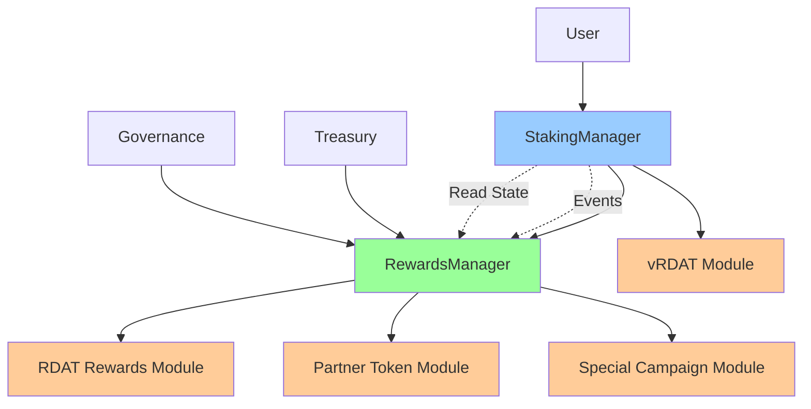
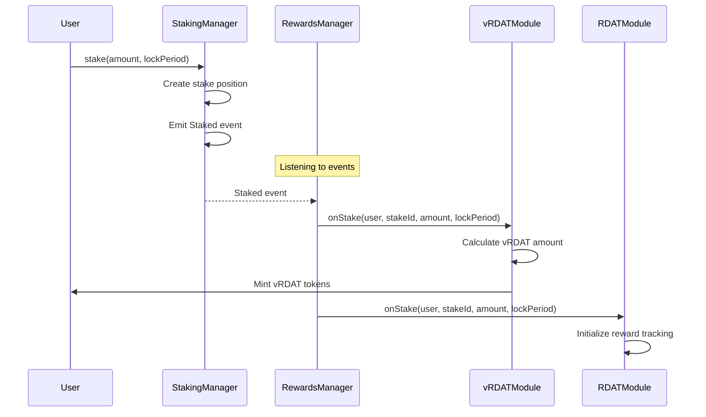
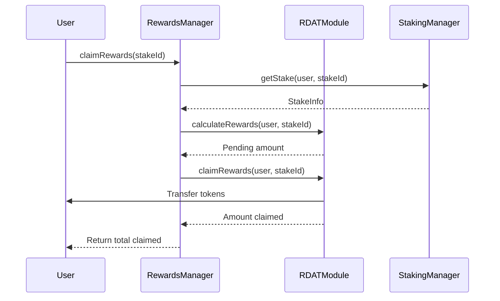

# Modular Rewards Architecture Specification

**Version**: 1.0  
**Date**: August 5, 2025  
**Status**: Draft

## 🎯 Overview

This specification defines a modular rewards architecture that separates staking logic from reward distribution. This design enables flexible reward programs, retroactive distributions, and independent upgrade paths while maintaining the security of immutable staking contracts.

## 📋 Key Design Principles

1. **Separation of Concerns**
   - StakingManager: Handles only core staking logic (amounts, durations, timestamps)
   - RewardsManager: Manages all reward calculations, distributions, and programs
   - Clean interfaces between components

2. **Flexibility**
   - Support multiple concurrent reward programs
   - Add new reward tokens without modifying staking
   - Implement retroactive rewards based on historical data
   - Time-limited campaigns and special distributions

3. **Security**
   - Immutable staking contract for maximum security
   - Upgradeable reward modules for flexibility
   - No migration needed for core staking data
   - Separate slashing logic per reward type

4. **Gas Efficiency**
   - Lazy reward calculations (compute on claim)
   - Batch operations for multiple rewards
   - Minimal storage in staking contract
   - EnumerableSet for O(1) stake tracking (no unbounded arrays)

5. **Fair Distribution**
   - Default: Proportional rewards based on lock duration
   - 365-day locks receive 100% of allocated rewards
   - Shorter locks receive proportionally less (days/365)
   - Prevents gaming through sequential short stakes

## 🏗️ Architecture Overview



## 📦 Core Components

### 1. StakingManager Contract

**Purpose**: Manages core staking positions and state

```solidity
interface IStakingManager {
    struct StakeInfo {
        uint256 amount;          // Amount staked
        uint256 startTime;       // When stake was created
        uint256 endTime;         // When stake unlocks
        uint256 lockPeriod;      // Duration in seconds
        bool active;             // Is stake active
    }
    
    // Core staking functions
    function stake(uint256 amount, uint256 lockPeriod) external returns (uint256 stakeId);
    function unstake(uint256 stakeId) external;
    function emergencyWithdraw(uint256 stakeId) external;
    
    // View functions for rewards contracts
    function getStake(address user, uint256 stakeId) external view returns (StakeInfo memory);
    function getUserStakes(address user) external view returns (uint256[] memory);
    function totalStaked() external view returns (uint256);
    function userTotalStaked(address user) external view returns (uint256);
    
    // Events for reward tracking
    event Staked(address indexed user, uint256 indexed stakeId, uint256 amount, uint256 lockPeriod);
    event Unstaked(address indexed user, uint256 indexed stakeId, uint256 amount);
    event EmergencyWithdrawn(address indexed user, uint256 indexed stakeId, uint256 amount);
}
```

**Key Features**:
- No reward logic whatsoever
- Emits events for all state changes
- Provides read access to stake data
- Supports multiple stakes per user
- Immutable for maximum security

### 2. RewardsManager Contract

**Purpose**: Orchestrates multiple reward modules and programs

```solidity
interface IRewardsManager {
    struct RewardProgram {
        address rewardModule;    // Module handling this program
        address rewardToken;     // Token being distributed
        uint256 allocation;      // Total allocation
        uint256 distributed;     // Amount distributed
        uint256 startTime;       // Program start
        uint256 endTime;         // Program end
        bool active;             // Is program active
    }
    
    // Program management (governance only)
    function createProgram(
        address rewardModule,
        address rewardToken,
        uint256 allocation,
        uint256 duration
    ) external returns (uint256 programId);
    
    function pauseProgram(uint256 programId) external;
    function resumeProgram(uint256 programId) external;
    
    // Reward operations
    function claimRewards(uint256 stakeId) external returns (uint256[] memory amounts);
    function claimRewardsFor(address user, uint256 stakeId) external returns (uint256[] memory);
    function calculateRewards(address user, uint256 stakeId) external view returns (uint256[] memory);
    
    // Batch operations
    function claimAllRewards(address user) external returns (uint256[] memory);
    function calculateAllRewards(address user) external view returns (uint256[] memory);
    
    // Emergency functions
    function emergencyWithdrawRewards(uint256 programId) external;
}
```

### 3. Reward Module Interface

**Purpose**: Standard interface for all reward distribution modules

```solidity
interface IRewardModule {
    // Called when stake is created
    function onStake(address user, uint256 stakeId, uint256 amount, uint256 lockPeriod) external;
    
    // Called when stake is withdrawn
    function onUnstake(address user, uint256 stakeId, uint256 amount, bool emergency) external;
    
    // Calculate pending rewards
    function calculateRewards(address user, uint256 stakeId) external view returns (uint256);
    
    // Claim rewards (returns amount claimed)
    function claimRewards(address user, uint256 stakeId) external returns (uint256);
    
    // Module metadata
    function rewardToken() external view returns (address);
    function isActive() external view returns (bool);
    function totalAllocated() external view returns (uint256);
    function totalDistributed() external view returns (uint256);
}
```

### Default Proportional Distribution Pattern

All reward modules should implement proportional distribution by default:

```solidity
// Standard reward calculation
function calculateRewardShare(
    uint256 baseReward,
    uint256 lockPeriod
) public pure returns (uint256) {
    // 365-day locks get 100% of rewards
    // Shorter locks get proportionally less
    return (baseReward * lockPeriod) / 365 days;
}

// Lock period multipliers (out of 10000)
mapping(uint256 => uint256) public rewardMultipliers;

constructor() {
    rewardMultipliers[30 days] = 833;    // 8.33%
    rewardMultipliers[90 days] = 2466;   // 24.66%
    rewardMultipliers[180 days] = 4932;  // 49.32%
    rewardMultipliers[365 days] = 10000; // 100%
}
```

## 🔌 Example Reward Modules

### 1. vRDAT Governance Module (First Implementation)

**Purpose**: Immediate distribution of soul-bound governance tokens

**Key Design Decision**: vRDAT distribution is implemented as our first reward module, proving the modular architecture. This demonstrates that even core functionality like governance token distribution uses the same pluggable system as partner rewards.

**Access Control Requirements**:
- vRDATRewardModule must be granted MINTER_ROLE on vRDAT token
- vRDATRewardModule must be granted BURNER_ROLE on vRDAT token
- No other contracts should have these roles (security critical)
- vRDAT has unlimited supply - minted as needed for stakers

```solidity
contract vRDATRewardModule is IRewardModule {
    IvRDAT public immutable vrdatToken;
    IStakingManager public immutable stakingManager;
    
    mapping(uint256 => uint256) public lockMultipliers;
    mapping(address => mapping(uint256 => uint256)) public distributedAmounts;
    
    function onStake(address user, uint256 stakeId, uint256 amount, uint256 lockPeriod) external {
        // Calculate vRDAT based on amount and lock period
        uint256 multiplier = lockMultipliers[lockPeriod];
        uint256 vrdatAmount = (amount * multiplier) / PRECISION;
        
        // Mint immediately (soul-bound, no claiming needed)
        vrdatToken.mint(user, vrdatAmount);
        distributedAmounts[user][stakeId] = vrdatAmount;
        
        emit vRDATDistributed(user, stakeId, vrdatAmount);
    }
    
    function onUnstake(address user, uint256 stakeId, uint256 amount, bool emergency) external {
        if (emergency) {
            // Burn vRDAT on emergency withdrawal
            uint256 vrdatAmount = distributedAmounts[user][stakeId];
            vrdatToken.burn(user, vrdatAmount);
            emit vRDATBurned(user, stakeId, vrdatAmount);
        }
        // Normal unstake: user keeps vRDAT
    }
}
```

### 2. RDAT Staking Rewards Module

**Purpose**: Time-based RDAT reward accumulation

```solidity
contract RDATRewardsModule is IRewardModule {
    struct UserRewards {
        uint256 accumulated;
        uint256 claimed;
        uint256 lastUpdate;
    }
    
    IERC20 public immutable rdatToken;
    IStakingManager public immutable stakingManager;
    
    uint256 public rewardRate; // Tokens per second per RDAT staked
    mapping(address => mapping(uint256 => UserRewards)) public rewards;
    
    function calculateRewards(address user, uint256 stakeId) external view returns (uint256) {
        StakeInfo memory stake = stakingManager.getStake(user, stakeId);
        UserRewards memory userReward = rewards[user][stakeId];
        
        if (!stake.active) return 0;
        
        uint256 timeDelta = block.timestamp - userReward.lastUpdate;
        uint256 pending = (stake.amount * rewardRate * timeDelta) / PRECISION;
        
        return userReward.accumulated + pending - userReward.claimed;
    }
    
    function claimRewards(address user, uint256 stakeId) external returns (uint256) {
        uint256 pending = calculateRewards(user, stakeId);
        
        if (pending > 0) {
            rewards[user][stakeId].claimed += pending;
            rewards[user][stakeId].lastUpdate = block.timestamp;
            
            rdatToken.transfer(user, pending);
            emit RewardsClaimed(user, stakeId, pending);
        }
        
        return pending;
    }
}
```

### 3. Partner Token Campaign Module (e.g., VANA)

**Purpose**: Time-limited partner token distribution with proportional rewards

```solidity
contract VANARewardModule is IRewardModule {
    IERC20 public immutable vanaToken;
    uint256 public constant TOTAL_ALLOCATION = 1000e18; // 1000 VANA
    uint256 public immutable programStart;
    uint256 public immutable programEnd;
    
    mapping(uint256 => uint256) public lockMultipliers;
    mapping(uint256 => uint256) public stakeRewards; // Pre-calculated rewards
    uint256 public totalWeightedStakes;
    
    constructor(address _vanaToken) {
        vanaToken = IERC20(_vanaToken);
        programStart = block.timestamp;
        programEnd = block.timestamp + 30 days;
        
        // Proportional distribution - matching vRDAT
        lockMultipliers[30 days] = 833;    // 8.33%
        lockMultipliers[90 days] = 2466;   // 24.66%
        lockMultipliers[180 days] = 4932;  // 49.32%
        lockMultipliers[365 days] = 10000; // 100%
    }
    
    function onStake(address user, uint256 stakeId, uint256 amount, uint256 lockPeriod) external {
        if (block.timestamp >= programStart && block.timestamp <= programEnd) {
            // Calculate weighted stake amount
            uint256 weightedAmount = (amount * lockMultipliers[lockPeriod]) / 10000;
            totalWeightedStakes += weightedAmount;
            
            // Pre-calculate this stake's share
            stakeRewards[stakeId] = weightedAmount;
        }
    }
    
    function calculateRewards(address user, uint256 stakeId) external view returns (uint256) {
        if (totalWeightedStakes == 0) return 0;
        
        // Proportional share of total VANA allocation
        return (TOTAL_ALLOCATION * stakeRewards[stakeId]) / totalWeightedStakes;
    }
}
```

**Example Distribution**:
- Alice stakes 1000 RDAT for 365 days → Gets 35.7% of VANA
- Bob stakes 1000 RDAT for 30 days → Gets 3.0% of VANA
- Result: Long-term stakers get 12x more partner rewards

### 4. Retroactive Airdrop Module

**Purpose**: One-time retroactive rewards based on historical staking

```solidity
contract RetroactiveRewardModule is IRewardModule {
    mapping(address => uint256) public allocations;
    mapping(address => bool) public claimed;
    uint256 public snapshotTime;
    uint256 public claimDeadline;
    
    function setAllocations(address[] memory users, uint256[] memory amounts) external onlyOwner {
        for (uint256 i = 0; i < users.length; i++) {
            allocations[users[i]] = amounts[i];
        }
    }
    
    function claimRewards(address user, uint256 stakeId) external returns (uint256) {
        require(block.timestamp <= claimDeadline, "Claim period ended");
        require(!claimed[user], "Already claimed");
        
        uint256 amount = allocations[user];
        if (amount > 0) {
            claimed[user] = true;
            rewardToken.transfer(user, amount);
            emit RetroactiveClaimed(user, amount);
        }
        
        return amount;
    }
}
```

## 🔄 Integration Flow

### Staking Flow


### Claiming Flow


## 🛡️ Security Considerations

### 1. Access Control
- StakingManager: Only user can manage their own stakes
- RewardsManager: Program creation limited to governance
- Reward Modules: Can only be called by RewardsManager
- vRDAT Minting: Only vRDATRewardModule should have MINTER_ROLE
- vRDAT Burning: Only vRDATRewardModule should have BURNER_ROLE

### 2. Reentrancy Protection
- All external calls use checks-effects-interactions pattern
- ReentrancyGuard on claim functions
- State updates before external calls

### 3. Module Security
- Modules cannot modify staking state
- Modules have view-only access to stake data
- Failed module doesn't affect other modules

### 4. Emergency Functions
- Pause individual reward programs
- Emergency withdraw for governance
- Module replacement without staking migration

## 📈 Benefits

### 1. For Users
- Multiple reward streams from single stake
- No need to migrate for new rewards
- Clear visibility of all rewards
- Batch claiming for gas efficiency

### 2. For Protocol
- Add rewards without touching core staking
- Experiment with different reward mechanisms
- Retroactive rewards for user retention
- Partner integrations without risk

### 3. For Development
- Clean separation of concerns
- Independent testing of modules
- Faster iteration on reward logic
- No complex migrations

## 🔄 Migration Strategy

### Phase 1: Deploy New Architecture
1. Deploy new StakingManager (immutable)
2. Deploy RewardsManager (upgradeable)
3. Deploy initial reward modules (vRDAT, RDAT)

### Phase 2: Migration Incentives
1. Enable emergency migration on old contract
2. Offer bonus rewards for early migration
3. Preserve staking history and rewards

### Phase 3: Full Transition
1. Disable old staking contract
2. Complete remaining migrations
3. Activate additional reward modules

## 📊 Example Reward Programs

### 1. Base Staking Rewards
- **Token**: RDAT
- **Allocation**: 10M RDAT
- **Duration**: 2 years
- **Distribution**: Linear based on stake amount and duration

### 2. Governance Participation
- **Token**: vRDAT
- **Allocation**: Unlimited (minted)
- **Duration**: Permanent
- **Distribution**: Immediate on stake, burned on emergency exit

### 3. Launch Partner Campaign (e.g., VANA)
- **Token**: VANA (or other partner tokens)
- **Allocation**: 1,000 VANA
- **Duration**: 30 days
- **Distribution**: Proportional to lock duration
  - 365 days: 100% share
  - 180 days: 49.3% share
  - 90 days: 24.7% share
  - 30 days: 8.3% share

### 4. Retroactive Loyalty Rewards
- **Token**: RDAT
- **Allocation**: 1M RDAT
- **Duration**: One-time
- **Distribution**: Based on historical staking duration

## 🚀 Future Enhancements

1. **Cross-chain Rewards**: Distribute rewards on multiple chains
2. **NFT Rewards**: Special NFTs for long-term stakers
3. **Dynamic APR**: Governance-adjustable reward rates
4. **Compound Strategies**: Auto-compound reward modules
5. **Referral Rewards**: Additional rewards for referrals

## 📝 Implementation Checklist

- [x] Define final StakingManager interface
- [x] Implement RewardsManager orchestrator
- [x] Create vRDAT reward module (with minting authority)
- [x] Create RDAT reward module
- [ ] Grant vRDATRewardModule MINTER/BURNER roles on vRDAT
- [ ] Write comprehensive tests
- [ ] Security audit focus areas identified
- [ ] Migration scripts prepared
- [x] Documentation updated