# r/datadao Project Overview

**Last Updated**: September 20, 2025
**Version**: 3.2 - Mainnet Live
**Status**: Production ✅

## 📋 Table of Contents
1. [Executive Summary](#executive-summary)
2. [Project Timeline](#project-timeline)
3. [Technical Architecture](#technical-architecture)
4. [Development History](#development-history)
5. [Current Status](#current-status)
6. [Team & Resources](#team--resources)

## 🎯 Executive Summary

### Project Vision
r/datadao is building a decentralized data contribution and governance ecosystem on the Vana network, enabling Reddit users to monetize their data contributions while maintaining privacy and control.


### Key Metrics
- **Total Supply**: 100,000,000 RDAT (fixed)
- **Network**: Vana (primary) + Base (migration)
- **DLP ID**: 40
- **Token Holders**: Growing
- **Migration Progress**: 30M allocated for V1 holders

### Value Proposition
1. **For Users**: Monetize Reddit data contributions
2. **For Community**: Decentralized governance
3. **For Ecosystem**: Data liquidity and validation
4. **For Partners**: Access to validated data

## 📅 Project Timeline


## 🏗️ Technical Architecture

### System Components


### Technology Stack
- **Smart Contracts**: Solidity 0.8.19
- **Framework**: Foundry
- **Libraries**: OpenZeppelin 4.9.0
- **Networks**: Vana (1480), Base (8453)
- **Pattern**: UUPS Upgradeable

### Security Features
- ✅ Hashlock Audited
- ✅ 100% Test Coverage (382 tests)
- ✅ Multi-sig Governance
- ✅ Emergency Pause (72hr limit)
- ✅ Fixed Supply (no minting)

## 📚 Development History

### Phase 1: Foundation (April-June 2025)
**Objective**: Launch basic token on Base


**Achievements**:
- Basic ERC-20 token deployed
- 30M tokens distributed
- Community established
- Initial holders onboarded

### Phase 2: Evolution (July 2025)
**Objective**: Plan migration to Vana

**Key Decisions**:
1. **Network Switch**: Base → Vana for DLP integration
2. **Supply Expansion**: 30M → 100M for enhanced tokenomics
3. **Architecture**: UUPS upgradeable pattern
4. **Distribution**: 70% treasury, 30% migration

### Phase 3: Sprint Development (August 5-8, 2025)


**Sprint Achievements**:
- 12 core contracts developed
- 333 tests passing (100% coverage)
- Migration system complete
- VRC-20 compliance achieved
- Comprehensive documentation

### Phase 4: Audit & Remediation (August-September 2025)
**Auditor**: Hashlock

**Findings & Resolutions**:
- 2 HIGH: ✅ Fixed (penalty withdrawal, challenge period)
- 3 MEDIUM: ✅ Fixed (V1 burning, NFT transfer, poolId)
- 5 LOW: ✅ Fixed (timelock, rounding)
- 8 INFO: ✅ Acknowledged

### Phase 5: Mainnet Launch (September 20, 2025)
**Deployment Sequence**:
1. Vana contracts deployed
2. Base bridge deployed
3. DLP registered (ID: 40)
4. Migration activated
5. Monitoring enabled

## 📊 Current Status

### Production Metrics

```mermaid
graph TD
    subgraph "System Health"
        A[Contracts: Live ✅]
        B[Tests: 382/382 ✅]
        C[Audit: Complete ✅]
        D[DLP: Active ✅]
        E[Migration: Open ✅]
    end
```



### Contract Addresses
```yaml
Vana Mainnet (1480):
  RDAT Token:        0x2c1CB448cAf3579B2374EFe20068Ea97F72A996E
  Treasury:          0x77D2713972af12F1E3EF39b5395bfD65C862367C
  Migration Bridge:  0x9d4aB2d3fb25D414dba1d9D22200356b5984D35E
  RDATDataDAO:       0xBbB0B59163b850dDC5139e98118774557c5d9F92

Base Mainnet (8453):
  RDAT V1:           0x4498cd8Ba045E00673402353f5a4347562707e7D
  Migration Bridge:  0xa4435b45035a483d364de83B9494BDEFA8322626
```

### Token Distribution


## 👥 Team & Resources

### Development Team Structure


### Key Contributors
- **Smart Contracts**: Claude Code + Human developers
- **Audit**: Hashlock Security Team
- **Infrastructure**: Vana Network Team
- **Community**: r/datadao members

### Communication Channels
- **GitHub**: [github.com/rdatadao/contracts-v2](https://github.com/rdatadao/contracts-v2)
- **Discord**: [discord.gg/rdatadao](https://discord.gg/rdatadao)
- **Website**: [rdatadao.org](https://rdatadao.org)
- **Twitter**: [@rdatadao](https://twitter.com/rdatadao)

## 🎯 Success Metrics

### Phase 1 Achievements ✅
- [x] Token deployed to mainnet
- [x] 100% test coverage
- [x] Security audit complete
- [x] DLP registration successful
- [x] Migration bridge active
- [x] Documentation comprehensive

### Phase 2 Goals (Q4 2025)
- [ ] Launch staking system
- [ ] Deploy governance contracts
- [ ] Achieve 30M TVL
- [ ] Onboard 1,000 stakers
- [ ] Process first governance proposal

### Long-term Vision (2026)
- [ ] Full DAO autonomy
- [ ] Multi-chain deployment
- [ ] 100M TVL
- [ ] 10,000+ active users
- [ ] Sustainable revenue model

## 💡 Innovation Highlights

### Technical Innovations
1. **Fixed Supply Model**: No inflation, pure value accrual
2. **Soul-bound Governance**: vRDAT prevents gaming
3. **Modular Rewards**: Flexible reward distribution
4. **NFT Staking**: Transferable positions
5. **Cross-chain Migration**: Seamless V1→V2

### Economic Innovations
1. **70/30 Distribution**: Balanced tokenomics
2. **Vesting Schedules**: Long-term alignment
3. **Revenue Sharing**: 50/30/20 split
4. **Multiplier System**: Time-lock incentives
5. **Penalty Redistribution**: Community benefits

## 🔮 Future Roadmap

### Q4 2025: Activation


### Q1 2026: Expansion


### Q2-Q4 2026: Maturation
- Advanced DLP features
- Institutional partnerships
- Cross-protocol integrations
- Decentralized data marketplace

## 📝 Documentation Structure

### For Different Audiences

| Audience | Key Documents |
|----------|--------------|
| **Users** | [Migration Guide](./MIGRATION.md), [Quick Reference](../QUICK_REFERENCE.md) |
| **Developers** | [Frontend Integration](./FRONTEND_INTEGRATION.md), [Contracts](./CONTRACTS.md) |
| **Admins** | [Admin Guide](./ADMIN_GUIDE.md), [Security](./SECURITY.md) |
| **Auditors** | [Audit Documentation](./AUDIT.md), [Testing](./TESTING.md) |
| **Investors** | [Tokenomics](./ARCHITECTURE.md#token-economics-architecture), [Roadmap](#future-roadmap) |

## 🤝 Partnerships & Integrations

### Current Partners
- **Vana Network**: DLP infrastructure
- **Base Network**: Migration support
- **Hashlock**: Security audit
- **Gnosis Safe**: Multisig infrastructure

### Integration Opportunities
1. Data marketplaces
2. DeFi protocols
3. Governance aggregators
4. Analytics platforms
5. Web3 social platforms

## 📞 Contact Information

### General Inquiries
- **Email**: info@rdatadao.org
- **Discord**: [Join Server](https://discord.gg/rdatadao)
- **Twitter**: [@rdatadao](https://twitter.com/rdatadao)

### Specific Contacts
- **Development**: dev@rdatadao.org
- **Security**: security@rdatadao.org
- **Partnerships**: partnerships@rdatadao.org
- **Media**: media@rdatadao.org

## ⚖️ Legal & Compliance

### Disclaimers
- Not financial advice
- No guarantee of returns
- Utility token only
- Community governance
- Open source software

### License
MIT License - See [LICENSE](../LICENSE) file

### Compliance
- No securities offering
- Decentralized governance
- Community-driven development
- Transparent operations

## 🙏 Acknowledgments

Special thanks to:
- Vana Network team for DLP support
- Hashlock for security audit
- Community members for testing
- Claude Code for development assistance
- All contributors and supporters

---

**"Democratizing data ownership, one contribution at a time."**

*r/datadao Team*