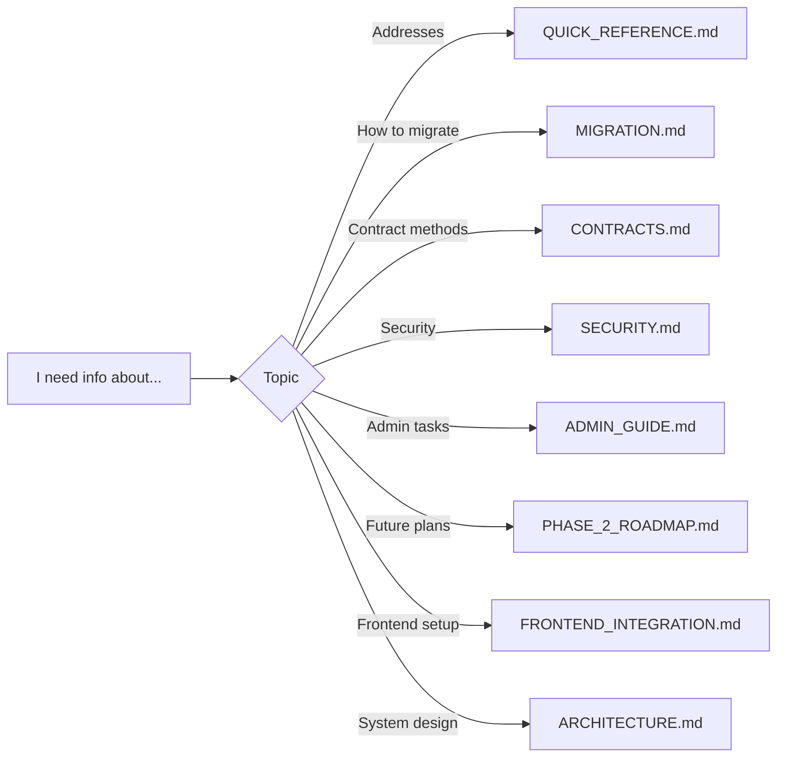
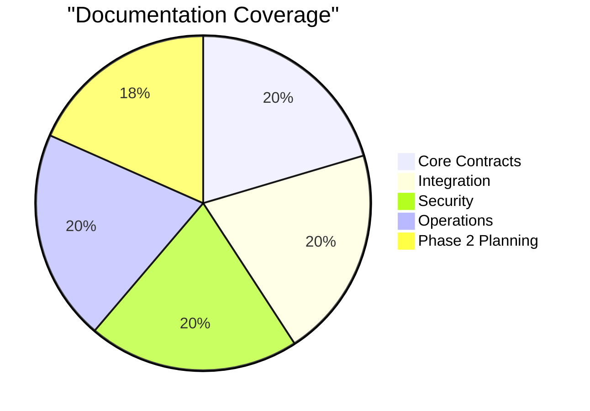

# 📚 r/datadao Documentation Hub

**Last Updated**: September 20, 2025
**Version**: 3.3 - Consolidated & Organized
**Status**: Mainnet Live ✅

## 🗂️ Documentation Structure



```mermaid
graph TD
    A[Documentation Hub] --> B[Core Documentation]
    A --> C[Integration Guides]
    A --> D[Operations & Security]
    A --> E[Development Resources]

    B --> B1[PROJECT_OVERVIEW.md]
    B --> B2[ARCHITECTURE.md]
    B --> B3[CONTRACTS.md]
    B --> B4[SPECIFICATIONS.md]
    B --> B5[WHITEPAPER.md]

    C --> C1[FRONTEND_INTEGRATION.md]
    C --> C2[MIGRATION.md]
    C --> C3[DLP_VANA_INTEGRATION.md]
    C --> C4[ABI_EXPORT_GUIDE.md]

    D --> D1[ADMIN_GUIDE.md]
    D --> D2[ADMIN_FEATURES_GUIDE.md]
    D --> D3[SECURITY.md]
    D --> D4[AUDIT.md]
    D --> D5[DEPLOYMENT.md]

    E --> E1[TESTING.md]
    E --> E2[PHASE_2_ROADMAP.md]
    E --> E3[RDAT_DATA_DAO.md]
```

## 📖 Documentation by Audience

### 👤 For Users
- **[Migration Guide](./MIGRATION.md)** - Step-by-step V1 to V2 migration
- **[Quick Reference](../QUICK_REFERENCE.md)** - All essential addresses and commands

### 💻 For Frontend Developers
- **[Frontend Integration](./FRONTEND_INTEGRATION.md)** - Complete UI integration with code examples
- **[Admin Features Guide](./ADMIN_FEATURES_GUIDE.md)** - Admin panel implementation guide
- **[ABI Export Guide](./ABI_EXPORT_GUIDE.md)** - Contract ABI usage for Web3 integration
- **[Contracts Reference](./CONTRACTS.md)** - Smart contract methods and events

### 🔧 For Smart Contract Developers
- **[Architecture](./ARCHITECTURE.md)** - System design and data flow
- **[Testing Guide](./TESTING.md)** - 382 tests with 100% coverage
- **[Deployment Guide](./DEPLOYMENT.md)** - Deployment process and commands
- **[Security](./SECURITY.md)** - Security model and best practices

### 👮 For Administrators
- **[Admin Guide](./ADMIN_GUIDE.md)** - Multisig operations and emergency procedures
- **[Audit Documentation](./AUDIT.md)** - Hashlock audit findings and remediations
- **[DLP Integration](./DLP_VANA_INTEGRATION.md)** - Vana DLP management

### 🚀 For Understanding the Project
- **[Project Overview](./PROJECT_OVERVIEW.md)** - Vision, timeline, and development history
- **[Whitepaper](./WHITEPAPER.md)** - Economic model and tokenomics
- **[Specifications](./SPECIFICATIONS.md)** - Current deployed system vs planned features
- **[Phase 2 Roadmap](./PHASE_2_ROADMAP.md)** - Upcoming features and timeline

## 📊 Quick Links to Key Information

### Production Contracts (Live)
| Contract | Address | Explorer |
|----------|---------|----------|
| RDAT Token | `0x2c1CB448cAf3579B2374EFe20068Ea97F72A996E` | [View](https://vanascan.io/address/0x2c1CB448cAf3579B2374EFe20068Ea97F72A996E) |
| Treasury | `0x77D2713972af12F1E3EF39b5395bfD65C862367C` | [View](https://vanascan.io/address/0x77D2713972af12F1E3EF39b5395bfD65C862367C) |
| Migration Bridge (Vana) | `0x9d4aB2d3fb25D414dba1d9D22200356b5984D35E` | [View](https://vanascan.io/address/0x9d4aB2d3fb25D414dba1d9D22200356b5984D35E) |
| V1 Token (Base) | `0x4498cd8Ba045E00673402353f5a4347562707e7D` | [View](https://basescan.org/token/0x4498cd8Ba045E00673402353f5a4347562707e7D) |

## 📚 Core Documentation Files

### System Understanding
- **[PROJECT_OVERVIEW.md](./PROJECT_OVERVIEW.md)** - Complete project overview including vision and timeline
- **[WHITEPAPER.md](./WHITEPAPER.md)** - Economic model with accurate tokenomics and current status
- **[SPECIFICATIONS.md](./SPECIFICATIONS.md)** - Actual deployed system specifications vs planned features
- **[ARCHITECTURE.md](./ARCHITECTURE.md)** - System architecture with detailed component diagrams

### Technical Reference
- **[CONTRACTS.md](./CONTRACTS.md)** - Comprehensive smart contract reference
- **[DEPLOYMENT.md](./DEPLOYMENT.md)** - Deployment documentation and commands
- **[TESTING.md](./TESTING.md)** - Testing guide covering 382 tests
- **[RDAT_DATA_DAO.md](./RDAT_DATA_DAO.md)** - DataDAO contract specifications

### Integration & Operations
- **[FRONTEND_INTEGRATION.md](./FRONTEND_INTEGRATION.md)** - Frontend integration with React/TypeScript examples
- **[MIGRATION.md](./MIGRATION.md)** - V1 to V2 migration guide for users and developers
- **[DLP_VANA_INTEGRATION.md](./DLP_VANA_INTEGRATION.md)** - Vana DLP registration and integration
- **[ABI_EXPORT_GUIDE.md](./ABI_EXPORT_GUIDE.md)** - ABI generation and usage guide

### Security & Governance
- **[SECURITY.md](./SECURITY.md)** - Security documentation and best practices
- **[AUDIT.md](./AUDIT.md)** - Complete audit documentation with Hashlock findings
- **[ADMIN_GUIDE.md](./ADMIN_GUIDE.md)** - Admin operations for multisig owners
- **[ADMIN_FEATURES_GUIDE.md](./ADMIN_FEATURES_GUIDE.md)** - Frontend admin features implementation

### Future Development
- **[PHASE_2_ROADMAP.md](./PHASE_2_ROADMAP.md)** - Detailed Phase 2 implementation plan

## 📂 Archive Structure

### Historical Documentation
Located in `./archive/` subdirectories:
- `original-planning-docs/` - Initial August 2025 specifications (01-10 numbered files)
- `audit-remediation-docs/` - Detailed audit remediation documents
- `dlp-docs/` - DLP registration attempts and debug logs
- `validator-docs/` - Validator configuration details
- `misc-docs/` - Various superseded documents
- `root-cleanup-2025-09-20/` - Original root folder markdown files

## 🔍 Finding Information

### By Topic


## 📝 Documentation Standards

All documentation follows these conventions:
1. **Markdown format** with GitHub Flavored Markdown
2. **Mermaid diagrams** for visual representations
3. **Clear headers** with emoji indicators
4. **Code examples** with syntax highlighting
5. **Updated timestamps** in document headers

## 🔄 Documentation Status

### Recently Consolidated (September 20, 2025)
- ✅ Moved 10 numbered planning documents to archive
- ✅ Consolidated audit remediation documents into AUDIT.md
- ✅ Merged DLP registration guides into DLP_VANA_INTEGRATION.md
- ✅ Archived redundant validator and deployment guides
- ✅ Renamed current specifications and whitepaper (removed _CURRENT suffix)

### Current Document Count
- **Active Documentation**: 18 essential markdown files
- **Archived Documentation**: 40+ historical files
- **Reduction**: From 50+ scattered files to 18 organized documents

## 📞 Support & Contribution

### Getting Help
- **Discord**: [discord.gg/rdatadao](https://discord.gg/rdatadao)
- **Email**: dev@rdatadao.org
- **GitHub Issues**: [Create Issue](https://github.com/rdatadao/contracts-v2/issues)

### Contributing to Docs
1. Fork the repository
2. Create a feature branch
3. Make your improvements
4. Submit a pull request

## ⚡ Quick Commands

```bash
# Search all docs for a keyword
grep -r "keyword" docs/

# Find specific contract info
grep -r "RDATUpgradeable" docs/*.md

# List all active documentation
ls -la docs/*.md | grep -v archive

# Count documentation lines
find docs -name "*.md" -not -path "*/archive/*" -exec wc -l {} + | sort -n
```

## 🎯 Documentation Completeness



---

**Note**: This documentation hub represents the complete, consolidated technical and operational guide for r/datadao V2. Historical and redundant documentation has been archived for reference. For the latest updates, always check the mainnet contracts and official announcements.