# 📋 RDAT V2 Beta Smart Contract Specifications

**Version**: 3.0 Beta (Full VRC Compliance)  
**Sprint Duration**: August 5-18, 2025 (13 days)  
**Context**: Upgrade from V1 (30M RDAT on Base) to V2 (100M RDAT on Vana)  
**Approach**: Modular rewards system with full VRC-14/15/20 compliance  
**Risk Reduction**: $85M+ → ~$10M through major design flaw resolution  
**Contracts**: 11 total (reduced from 14 with new architecture)

### 📊 Progress Update (August 5, 2025)
**Status**: ✅ Major architecture completed - Core contracts implemented  
**Architecture**: Hybrid approach - UUPS upgradeable RDAT token + non-upgradeable staking  
**Key Decision**: Staking uses manual migration pattern for maximum security  
**Impact**: Clean separation of concerns with appropriate upgrade strategies  
**Audit Readiness**: Increased from 65% to 75%

## 🎯 Overview

RDAT V2 Beta represents a major upgrade from the existing V1 deployment, introducing time-lock staking with multipliers, cross-chain migration, enhanced tokenomics (100M supply), and improved governance mechanisms. The implementation follows a phased approach, starting with essential features and progressively adding complexity.

### V2 Beta Improvements Over V1:
- **Supply Expansion**: 30M → 100M tokens (fixed supply, fully minted at deployment)
- **Staking Architecture**: Basic staking → Modular rewards (1x-1.75x multipliers)
- **Governance**: Single admin → Multi-sig control + proportional vRDAT
- **Chain**: Base-only → Cross-chain (Base + Vana)
- **Features**: Basic ERC-20 → VRC-20 compliant with modular rewards
- **Analytics**: Limited → Comprehensive tracking
- **Security**: Basic → Reentrancy guards + module timelock + upgrade safety
- **Value Accrual**: None → Fee distribution (50/30/20 split)
- **User Experience**: Simple staking → Flexible reward programs
- **Tokenomics**: Inflationary → Fixed supply with pre-allocated reward pools

## 💰 Tokenomics

### **RDAT Token Supply Model**
- **Total Supply**: 100,000,000 RDAT (fixed, non-inflationary)
- **Minting Strategy**: ENTIRE supply minted at deployment in `initialize()`
- **Initial Distribution**: 
  - Treasury: 70M tokens (rewards, liquidity, operations)
  - Migration Contract: 30M tokens (pre-allocated for V1 holders)
- **No Minting Function**: `mint()` always reverts - prevents any supply inflation
- **Security**: No MINTER_ROLE exists, eliminating minting vulnerabilities

### **Reward Distribution**
- **Source**: Pre-allocated pools from treasury, NOT from minting
- **Sustainability**: Fixed reward pools ensure long-term viability
- **Revenue Sharing**: Protocol fees distributed 50/30/20 (stakers/treasury/contributors)

## 🚀 Deployment Process

### **RDAT Token Deployment (Using CREATE2)**
1. **Calculate RDAT address via CREATE2** (resolves circular dependencies)
2. **Deploy TreasuryWallet** with predicted RDAT address
3. **Deploy MigrationBridge** with predicted RDAT address
4. **Deploy RDATUpgradeable via CREATE2**:
   ```solidity
   initialize(treasuryWallet, admin, migrationContract)
   // This mints:
   // - 70M RDAT to TreasuryWallet (manages vesting)
   // - 30M RDAT to MigrationBridge
   ```
5. **TreasuryWallet distributes per DAO vote**:
   - Admin manually triggers distributions after migration verification
   - 4.95M to liquidity (exactly 33% of 15M)
   - Remaining follows vesting schedules
6. **No further minting possible**: `mint()` function always reverts

### **Security Guarantees**
- **No MINTER_ROLE**: Role doesn't exist in the contract
- **Fixed Supply**: Hard-coded 100M limit enforced
- **Immutable Distribution**: Cannot change token allocations post-deployment

## 🏆 Staking System Design

### **Time-Lock Staking with Multipliers**
The staking system incentivizes long-term commitment through increasing reward multipliers based on lock duration. Users choose their commitment period upfront and receive proportional rewards.

### **Key Features**
- **Fixed Lock Periods**: 30, 90, 180, and 365 days
- **Reward Multipliers**: 1x, 1.15x, 1.35x, and 1.75x respectively
- **vRDAT Distribution**: Automatic soul-bound governance token minting on stake
- **Compound Option**: Re-stake rewards for increased positions
- **Emergency Migration**: Admin-enabled penalty-free withdrawal for upgrades

### **Technical Implementation**
- **Non-Upgradeable Contract**: Maximum security through immutability
- **Manual Migration Pattern**: Clean upgrade path when needed
- **Reentrancy Protection**: All external calls protected
- **Soul-Bound Defense**: vRDAT cannot be transferred or flash loaned
- **Comprehensive Testing**: Full coverage of staking scenarios

## 🔌 Modular Rewards Architecture

### **Design Philosophy**
The V2 architecture separates staking logic from reward distribution, enabling flexible reward programs without compromising the security of core staking contracts.

### **Core Components**
1. **StakingManager**: Handles only staking state (amounts, durations, timestamps)
2. **RewardsManager**: Orchestrates multiple reward modules and programs
3. **Reward Modules**: Pluggable contracts for different reward types

### **Benefits of Modular Design**
- **Flexibility**: Add new rewards without modifying staking contract
- **Security**: Immutable staking with upgradeable rewards
- **Efficiency**: Gas-optimized with lazy calculations
- **Extensibility**: Support for partner tokens, NFTs, and special campaigns

### **Example Reward Modules**
- **vRDAT Module**: Immediate soul-bound token distribution
- **RDAT Rewards**: Time-based staking rewards with multipliers
- **Retroactive Rewards**: One-time distributions based on history
- **Partner Campaigns**: Time-limited third-party token rewards

### **Integration Pattern**
```solidity
// StakingManager emits events
emit Staked(user, stakeId, amount, lockPeriod);

// RewardsManager listens and notifies modules
rewardModule.onStake(user, stakeId, amount, lockPeriod);

// Users claim from RewardsManager
rewardsManager.claimRewards(stakeId);
```

For detailed architecture specification, see [Modular Rewards Architecture](./MODULAR_REWARDS_ARCHITECTURE.md)

## 🚀 Phased Implementation Plan

### Phase 1: V2 Beta (13 Days - August 5-18, 2025)
**Focus**: Core functionality with time-lock staking and UUPS upgradeable token

#### ✅ **Completed (Major Architecture)**
- **RDAT V2 Token**: Upgradeable with VRC-20 stubs + reentrancy protection
- **StakingManager**: Immutable core staking with EnumerableSet optimization
- **vRDAT Soul-bound Token**: Proportional distribution (days/365)
- **Modular Rewards**: Triple-layer architecture (Token + Staking + Rewards)
- **vRDATRewardModule**: First reward module with anti-gaming mechanics
- **Security Enhancements**: Soul-bound token design, reentrancy guards
- **Multi-sig Integration**: Gnosis Safe addresses configured for all networks
- **Deployment Infrastructure**: Scripts for testnet and mainnet deployment

#### 🎯 **Remaining Items (3-4 days)**
- **RewardsManager**: UUPS upgradeable orchestrator with module timelock
- **RDATRewardModule**: Time-based rewards with sustainable multipliers (1x-1.75x)
- **Dynamic Reward Rate**: Automatic adjustment for 2-year sustainability
- **Revenue Distribution**: RevenueCollector.sol (50/30/20 split)
- **Migration Bridge**: Enhanced security (3-of-5 validators + on-chain proofs)
- **Emergency Extensions**: Governance-controlled pause extensions
- **Batch Operations**: Gas-optimized multi-claim functionality

### Phase 2: Hybrid (Months 2-4)
**Focus**: Progressive on-chain migration
- 🔄 Liquid staking derivatives (rdatSTAKED)
- 🔄 Reality.eth governance execution
- 🔄 Kismet score registry
- 🔄 Basic data marketplace
- 🔄 Multi-validator bridge (3+ validators)

### Phase 3: Full Decentralization (Months 5+)
**Focus**: Complete specification implementation
- 📋 On-chain quadratic voting
- 📋 Full data marketplace
- 📋 Automated revenue distribution
- 📋 Advanced governance features
- 📋 Complete VRC-20/14/15 compliance

## 📊 System Architecture Overview

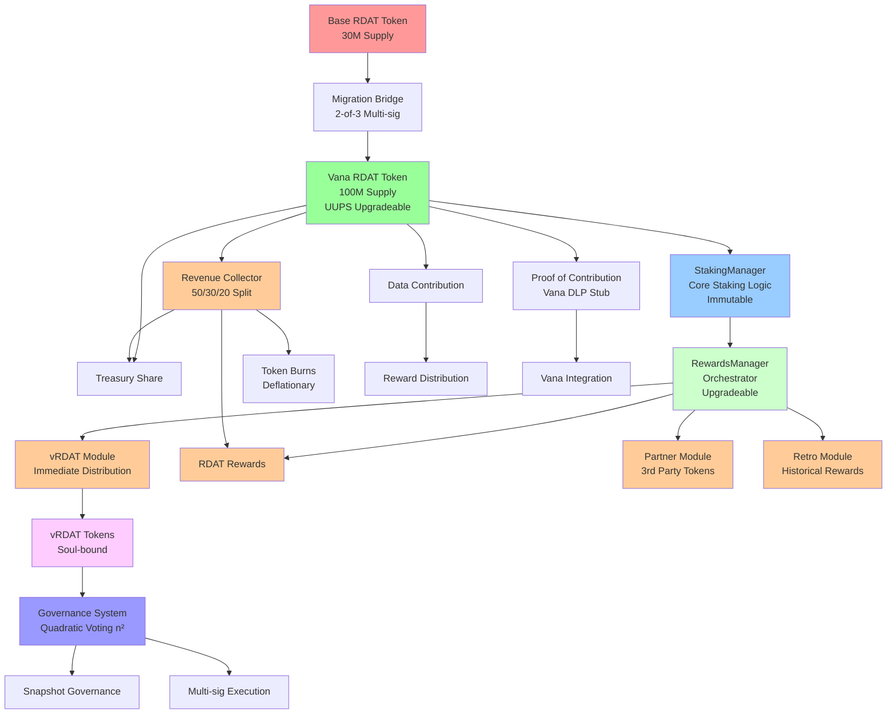

## 🔄 Cross-Chain Migration Flow

```mermaid
sequenceStart
    participant User
    participant BaseRDAT as Base RDAT Contract
    participant MigrationBase as Migration Contract (Base)
    participant Validators as Multi-Validator Network
    participant MigrationVana as Migration Contract (Vana)  
    participant VanaRDAT as Vana RDAT Contract
    
    User->>BaseRDAT: approve(migrationContract, amount)
    User->>MigrationBase: initiateMigration(amount)
    MigrationBase->>BaseRDAT: transferFrom(user, migrationContract, amount)
    MigrationBase->>MigrationBase: burn(amount)
    MigrationBase->>Validators: emitCrossChainEvent(user, amount, burnTxHash)
    
    Note over Validators: 3+ validators verify<br/>burn with 12+ confirmations
    
    Validators->>MigrationVana: submitValidation(user, amount, proof)
    MigrationVana->>MigrationVana: checkConsensus(3+ validators)
    
    Note over MigrationVana: 6-hour challenge period
    
    MigrationVana->>MigrationVana: validateProof(proof)
    MigrationVana->>VanaRDAT: transfer(user, amount + bonus)
    VanaRDAT-->>User: Receive RDAT on Vana
    Note over VanaRDAT: Tokens transferred from pre-allocated 30M pool
```

### 🔒 Enhanced Migration Security

**Multi-Validator Consensus:**
```solidity
contract SecureMigrationBridge {
    uint256 public constant CHALLENGE_PERIOD = 6 hours;
    uint256 public constant MIN_VALIDATORS = 3;
    uint256 public constant CONFIRMATION_BLOCKS = 12;
    
    mapping(bytes32 => bool) public processedBurnHashes;
    mapping(bytes32 => MigrationRequest) public migrationRequests;
    
    struct MigrationRequest {
        address user;
        uint256 amount;
        uint256 bonus; // Migration incentive
        bytes32 burnTxHash;
        uint256 burnBlockNumber;
        uint256 validatorApprovals;
        mapping(address => bool) hasValidated;
        uint256 challengeEndTime;
        bool executed;
        bool challenged;
    }
}
```

**Migration Incentives:**
- Week 1-2: 5% bonus tokens
- Week 3-4: 3% bonus tokens
- Week 5-8: 1% bonus tokens
- After Week 8: No bonus

**Double-Spend Prevention:**
- Permanent burn transaction recording
- Cross-chain state verification
- Multi-validator consensus requirement
- Challenge period for dispute resolution

**DAO Vote Reference**: [Snapshot Proposal 0xa0c701b7...](https://snapshot.box/#/s:rdatadao.eth/proposal/0xa0c701b7f26855b3861e150fb31d637f70ae6f50cb4e1c92e2b5675a048a54bb)
- **Approved**: New tokenomics with 100M total supply
- **Migration**: 1:1 swap for existing 30M RDAT holders
- **Fixed Supply**: No additional minting after initial distribution

### 📍 Migration from Base Mainnet RDAT

**Existing Base Contract**: `0x4498cd8ba045e00673402353f5a4347562707e7d`  
**Network**: Base Mainnet (Chain ID: 8453)  
**Supply**: 30,000,000 RDAT tokens  
**Block Explorer**: https://basescan.org/token/0x4498cd8ba045e00673402353f5a4347562707e7d#code

**Migration Purpose**: Base blockchain integration is **solely for token holder migration** from the existing 30M RDAT on Base to the new 100M RDAT ecosystem on Vana. Base will not host ongoing RDAT ecosystem operations.

**Base Integration Requirements**:
1. **Migration Contract**: Deploy migration contract on Base for 1:1 token swap
2. **Mock RDAT**: Create local/testnet versions for migration testing
3. **Migration Verification**: Ensure seamless transition for existing holders
4. **Post-Migration**: Base contracts become legacy after migration period

## 📦 Smart Contracts Required (11 Total)

### Core Contracts (V2 Modular Architecture)
1. **RDATUpgradeable.sol** - Main token with full VRC-20 compliance (UUPS upgradeable)
2. **vRDAT.sol** - Soul-bound governance token (non-upgradeable)
3. **StakingPositions.sol** - NFT-based staking with conditional transfers (non-upgradeable)
4. **RewardsManager.sol** - Orchestrates reward modules (upgradeable for flexibility)
5. **vRDATRewardModule.sol** - Immediate governance token distribution
6. **RDATRewardModule.sol** - Time-based staking rewards
7. **MigrationBridge.sol** - Secure cross-chain migration
8. **EmergencyPause.sol** - Emergency response system
9. **RevenueCollector.sol** - Fee distribution mechanism
10. **ProofOfContribution.sol** - Full Vana DLP implementation
11. **VRC14LiquidityModule.sol** - VANA liquidity incentives as reward module

### 🔄 Architecture Approach

**Triple-Layer Pattern**: Upgradeable Token + Immutable Staking + Modular Rewards
- **RDAT Token (RDATUpgradeable.sol)**: UUPS upgradeable for feature additions
  - Bug fixes and improvements without migration
  - Multi-sig with timelock control
  - Storage gaps prevent collisions
  
- **Staking Layer (StakingPositions.sol)**: NFT-based with transfer protection
  - Each stake creates an ERC-721 NFT position
  - Soul-bound during lock period
  - Conditional transfers after unlock (must clear vRDAT)
  - Prevents zombie positions
  - Emergency migration if needed
  - Events for reward tracking
  
- **Rewards Layer (RewardsManager + Modules)**: Flexible and extensible
  - Upgradeable manager for orchestration
  - Pluggable reward modules
  - Support multiple tokens and programs
  - Independent upgrade cycles

**Benefits**:
- Maximum security for user funds (immutable staking)
- Flexibility for rewards without touching stakes
- Clean separation enables independent development
- No complex migrations for new reward programs
- Users get penalty-free migration (better than early withdrawal)
- Independent security audits for each contract version
- Complete architectural freedom for new versions

### 1. Core Token Contract: `RDATV2.sol`

**Phase 1 V2 Beta Implementation (UPDATED):**
```solidity
// Enhanced with security measures and upgradeability
contract RDATUpgradeable is 
    Initializable,
    ERC20Upgradeable,
    ERC20BurnableUpgradeable,
    ERC20PausableUpgradeable,
    ERC20PermitUpgradeable,
    AccessControlUpgradeable,
    ReentrancyGuardUpgradeable,
    UUPSUpgradeable,
    IVRC20Basic  // Simplified VRC compliance for Phase 1
```

**Key Changes:**
- ✅ **UUPS Upgradeable Pattern**: Allows future contract improvements without migration
- ✅ **CREATE2 Deployment**: Deterministic addresses across chains
- ✅ **Proxy Pattern**: Separates logic from storage for upgradeability

**Phase 3 Full Implementation:**
```solidity
// Complete implementation post-beta
contract RDAT is 
    Initializable,
    ERC20Upgradeable,
    ERC20BurnableUpgradeable,
    ERC20PausableUpgradeable,
    ERC20PermitUpgradeable,
    AccessControlUpgradeable,
    UUPSUpgradeable,
    ReentrancyGuardUpgradeable,
    VRCRegistry,
    IVRC20,
    IVRC20DataLicensing,
    IVRC15,
    IEmergencyMintable
```

**Key Features:**
- **Token Parameters:**
  - Name: "r/datadao"
  - Symbol: "RDAT"
  - Total Supply: 100,000,000 (100 million) tokens
  - Decimals: 18
  - **Primary Blockchain: Vana** (Main deployment and ecosystem)
  - *Existing Base RDAT: 30,000,000 (30 million) tokens - Migration only*

- **Core Functionality:**
  - ERC-20 standard compliance with modern extensions
  - Burnable tokens with deflationary mechanisms
  - Pausable transfers (emergency mechanism with multi-sig)
  - UUPS upgradeable pattern with timelock
  - Meta-transaction support (EIP-2771)
  - Permit functionality (EIP-2612) for gasless approvals
  - Transfer with authorization (EIP-3009)
  - Flash loan protection mechanisms
  - Revenue distribution to stakers (fee switch)

- **VRC-20 Compliance:**
  - Fixed supply of 100M tokens (no minting after deployment)
  - Transfer fees: 0-3% (configurable, max 300 basis points)
  - Fee distribution: 50% to stakers, 30% to treasury, 20% to contributors
  - Team vesting: Minimum 6-month cliff (REQUIRED for DLP rewards)
  - Blocklist capability for regulatory compliance
  - No rebasing functionality
  - Public disclosure of team allocations and locking mechanism
  - Data licensing hooks for revenue capture

- **VRC-15 Compliance:**
  - Data utility hooks for marketplace integration
  - Revenue distribution from data sales
  - Integration with DataDAO ecosystem

- **Security Mechanisms:**
  ```solidity
  // Fixed supply enforcement
  function mint(address, uint256) external pure {
      revert("Minting is disabled - all tokens minted at deployment");
  }
  
  // Emergency pause mechanism (72-hour auto-expiry)
  function emergencyPause() external onlyRole(PAUSER_ROLE) {
      _pause();
      pausedAt = block.timestamp;
  }
  ```

- **Revenue Distribution:**
  ```solidity
  uint256 public constant STAKER_SHARE = 5000; // 50%
  uint256 public constant TREASURY_SHARE = 3000; // 30%
  uint256 public constant CONTRIBUTOR_SHARE = 2000; // 20%
  
  function distributeRevenue() external {
      uint256 fees = collectedFees;
      collectedFees = 0;
      
      uint256 stakerAmount = (fees * STAKER_SHARE) / 10000;
      uint256 treasuryAmount = (fees * TREASURY_SHARE) / 10000;
      uint256 contributorAmount = (fees * CONTRIBUTOR_SHARE) / 10000;
      
      stakingRewards.addRewards(stakerAmount);
      _transfer(address(this), treasury, treasuryAmount);
      _transfer(address(this), contributorPool, contributorAmount);
  }
  ```

### 2. VRC Registry: `VRCRegistry.sol`

**Abstract Contract Features:**
- Multi-VRC standard registration
- Version tracking for each VRC standard
- Off-chain verification queries
- Future VRC support mechanism

**Required Functions:**
```solidity
function registerVRCCompliance(string memory vrcStandard, uint256 version) internal
function isVRCCompliant(string memory vrcStandard) external view returns (bool)
function getVRCVersion(string memory vrcStandard) external view returns (uint256)
```

### 3. Data Contributor Rewards: `DataContributorRewards.sol`

**Key Features:**
- Merkle-based distribution for gas efficiency
- Multiple reward rounds support
- Contribution-based scoring system
- Budget tracking (30M RDAT total)
- Unclaimed token recovery
- Integration with Phase 3 vesting unlock

**Required Functions:**
```solidity
function createRewardRound(
    bytes32 merkleRoot,
    uint256 totalRewards,
    uint256 duration
) external onlyRole(DISTRIBUTOR_ROLE)

function claimRewards(
    uint256 roundId,
    uint256 amount,
    bytes32[] calldata merkleProof
) external

function finalizeRound(uint256 roundId) external
```

**Distribution Strategy:**
- Initial rounds: 5-8M RDAT per round
- Claim windows: 30-90 days
- Quality-based scoring tiers
- Early contributor bonuses

### 4. Vesting Contract: `RDATVesting.sol`

**Key Features:**
- Multi-beneficiary vesting schedules with multi-sig control
- Cliff period support (6 months for treasury)
- Linear vesting after cliff with optional streaming
- Phase-based unlock triggers (3-of-5 multi-sig required)
- Emergency pause mechanism with DAO override
- Vesting schedule modification (timelock + multi-sig)
- Optional migration vesting incentives (110-120% bonuses)

**Required Functions:**
```solidity
function createVestingSchedule(
    address beneficiary,
    uint256 totalAmount,
    uint256 startTime,
    uint256 cliffDuration,
    uint256 vestingDuration,
    bool revocable
) external onlyRole(VESTING_ADMIN_ROLE) requiresMultiSig(2, 3)

// Phase 3 trigger with multi-sig protection
function triggerPhase3Vote() external onlyRole(VESTING_ADMIN_ROLE) {
    require(!phase3Votes[msg.sender], "Already voted");
    phase3Votes[msg.sender] = true;
    phase3VoteCount++;
    
    if (phase3VoteCount >= REQUIRED_PHASE3_VOTES) {
        _schedulePhase3Trigger(); // Timelock delay
    }
}

function release(address beneficiary) external
function releasable(address beneficiary) external view returns (uint256)
function triggerPhase3Unlock() external onlyRole(VESTING_ADMIN_ROLE)
```

**Vesting Schedules:**
```solidity
// Treasury vesting
createVestingSchedule(
    treasuryAddress,
    25_000_000e18,
    TGE,
    6 months,
    18 months,
    false
);

// Future rewards (locked until Phase 3)
createVestingSchedule(
    rewardsPool,
    30_000_000e18,
    type(uint256).max, // Start time set when Phase 3 triggers
    0,
    0,
    false
);
```

### 4. Factory Contract: `RDATFactory.sol`

**Key Features:**
- CREATE2 deterministic deployment
- Automated proxy + implementation deployment
- Timelock controller integration (48-hour delay)
- Multi-network deployment support
- Deployment tracking and verification

**Required Functions:**
```solidity
function deployRDAT(
    address timelockController,
    address[] memory vestingRecipients,
    uint256[] memory vestingAmounts,
    uint256[] memory vestingSchedules
) external returns (address proxy, address implementation)

function getDeploymentAddress(bytes32 salt) external view returns (address)
```

### 4. Token Allocation (Per DAO Vote)

**Total Supply: 100,000,000 RDAT**

| Allocation | Percentage | Amount | Vesting Schedule |
|------------|------------|--------|------------------|
| Migration Reserve | 30% | 30,000,000 | 100% unlocked at TGE |
| Future Rewards | 30% | 30,000,000 | 0% at TGE, split determined by future DAO vote |
| Treasury & Ecosystem | 25% | 25,000,000 | 10M team (DAO vote required), 2.5M TGE, 12.5M treasury |
| Liquidity & Staking | 15% | 15,000,000 | 4.95M TGE liquidity (33%), 10.05M staking incentives |

**Key Clarifications:**
- **Future Rewards**: 30M total, split between staking/data per future DAO vote
- **Team Tokens**: 10M from Treasury requires DAO approval to transfer to TokenVesting
- **Liquidity**: Exactly 4.95M (not rounded to 5M)
- **Staking Incentives**: 10.05M for LP rewards, vRDAT boosts (separate from Future Rewards)
- **Initial Distributions**: Admin manually triggers after migration verification

**Vesting Implementation Requirements:**
- Migration Reserve: Immediately available for 1:1 token swap
- Future Rewards: Locked until Phase 3, then distributed per DAO vote on split
- Treasury: 2.5M at TGE, 10M team allocation (DAO vote), 12.5M general treasury
- Liquidity: 4.95M at TGE for DEX liquidity, 10.05M for staking incentives

**Data Contributor Rewards:**
- Source: Future Rewards allocation (portion of 30M per DAO vote)
- Distribution: Based on quality and quantity of data contributions
- Unlock: Triggered when Phase 3 data aggregation begins
- Management: Through DataDAO governance and contribution scoring
- Initial Phase 3 Budget: Recommended 5-10M RDAT for first contributor cohort

**VRC-20 Team Allocation Compliance:**
- Team/founder/early contributor tokens MUST be allocated from the Treasury & Ecosystem bucket
- Minimum 6-month lockup period starting from DLP reward eligibility date
- Linear vesting after the 6-month cliff
- All team allocations must be locked in verified smart contracts (VestingWallet)
- Public disclosure required for all team allocations including amounts and vesting schedules
- Non-compliance will result in loss of DLP rewards eligibility

### 5. Access Control Roles

**Role Definitions:**
```solidity
bytes32 public constant PAUSER_ROLE = keccak256("PAUSER_ROLE");
bytes32 public constant UPGRADER_ROLE = keccak256("UPGRADER_ROLE");
bytes32 public constant FEE_SETTER_ROLE = keccak256("FEE_SETTER_ROLE");
bytes32 public constant VESTING_ADMIN_ROLE = keccak256("VESTING_ADMIN_ROLE");
bytes32 public constant BLOCKLIST_ADMIN_ROLE = keccak256("BLOCKLIST_ADMIN_ROLE");
```

## 🧪 Testing Requirements

### 1. Unit Tests

**Token Core Functionality (`test/unit/Rdat.t.sol`):**
- Token initialization with correct parameters
- Transfer functionality
- Approval and transferFrom
- Burn functionality
- Pause/unpause mechanisms
- Access control for all restricted functions

**VRC-20 Compliance (`test/unit/VRC20Compliance.t.sol`):**
- Fixed supply enforcement
- Transfer fee calculations (0%, 1%, 3% scenarios)
- Fee recipient updates
- Blocklist functionality
- Anti-rebasing verification

**Vesting Tests (`test/unit/Vesting.t.sol`):**
- Treasury vesting: 6-month cliff, then 5% monthly releases
- Future rewards: Complete lock until Phase 3 trigger
- Migration reserve: Immediate availability (no vesting)
- Liquidity allocation: 33% immediate, 67% for staking
- Multiple beneficiary support
- Vesting admin controls
- Phase 3 trigger mechanism for rewards unlock

**Data Contributor Rewards Tests (`test/unit/DataContributorRewards.t.sol`):**
- Merkle proof verification for claims
- Reward round creation and budget tracking
- Multiple round support with different parameters
- Claim period enforcement
- Duplicate claim prevention
- Unclaimed token recovery
- Total budget enforcement (30M cap)
- Integration with vesting contract

**Upgrade Tests (`test/unit/Upgrades.t.sol`):**
- UUPS upgrade authorization
- Storage layout preservation
- Upgrade rollback scenarios
- Access control on upgrades

### 2. Integration Tests

**Factory Deployment (`test/integration/FactoryDeployment.t.sol`):**
- Full deployment flow with factory
- Timelock integration
- Multi-recipient vesting setup
- Cross-chain deployment simulation
- Deterministic address verification

**Governance Integration (`test/integration/Governance.t.sol`):**
- Timelock proposal creation
- 48-hour delay enforcement
- Multi-sig execution
- Emergency cancellation
- Role-based execution

### 3. Security Tests

**Edge Cases (`test/security/EdgeCases.t.sol`):**
- Reentrancy protection
- Integer overflow/underflow
- Zero address checks
- Empty array handling
- Maximum value transfers

**Access Control (`test/security/AccessControl.t.sol`):**
- Unauthorized function calls
- Role hierarchy testing
- Admin function restrictions
- Cross-role interference

**Gas Optimization (`test/security/GasOptimization.t.sol`):**
- Deployment gas costs
- Transfer gas costs
- Batch operation efficiency
- Storage optimization verification

### 4. Fuzzing Tests

**Foundry Invariant Tests (`test/invariant/`):**
- Total supply consistency
- Fee calculation boundaries
- Vesting schedule integrity
- Role assignment consistency

**Property-Based Tests:**
- Transfer fee never exceeds 3%
- Vesting always respects cliff
- Total vested amount never exceeds allocation
- Blocklist always prevents transfers

## 🔧 Mock Token Contracts

### MockRDAT Token (`src/mocks/MockRDAT.sol`)

**Purpose**: Exact replica of the existing RDAT token from Base mainnet for testing
- Exact same implementation as Base mainnet RDAT (0x4498cd8ba045e00673402353f5a4347562707e7d)
- Fixed supply of 30 million tokens (matching existing Base RDAT)
- Full feature parity including:
  - ERC20 + ERC20Permit + ERC20Votes
  - Ownable2Step for secure ownership transfer
  - Admin role for blocklist management
  - Address blocklist functionality
  - Mint blocking capability (one-way switch)
  - Timestamp-based governance support

**Deployment Script**: `script/mocks/DeployMockRDAT.s.sol`
```bash
# Deploy to local Base chain
forge script script/mocks/DeployMockRDAT.s.sol:DeployMockRDAT --rpc-url http://localhost:8545 --broadcast

# Deploy to Base Sepolia
forge script script/mocks/DeployMockRDAT.s.sol:DeployMockRDAT --rpc-url $BASE_SEPOLIA_RPC_URL --broadcast
```

## 🚀 Deployment Scripts

### 1. Local Development (`script/local/`)

**`DeployLocal.s.sol`:**
- Deploy to local Anvil instances
- Use test mnemonics
- Skip timelock for faster testing
- Pre-fund test accounts

### 2. Testnet Deployment (`script/testnet/`)

**`DeployVanaMoksha.s.sol`:**
- Deploy to Vana Moksha testnet (Chain ID: 14800)
- Include timelock with reduced delay (1 hour)
- Deploy with test vesting schedules
- Verify on block explorer

**`DeployBaseSepolia.s.sol`:**
- Deploy to Base Sepolia (Chain ID: 84532)
- Same configuration as Vana Moksha
- Cross-chain address consistency check

### 3. Mainnet Deployment (`script/mainnet/`)

**`DeployVanaMainnet.s.sol`:**
- Deploy to Vana mainnet (Chain ID: 1480)
- Production timelock (48 hours)
- Real vesting schedules
- Multi-sig wallet integration

**`DeployBaseMainnet.s.sol`:**
- Deploy to Base mainnet (Chain ID: 8453)
- Identical configuration to Vana
- Cross-chain verification

### 4. Deployment Utilities (`script/utils/`)

**`VerifyDeployment.s.sol`:**
- Verify contract on block explorers
- Check all role assignments
- Validate vesting schedules
- Confirm timelock configuration

**`PostDeploymentSetup.s.sol`:**
- Register with DataDAO
- Set initial fee parameters
- Configure blocklist oracle
- Transfer admin roles to multi-sig

## 🛡️ Audit Strategy

### 1. Pre-Audit Preparation

**Static Analysis:**
- Run Slither with zero high/critical issues
- Mythril vulnerability scanning
- Solhint linting compliance
- Custom error implementation verification

**Documentation:**
- Complete NatSpec comments
- Architecture diagrams
- Known issues documentation
- Gas optimization report

### 2. OpenZeppelin Integration

**Leverage Audited Contracts:**
```solidity
// Use OpenZeppelin's audited implementations
import "@openzeppelin/contracts-upgradeable/token/ERC20/ERC20Upgradeable.sol";
import "@openzeppelin/contracts-upgradeable/token/ERC20/extensions/ERC20BurnableUpgradeable.sol";
import "@openzeppelin/contracts-upgradeable/security/PausableUpgradeable.sol";
import "@openzeppelin/contracts-upgradeable/access/AccessControlUpgradeable.sol";
import "@openzeppelin/contracts-upgradeable/proxy/utils/UUPSUpgradeable.sol";
import "@openzeppelin/contracts/governance/TimelockController.sol";
```

**Custom Extensions:**
- Minimize custom code
- Inherit security properties
- Focus audit on VRC compliance layer
- Use OpenZeppelin's upgrade plugins

### 3. Testing Coverage Requirements

**Minimum Coverage Targets:**
- Line Coverage: 100%
- Branch Coverage: 100%
- Function Coverage: 100%
- Statement Coverage: 100%

**Critical Path Testing:**
- Every external/public function
- All state transitions
- Emergency scenarios
- Upgrade paths

### 4. Audit Focus Areas

**High Priority:**
1. VRC compliance implementation
2. Vesting logic and cliff enforcement
3. Fee calculation and distribution
4. Upgrade authorization
5. Access control integration

**Medium Priority:**
1. Gas optimization effectiveness
2. Event emission completeness
3. Error message clarity
4. Storage layout efficiency

**Low Priority:**
1. Code style consistency
2. Documentation completeness
3. Test coverage redundancy

## 📊 Success Metrics

### Technical Metrics
- Compilation time: < 0.5 seconds
- Contract size: < 24KB
- Deployment gas: < 5M gas
- Transfer gas: < 65K gas
- Test execution: < 30 seconds

### Security Metrics
- Zero high/critical vulnerabilities
- 100% test coverage
- All fuzzing invariants hold
- Clean audit report

### Business Metrics
- Multi-chain deployment capability
- Regulatory compliance ready
- DataDAO integration complete
- User-friendly fee structure
- Future VRC adaptability

## 🔄 V2 Beta Sprint Timeline (13 Days)

### August 5-18, 2025 Execution Plan

**Days 1-2: Foundation**
- Initialize project structure
- Deploy Gnosis Safe on testnet
- Begin RDAT V2 and vRDAT V2 contracts
- Set up CI/CD pipeline

**Days 3-4: Core Development**
- Complete V2 token contracts
- Implement Staking (simplified)
- Build V1→V2 migration bridge
- Deploy all contracts to testnet
- **Milestone**: Testnet launch ✓

**Days 5-6: Frontend Integration**
- Build staking UI
- Create migration wizard
- Integrate Snapshot governance
- Set up analytics tracking

**Days 7-8: Security & Polish**
- Security audit (focused scope)
- Fix critical issues
- Performance optimization
- **Milestone**: Frontend complete ✓

**Days 9-11: Community Testing**
- Launch beta testing program
- Gather community feedback
- Fix reported bugs
- Stress test migration bridge
- **Milestone**: Beta testing complete ✓

**Days 12-13: Mainnet Launch**
- Deploy to mainnet
- Verify all contracts
- Enable migration bridge
- 24-hour monitoring
- **Milestone**: V2 Beta live ✓

---

## 🌉 Migration System Specifications

### Overview

The migration system facilitates the **one-time transition** of existing 30M RDAT holders from Base to the new 100M RDAT ecosystem on **Vana blockchain**. This is the **sole purpose** of Base blockchain integration - Vana will host all ongoing RDAT ecosystem operations including staking, governance, and data contributions.

**Migration Goals:**
- Seamless 1:1 token swap for existing Base RDAT holders
- Transition to Vana-native RDAT ecosystem  
- Base contracts become legacy post-migration
- All future development occurs on Vana blockchain

## 📦 Migration Smart Contracts

### 1. Base Chain Contract: `MigrationBridge.sol`

**Phase 1 V2 Beta Implementation:**
```solidity
// Simplified for V2 Beta with 2-of-3 multi-sig
contract MigrationBridge is 
    Pausable,
    AccessControl
```

**Phase 3 Full Implementation:**
```solidity
// Multi-validator version
contract RdatMigration is 
    Pausable,
    AccessControl,
    ReentrancyGuard
```

**Key Features:**
- **Deposit Management:**
  - Accept RDAT token deposits from users
  - Configurable minimum/maximum deposit limits
  - Per-user deposit tracking and limits
  - Batch deposit aggregation for efficiency

- **Whale Whitelist:**
  - Special handling for large token holders
  - Bypass standard deposit limits for whitelisted addresses
  - Admin-controlled whitelist management
  - Event emission for whitelist changes

- **Security Features:**
  - Pausable operations for emergency situations
  - Reentrancy protection on all state-changing functions
  - Comprehensive input validation
  - Event logging for all critical operations

**Required Functions:**
```solidity
function deposit(uint256 amount) external whenNotPaused nonReentrant
function setDepositLimits(uint256 min, uint256 max) external onlyRole(ADMIN_ROLE)
function addWhaleToWhitelist(address whale) external onlyRole(ADMIN_ROLE)
function removeWhaleFromWhitelist(address whale) external onlyRole(ADMIN_ROLE)
function pause() external onlyRole(PAUSER_ROLE)
function unpause() external onlyRole(ADMIN_ROLE)
```

### 2. Vana Chain Contract: `RdatDistributor.sol`

**Inheritance Structure:**
```solidity
contract RdatDistributor is 
    Pausable,
    AccessControl,
    ReentrancyGuard,
    MerkleProof
```

**Key Features:**
- **Merkle Distribution:**
  - Gas-efficient Merkle proof verification
  - Batch claim processing with single Merkle root
  - Double-spend prevention with claim tracking
  - Support for multiple distribution batches

- **Gnosis Safe Integration:**
  - Multi-signature control for batch activation
  - Timelock for batch finalization
  - Emergency batch cancellation
  - Role-based batch management

- **Claim Management:**
  - Individual claim tracking
  - Partial claim support
  - Claim expiration mechanism
  - Emergency withdrawal for unclaimed tokens

**Required Functions:**
```solidity
function submitBatch(bytes32 merkleRoot, uint256 totalAmount) external onlyRole(BATCH_SUBMITTER_ROLE)
function activateBatch(uint256 batchId) external onlyRole(BATCH_ACTIVATOR_ROLE)
function claim(uint256 batchId, uint256 amount, bytes32[] calldata proof) external whenNotPaused nonReentrant
function emergencyWithdraw(address token, uint256 amount) external onlyRole(ADMIN_ROLE)
function cancelBatch(uint256 batchId) external onlyRole(ADMIN_ROLE)
```

### 3. Migration Orchestrator: `MigrationOrchestrator.sol`

**Off-chain Service Components:**
- **Event Monitoring:** Watch for deposit events on Base
- **Batch Creation:** Aggregate deposits into optimized batches
- **Merkle Tree Generation:** Create Merkle trees for distribution
- **Cross-chain Coordination:** Manage state between chains
- **Status Tracking:** Provide real-time migration status

### 4. Access Control Roles

**Role Definitions:**
```solidity
// RdatMigration roles
bytes32 public constant ADMIN_ROLE = keccak256("ADMIN_ROLE");
bytes32 public constant PAUSER_ROLE = keccak256("PAUSER_ROLE");
bytes32 public constant WHALE_MANAGER_ROLE = keccak256("WHALE_MANAGER_ROLE");

// RdatDistributor roles
bytes32 public constant BATCH_SUBMITTER_ROLE = keccak256("BATCH_SUBMITTER_ROLE");
bytes32 public constant BATCH_ACTIVATOR_ROLE = keccak256("BATCH_ACTIVATOR_ROLE");
bytes32 public constant EMERGENCY_ROLE = keccak256("EMERGENCY_ROLE");
```

## 🧪 Migration Testing Requirements

### 1. Unit Tests

**Migration Contract Tests (`test/unit/RdatMigration.t.sol`):**
- Deposit functionality with various amounts
- Deposit limit enforcement
- Whale whitelist functionality
- Pause/unpause mechanisms
- Access control restrictions
- Event emission verification

**Distributor Contract Tests (`test/unit/RdatDistributor.t.sol`):**
- Merkle proof verification
- Batch submission and activation
- Claim processing and tracking
- Double-claim prevention
- Emergency functions
- Gnosis Safe integration

**Edge Cases (`test/unit/MigrationEdgeCases.t.sol`):**
- Zero amount deposits
- Maximum uint256 handling
- Empty Merkle proofs
- Batch overflow scenarios
- Gas limit testing

### 2. Integration Tests

**End-to-End Migration (`test/integration/MigrationFlow.t.sol`):**
- Complete migration flow from deposit to claim
- Multi-user batch processing
- Cross-chain state synchronization
- Error recovery scenarios
- Performance under load

**Orchestrator Integration (`test/integration/Orchestrator.t.sol`):**
- Event detection and processing
- Batch optimization logic
- Merkle tree generation
- Status update accuracy
- Failure handling

### 3. Security Tests

**Security Scenarios (`test/security/MigrationSecurity.t.sol`):**
- Reentrancy attack prevention
- Front-running protection
- Merkle proof manipulation attempts
- Access control bypass attempts
- DoS attack resilience

**Gas Optimization (`test/security/MigrationGas.t.sol`):**
- Batch size optimization
- Merkle proof gas costs
- Claim gas efficiency
- Storage optimization

### 4. Fuzzing Tests

**Invariant Tests (`test/invariant/MigrationInvariants.sol`):**
- Total deposited equals total claimable
- No tokens can be created or destroyed
- Claimed amount never exceeds deposited
- Batch totals match individual claims

## 🚀 Migration Deployment Scripts

### 1. Local Development (`script/migration/local/`)

**`DeployMigrationLocal.s.sol`:**
- Deploy MockRDAT first (replicating Base mainnet RDAT)
- Deploy both migration contracts
- Set up test whale whitelist
- Configure minimal delays
- Pre-fund test accounts with MockRDAT tokens

**Testing Flow:**
1. Deploy MockRDAT to local Base chain (port 8545)
2. Deploy RdatMigration contract on local Base
3. Deploy new RDAT token on local Vana chain (port 8546)
4. Deploy RdatDistributor contract on local Vana
5. Fund test accounts with MockRDAT for migration testing

### 2. Testnet Deployment (`script/migration/testnet/`)

**`DeployMigrationTestnet.s.sol`:**
- Deploy to Base Sepolia and Vana Moksha
- Configure realistic limits and delays
- Set up multi-sig controls
- Initialize with test batch

### 3. Mainnet Deployment (`script/migration/mainnet/`)

**`DeployMigrationMainnet.s.sol`:**
- Deploy with production parameters
- Gnosis Safe integration
- Production limits and delays
- Comprehensive verification

### 4. Migration Utilities (`script/migration/utils/`)

**`MigrationHelpers.s.sol`:**
- Merkle tree generation utilities
- Batch optimization calculations
- Gas estimation helpers
- Migration status queries

**`EmergencyActions.s.sol`:**
- Emergency pause procedures
- Batch cancellation scripts
- Token recovery functions
- Admin action utilities

## 🛡️ Migration Audit Strategy

### 1. Security Focus Areas

**High Priority:**
1. Merkle proof verification correctness
2. Cross-chain state consistency
3. Access control and multi-sig integration
4. Reentrancy and front-running protection
5. Emergency mechanism reliability

**Medium Priority:**
1. Gas optimization effectiveness
2. Batch processing efficiency
3. Event emission completeness
4. Error handling robustness

### 2. OpenZeppelin Integration

**Leverage Audited Components:**
```solidity
import "@openzeppelin/contracts/security/Pausable.sol";
import "@openzeppelin/contracts/security/ReentrancyGuard.sol";
import "@openzeppelin/contracts/access/AccessControl.sol";
import "@openzeppelin/contracts/utils/cryptography/MerkleProof.sol";
import "@openzeppelin/contracts/proxy/utils/UUPSUpgradeable.sol";
```

### 3. Testing Requirements

**Coverage Targets:**
- Line Coverage: 100%
- Branch Coverage: 100%
- State Machine Coverage: 100%
- Cross-chain Scenario Coverage: 95%

### 4. Performance Benchmarks

**Gas Targets:**
- Deposit: < 100k gas
- Claim: < 150k gas
- Batch submission: < 200k gas
- Merkle proof verification: < 50k gas per proof

## 📊 Migration Success Metrics

### Technical Metrics
- Migration completion time: < 2 hours
- Batch processing efficiency: > 70% gas savings
- System uptime: 99.9% SLA
- Transaction success rate: > 99%

### Security Metrics
- Zero security incidents
- 100% fund recovery capability
- Complete audit trail
- Multi-sig protection on all admin functions

### Business Metrics
- User migration completion: > 90%
- Support ticket reduction: > 80%
- Gas cost savings: > $50k
- Migration timeline: 8 weeks

---

## 🥩 Staking System Specifications

### Overview

The RDAT staking system uses a modular architecture with stake IDs (not NFTs) to provide flexibility while optimizing gas costs. Users can create multiple concurrent stakes with different amounts and durations. Each staking position is tracked via unique stake IDs with gas-optimized EnumerableSet storage. **Deployed exclusively on Vana blockchain** as part of the complete RDAT ecosystem. The system is designed for modularity, security, and scalability.

## 🔄 Staking Flow Diagram

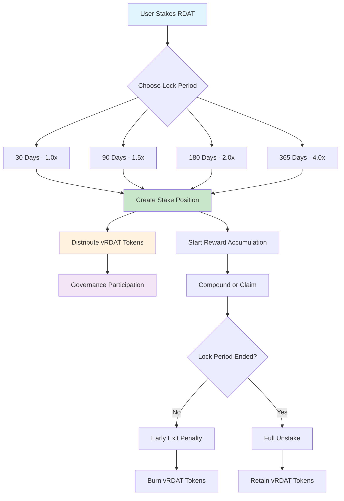

## ⚡ vRDAT Distribution Flow

```mermaid
sequenceStart
    participant User
    participant StakingManager
    participant vRDATDistributor
    participant vRDAT
    participant SecuritySystem
    
    User->>StakingManager: stake(amount, lockPeriod)
    StakingManager->>StakingManager: validate stake parameters
    StakingManager->>vRDATDistributor: distributeForStaking(user, amount, lockPeriod)
    
    vRDATDistributor->>SecuritySystem: checkAntiGaming(user, amount)
    SecuritySystem-->>vRDATDistributor: validation result
    
    alt Gaming Check Passed
        vRDATDistributor->>vRDATDistributor: calculatevRDATAmount(amount, duration, lock)
        vRDATDistributor->>vRDAT: mint(user, vrdatAmount)
        vRDAT-->>User: vRDAT tokens (non-transferable)
    else Gaming Detected
        vRDATDistributor-->>User: Distribution blocked
    end
```

## 📦 Staking Smart Contracts

### 1. Core Staking Contract

**Phase 1 V2 Beta: `Staking.sol`**
```solidity
// Non-upgradeable staking implementation with manual migration
contract Staking is 
    IStaking,
    AccessControl,
    Pausable,
    ReentrancyGuard
```

**Key Architecture Decisions:**
- **Non-Upgradeable**: Clean immutable contract, uses manual migration for upgrades
- **Single Position Per User**: Simplified state management
- **Time-Lock Multipliers**: 1x, 1.5x, 2x, 4x based on lock duration
- **vRDAT Minting**: Automatic governance token distribution
- **Emergency Migration**: Admin can enable penalty-free withdrawal for migration

**V2 Beta Features (Phase 1):**
- **Time-Lock Staking**: Fixed periods with increasing multipliers
- **Fixed Lock Periods**: 30, 90, 180, 365 days (1x, 1.15x, 1.35x, 1.75x)
- **Automatic vRDAT**: Governance tokens minted on stake
- **Compound Rewards**: Re-stake earned rewards
- **Emergency Exit**: 50% penalty for early withdrawal
- **Emergency Migration**: Admin-triggered penalty-free unstaking
- **Maximum Stake**: 10M RDAT per user limit

**Phase 2 Enhancements:**
- **Liquid Staking Derivatives**: rdatSTAKED tokens for capital efficiency
- **Compound Options**: Add rewards to existing positions
- **Dynamic Reward Adjustment**: Gauge voting for APR discovery
- **Position Marketplace**: Trade matured positions

**Lock Period Configuration:**
| Period | RDAT Multiplier | vRDAT Distribution | Early Exit Penalty |
|--------|-----------------|-------------------|-------------------|
| 30 days | 1.0x | 8.3% (30/365) | 10% |
| 90 days | 1.15x | 24.7% (90/365) | 15% |
| 180 days | 1.35x | 49.3% (180/365) | 20% |
| 365 days | 1.75x | 100% (365/365) | 25% |

**Stake Structure:**
```solidity
struct StakeInfo {
    uint256 amount;           // RDAT staked
    uint256 startTime;        // Stake timestamp
    uint256 endTime;          // Unlock timestamp
    uint256 lockPeriod;       // Duration in seconds (30/90/180/365 days)
    uint256 vRDATMinted;      // vRDAT tokens minted
    uint256 rewardsClaimed;   // Total rewards claimed
    uint256 lastUpdateTime;   // Last reward calculation
    bool migrationEnabled;    // Emergency migration flag
}

mapping(address => StakeInfo) private _stakes; // user => stake
mapping(uint256 => uint256) public lockMultipliers; // period => multiplier
```

**Required Functions:**
```solidity
// Create new staking position
function stake(uint256 amount, uint256 lockPeriod) external

// Unstake position after lock period
function unstake() external

// Claim accumulated rewards
function claimRewards() external

// Emergency exit with 50% penalty
function emergencyWithdraw() external

// Emergency migration functions (ADMIN_ROLE only)
function enableEmergencyMigration() external  // Unlock all positions
function emergencyMigrate() external  // User callable during migration

// Query functions
function getStake(address user) external view returns (StakeInfo memory)
function calculateRewards(address user) external view returns (uint256)
function isMatured(address user) external view returns (bool)
function getMultiplier(uint256 lockPeriod) external view returns (uint256)

// Compound rewards by re-staking
function compound() external

// Add to existing stake (inherits lock period)
function addToStake(uint256 additionalAmount) external
```

**Reward Calculation with Precision:**
```solidity
uint256 public constant PRECISION_FACTOR = 1e18;

function calculateRewards(address user) public view returns (uint256) {
    StakeInfo memory stake = _stakes[user];
    if (stake.amount == 0) return 0;
    
    uint256 timeStaked = block.timestamp - stake.lastUpdateTime;
    uint256 multiplier = lockMultipliers[stake.lockPeriod];
    
    // Calculate rewards with multiplier
    uint256 rewards = (stake.amount * rewardRate * timeStaked * multiplier) / (365 days * PRECISION);
    
    // Check for overflow
    require(multipliedReward >= baseReward, "Reward overflow");
    return multipliedReward;
}
```

### 2. Rewards Manager: `RewardsManager.sol`

**Key Features:**
- UUPS upgradeable orchestrator
- Manages multiple reward modules
- Gas-optimized batch claiming
- Module registration with 48-hour timelock
- Emergency pause functionality

**Core Functions:**
```solidity
// Register new reward module with timelock
function proposeModule(address module) external onlyAdmin
function activateModule(address module) external

// Claim rewards from multiple modules
function claimRewards(uint256[] calldata stakeIds) external

// Module notification
function notifyStake(address user, uint256 stakeId, uint256 amount, uint256 lockPeriod) external
```

### 3. vRDAT Reward Module: `vRDATRewardModule.sol`

**Key Features:**
- **Proportional Distribution**: vRDAT = RDAT × (days/365)
- **Soul-bound Tokens**: Non-transferable governance tokens
- **Minting Authority**: Has permission to mint vRDAT
- **Anti-Gaming**: Sequential short stakes yield less than long stakes

**Proportional Multipliers:**
```solidity
lockMultipliers[30 days] = 833;     // 0.0833x (30/365)
lockMultipliers[90 days] = 2466;    // 0.2466x (90/365)
lockMultipliers[180 days] = 4932;   // 0.4932x (180/365)
lockMultipliers[365 days] = 10000;  // 1.0x (365/365)
```

**Distribution Formula:**
```solidity
function calculatevRDAT(uint256 amount, uint256 lockPeriod) public pure returns (uint256) {
    // Proportional to lock duration
    return (amount * lockMultipliers[lockPeriod]) / 10000;
}
```

### 4. Governance Token: `vRDAT.sol`

**Key Features:**
- **Soul-bound**: Non-transferable governance tokens
- **Position-based**: Minted based on staking positions
- **Voting Power**: Quadratic voting support
- **Delegation**: Voting power delegation

**vRDAT Calculation:**
```solidity
vRDAT = stakedAmount * (lockDays / 365)
// Example: 1000 RDAT locked for 180 days = 493 vRDAT
```

**Required Functions:**
```solidity
function mint(address to, uint256 amount) external onlyStakingManager
function burn(address from, uint256 amount) external onlyStakingManager
function delegate(address delegatee) external
function getPastVotes(address account, uint256 blockNumber) external view returns (uint256)
```

### 5. Delegation System: `ValidatorRegistry.sol`

**Key Features:**
- **Validator Management**: Registration and performance tracking
- **Non-custodial**: Users retain control of funds
- **Commission Structure**: Flexible validator fees
- **Slashing Conditions**: Misbehavior penalties

**Validator Structure:**
```solidity
struct Validator {
    address validatorAddress;
    uint256 commission; // Basis points (100 = 1%)
    uint256 totalDelegated;
    uint256 performanceScore;
    bool active;
    string metadata; // IPFS hash
}
```

### 6. Security Module: `StakingSecurityModule.sol`

**Key Features:**
- **Slashing Protection**: Insurance pools for delegators
- **Rate Limiting**: Transaction frequency controls
- **Emergency Functions**: Pause and emergency withdraw
- **Timelock**: Parameter change delays

**Security Parameters:**
```solidity
uint256 constant MIN_STAKE_AMOUNT = 100e18; // 100 RDAT minimum
uint256 constant MAX_STAKE_AMOUNT = 10_000_000e18; // 10M RDAT maximum
uint256 constant WITHDRAWAL_DELAY = 7 days; // Unstaking cooldown
uint256 constant PARAM_UPDATE_DELAY = 48 hours; // Timelock delay
```

## 🧪 Staking Testing Requirements

### 1. Unit Tests

**Core Staking Tests (`test/unit/StakingManager.t.sol`):**
- Staking with different amounts and periods
- Stake ID generation and tracking
- Lock period enforcement
- Early exit penalty calculations
- EnumerableSet gas optimization
- Multiple positions per user

**Rewards Tests (`test/unit/RewardProgramManager.t.sol`):**
- Multiple concurrent reward programs
- Epoch-based distribution calculations
- Budget depletion handling
- Eligibility criteria enforcement
- Precision math verification

**vRDAT Tests (`test/unit/vRDAT.t.sol`):**
- Minting based on staking positions
- Non-transferability enforcement
- Voting power calculations
- Delegation mechanics
- Historical voting snapshots

### 2. Integration Tests

**Staking Flow (`test/integration/StakingFlow.t.sol`):**
- Complete stake → wait → claim → unstake flow
- Multiple positions per user
- Reward program interactions
- vRDAT minting and burning
- Delegation and undelegation

**Economic Tests (`test/integration/StakingEconomics.t.sol`):**
- APY calculation accuracy
- Reward sustainability over time
- Multiple reward token distributions
- Slashing impact simulations
- Fee collection and distribution

### 3. Security Tests

**Attack Scenarios (`test/security/StakingAttacks.t.sol`):**
- Reentrancy on claims
- Position manipulation attempts
- Reward calculation exploits
- Delegation vulnerabilities
- Emergency scenario handling

### 4. Load Tests

**Performance Tests (`test/load/StakingLoad.t.sol`):**
- 10,000 concurrent stakers
- Batch operations gas costs
- Reward calculation at scale
- Position enumeration efficiency

## 🚀 Staking Deployment Scripts

### 1. Local Development (`script/staking/local/`)

**`DeployStakingLocal.s.sol`:**
- Deploy all staking contracts
- Set up initial reward programs
- Configure test parameters
- Mint test tokens for staking

### 2. Testnet Deployment (`script/staking/testnet/`)

**`DeployStakingTestnet.s.sol`:**
- Deploy to Vana Moksha and Base Sepolia
- Configure realistic parameters
- Set up multi-sig controls
- Initialize with test rewards

### 3. Mainnet Deployment (`script/staking/mainnet/`)

**`DeployStakingMainnet.s.sol`:**
- Production parameter configuration
- Gnosis Safe integration
- Initial reward program funding
- Comprehensive verification

### 4. Staking Utilities (`script/staking/utils/`)

**`StakingHelpers.s.sol`:**
- Reward program creation helpers
- Validator registration scripts
- Emergency action procedures
- Migration utilities

## 🛡️ Staking Audit Strategy

### 1. Security Focus Areas

**High Priority:**
1. StakingManager immutability and stake tracking
2. Reward module registration and timelock
3. Proportional vRDAT distribution accuracy
4. Emergency migration procedures
5. RewardsManager upgrade authorization

**Medium Priority:**
1. Gas optimization effectiveness
2. Event emission completeness
3. Frontend integration points
4. Economic parameter validation

### 2. OpenZeppelin Integration

**Leverage Audited Components:**
```solidity
import "@openzeppelin/contracts-upgradeable/token/ERC721/ERC721Upgradeable.sol";
import "@openzeppelin/contracts-upgradeable/security/ReentrancyGuardUpgradeable.sol";
import "@openzeppelin/contracts-upgradeable/security/PausableUpgradeable.sol";
import "@openzeppelin/contracts-upgradeable/access/AccessControlUpgradeable.sol";
import "@openzeppelin/contracts-upgradeable/proxy/utils/UUPSUpgradeable.sol";
import "@openzeppelin/contracts/utils/math/SafeMath.sol";
import "@openzeppelin/contracts/utils/math/Math.sol";
```

### 3. Economic Auditing

**Sustainability Analysis:**
- Reward rate vs token supply
- Lock period incentive modeling
- Slashing impact on TVL
- Fee structure optimization

### 4. Testing Requirements

**Coverage Targets:**
- Line Coverage: 100%
- Branch Coverage: 100%
- Economic Scenarios: 95%
- Attack Vectors: 100%

## 📊 Staking Success Metrics

### Technical Metrics
- Gas per stake: < 200k
- Gas per claim: < 100k
- Position query time: < 100ms
- Reward calculation accuracy: 18 decimals

### Business Metrics
- TVL target: $10M in 3 months
- Active stakers: 5,000+
- Average lock period: 180 days
- Delegation rate: 30%

### Security Metrics
- Zero critical vulnerabilities
- 100% fund recovery capability
- Complete slashing protection
- Multi-sig on all admin functions

---

# 📊 Data Contribution System Specifications

## 🎯 Overview

The Data Contribution System enables users to contribute Reddit data and earn RDAT rewards through a merit-based scoring system. Built with privacy-first design, GDPR compliance, and decentralized storage using IPFS.

## 📊 Data Contribution Flow

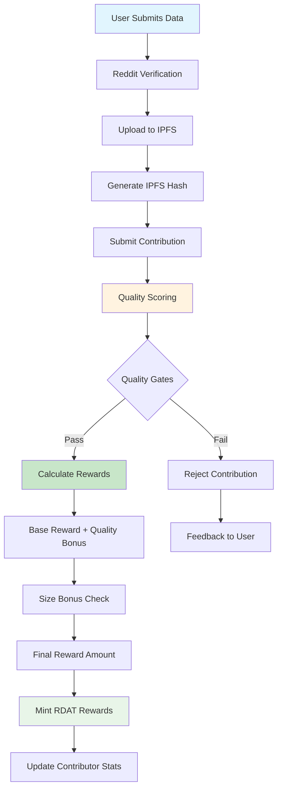

## 🔍 Quality Scoring System

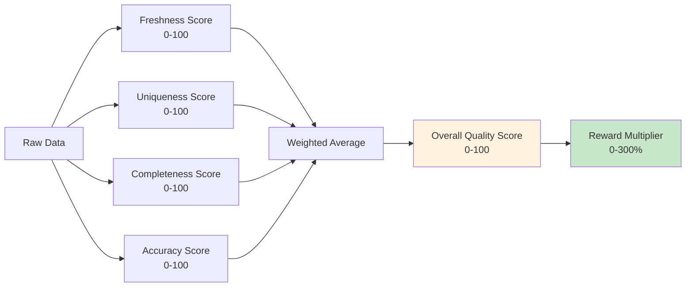

**Epic Reference**: Data Processing & DLP Implementation (#1180)  
**Priority**: P1 - High (Phase 3)  
**Timeline**: 8 weeks (Starting after Staking System)  
**Primary Blockchain**: Vana (all data contribution operations)  
**Architecture**: Reddit data contribution with DLP integration and IPFS storage

## 📦 Smart Contracts Required

### 1. Core Contract: `DataContribution.sol`

**Inheritance Structure:**
```solidity
contract DataContribution is 
    Initializable,
    AccessControlUpgradeable,
    PausableUpgradeable,
    ReentrancyGuardUpgradeable,
    UUPSUpgradeable
```

**Key Features:**
- **Proof Submission**: IPFS hash submission with cryptographic verification
- **Duplicate Prevention**: Hash-based deduplication system
- **Reward Calculation**: Base + quality + size bonus rewards with Kismet multipliers
- **Batch Submissions**: Gas-optimized bulk data submission
- **Contribution Types**: New data vs refresh data tracking
- **Decentralized Validation**: Multi-validator quality consensus
- **Sybil Resistance**: Reddit account verification and staking requirements
- **First-Submitter Bonus**: 100% rewards for first, 10% for duplicates
- **Logarithmic Scaling**: Prevents quantity gaming over quality

**Core Functions:**
```solidity
// Primary submission function
function submitContribution(
    string calldata ipfsHash,
    uint256 dataSize,
    ContributionType contributionType,
    bytes calldata proof
) external whenNotPaused nonReentrant

// Batch submission for gas efficiency
function submitBatchContributions(
    ContributionData[] calldata contributions
) external whenNotPaused nonReentrant

// Calculate rewards based on quality metrics with Kismet integration
function calculateReward(
    uint256 contributionId
) external view returns (uint256 reward) {
    Contribution memory contrib = contributions[contributionId];
    
    // Base reward: 1 RDAT per MB
    uint256 baseReward = (contrib.dataSize * BASE_REWARD_PER_MB) / 1e6;
    
    // Kismet multiplier (1.0x - 1.5x based on reputation)
    uint256 kismetMultiplier = kismetScore.calculateRewardMultiplier(contrib.contributor);
    
    // Quality multiplier (0-300% based on score)
    uint256 qualityMultiplier = (contrib.qualityScore * 3);
    
    // First submitter bonus
    uint256 duplicateMultiplier = contrib.isFirstSubmitter ? 100 : 10;
    
    uint256 totalReward = (baseReward * kismetMultiplier * qualityMultiplier * duplicateMultiplier) / 1000000;
    
    // Logarithmic scaling to prevent gaming
    return _applyLogarithmicScaling(totalReward);
}

// Claim accumulated rewards
function claimRewards(
    uint256[] calldata contributionIds
) external nonReentrant
```

**Data Structures:**
```solidity
struct Contribution {
    address contributor;
    string ipfsHash;
    uint256 dataSize;
    uint256 timestamp;
    ContributionType contributionType;
    QualityScore qualityScore;
    uint256 baseReward;
    uint256 bonusReward;
    bool rewardClaimed;
    bytes32 proofHash;
}

struct QualityScore {
    uint256 freshnessScore;     // 0-100 based on data recency
    uint256 uniquenessScore;    // 0-100 based on novelty
    uint256 completenessScore;  // 0-100 based on data completeness
    uint256 accuracyScore;      // 0-100 based on validation
    uint256 overallScore;       // Weighted average 0-100
}

enum ContributionType {
    NEW_DATA,
    REFRESH_DATA,
    VERIFICATION_DATA
}
```

**Access Control Roles:**
```solidity
bytes32 public constant VALIDATOR_ROLE = keccak256("VALIDATOR_ROLE");
bytes32 public constant REWARD_ADMIN_ROLE = keccak256("REWARD_ADMIN_ROLE");
bytes32 public constant QUALITY_SCORER_ROLE = keccak256("QUALITY_SCORER_ROLE");
```

### 2. Reward Engine: `ContributionRewards.sol`

**Inheritance Structure:**
```solidity
contract ContributionRewards is 
    Initializable,
    AccessControlUpgradeable,
    ReentrancyGuardUpgradeable,
    UUPSUpgradeable
```

**Key Features:**
- **Merit-based Scoring**: Quality-based reward multipliers
- **Anti-Gaming**: Sybil resistance and rate limiting
- **Dynamic Rewards**: Adaptive reward based on demand
- **Treasury Integration**: Connection to RDAT treasury
- **Cooldown Periods**: Anti-spam refresh intervals

**Reward Algorithm:**
```solidity
// Base reward calculation
function calculateBaseReward(uint256 dataSize) internal pure returns (uint256) {
    // Base: 1 RDAT per MB of data
    return (dataSize * BASE_REWARD_PER_MB) / 1e6;
}

// Quality bonus calculation
function calculateQualityBonus(
    QualityScore memory score,
    uint256 baseReward
) internal pure returns (uint256) {
    // Bonus: 0-300% based on quality score
    uint256 multiplier = (score.overallScore * 3) / 100;
    return (baseReward * multiplier) / 100;
}

// Size bonus for large contributions
function calculateSizeBonus(
    uint256 dataSize,
    uint256 baseReward
) internal pure returns (uint256) {
    if (dataSize > LARGE_CONTRIBUTION_THRESHOLD) {
        return baseReward / 10; // 10% bonus for large contributions
    }
    return 0;
}
```

### 3. Quality Scoring: `QualityScorer.sol`

**Inheritance Structure:**
```solidity
contract QualityScorer is 
    Initializable,
    AccessControlUpgradeable,
    UUPSUpgradeable
```

**Scoring Components:**
- **Freshness**: Recency-based scoring with decay functions
- **Uniqueness**: Novelty detection using similarity hashing
- **Completeness**: Data structure and field completeness
- **Accuracy**: Cross-reference validation scoring
- **Community**: Peer review and reputation integration

**Core Functions:**
```solidity
// Main scoring function
function scoreContribution(
    string calldata ipfsHash,
    bytes calldata metadata
) external onlyRole(QUALITY_SCORER_ROLE) returns (QualityScore memory)

// Update quality score post-submission
function updateQualityScore(
    uint256 contributionId,
    QualityScore calldata newScore
) external onlyRole(QUALITY_SCORER_ROLE)

// Batch scoring for efficiency
function batchScoreContributions(
    uint256[] calldata contributionIds
) external onlyRole(QUALITY_SCORER_ROLE)
```

### 4. Privacy Manager: `PrivacyManager.sol`

**Inheritance Structure:**
```solidity
contract PrivacyManager is 
    Initializable,
    AccessControlUpgradeable,
    UUPSUpgradeable
```

**Privacy Features:**
- **GDPR Compliance**: Right to deletion, data portability
- **Consent Management**: Granular permission tracking
- **Data Anonymization**: PII removal and hashing
- **Access Controls**: Role-based data access
- **Audit Trails**: Comprehensive compliance logging

**Core Functions:**
```solidity
// GDPR Article 17 - Right to Deletion
function deleteUserData(
    address user
) external onlyRole(PRIVACY_ADMIN_ROLE)

// Data export for portability
function exportUserData(
    address user
) external view returns (bytes memory)

// Consent management
function updateConsent(
    address user,
    ConsentType consentType,
    bool granted
) external

// Anonymization tracking
function markDataAnonymized(
    uint256 contributionId
) external onlyRole(PRIVACY_ADMIN_ROLE)
```

## 🧪 Testing Strategy

### Unit Tests
1. **DataContribution Contract**
   - Contribution submission validation
   - Duplicate prevention testing
   - Reward calculation accuracy
   - Access control verification
   - Pause/unpause functionality

2. **Reward Engine**
   - Quality bonus calculations
   - Size bonus thresholds
   - Anti-gaming mechanisms
   - Treasury integration
   - Cooldown period enforcement

3. **Quality Scorer**
   - Scoring algorithm accuracy
   - Batch processing efficiency
   - Score update mechanisms
   - Edge case handling

4. **Privacy Manager**
   - GDPR deletion compliance
   - Data export functionality
   - Consent management
   - Access control enforcement

### Integration Tests
1. **End-to-End Contribution Flow**
   - Submit → Score → Reward → Claim
   - Batch submission processing
   - Cross-contract interactions
   - Error recovery scenarios

2. **Reddit Integration**
   - OAuth2 authentication flow
   - Data extraction accuracy
   - Rate limit handling
   - Verification code validation

3. **IPFS Storage**
   - Hash generation and validation
   - Data persistence verification
   - Access control testing
   - Redundancy validation

### Performance Tests
1. **Gas Optimization**
   - Submission cost analysis
   - Batch processing efficiency
   - Storage optimization
   - Function call costs

2. **Load Testing**
   - High-volume submissions
   - Concurrent user handling
   - System bottleneck identification
   - Recovery mechanisms

## 🚀 Deployment Strategy

### Local Development
1. **Mock Contracts**
   - MockRedditAPI for testing
   - MockIPFS for storage simulation
   - Test RDAT token distribution
   - Quality scoring simulation

2. **Development Scripts**
   - `DeployDataContribution.s.sol`
   - `ConfigureRewards.s.sol`
   - `SetupTesting.s.sol`
   - `PopulateTestData.s.sol`

### Testnet Deployment
1. **Base Sepolia** (Migration Testing Only)
   - Deploy migration contracts for testing
   - Mock RDAT token for migration simulation
   - Test cross-chain migration flow
   - Validate migration contract functionality

2. **Vana Moksha** (Full Ecosystem Testing)
   - Deploy all RDAT ecosystem contracts
   - Full data contribution system testing
   - Staking system integration testing
   - Performance validation and security audit preparation

### Mainnet Deployment
1. **Vana Mainnet** (Primary Deployment)
   - Production RDAT ecosystem deployment
   - All smart contracts (Token, Staking, Data Contribution)
   - Multi-sig ownership transfer
   - Treasury and governance setup
   - Monitoring and analytics

2. **Base Mainnet** (Migration Only)
   - Migration contract deployment only
   - Token holder transition facilitation
   - Legacy contract maintenance during migration period
   - No ongoing ecosystem operations

## 🔒 Security & Audit Strategy

### OpenZeppelin Integration
- **Upgradeable Contracts**: UUPS pattern for future improvements
- **Access Control**: Role-based permissions
- **Security**: ReentrancyGuard, Pausable
- **Standards**: ERC20 compliance for reward tokens

### Audit Preparation
1. **Code Review Checklist**
   - Integer overflow/underflow protection
   - Reentrancy attack prevention
   - Access control validation
   - Input validation completeness
   - Gas optimization verification

2. **Security Testing**
   - Fuzz testing with Echidna
   - Slither static analysis
   - Mythril symbolic execution
   - Manual code review
   - Economic attack modeling

3. **Formal Verification**
   - Critical function verification
   - Invariant checking
   - Property-based testing
   - Mathematical proof validation

## 💰 Economic Model

### Reward Budget
- **Source**: 30M RDAT from "Future Rewards" allocation
- **Distribution**: Merit-based with quality multipliers
- **Sustainability**: Dynamic reward adjustment
- **Governance**: Community-controlled parameters

### Anti-Gaming Measures
- **Sybil Resistance**: Reddit account verification
- **Rate Limiting**: Submission frequency controls
- **Quality Thresholds**: Minimum score requirements
- **Penalty System**: Reputation-based deductions
- **Appeal Process**: Community dispute resolution

## 🎯 Success Metrics

### Technical KPIs
- **Data Quality**: >98% average quality score
- **Processing Speed**: <30 second submission to reward
- **Uptime**: 99.9% system availability
- **Gas Efficiency**: <$1 average transaction cost
- **Storage**: <$0.01 per MB storage cost

### Business KPIs
- **Active Contributors**: 1,000 verified users
- **Monthly Volume**: 10TB data processed
- **Reward Distribution**: $100k monthly
- **User Retention**: 70% monthly retention
- **Data Utilization**: 80% of contributed data used

## 📋 Deployment Scripts Required

### 1. `DeployDataContribution.s.sol`
```solidity
// Deploy main contribution system
// Configure initial parameters
// Set up role permissions
// Initialize reward pools
```

### 2. `DeployQualityScoring.s.sol`
```solidity
// Deploy scoring contracts
// Configure scoring algorithms
// Set quality thresholds
// Initialize scoring parameters
```

### 3. `DeployPrivacyManager.s.sol`
```solidity
// Deploy privacy contracts
// Configure GDPR compliance
// Set up consent management
// Initialize anonymization tools
```

### 4. `ConfigureSystem.s.sol`
```solidity
// Cross-contract integration
// Role assignment
// Parameter configuration
// Treasury connections
```

---

# 🏛️ Governance System Specifications

## 🎯 Overview

The RDAT Governance System implements quadratic voting with vRDAT tokens, delegation mechanisms, and timelock security for decentralized protocol governance. **Deployed exclusively on Vana blockchain** as the primary governance layer for the RDAT ecosystem.

## 🗳️ Governance Flow Diagram

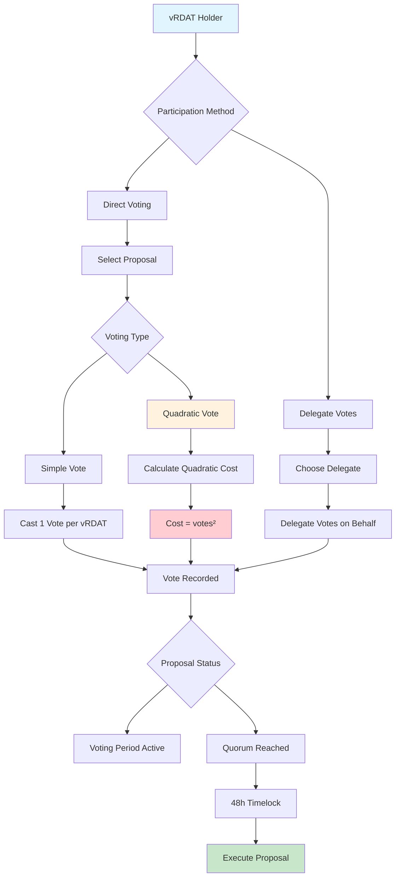

## 📋 Proposal Lifecycle

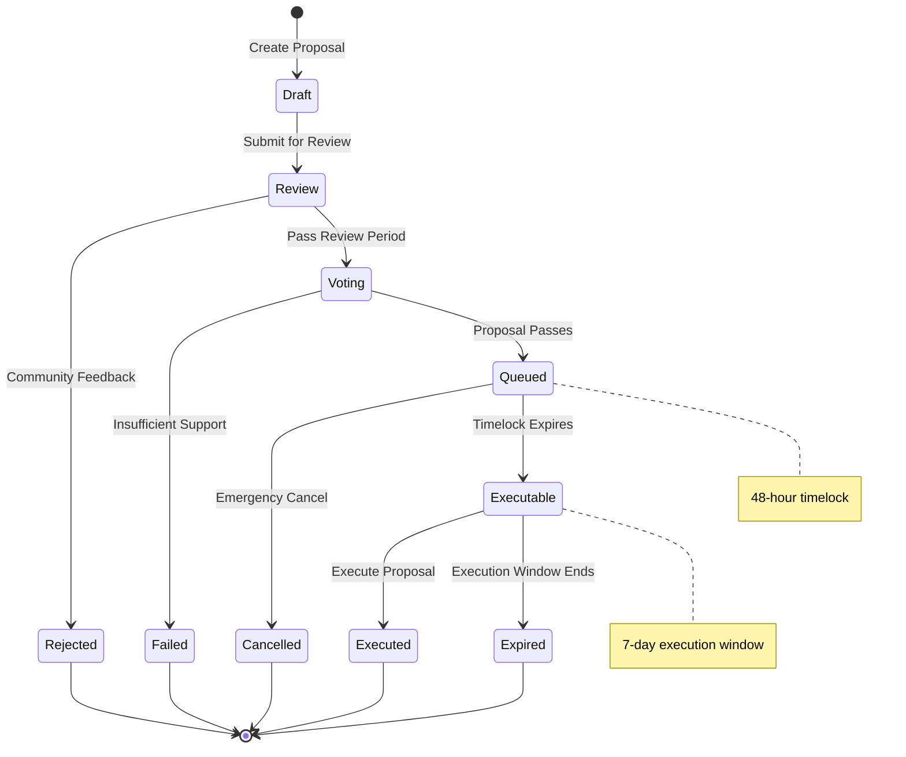

**Epic Reference**: Complete Governance & Delegation Frontend Support (#568)  
**Priority**: P1 - High (Phase 3)  
**Timeline**: 8 weeks (Starting after Staking System)  
**Primary Blockchain**: Vana (all governance operations)  
**Architecture**: Quadratic voting with vRDAT integration and delegation support

## 📦 Smart Contracts Required

### 1. Governance Implementation

**Phase 1 V2 Beta: Off-chain Snapshot**
- **Platform**: Snapshot.org with quadratic counting (√balance = votes)
- **Integration**: vRDAT balances read by Snapshot strategy
- **Execution**: Manual via Gnosis Safe multi-sig
- **Cost**: Zero gas for voting

**Phase 2: Hybrid Governance**
- **Platform**: Snapshot + Reality.eth for on-chain execution
- **Automation**: Approved proposals execute automatically
- **Security**: Timelock delays and multi-sig oversight

**Phase 3: Full On-chain `QuadraticVoting.sol`**
```solidity
contract QuadraticVoting is 
    Initializable,
    AccessControlUpgradeable,
    PausableUpgradeable,
    UUPSUpgradeable,
    IGovernor
```

**V2 Beta Features (Phase 1):**
- **Quadratic Counting**: √vRDAT = votes (via Snapshot)
- **Zero Gas Voting**: All voting happens off-chain
- **Multi-sig Execution**: 3-of-5 Gnosis Safe
- **Simple Proposals**: Parameter changes and treasury allocations

**Full Features (Phase 3):**
- **True Quadratic Voting**: Cost = votes² on-chain
- **Multi-position Support**: Vote with multiple staking positions
- **Gas Optimization**: Batch voting operations
- **Proposal Lifecycle**: Creation, voting, execution, and appeals
- **Soul-Bound Protection**: vRDAT cannot be flash loaned or transferred
- **Proposal Bonds**: 1000 RDAT bond to prevent spam (refundable)
- **Emergency Governance**: 24-hour fast track for security issues
- **Participation Incentives**: Rewards for active governance participation

**Core Functions:**
```solidity
// Quadratic voting implementation
function calculateVoteCost(uint256 votes) public pure returns (uint256) {
    return votes * votes; // n² cost
}

// Cast quadratic vote on proposal with flash loan protection
function castVote(
    uint256 proposalId,
    uint256 numVotes,
    uint8 support
) external flashLoanProtection {
    uint256 cost = calculateVoteCost(numVotes);
    require(vRDAT.balanceOf(msg.sender) >= cost, "Insufficient vRDAT");
    
    vRDAT.burnFrom(msg.sender, cost);
    proposals[proposalId].votes[msg.sender] += numVotes;
    
    emit VoteCast(msg.sender, proposalId, numVotes, support);
}

// Soul-bound protection ensures no flash loans
modifier onlyValidVoter() {
    require(
        block.timestamp > lastStakeTimestamp[msg.sender] + VOTING_DELAY,
        "Recent stake, voting disabled"
    );
    _;
}

// Proposal creation with bond
function propose(
    address[] memory targets,
    uint256[] memory values,
    bytes[] memory calldatas,
    string memory description
) external returns (uint256) {
    // Require proposal bond
    RDAT.transferFrom(msg.sender, address(this), PROPOSAL_BOND);
    
    uint256 proposalId = _createProposal(targets, values, calldatas, description);
    proposalBonds[proposalId] = msg.sender;
    
    return proposalId;
}
    uint256[] calldata voteAmounts
) external pure returns (uint256 totalCost)

// Create new governance proposal
function propose(
    address[] memory targets,
    uint256[] memory values,
    bytes[] memory calldatas,
    string memory description
) external returns (uint256 proposalId)

// Execute passed proposal
function execute(
    address[] memory targets,
    uint256[] memory values,
    bytes[] memory calldatas,
    bytes32 descriptionHash
) external payable returns (uint256 proposalId)
```

**Quadratic Voting Formula:**
```solidity
// Core quadratic cost calculation
function _calculateQuadraticCost(uint256 votes) internal pure returns (uint256) {
    return votes * votes; // votes²
}

// Multi-position cost aggregation
function _calculateTotalCost(
    uint256[] memory voteAmounts
) internal pure returns (uint256) {
    uint256 totalCost = 0;
    for (uint256 i = 0; i < voteAmounts.length; i++) {
        totalCost += _calculateQuadraticCost(voteAmounts[i]);
    }
    return totalCost;
}
```

**Access Control Roles:**
```solidity
bytes32 public constant PROPOSER_ROLE = keccak256("PROPOSER_ROLE");
bytes32 public constant EXECUTOR_ROLE = keccak256("EXECUTOR_ROLE");
bytes32 public constant CANCELLER_ROLE = keccak256("CANCELLER_ROLE");
bytes32 public constant TIMELOCK_ADMIN_ROLE = keccak256("TIMELOCK_ADMIN_ROLE");
```

### 2. Proposal Manager: `ProposalManager.sol`

**Inheritance Structure:**
```solidity
contract ProposalManager is 
    Initializable,
    AccessControlUpgradeable,
    UUPSUpgradeable
```

**Key Features:**
- **Structured Proposals**: Template-based proposal creation
- **Lifecycle Management**: Draft, review, voting, execution phases
- **Impact Assessment**: Automated proposal impact analysis
- **Category System**: Organized proposal types
- **Execution Queue**: Post-vote implementation coordination

**Proposal Types:**
```solidity
enum ProposalType {
    PARAMETER_CHANGE,
    TREASURY_ALLOCATION,
    PROTOCOL_UPGRADE,
    PARTNERSHIP_AGREEMENT,
    COMMUNITY_INITIATIVE
}

struct Proposal {
    uint256 id;
    address proposer;
    string title;
    string description;
    ProposalType proposalType;
    address[] targets;
    uint256[] values;
    bytes[] calldatas;
    uint256 createdAt;
    uint256 votingStart;
    uint256 votingEnd;
    ProposalState state;
    mapping(address => Vote) votes;
    uint256 forVotes;
    uint256 againstVotes;
    uint256 abstainVotes;
}
```

### 3. Delegation System: `VotingDelegation.sol`

**Inheritance Structure:**
```solidity
contract VotingDelegation is 
    Initializable,
    AccessControlUpgradeable,
    UUPSUpgradeable
```

**Key Features:**
- **Flexible Delegation**: Partial or full voting power delegation
- **Delegate Registry**: Verified representative system
- **Override Voting**: Direct voting on specific proposals
- **Delegation History**: Complete audit trail
- **Performance Tracking**: Delegate effectiveness metrics

**Core Functions:**
```solidity
// Delegate voting power to representative
function delegate(
    address delegatee,
    uint256[] calldata positionIds,
    DelegationType delegationType
) external

// Override delegate vote on specific proposal
function voteOverride(
    uint256 proposalId,
    uint256[] calldata positionIds,
    uint8 support
) external

// Revoke delegation
function revokeDelegation(
    address delegatee,
    uint256[] calldata positionIds
) external

// Get effective voting power (including delegations)
function getVotingPower(
    address account,
    uint256 blockNumber
) external view returns (uint256)
```

**Delegation Types:**
```solidity
enum DelegationType {
    FULL_DELEGATION,        // Delegate all voting power
    CATEGORY_DELEGATION,    // Delegate specific proposal types
    THRESHOLD_DELEGATION,   // Delegate only above certain amounts
    SELECTIVE_DELEGATION    // Manual per-proposal delegation
}
```

### 4. Timelock Controller: `GovernanceTimelock.sol`

**Inheritance Structure:**
```solidity
contract GovernanceTimelock is 
    TimelockControllerUpgradeable,
    UUPSUpgradeable
```

**Key Features:**
- **Security Delay**: 48-hour minimum execution delay
- **Multi-signature Support**: Critical operation protection
- **Emergency Functions**: Fast-track for urgent decisions
- **Role-based Access**: Granular permission management
- **Cancellation Rights**: Emergency proposal cancellation

**Security Parameters:**
```solidity
uint256 public constant MIN_DELAY = 48 hours;
uint256 public constant EMERGENCY_DELAY = 6 hours;
uint256 public constant MAX_DELAY = 30 days;

// Emergency proposal types that can use reduced delay
mapping(bytes32 => bool) public emergencyOperations;
```

### 5. Governance Analytics: `GovernanceMetrics.sol`

**Inheritance Structure:**
```solidity
contract GovernanceMetrics is 
    Initializable,
    AccessControlUpgradeable,
    UUPSUpgradeable
```

**Key Features:**
- **Participation Tracking**: Voter turnout and engagement
- **Voting Pattern Analysis**: Behavior analytics
- **Delegate Performance**: Representative effectiveness
- **Quorum Monitoring**: Participation threshold tracking
- **Governance Health**: Decentralization metrics

**Metrics Functions:**
```solidity
// Track proposal participation
function recordVote(
    uint256 proposalId,
    address voter,
    uint256 votingPower,
    uint8 support
) external onlyRole(GOVERNANCE_ROLE)

// Calculate voter participation rate  
function getParticipationRate(
    uint256 proposalId
) external view returns (uint256)

// Get delegate performance metrics
function getDelegateMetrics(
    address delegate
) external view returns (DelegateMetrics memory)

// Calculate governance decentralization index
function getDecentralizationIndex() external view returns (uint256)
```

## 🧪 Testing Strategy

### Unit Tests
1. **QuadraticVoting Contract**
   - Quadratic cost calculation accuracy
   - Multi-position voting validation
   - Proposal lifecycle testing
   - Access control verification
   - Gas optimization validation

2. **Delegation System**
   - Delegation mechanics testing
   - Override voting functionality
   - Delegate registry management
   - Performance tracking accuracy
   - Revocation mechanisms

3. **Proposal Manager**
   - Proposal creation validation
   - Lifecycle state transitions
   - Category system functionality
   - Impact assessment accuracy
   - Execution queue processing

4. **Timelock Controller**
   - Delay mechanism testing
   - Emergency function validation
   - Multi-signature integration
   - Cancellation functionality
   - Role-based access control

### Economic Model Testing
1. **Quadratic Voting Economics**
   - Cost formula validation
   - Anti-plutocracy effectiveness
   - Game theory attack scenarios
   - Vote buying resistance
   - Economic equilibrium analysis

2. **Delegation Economics**
   - Delegation incentive alignment
   - Representative accountability
   - Delegation concentration analysis
   - Economic attack vectors
   - Delegation market dynamics

### Security Testing
1. **Governance Attack Vectors**
   - Vote manipulation attempts
   - Flash loan governance attacks
   - Sybil resistance testing
   - Collusion detection
   - Governance capture scenarios

2. **Smart Contract Security**
   - Reentrancy attack prevention
   - Integer overflow protection
   - Access control validation
   - Upgrade mechanism security
   - Emergency pause functionality

### Integration Tests
1. **vRDAT Integration**
   - Staking position voting power
   - Multi-position vote aggregation
   - Delegation power calculation
   - Vote weight accuracy
   - Cross-contract interaction

2. **Frontend Integration**
   - Voting interface functionality
   - Delegation dashboard accuracy
   - Proposal creation flow
   - Real-time vote tracking
   - Mobile responsiveness

## 🚀 Deployment Strategy

### Local Development
1. **Mock Contracts**
   - MockvRDAT for testing
   - MockStaking for position simulation
   - Test governance scenarios
   - Economic model validation

2. **Development Scripts**
   - `DeployGovernance.s.sol`
   - `ConfigureVoting.s.sol`
   - `SetupDelegation.s.sol`
   - `PopulateTestProposals.s.sol`

### Testnet Deployment
1. **Vana Moksha** (Full Governance Testing)
   - Deploy complete governance system
   - Integration with testnet vRDAT
   - Full proposal lifecycle testing
   - Delegation system validation
   - Security audit preparation

### Mainnet Deployment
1. **Vana Mainnet** (Production Governance)
   - Production governance system deployment
   - Integration with live vRDAT tokens
   - Multi-sig timelock configuration
   - Monitoring and analytics setup
   - Community governance activation

## 🔒 Security & Audit Strategy

### OpenZeppelin Integration
- **Governor Framework**: Standard governance contract base
- **TimelockController**: Secure execution delays
- **AccessControl**: Role-based permissions
- **Upgradeable Contracts**: UUPS pattern for improvements
- **Security Utils**: ReentrancyGuard, Pausable

### Audit Preparation
1. **Mathematical Verification**
   - Quadratic voting formula correctness
   - Economic model mathematical proofs
   - Game theory analysis
   - Incentive alignment verification
   - Attack vector mathematical modeling

2. **Security Testing**
   - Formal verification of critical functions
   - Economic attack simulation
   - Governance capture analysis
   - Flash loan attack prevention
   - Multi-signature security validation

3. **Code Review Checklist**
   - Governance attack prevention
   - Delegation security validation
   - Timelock mechanism integrity
   - Access control completeness
   - Upgrade path security

## 💰 Economic Model

### Voting Power Calculation
- **Base Power**: Derived from vRDAT token balance
- **Position Multiplier**: Staking position lock period bonus
- **Delegation Aggregation**: Combined delegated voting power
- **Quadratic Cost**: Prevents vote concentration

### Governance Incentives
- **Participation Rewards**: Incentivize active voting
- **Delegate Rewards**: Compensation for representatives
- **Proposal Rewards**: Successful proposal bonuses
- **Long-term Alignment**: Increased power with longer stakes

### Anti-Gaming Measures
- **Quadratic Cost Scaling**: Exponentially expensive vote concentration
- **Sybil Resistance**: vRDAT requirement for participation
- **Flash Loan Protection**: Block-based voting power snapshots
- **Delegation Limits**: Maximum delegation concentration
- **Cooldown Periods**: Prevent rapid vote manipulation

## 🎯 Success Metrics

### Participation Metrics
- **Voter Turnout**: 30% of vRDAT holders actively voting
- **Proposal Success**: 70% of proposals reaching quorum
- **Delegation Rate**: 50% of voting power delegated
- **Voter Retention**: 60% monthly active voters
- **Geographic Distribution**: Global participation

### Governance Health
- **Decentralization Index**: >0.8 (scale 0-1)
- **Voting Power Concentration**: <20% by top 10 holders
- **Delegate Performance**: >80% alignment with delegators
- **Proposal Quality**: >90% well-formed proposals
- **Execution Success**: >95% approved proposals executed

### Technical Performance
- **Gas Efficiency**: <500k gas per vote transaction
- **Response Time**: <2 second UI response
- **Uptime**: 99.9% system availability
- **Security**: Zero critical vulnerabilities
- **Scalability**: Support 10,000+ concurrent voters

## 📋 Deployment Scripts Required

### 1. `DeployGovernance.s.sol`
```solidity
// Deploy complete governance system
// Configure quadratic voting parameters
// Set up proposal management
// Initialize timelock controller
```

### 2. `DeployDelegation.s.sol`
```solidity
// Deploy delegation contracts
// Configure delegate registry
// Set up delegation mechanics
// Initialize performance tracking
```

### 3. `ConfigureGovernance.s.sol`
```solidity
// Cross-contract integration
// Role assignment and permissions
// Parameter configuration
// Security settings
```

### 4. `SetupTimelock.s.sol`
```solidity
// Deploy timelock controller
// Configure execution delays
// Set up multi-signature integration
// Initialize emergency functions
```

---

# 💰 Token Distribution & Allocation System Specifications

## 🎯 Overview

The RDAT Token Distribution & Allocation System implements DAO-governed token distribution of the pre-minted 100M RDAT supply through automated vesting schedules and comprehensive allocation tracking. **Deployed exclusively on Vana blockchain** as part of the complete RDAT tokenomics framework with fixed supply guarantees.

**Epic Reference**: DAO-Governed Token Distribution & Allocation System  
**Priority**: P1 - High (Phase 1)  
**Timeline**: Deployed at token launch  
**Primary Blockchain**: Vana (all distribution and allocation operations)  
**Architecture**: Fixed supply distribution with vesting, allocation tracking, and claim mechanisms

## 📦 Smart Contracts Required

### 1. Core Contract: `TreasuryWallet.sol`

**Inheritance Structure:**
```solidity
contract TreasuryWallet is 
    Initializable,
    AccessControlUpgradeable,
    ReentrancyGuardUpgradeable,
    UUPSUpgradeable
```

**Key Features:**
- **Fixed Supply Management**: Receives 70M RDAT at token deployment
- **DAO Integration**: Governance-controlled distribution through proposal execution
- **Vesting Schedules**: Automated vesting with cliffs and linear release
- **Phase-Gated Releases**: Future Rewards locked until Phase 3 activation
- **Distribution Tracking**: Complete on-chain history of all distributions

**Core Functions:**
```solidity
// Process time-based vesting releases
function checkAndRelease() external nonReentrant

// Distribute tokens with reason tracking
function distribute(
    address recipient, 
    uint256 amount, 
    string calldata reason
) external onlyRole(DISTRIBUTOR_ROLE) nonReentrant

// Activate Phase 3 to unlock Future Rewards
function setPhase3Active() external onlyRole(DEFAULT_ADMIN_ROLE)

// Execute DAO-approved proposals
function executeDAOProposal(
    uint256 proposalId,
    address[] calldata targets,
    uint256[] calldata values,
    bytes[] calldata calldatas
) external onlyRole(DAO_ROLE) nonReentrant

// Get vesting information for allocation
function getVestingInfo(bytes32 allocation) external view 
    returns (uint256 total, uint256 released, uint256 available, bool isActive)
```

**Initial Token Distribution:**
```solidity
// At RDAT deployment, 100M tokens are minted and distributed:
// - 70M to TreasuryWallet (managed by this contract)
// - 30M to MigrationBridge (for V1 holder migration)

// TreasuryWallet manages these allocations per DAO vote:
bytes32 public constant FUTURE_REWARDS = keccak256("FUTURE_REWARDS");        // 30M - Phase 3 gated
bytes32 public constant TREASURY_ECOSYSTEM = keccak256("TREASURY_ECOSYSTEM"); // 25M - 10% TGE, vesting
bytes32 public constant LIQUIDITY_STAKING = keccak256("LIQUIDITY_STAKING");   // 15M - 33% TGE

struct VestingSchedule {
    uint256 total;              // Total allocation
    uint256 released;           // Amount already released
    uint256 tgeUnlock;          // Amount unlocked at TGE
    uint256 cliffDuration;      // Cliff period in seconds
    uint256 vestingDuration;    // Total vesting duration after cliff
    uint256 vestingStart;       // Timestamp when vesting starts
    uint256 lastRelease;        // Last release timestamp
    bool isPhase3Gated;         // Whether this requires Phase 3
    bool initialized;           // Whether schedule is set up
}

mapping(bytes32 => VestingSchedule) public vestingSchedules;
```

**Access Control Roles:**
```solidity
bytes32 public constant DISTRIBUTOR_ROLE = keccak256("DISTRIBUTOR_ROLE");
bytes32 public constant DAO_ROLE = keccak256("DAO_ROLE");
bytes32 public constant UPGRADER_ROLE = keccak256("UPGRADER_ROLE");
// DEFAULT_ADMIN_ROLE from AccessControl for admin functions
```

### 2. Team Vesting System: `TokenVesting.sol`

**Inheritance Structure:**
```solidity
contract TokenVesting is 
    Initializable,
    AccessControlUpgradeable,
    ReentrancyGuardUpgradeable,
    UUPSUpgradeable
```

**Key Features:**
- **Team Vesting**: 6-month cliff with linear vesting (Vana DLP compliance)
- **Flexible Start Date**: Admin can set vesting start when DLP becomes eligible for rewards
- **Individual Schedules**: Create vesting schedules for each team member
- **On-chain Proof**: Clear audit trail for Vana compliance verification
- **Batch Claims**: Gas-optimized claim processing

**Core Functions:**
```solidity
// Set the vesting start date (when DLP becomes eligible for rewards)
function setVestingStartDate(
    uint256 startDate
) external onlyRole(DEFAULT_ADMIN_ROLE)

// Create team member vesting schedule (6-month cliff + vesting)
function createTeamVesting(
    address beneficiary,
    uint256 totalAmount
) external onlyRole(VESTING_ADMIN_ROLE) returns (uint256 scheduleId)

// Claim vested tokens
function claimVestedTokens() external nonReentrant returns (uint256 claimedAmount)

// Calculate vested amount for beneficiary
function calculateVestedAmount(
    address beneficiary
) external view returns (uint256 vestedAmount)

// Get vesting details for Vana compliance audit
function getVestingSchedule(
    address beneficiary
) external view returns (VestingSchedule memory)
```

**Vesting Structure:**
```solidity
struct VestingSchedule {
    address beneficiary;
    uint256 totalAmount;
    uint256 claimedAmount;
    uint256 vestingStart;      // Set by admin when DLP eligible
    uint256 cliffDuration;      // 6 months per Vana requirement
    uint256 vestingDuration;    // Total vesting period after cliff
    bool initialized;
    bool revoked;
}

// Constants per Vana DLP requirements
uint256 public constant TEAM_CLIFF = 180 days;        // 6-month cliff
uint256 public constant TEAM_VESTING = 540 days;      // 18-month vesting after cliff
uint256 public constant MAX_TEAM_ALLOCATION = 10_000_000e18; // 10M RDAT cap
```

### 3. Distribution Tracker: `AllocationTracker.sol`

**Inheritance Structure:**
```solidity
contract AllocationTracker is 
    Initializable,
    AccessControlUpgradeable,
    UUPSUpgradeable
```

**Key Features:**
- **Distribution Tracking**: Track all distributions from TreasuryWallet
- **Category Management**: Future Rewards, Treasury/Ecosystem, Liquidity/Staking
- **Real-time Monitoring**: Live tracking of distributed vs remaining tokens
- **Audit Trail**: Complete distribution history for transparency
- **Analytics Integration**: Data feeds for dashboards and reporting

**Core Functions:**
```solidity
// Record distribution from TreasuryWallet
function recordDistribution(
    bytes32 category,
    address recipient,
    uint256 amount,
    string calldata reason
) external onlyRole(TRACKER_ROLE)

// Get distribution summary for category
function getDistributionSummary(
    bytes32 category
) external view returns (DistributionSummary memory)

// Get recipient history
function getRecipientHistory(
    address recipient
) external view returns (Distribution[] memory)

// Generate distribution report
function generateDistributionReport(
    uint256 fromTimestamp,
    uint256 toTimestamp
) external view returns (DistributionReport memory)
```

**Distribution Types:**
```solidity
struct Distribution {
    bytes32 category;
    address recipient;
    uint256 amount;
    uint256 timestamp;
    string reason;
}

struct DistributionSummary {
    uint256 totalAllocated;      // Initial allocation for category
    uint256 totalDistributed;    // Amount distributed so far
    uint256 totalPending;        // Vesting amount pending release
    uint256 remainingBalance;    // Available for distribution
    uint256 distributionCount;   // Number of distributions
}
```


## 🧪 Testing Strategy

### Unit Tests
1. **TreasuryWallet Contract**
   - Vesting schedule calculations
   - Phase 3 activation logic
   - Distribution authorization
   - DAO proposal execution
   - Access control verification

2. **TokenVesting System**
   - Vesting calculation accuracy (6-month cliff)
   - Settable start date functionality
   - Claim calculations after cliff
   - Vana compliance verification
   - Team allocation cap enforcement

3. **AllocationTracker**
   - Distribution recording accuracy
   - Category balance tracking
   - Audit trail completeness
   - Report generation accuracy
   - Integration with TreasuryWallet

### Economic Model Testing
1. **Fixed Supply Validation**
   - Verify 100M total supply cap
   - No minting after deployment
   - Distribution accuracy from fixed pools
   - Vesting schedule calculations
   - Market impact assessment

2. **Distribution Testing**
   - Category allocation accuracy (30M/25M/15M)
   - TGE unlock verification
   - Vesting timeline validation
   - Phase 3 activation testing
   - Team allocation cap (10M)

### Security Testing
1. **Distribution Security**
   - Unauthorized distribution prevention
   - Fixed supply enforcement (no minting)
   - Phase 3 gate verification
   - Access control validation
   - Multi-signature integration

2. **Vesting Security**
   - Early claim prevention
   - Start date manipulation attempts
   - Beneficiary authorization
   - Schedule integrity protection
   - Vana compliance verification

### Integration Tests
1. **Governance Integration**
   - Proposal-to-execution flow
   - Timelock mechanism validation
   - Multi-signature coordination
   - Vote verification accuracy
   - Emergency override functionality

2. **Cross-System Integration**
   - Staking reward integration
   - Data contribution reward integration
   - Treasury allocation coordination
   - Analytics data integration
   - Frontend integration validation

## 🚀 Deployment Strategy

### Local Development
1. **Mock Contracts**
   - MockGovernance for testing
   - MockRDAT token for allocation testing
   - Test allocation scenarios
   - Vesting simulation
   - Economic model validation

2. **Development Scripts**
   - `DeployTreasuryWallet.s.sol`
   - `DeployTokenVesting.s.sol`
   - `DeployAllocationTracker.s.sol`
   - `SetupDistributions.s.sol`

### Testnet Deployment
1. **Vana Moksha** (Full System Testing)
   - Deploy complete distribution system
   - TreasuryWallet with 70M RDAT
   - Vesting schedule configuration
   - Team token vesting setup
   - Security audit preparation

### Mainnet Deployment
1. **Vana Mainnet** (Production Distribution)
   - Production distribution system
   - Integration with governance
   - Multi-sig configuration
   - Monitoring and analytics
   - TGE distribution execution

## 🔒 Security & Audit Strategy

### OpenZeppelin Integration
- **AccessControl**: Role-based permissions
- **Upgradeable Contracts**: UUPS pattern for improvements
- **Security Utils**: ReentrancyGuard, Pausable
- **VestingWallet**: Proven vesting contract patterns
- **Timelock**: Governance execution delays

### Audit Preparation
1. **Economic Model Verification**
   - Tokenomics mathematical proofs
   - Allocation distribution correctness
   - Vesting formula validation
   - Inflation impact modeling
   - Economic attack vector analysis

2. **Security Testing**
   - Formal verification of critical functions
   - Multi-signature integration testing
   - Emergency control validation
   - Governance integration security
   - Cross-contract interaction security

3. **Code Review Checklist**
   - Unauthorized minting prevention
   - Allocation limit enforcement
   - Vesting calculation accuracy
   - Access control completeness
   - Emergency procedure validation

## 💰 Economic Model

### Fixed Supply Distribution (100M RDAT Total)
**Initial Distribution at Deployment:**
- **TreasuryWallet**: 70M RDAT (70%) - Managed allocations
- **MigrationBridge**: 30M RDAT (30%) - V1 holder migration

**TreasuryWallet Allocations (per DAO vote):**
- **Future Rewards**: 30M RDAT - Phase 3 locked (staking, data contributions)
- **Treasury & Ecosystem**: 25M RDAT - 10% TGE, 6mo cliff, 18mo vesting
  - Includes 10M RDAT reserved for team vesting
- **Liquidity & Staking**: 15M RDAT - 33% TGE for DEX liquidity

### Vesting Schedules
- **Team Vesting**: 6-month cliff from DLP eligibility date (Vana requirement)
- **Treasury/Ecosystem**: 10% at TGE, 6-month cliff, then 5% monthly
- **Future Rewards**: Locked until Phase 3 activation
- **Liquidity**: 33% at TGE, remainder for staking incentives

### Distribution Controls
- **Fixed Supply**: No minting after deployment (mint() always reverts)
- **DAO Governance**: All distributions require approval
- **Multi-signature**: Treasury operations need multi-sig
- **Phase Gates**: Future Rewards locked until Phase 3
- **On-chain Tracking**: Complete audit trail

## 🎯 Success Metrics

### Operational Metrics
- **Distribution Accuracy**: 100% accurate distribution tracking
- **Vesting Automation**: 95% of vesting releases processed automatically
- **Governance Integration**: 100% of distributions governed by DAO
- **Gas Efficiency**: <150k gas per distribution operation
- **Uptime**: 99.9% system availability

### Business Metrics
- **User Satisfaction**: 90% positive feedback on distribution experience
- **Operational Efficiency**: 80% reduction in manual distribution overhead
- **Compliance**: 100% audit trail completeness
- **Security**: Zero critical vulnerabilities
- **Migration Success**: Complete migration of V1 RDAT holders

### Economic Metrics
- **Fixed Supply**: 100M RDAT cap maintained forever
- **Distribution Transparency**: All allocations on-chain
- **Vesting Compliance**: 100% Vana DLP compliance for team tokens
- **Treasury Management**: Efficient fund distribution
- **Market Stability**: Controlled token release via vesting

## 📋 Deployment Scripts Required

### 1. `DeployDistributionSystem.s.sol`
```solidity
// Deploy TreasuryWallet to receive 70M RDAT
// Configure vesting schedules per DAO vote
// Set up Phase 3 gate for Future Rewards
// Initialize distribution roles
```

### 2. `DeployTeamVesting.s.sol`
```solidity
// Deploy TokenVesting contract for team tokens
// Configure 6-month cliff + vesting
// Set up admin-controlled start date
// Initialize Vana compliance tracking
```

### 3. `ConfigureDistributions.s.sol`
```solidity
// Process TGE distributions (liquidity, treasury)
// Set up distribution tracking
// Configure analytics integration
// Initialize reporting systems
```

### 4. `SetupGovernanceIntegration.s.sol`
```solidity
// Connect TreasuryWallet to governance
// Configure DAO proposal execution
// Set up multi-signature roles
// Initialize emergency controls
```

---

# 🗳️ vRDAT Distribution System Specifications

## 🎯 Overview

The vRDAT Distribution System implements soul-bound (non-transferable) governance tokens distributed based on staking participation with time-weighted loyalty rewards. **Deployed exclusively on Vana blockchain** as the voting power layer for the RDAT governance ecosystem.

**Epic Reference**: Non-Transferable Voting Token Distribution System (#1183)  
**Priority**: P1 - High (Phase 3)  
**Timeline**: 4 weeks (Starting after Staking System)  
**Primary Blockchain**: Vana (all vRDAT operations)  
**Architecture**: Soul-bound voting tokens with staking-based distribution and governance integration

## 📦 Smart Contracts Required

### 1. Core Contract: `vRDAT.sol` (Enhanced)

**Inheritance Structure:**
```solidity
contract vRDAT is 
    Initializable,
    ERC20Upgradeable,
    ERC20VotesUpgradeable,
    ERC20PermitUpgradeable,
    AccessControlUpgradeable,
    UUPSUpgradeable
```

**Key Features:**
- **Soul-Bound Implementation**: Non-transferable tokens preventing vote buying
- **Voting Power Integration**: ERC20Votes for governance participation
- **Staking-Based Minting**: Automatic distribution based on staking positions
- **Time-Weighted Rewards**: Loyalty multipliers for long-term stakers
- **Snapshot Support**: Historical balance queries for governance

**Transfer Override (Soul-Bound):**
```solidity
// Override transfer functions to prevent movement
function _beforeTokenTransfer(
    address from,
    address to,
    uint256 amount
) internal override {
    super._beforeTokenTransfer(from, to, amount);
    
    // Allow minting (from == address(0)) and burning (to == address(0))
    if (from == address(0) || to == address(0)) {
        return;
    }
    
    // Block all transfers between addresses
    revert("vRDAT: non-transferable token");
}

// Allow staking contract to manage vRDAT for governance
function _isTransferAllowed(address from, address to) internal view returns (bool) {
    return hasRole(TRANSFER_ROLE, from) || hasRole(TRANSFER_ROLE, to);
}
```

**Distribution Formula:**
```solidity
// Calculate vRDAT amount based on staking
function calculatevRDATAmount(
    uint256 stakedAmount,
    uint256 stakingDuration,
    uint256 lockPeriod
) public pure returns (uint256) {
    // Base amount: 1 vRDAT per 1 RDAT staked
    uint256 baseAmount = stakedAmount;
    
    // Time multiplier: bonus for longer staking
    uint256 timeMultiplier = _calculateTimeMultiplier(stakingDuration);
    
    // Lock period multiplier: matches staking multipliers
    uint256 lockMultiplier = _getLockPeriodMultiplier(lockPeriod);
    
    // Final calculation: base × time × lock multipliers
    return (baseAmount * timeMultiplier * lockMultiplier) / (10000 * 10000);
}

function _calculateTimeMultiplier(uint256 duration) internal pure returns (uint256) {
    // Linear increase: 10% bonus per month, capped at 100%
    uint256 months = duration / 30 days;
    uint256 bonus = months * 1000; // 10% = 1000 basis points
    return 10000 + (bonus > 10000 ? 10000 : bonus); // Cap at 100% bonus
}
```

**Access Control Roles:**
```solidity
bytes32 public constant MINTER_ROLE = keccak256("MINTER_ROLE");
bytes32 public constant BURNER_ROLE = keccak256("BURNER_ROLE");
bytes32 public constant DISTRIBUTOR_ROLE = keccak256("DISTRIBUTOR_ROLE");
bytes32 public constant TRANSFER_ROLE = keccak256("TRANSFER_ROLE");
```

### 2. Distribution Manager: `vRDATDistributor.sol`

**Inheritance Structure:**
```solidity
contract vRDATDistributor is 
    Initializable,
    AccessControlUpgradeable,
    ReentrancyGuardUpgradeable,
    UUPSUpgradeable
```

**Key Features:**
- **Staking Integration**: Automatic vRDAT distribution when users stake
- **Batch Distribution**: Gas-efficient batch processing
- **Distribution Caps**: Per-address and total supply limits
- **Loyalty Tracking**: Time-based multiplier calculation
- **Event Emission**: Comprehensive logging for analytics

**Core Functions:**
```solidity
// Distribute vRDAT based on new staking position
function distributeForStaking(
    address staker,
    uint256 stakedAmount,
    uint256 lockPeriod,
    uint256 positionId
) external onlyRole(STAKING_MANAGER_ROLE) nonReentrant {
    require(stakedAmount > 0, "Invalid staked amount");
    
    // Calculate vRDAT amount
    uint256 vrdatAmount = calculatevRDATAmount(
        stakedAmount,
        block.timestamp - stakingStartTime[staker],
        lockPeriod
    );
    
    // Apply distribution caps
    require(
        distributedAmounts[staker] + vrdatAmount <= MAX_PER_ADDRESS,
        "Exceeds per-address cap"
    );
    
    // Mint vRDAT tokens
    vRDAT.mint(staker, vrdatAmount);
    
    // Update tracking
    distributedAmounts[staker] += vrdatAmount;
    positionDistributions[positionId] = vrdatAmount;
    
    emit vRDATDistributed(staker, vrdatAmount, positionId);
}

// Handle unstaking - decide whether to burn or retain vRDAT
function handleUnstaking(
    address staker,
    uint256 positionId,
    bool earlyExit
) external onlyRole(STAKING_MANAGER_ROLE) {
    uint256 vrdatAmount = positionDistributions[positionId];
    
    if (earlyExit && BURN_ON_EARLY_EXIT) {
        // Burn vRDAT for early unstaking
        vRDAT.burn(staker, vrdatAmount);
        emit vRDATBurned(staker, vrdatAmount, positionId);
    }
    
    // Clean up tracking
    delete positionDistributions[positionId];
}

// Batch distribute for multiple stakers
function batchDistribute(
    DistributionData[] calldata distributions
) external onlyRole(DISTRIBUTOR_ROLE) nonReentrant {
    for (uint256 i = 0; i < distributions.length; i++) {
        _distributevRDAT(distributions[i]);
    }
}
```

**Distribution Caps & Limits:**
```solidity
// Distribution limits to prevent gaming
uint256 public constant MAX_PER_ADDRESS = 10_000_000e18; // 10M vRDAT max per address
uint256 public constant MAX_TOTAL_SUPPLY = 1_000_000_000e18; // 1B vRDAT max supply
uint256 public constant MIN_STAKING_DURATION = 7 days; // Minimum for vRDAT eligibility

// Time-based distribution tracking
mapping(address => uint256) public stakingStartTime;
mapping(address => uint256) public distributedAmounts;
mapping(uint256 => uint256) public positionDistributions; // positionId => vRDAT amount
```

### 3. Governance Integration: `vRDATGovernance.sol`

**Inheritance Structure:**
```solidity
contract vRDATGovernance is 
    Initializable,
    AccessControlUpgradeable,
    UUPSUpgradeable
```

**Key Features:**
- **Voting Power Calculation**: Real-time voting power from vRDAT balance
- **Quadratic Integration**: Support for quadratic voting mechanics
- **Delegation Support**: Vote delegation without token transfer
- **Multi-position Voting**: Separate voting with different staking positions
- **Snapshot Integration**: Historical voting power queries

**Core Functions:**
```solidity
// Get current voting power for address
function getVotingPower(address account) external view returns (uint256) {
    return vRDAT.getVotes(account);
}

// Get historical voting power at specific block
function getVotingPowerAt(
    address account,
    uint256 blockNumber
) external view returns (uint256) {
    return vRDAT.getPastVotes(account, blockNumber);
}

// Calculate quadratic voting cost
function calculateQuadraticCost(
    address voter,
    uint256 votesToCast
) external view returns (uint256) {
    uint256 votingPower = getVotingPower(voter);
    require(votesToCast <= votingPower, "Insufficient voting power");
    
    // Quadratic cost: votes²
    return votesToCast * votesToCast;
}

// Delegate voting power (without transferring tokens)
function delegateVotes(address delegatee) external {
    vRDAT.delegate(delegatee);
    emit VotesDelegated(msg.sender, delegatee);
}

// Get effective voting power including delegations
function getEffectiveVotingPower(address account) external view returns (uint256) {
    return vRDAT.getVotes(account); // Includes delegated power
}
```

### 4. Anti-Gaming System: `vRDATSecurity.sol`

**Inheritance Structure:**
```solidity
contract vRDATSecurity is 
    Initializable,
    AccessControlUpgradeable,
    UUPSUpgradeable
```

**Key Features:**
- **Sybil Resistance**: Identity-based distribution limits
- **Gaming Detection**: Unusual staking pattern monitoring
- **Rate Limiting**: Distribution frequency controls
- **Circuit Breakers**: Automatic protection mechanisms
- **Penalty Systems**: Penalties for detected gaming

**Core Functions:**
```solidity
// Check if distribution is allowed (anti-gaming)
function isDistributionAllowed(
    address staker,
    uint256 amount
) external view returns (bool, string memory reason) {
    // Check daily limits
    if (dailyDistributions[staker][today()] + amount > DAILY_LIMIT) {
        return (false, "Daily limit exceeded");
    }
    
    // Check for suspicious patterns
    if (_isSuspiciousPattern(staker)) {
        return (false, "Suspicious activity detected");
    }
    
    // Check global rate limits
    if (totalDailyDistributions[today()] + amount > GLOBAL_DAILY_LIMIT) {
        return (false, "Global daily limit exceeded");
    }
    
    return (true, "");
}

// Detect gaming patterns
function _isSuspiciousPattern(address staker) internal view returns (bool) {
    // Check for rapid stake/unstake cycles
    uint256 recentTransactions = stakingTransactionCount[staker][today()];
    if (recentTransactions > SUSPICIOUS_TRANSACTION_THRESHOLD) {
        return true;
    }
    
    // Check for coordinated behavior with other addresses
    if (_isCoordinatedBehavior(staker)) {
        return true;
    }
    
    return false;
}

// Emergency pause distribution
function emergencyPause() external onlyRole(EMERGENCY_ROLE) {
    _pause();
    emit EmergencyPaused(msg.sender);
}
```

### 5. Analytics & Metrics: `vRDATAnalytics.sol`

**Inheritance Structure:**
```solidity
contract vRDATAnalytics is 
    Initializable,
    AccessControlUpgradeable,
    UUPSUpgradeable
```

**Key Features:**
- **Distribution Tracking**: Real-time distribution monitoring
- **Voting Power Analysis**: Concentration and distribution metrics
- **Participation Metrics**: Governance engagement tracking
- **Staking Correlation**: Staking-to-vRDAT relationship analysis
- **Gaming Detection**: Suspicious activity monitoring

**Core Functions:**
```solidity
// Get distribution statistics
function getDistributionStats() external view returns (DistributionStats memory) {
    return DistributionStats({
        totalDistributed: vRDAT.totalSupply(),
        uniqueHolders: holderCount,
        averageBalance: vRDAT.totalSupply() / holderCount,
        concentrationIndex: _calculateConcentrationIndex(),
        dailyDistribution: totalDailyDistributions[today()]
    });
}

// Calculate voting power concentration (Gini coefficient)
function _calculateConcentrationIndex() internal view returns (uint256) {
    // Implementation of Gini coefficient for voting power distribution
    // Returns value from 0 (perfect equality) to 10000 (maximum concentration)
}

// Track governance participation
function recordVote(
    address voter,
    uint256 proposalId,
    uint256 votingPower
) external onlyRole(GOVERNANCE_ROLE) {
    participationHistory[voter].push(ParticipationRecord({
        proposalId: proposalId,
        votingPower: votingPower,
        timestamp: block.timestamp
    }));
    
    emit GovernanceParticipation(voter, proposalId, votingPower);
}
```

## 🧪 Testing Strategy

### Unit Tests
1. **vRDAT Token Contract**
   - Non-transferability enforcement
   - Minting and burning functionality
   - Voting power delegation
   - Snapshot functionality
   - Access control verification

2. **Distribution Manager**
   - Staking-based distribution accuracy
   - Time-weighted multiplier calculation
   - Distribution cap enforcement
   - Batch processing efficiency
   - Anti-gaming mechanism validation

3. **Governance Integration**
   - Voting power calculation accuracy
   - Quadratic cost calculation
   - Delegation mechanics
   - Historical balance queries
   - Multi-position voting support

4. **Security Systems**
   - Gaming pattern detection
   - Rate limiting enforcement
   - Emergency pause functionality
   - Sybil resistance validation
   - Circuit breaker activation

### Economic Model Testing
1. **Distribution Economics**
   - Fair distribution formula validation
   - Time-based multiplier effectiveness
   - Long-term staking incentive analysis
   - Voting power concentration prevention
   - Economic attack scenario modeling

2. **Governance Impact**
   - Voting power distribution fairness
   - Quadratic voting effectiveness
   - Delegation behavior analysis
   - Participation incentive validation
   - Democratic representation testing

### Security Testing
1. **Gaming Resistance**
   - Sybil attack prevention
   - Vote buying resistance (non-transferability)
   - Coordinated gaming detection
   - Flash loan attack prevention
   - Identity spoofing prevention

2. **Smart Contract Security**
   - Transfer function override security
   - Access control validation
   - Emergency function security
   - Upgrade mechanism protection
   - Integration security validation

### Integration Tests
1. **Staking System Integration**
   - Automatic vRDAT distribution
   - Position-based calculation
   - Unstaking behavior validation
   - Multi-pool integration
   - Reward synchronization

2. **Governance System Integration**
   - Voting power integration
   - Proposal participation
   - Delegation functionality
   - Quorum calculation
   - Historical vote tracking

## 🚀 Deployment Strategy

### Local Development
1. **Mock Contracts**
   - MockStaking for distribution testing
   - MockGovernance for voting integration
   - Test distribution scenarios
   - Gaming attempt simulation
   - Economic model validation

2. **Development Scripts**
   - `DeployvRDAT.s.sol`
   - `ConfigureDistribution.s.sol`
   - `SetupGovernanceIntegration.s.sol`
   - `PopulateTestData.s.sol`

### Testnet Deployment
1. **Vana Moksha** (Full System Testing)
   - Deploy complete vRDAT system
   - Integration with testnet staking
   - Governance integration testing
   - Anti-gaming system validation
   - Security audit preparation

### Mainnet Deployment
1. **Vana Mainnet** (Production vRDAT)
   - Production vRDAT system deployment
   - Integration with live staking system
   - Governance system activation
   - Security monitoring setup
   - Community distribution launch

## 🔒 Security & Audit Strategy

### OpenZeppelin Integration
- **ERC20Votes**: Proven governance token patterns
- **AccessControl**: Role-based permissions
- **Upgradeable Contracts**: UUPS pattern for improvements
- **Security Utils**: ReentrancyGuard, Pausable
- **ERC20Permit**: Gasless approvals for enhanced UX

### Audit Preparation
1. **Non-Transferability Verification**
   - Transfer function override correctness
   - Soul-bound implementation security
   - Vote buying prevention validation
   - Delegation without transfer verification
   - Emergency transfer prevention

2. **Distribution Accuracy**
   - Mathematical formula verification
   - Time-weighted calculation accuracy
   - Distribution cap enforcement
   - Gaming resistance validation
   - Economic model integrity

3. **Code Review Checklist**
   - Transfer prevention completeness
   - Access control validation
   - Distribution formula accuracy
   - Anti-gaming mechanism effectiveness
   - Emergency procedure security

## 💰 Economic Model

### Distribution Formula
- **Base Distribution**: 1 vRDAT per 1 RDAT staked
- **Time Multiplier**: 10% bonus per month (capped at 100%)
- **Lock Period Multiplier**: Matches staking multipliers (1x to 4x)
- **Maximum per Address**: 10M vRDAT to prevent concentration
- **Total Supply Cap**: 1B vRDAT maximum

### Staking Integration
- **Automatic Distribution**: vRDAT minted when RDAT is staked
- **Position-Based**: Each staking position generates separate vRDAT
- **Early Exit Penalty**: Optional vRDAT burning for early unstaking
- **Loyalty Rewards**: Increased vRDAT for longer staking duration

### Governance Rights
- **Voting Power**: 1 vRDAT = 1 vote in governance
- **Quadratic Voting**: Support for quadratic cost scaling
- **Delegation**: Vote delegation without token transfer
- **Multi-position**: Vote separately with different positions

## 🎯 Success Metrics

### Distribution Metrics
- **Distribution Accuracy**: 100% accurate formula implementation
- **Gaming Resistance**: Zero successful gaming attempts
- **Fair Distribution**: Gini coefficient <0.5 for voting power
- **Participation Incentive**: 20% increase in average staking duration
- **System Uptime**: 99.9% distribution system availability

### Governance Metrics
- **Voting Participation**: 25% of vRDAT holders actively voting
- **Power Concentration**: <20% voting power held by top 10 addresses
- **Delegation Rate**: 40% of vRDAT delegated to representatives
- **Proposal Quality**: 80% of proposals reach voting threshold
- **Democratic Health**: Balanced proposal outcomes

### Technical Metrics
- **Non-Transferability**: 100% transfer prevention success
- **Gas Efficiency**: <150k gas per distribution operation
- **Query Performance**: <100ms for voting power calculations
- **Security**: Zero critical vulnerabilities
- **Integration**: Seamless staking and governance integration

---

# 🎯 Kismet Reputation System Specifications

## 📊 Overview

The Kismet reputation system provides privacy-preserving community reputation scoring that integrates with the data contribution and reward systems. It replaces traditional karma-based systems with a transparent, community-governed, and gaming-resistant scoring mechanism.

## 🏗️ System Architecture

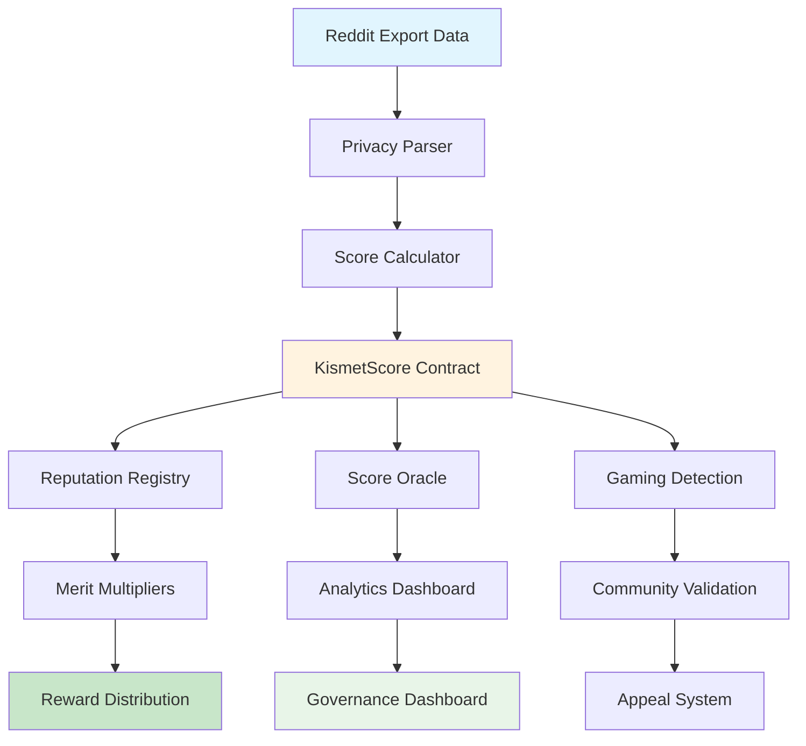

## 💰 Kismet Score Components (100% Total)

### 1. Content Creation (30%)
- **Posts**: 10 points per post created
- **Comments**: 5 points per comment made
- **Quality Threshold**: Capped at 95th percentile to prevent gaming
- **Purpose**: Rewards active content creators

### 2. Engagement (25%)
- **Votes Cast**: 1 point per upvote/downvote
- **Saved Items**: 3 points per saved post/comment
- **Subscriptions**: 2 points per subreddit subscription
- **Purpose**: Values community engagement and curation

### 3. Community Breadth (20%)
- **Subreddit Diversity**: Shannon entropy calculation
- **Cross-Community Participation**: Bonus for diverse engagement
- **Niche Community Support**: Rewards participation in smaller communities
- **Purpose**: Encourages diverse ecosystem participation

### 4. Consistency (15%)
- **Activity Patterns**: Regular engagement over time
- **Account Age Multiplier**: Longer accounts receive bonuses
- **Monthly Activity**: Consistent month-over-month participation
- **Purpose**: Rewards long-term sustained engagement

### 5. Quality (10%)
- **Content Length**: Analysis of thoughtful vs low-effort content
- **Award Patterns**: Giving and receiving Reddit awards
- **Thoughtful Content**: Detection of high-quality contributions
- **Purpose**: Identifies high-quality contributors

## 📋 Smart Contract Specifications

### 1. KismetScore Contract

```solidity
contract KismetScore is 
    Initializable,
    AccessControlUpgradeable,
    PausableUpgradeable,
    UUPSUpgradeable,
    ReentrancyGuardUpgradeable
{
    // Core storage structures
    struct ScoreData {
        uint256 totalScore;        // Final Kismet score (0-10000)
        uint256[5] componentScores; // Individual component scores
        uint256 lastUpdated;       // Timestamp of last update
        uint256 version;           // Algorithm version used
        bool disputed;             // Whether score is under dispute
        bytes32 calculationHash;   // Hash of calculation parameters
    }
    
    struct ContributorProfile {
        bytes32 characterId;       // Privacy-preserving identifier
        ScoreData currentScore;    // Current score data
        ScoreData[] scoreHistory;  // Historical scores
        uint256 gameFlags;         // Gaming detection flags
        uint256 appealCount;       // Number of appeals filed
        bool verified;             // Contributor verification status
    }
    
    // Storage mappings
    mapping(address => ContributorProfile) public contributors;
    mapping(bytes32 => address) public characterToAddress;
    mapping(uint256 => AlgorithmVersion) public algorithmVersions;
    
    // Algorithm configuration
    struct AlgorithmVersion {
        uint256 version;
        uint256[5] componentWeights; // Weights for 5 components
        uint256 qualityThreshold;    // Quality threshold parameters
        bool active;
        uint256 activatedAt;
    }
    
    // Events
    event ScoreUpdated(address indexed contributor, uint256 newScore, uint256 version);
    event ScoreDisputed(address indexed contributor, string reason);
    event AlgorithmUpdated(uint256 newVersion, uint256[5] weights);
    event GamingDetected(address indexed contributor, uint256 flags);
}
```

### 2. Reputation Registry

```solidity
contract ReputationRegistry is AccessControlUpgradeable {
    // Score verification and validation
    struct ScoreValidation {
        bytes32 dataHash;          // Hash of input data
        bytes32 calculationProof;  // Zero-knowledge proof
        address[] validators;      // Community validators
        uint256 consensusScore;    // Consensus validation score
        bool validated;
    }
    
    // Gaming detection
    struct GamingFlags {
        bool suspiciousPatterns;   // Pattern-based detection
        bool anomalousSpikes;      // Statistical anomaly detection
        bool sybilSuspect;         // Sybil attack indicators
        bool coordinatedBehavior;  // Coordinated gaming detection
        uint256 riskScore;         // Overall risk assessment
    }
    
    // Functions for score validation and gaming detection
    function validateScore(
        address contributor,
        ScoreData calldata scoreData,
        bytes calldata proof
    ) external returns (bool);
    
    function detectGaming(
        address contributor,
        ScoreData calldata newScore,
        ScoreData calldata previousScore
    ) external returns (GamingFlags memory);
}
```

### 3. Score Oracle System

```solidity
contract KismetOracle is 
    AccessControlUpgradeable,
    ReentrancyGuardUpgradeable
{
    bytes32 public constant ORACLE_ROLE = keccak256("ORACLE_ROLE");
    bytes32 public constant VALIDATOR_ROLE = keccak256("VALIDATOR_ROLE");
    
    struct ScoreUpdate {
        address contributor;
        uint256 newScore;
        uint256[5] componentScores;
        bytes32 dataHash;
        bytes proof;
        uint256 timestamp;
        address oracle;
    }
    
    struct ValidationRequest {
        bytes32 requestId;
        ScoreUpdate update;
        address[] validators;
        mapping(address => bool) validatorResponses;
        uint256 validationCount;
        bool approved;
        bool executed;
    }
    
    // Multi-signature score validation
    mapping(bytes32 => ValidationRequest) public validationRequests;
    uint256 public constant REQUIRED_VALIDATORS = 3;
    
    function submitScoreUpdate(
        address contributor,
        uint256 newScore,
        uint256[5] calldata componentScores,
        bytes calldata proof
    ) external onlyRole(ORACLE_ROLE);
    
    function validateUpdate(
        bytes32 requestId,
        bool approved
    ) external onlyRole(VALIDATOR_ROLE);
}
```

## 🔒 Privacy & Security Framework

### Privacy Protection
```solidity
contract PrivacyManager {
    // Character ID generation (no PII storage)
    function generateCharacterId(
        string calldata redditUsername,
        bytes32 salt
    ) external pure returns (bytes32) {
        return keccak256(abi.encodePacked(redditUsername, salt));
    }
    
    // Data anonymization
    function anonymizeRedditData(
        RedditExportData calldata rawData
    ) external pure returns (AnonymizedData memory);
    
    // Zero-knowledge proof verification
    function verifyScoreProof(
        bytes32 characterId,
        uint256 score,
        bytes calldata proof
    ) external view returns (bool);
}
```

### Gaming Prevention
```solidity
contract GamingPrevention {
    // Anomaly detection
    struct StatisticalProfile {
        uint256 meanScore;
        uint256 standardDeviation;
        uint256 percentileRank;
        uint256 lastCalculation;
    }
    
    // Rate limiting
    mapping(address => uint256) public lastSubmission;
    uint256 public constant SUBMISSION_COOLDOWN = 24 hours;
    
    // Sybil resistance
    mapping(bytes32 => bool) public usedRedditAccounts;
    
    function detectAnomalies(
        address contributor,
        uint256 newScore,
        uint256 previousScore
    ) external view returns (bool suspicious);
    
    function validateSubmissionRate(
        address contributor
    ) external view returns (bool allowed);
}
```

## 🔗 Integration Specifications

### Data Contribution Integration
```solidity
interface IKismetIntegration {
    function calculateRewardMultiplier(
        address contributor
    ) external view returns (uint256 multiplier);
    
    function updateScoreOnContribution(
        address contributor,
        uint256 contributionQuality
    ) external;
    
    function getContributorTier(
        address contributor
    ) external view returns (ContributorTier);
}

enum ContributorTier {
    Bronze,    // 0-2500 Kismet
    Silver,    // 2501-5000 Kismet
    Gold,      // 5001-7500 Kismet
    Platinum   // 7501-10000 Kismet
}
```

### Reward System Integration
```solidity
contract KismetRewardCalculator {
    function calculateMeritMultiplier(
        address contributor,
        uint256 baseReward
    ) external view returns (uint256 finalReward) {
        uint256 kismetScore = kismetContract.getScore(contributor);
        
        // Tier-based multipliers
        if (kismetScore >= 7500) return baseReward * 150 / 100; // 1.5x
        if (kismetScore >= 5000) return baseReward * 125 / 100; // 1.25x
        if (kismetScore >= 2500) return baseReward * 110 / 100; // 1.1x
        return baseReward; // 1.0x
    }
}
```

## 🧪 Testing Strategy

### Algorithm Testing
1. **Component Formula Validation**
   - Mathematical accuracy of 5-component scoring
   - Edge case handling (zero values, maximum values)
   - Component weight distribution verification
   - Score normalization accuracy
   - Gaming resistance under different scenarios

2. **Privacy Protection Testing**
   - PII removal verification
   - Character ID collision testing
   - Data anonymization effectiveness
   - Zero-knowledge proof validation
   - GDPR compliance verification

3. **Gaming Detection Testing**
   - Synthetic gaming attack simulation
   - Anomaly detection accuracy
   - False positive rate analysis
   - Sybil attack resistance
   - Coordinated gaming detection

### Smart Contract Testing
```solidity
contract KismetScoreTest is Test {
    function testScoreCalculation() public {
        // Test 5-component score calculation
        uint256[5] memory components = [3000, 2500, 2000, 1500, 1000];
        uint256 expectedScore = calculateWeightedScore(components);
        
        kismetScore.updateScore(contributor, components);
        assertEq(kismetScore.getScore(contributor), expectedScore);
    }
    
    function testGamingPrevention() public {
        // Test gaming detection mechanisms
        vm.expectRevert("Gaming detected");
        kismetScore.updateScore(gamer, suspiciousComponents);
    }
    
    function testPrivacyProtection() public {
        // Test PII protection
        bytes32 characterId = kismetScore.getCharacterId(contributor);
        assertTrue(characterId != bytes32(0));
        // Verify no PII can be reverse-engineered
    }
}
```

### Integration Testing
1. **Data Contribution Integration**
   - Automatic score updates on data submission
   - Quality multiplier application accuracy
   - Tier-based reward calculation
   - Cross-system synchronization
   - Performance under load

2. **Governance Integration**
   - Community voting on algorithm parameters
   - Proposal creation for scoring changes
   - Appeal system functionality
   - Democratic algorithm evolution
   - Transparency dashboard accuracy

## 🚀 Deployment Strategy

### Local Development
```solidity
// script/kismet/DeployKismet.s.sol
contract DeployKismet is BaseDeployScript {
    function deploy() internal override {
        // Deploy KismetScore contract
        // Deploy ReputationRegistry
        // Deploy KismetOracle
        // Configure integrations
        // Set up test data
    }
}
```

### Testnet Deployment (Vana Moksha)
1. **Phase 1**: Core contracts deployment
2. **Phase 2**: Integration with data contribution system
3. **Phase 3**: Community testing and feedback
4. **Phase 4**: Algorithm parameter optimization
5. **Phase 5**: Security audit and bug fixes

### Mainnet Deployment (Vana)
1. **Pre-launch**: Final security audit completion
2. **Launch**: Production deployment with monitoring
3. **Post-launch**: Community governance activation
4. **Evolution**: Algorithm improvements through DAO votes

## 🔒 Security & Audit Strategy

### OpenZeppelin Integration
- **AccessControl**: Role-based permissions for oracles and validators
- **Upgradeable**: UUPS pattern for algorithm improvements
- **ReentrancyGuard**: Protection against reentrancy attacks
- **Pausable**: Emergency pause for critical issues
- **EIP712**: Structured data signing for off-chain calculations

### Audit Preparation Checklist
1. **Privacy Protection Verification**
   - [ ] No PII stored in contracts
   - [ ] Character ID irreversibility
   - [ ] Data anonymization completeness
   - [ ] Zero-knowledge proof security
   - [ ] GDPR compliance validation

2. **Gaming Resistance Validation**
   - [ ] Anomaly detection accuracy
   - [ ] Sybil attack prevention
   - [ ] Rate limiting effectiveness
   - [ ] Statistical manipulation resistance
   - [ ] Community validation mechanisms

3. **Oracle Security Assessment**
   - [ ] Multi-signature validation security
   - [ ] Data integrity verification
   - [ ] Oracle manipulation resistance
   - [ ] Fallback mechanism reliability
   - [ ] Update authentication verification

4. **Integration Security Review**
   - [ ] Reward calculation accuracy
   - [ ] Cross-contract interaction safety
   - [ ] Access control verification
   - [ ] Emergency procedure testing
   - [ ] Upgrade mechanism security

### Security Monitoring
```solidity
contract KismetMonitoring {
    event AnomalyDetected(address contributor, uint256 riskScore);
    event ScoreManipulationAttempt(address attacker, bytes32 method);
    event UnusualPatternDetected(address contributor, string pattern);
    
    function monitorScoreUpdates() external {
        // Real-time anomaly monitoring
        // Pattern recognition for gaming attempts
        // Alert system for suspicious activity
    }
}
```

## 📊 Success Metrics

### Algorithm Performance
- **Accuracy**: >99.5% calculation accuracy
- **Gaming Resistance**: <0.1% successful gaming attempts detected
- **Privacy Protection**: Zero PII breaches or leaks
- **Community Adoption**: 80% of contributors using Kismet scores
- **System Reliability**: 99.9% uptime for score calculations

### Integration Success
- **Reward Fairness**: Merit-based distribution reducing inequality
- **User Satisfaction**: >85% positive feedback on scoring system
- **Developer Adoption**: 5+ third-party applications using Kismet API
- **Governance Participation**: 40% of community voting on algorithm changes
- **Academic Recognition**: Research publications citing Kismet system

## 📋 Deployment Scripts Required

### 1. `DeployKismet.s.sol`
```solidity
// Deploy complete Kismet reputation system
// Configure privacy protection mechanisms
// Set up gaming prevention systems
// Initialize algorithm parameters
// Configure oracle and validation system
```

### 2. `ConfigureKismetIntegration.s.sol`
```solidity
// Integrate with data contribution system
// Configure reward multiplier calculations
// Set up governance integration
// Initialize community validation
// Configure analytics and monitoring
```

### 3. `PopulateKismetTestData.s.sol`
```solidity
// Generate test contributor profiles
// Create sample score data
// Simulate gaming attempts
// Test algorithm variations
// Validate privacy protections
```

### 4. `KismetGovernanceSetup.s.sol`
```solidity
// Configure community governance
// Set up algorithm parameter voting
// Initialize appeal system
// Configure transparency dashboard
// Set up democratic evolution mechanisms
```

---

# 💰 Data Marketplace & Revenue Monetization Specifications

## 📊 Overview

The Data Marketplace enables data consumers to purchase high-quality datasets while ensuring fair revenue distribution to contributors, stakers, and the ecosystem. It provides transparent pricing, automated royalties, and sustainable token economics.

## 🔄 Marketplace Flow

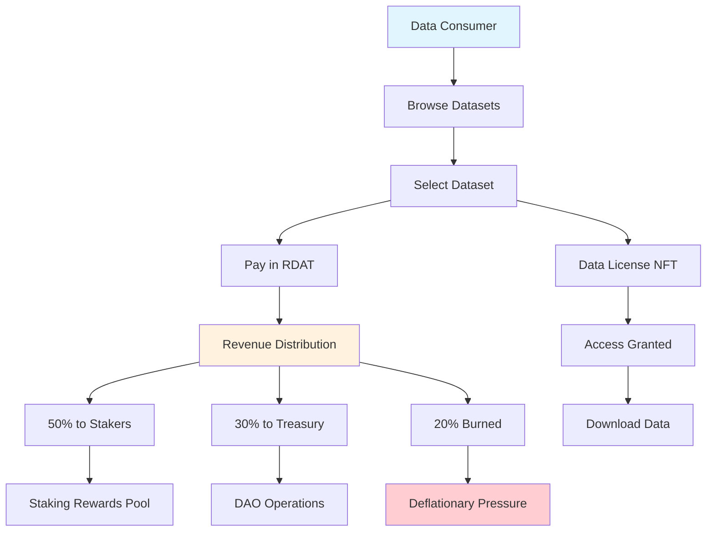

## 📦 Smart Contracts Required

### 1. Data Marketplace: `DataMarketplace.sol`

**Inheritance Structure:**
```solidity
contract DataMarketplace is 
    Initializable,
    AccessControlUpgradeable,
    PausableUpgradeable,
    ReentrancyGuardUpgradeable,
    UUPSUpgradeable
```

**Key Features:**
- **Dynamic Pricing**: Oracle-based fair market pricing
- **Revenue Distribution**: Automatic fee splitting to stakeholders
- **License Management**: NFT-based data access licenses
- **Royalty System**: Contributor royalties on secondary sales
- **Escrow Protection**: Secure payment handling
- **Batch Purchases**: Gas-efficient bulk buying

**Core Functions:**
```solidity
// List dataset for sale
function listDataset(
    bytes32 dataHash,
    uint256 basePrice,
    uint256 royaltyPercentage,
    DatasetMetadata calldata metadata
) external onlyRole(CONTRIBUTOR_ROLE)

// Purchase data license
function purchaseDataset(
    uint256 datasetId,
    uint256 licenseType
) external payable returns (uint256 licenseTokenId) {
    Dataset memory dataset = datasets[datasetId];
    uint256 price = priceOracle.getDatasetPrice(datasetId);
    
    require(RDAT.transferFrom(msg.sender, address(this), price), "Payment failed");
    
    // Distribute revenue
    _distributeRevenue(price);
    
    // Mint license NFT
    uint256 tokenId = dataLicenseNFT.mint(msg.sender, datasetId, licenseType);
    
    // Track attribution for royalties
    _recordAttribution(dataset.contributor, price);
    
    return tokenId;
}

// Revenue distribution mechanism
function _distributeRevenue(uint256 amount) internal {
    uint256 stakerShare = (amount * STAKER_SHARE) / 10000; // 50%
    uint256 treasuryShare = (amount * TREASURY_SHARE) / 10000; // 30%
    uint256 burnShare = (amount * BURN_SHARE) / 10000; // 20%
    
    // To stakers
    stakingRewards.addRewards(stakerShare);
    
    // To treasury
    RDAT.transfer(treasury, treasuryShare);
    
    // Burn for deflation
    RDAT.burn(burnShare);
    
    emit RevenueDistributed(stakerShare, treasuryShare, burnShare);
}
```

### 2. Data Pricing Oracle: `DataPricingOracle.sol`

**Key Features:**
- **Multi-Factor Pricing**: Quality, demand, rarity, size
- **Dynamic Adjustment**: Market-based price discovery
- **Circuit Breakers**: Protection against manipulation

```solidity
contract DataPricingOracle is AccessControlUpgradeable {
    struct PriceFactors {
        uint256 qualityScore;     // 0-100
        uint256 demandScore;      // Based on purchase history
        uint256 rarityScore;      // Uniqueness factor
        uint256 sizeMultiplier;   // Data volume adjustment
    }
    
    function calculateDatasetPrice(
        uint256 datasetId
    ) external view returns (uint256) {
        PriceFactors memory factors = _getPriceFactors(datasetId);
        
        uint256 basePrice = BASE_PRICE_PER_MB * datasets[datasetId].size;
        
        // Apply quality multiplier (0.5x - 2x)
        uint256 qualityAdjusted = (basePrice * (50 + factors.qualityScore)) / 100;
        
        // Apply demand multiplier (0.8x - 3x)
        uint256 demandAdjusted = (qualityAdjusted * factors.demandScore) / 100;
        
        // Apply rarity bonus (1x - 5x)
        uint256 finalPrice = (demandAdjusted * factors.rarityScore) / 100;
        
        // Circuit breaker
        require(finalPrice <= MAX_PRICE_PER_DATASET, "Price exceeds maximum");
        
        return finalPrice;
    }
}
```

### 3. Data License NFT: `DataLicenseNFT.sol`

**Key Features:**
- **License Types**: Personal, Commercial, Enterprise
- **Usage Tracking**: On-chain usage rights
- **Transferability**: Secondary market support
- **Expiration**: Time-based licenses

```solidity
contract DataLicenseNFT is ERC721, AccessControlUpgradeable {
    struct License {
        uint256 datasetId;
        LicenseType licenseType;
        uint256 expirationTime;
        bool isTransferable;
        uint256 usageLimit;
        uint256 usageCount;
    }
    
    mapping(uint256 => License) public licenses;
    
    function mint(
        address to,
        uint256 datasetId,
        LicenseType licenseType
    ) external onlyRole(MARKETPLACE_ROLE) returns (uint256) {
        uint256 tokenId = _nextTokenId++;
        
        licenses[tokenId] = License({
            datasetId: datasetId,
            licenseType: licenseType,
            expirationTime: block.timestamp + LICENSE_DURATION[licenseType],
            isTransferable: licenseType != LicenseType.Personal,
            usageLimit: USAGE_LIMITS[licenseType],
            usageCount: 0
        });
        
        _safeMint(to, tokenId);
        return tokenId;
    }
}
```

### 4. Contributor Royalties: `RoyaltyDistributor.sol`

**Key Features:**
- **Automatic Attribution**: Track contributor rewards
- **Batch Distribution**: Gas-efficient payouts
- **Vesting Integration**: Optional vesting for large royalties

```solidity
contract RoyaltyDistributor is AccessControlUpgradeable {
    mapping(address => uint256) public pendingRoyalties;
    mapping(address => uint256) public totalEarned;
    
    function distributeRoyalties(
        address[] calldata contributors,
        uint256[] calldata amounts
    ) external onlyRole(MARKETPLACE_ROLE) {
        for (uint256 i = 0; i < contributors.length; i++) {
            pendingRoyalties[contributors[i]] += amounts[i];
            totalEarned[contributors[i]] += amounts[i];
        }
    }
    
    function claimRoyalties() external {
        uint256 amount = pendingRoyalties[msg.sender];
        require(amount > 0, "No royalties to claim");
        
        pendingRoyalties[msg.sender] = 0;
        RDAT.transfer(msg.sender, amount);
        
        emit RoyaltiesClaimed(msg.sender, amount);
    }
}
```

## 🔒 Security & Economic Sustainability

### Revenue Flow Protection
- **Multi-signature**: Large purchases require approval
- **Rate Limiting**: Prevent wash trading
- **Price Manipulation**: Circuit breakers and bounds

### Long-term Sustainability
```solidity
contract SustainabilityMechanics {
    // Transition from fixed rewards to fee-based
    function transitionToFeeRewards() external onlyRole(DAO_ROLE) {
        require(block.timestamp > REWARD_POOL_DEPLETION_TIME, "Too early");
        
        // Switch reward source from pool to fees
        rewardSource = RewardSource.MarketplaceFees;
        
        // Adjust distribution percentages
        STAKER_SHARE = 7000; // 70% to stakers
        TREASURY_SHARE = 2000; // 20% to treasury
        BURN_SHARE = 1000; // 10% burned
    }
    
    // Dynamic fee adjustment based on volume
    function adjustMarketplaceFee() external {
        uint256 monthlyVolume = getMonthlyVolume();
        
        if (monthlyVolume > HIGH_VOLUME_THRESHOLD) {
            marketplaceFee = 200; // 2%
        } else if (monthlyVolume < LOW_VOLUME_THRESHOLD) {
            marketplaceFee = 500; // 5%
        } else {
            marketplaceFee = 350; // 3.5%
        }
    }
}
```

## 📊 Success Metrics

### Marketplace Health
- **Transaction Volume**: $1M+ monthly target
- **Active Datasets**: 10,000+ listed
- **Contributor Earnings**: Fair distribution verified
- **Price Stability**: <10% daily volatility
- **Revenue Sustainability**: Positive cash flow

### Token Economics
- **Burn Rate**: 0.5-1% monthly supply reduction
- **Staker APY**: 10-20% from fees
- **Treasury Growth**: Sustainable operations funding
- **Token Velocity**: Healthy circulation metrics

---

## 📋 Deployment Scripts Required

### 1. `DeployvRDAT.s.sol`
```solidity
// Deploy vRDAT token with non-transferable features
// Configure voting and governance integration
// Set up access control roles
// Initialize distribution parameters
```

### 2. `DeployDistribution.s.sol`
```solidity
// Deploy distribution manager
// Configure staking integration
// Set up anti-gaming mechanisms
// Initialize security monitoring
```

### 3. `ConfigureGovernanceIntegration.s.sol`
```solidity
// Connect to governance contracts
// Configure voting power calculation
// Set up delegation mechanisms
// Initialize quadratic voting support
```

### 4. `SetupSecurity.s.sol`
```solidity
// Deploy security and anti-gaming contracts
// Configure detection mechanisms
// Set up circuit breakers
// Initialize monitoring systems
```

---

# 🔐 Enhanced Security Framework & Immediate Action Items

Based on comprehensive security analysis, the following enhanced specifications address critical gaps and implement best practices for secure smart contract development.

## 🚨 Sprint 1: Enhanced Access Control & Security (Week 1-2)

### 1. Timelocked Access Control System

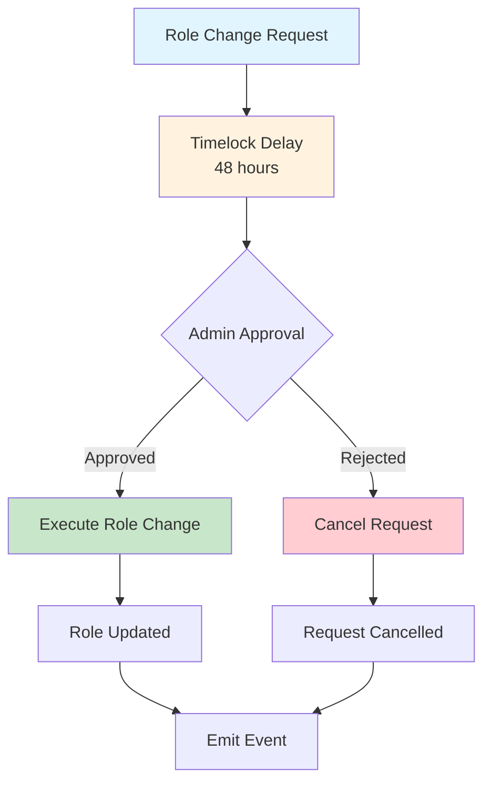

**Enhanced Access Control Contract:**
```solidity
contract TimelockedAccessControl is AccessControl, ReentrancyGuard {
    struct RoleChange {
        bytes32 role;
        address account;
        bool grant;
        uint256 executeAt;
        bool executed;
        address proposer;
    }
    
    mapping(bytes32 => RoleChange) public pendingRoleChanges;
    mapping(bytes32 => bool) public emergencyRoles;
    
    uint256 public constant ROLE_CHANGE_DELAY = 48 hours;
    uint256 public constant EMERGENCY_ROLE_DELAY = 6 hours;
    
    event RoleChangeProposed(
        bytes32 indexed changeId,
        bytes32 indexed role, 
        address indexed account,
        bool grant,
        uint256 executeAt
    );
    
    event RoleChangeExecuted(bytes32 indexed changeId);
    event RoleChangeCancelled(bytes32 indexed changeId);
    
    modifier onlyAfterDelay(bytes32 changeId) {
        RoleChange storage change = pendingRoleChanges[changeId];
        require(change.executeAt != 0, "Invalid change ID");
        require(block.timestamp >= change.executeAt, "Timelock not expired");
        require(!change.executed, "Already executed");
        _;
    }
    
    function proposeRoleChange(
        bytes32 role,
        address account,
        bool grant
    ) external onlyRole(getRoleAdmin(role)) nonReentrant returns (bytes32) {
        bytes32 changeId = keccak256(
            abi.encode(role, account, grant, block.timestamp, msg.sender)
        );
        
        uint256 delay = emergencyRoles[role] ? EMERGENCY_ROLE_DELAY : ROLE_CHANGE_DELAY;
        
        pendingRoleChanges[changeId] = RoleChange({
            role: role,
            account: account,
            grant: grant,
            executeAt: block.timestamp + delay,
            executed: false,
            proposer: msg.sender
        });
        
        emit RoleChangeProposed(changeId, role, account, grant, block.timestamp + delay);
        return changeId;
    }
    
    function executeRoleChange(
        bytes32 changeId
    ) external onlyAfterDelay(changeId) nonReentrant {
        RoleChange storage change = pendingRoleChanges[changeId];
        change.executed = true;
        
        if (change.grant) {
            _grantRole(change.role, change.account);
        } else {
            _revokeRole(change.role, change.account);
        }
        
        emit RoleChangeExecuted(changeId);
    }
    
    function cancelRoleChange(bytes32 changeId) external {
        RoleChange storage change = pendingRoleChanges[changeId];
        require(
            hasRole(DEFAULT_ADMIN_ROLE, msg.sender) || 
            msg.sender == change.proposer,
            "Not authorized to cancel"
        );
        require(!change.executed, "Already executed");
        
        delete pendingRoleChanges[changeId];
        emit RoleChangeCancelled(changeId);
    }
}
```

### 2. Universal Emergency Controls & Circuit Breakers

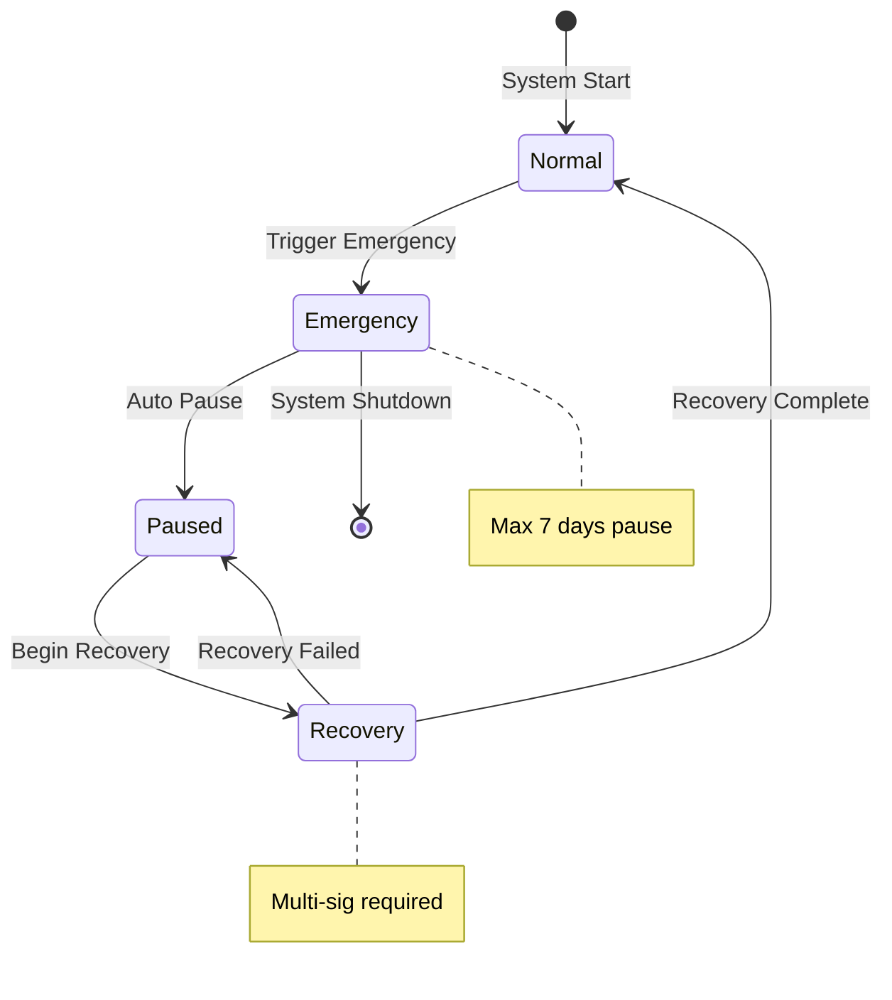

**Emergency Control Framework:**
```solidity
abstract contract EmergencyPausable is AccessControl, Pausable {
    bytes32 public constant EMERGENCY_ROLE = keccak256("EMERGENCY_ROLE");
    bytes32 public constant GUARDIAN_ROLE = keccak256("GUARDIAN_ROLE");
    bytes32 public constant RECOVERY_ROLE = keccak256("RECOVERY_ROLE");
    
    uint256 public emergencyPauseExpiry;
    uint256 public constant MAX_EMERGENCY_PAUSE = 7 days;
    uint256 public constant GUARDIAN_THRESHOLD = 2; // Multi-sig requirement
    
    mapping(address => bool) public emergencyVotes;
    uint256 public emergencyVoteCount;
    
    event EmergencyTriggered(address indexed trigger, string reason);
    event EmergencyPaused(uint256 expiry);
    event EmergencyRecovery(address indexed recoverer);
    
    modifier whenNotEmergencyPaused() {
        require(
            !paused() || block.timestamp > emergencyPauseExpiry,
            "Emergency pause active"
        );
        _;
    }
    
    function triggerEmergency(string calldata reason) external onlyRole(EMERGENCY_ROLE) {
        require(!paused(), "Already paused");
        
        emergencyPauseExpiry = block.timestamp + MAX_EMERGENCY_PAUSE;
        _pause();
        
        emit EmergencyTriggered(msg.sender, reason);
        emit EmergencyPaused(emergencyPauseExpiry);
    }
    
    function voteEmergencyRecovery() external onlyRole(GUARDIAN_ROLE) {
        require(paused(), "Not paused");
        require(!emergencyVotes[msg.sender], "Already voted");
        
        emergencyVotes[msg.sender] = true;
        emergencyVoteCount++;
        
        if (emergencyVoteCount >= GUARDIAN_THRESHOLD) {
            _executeRecovery();
        }
    }
    
    function _executeRecovery() internal {
        _unpause();
        
        // Reset emergency state
        emergencyVoteCount = 0;
        // Clear votes (implementation detail)
        
        emit EmergencyRecovery(msg.sender);
    }
    
    function extendEmergencyPause() external onlyRole(DEFAULT_ADMIN_ROLE) {
        require(paused(), "Not paused");
        require(
            emergencyPauseExpiry > block.timestamp,
            "Emergency pause expired"
        );
        
        emergencyPauseExpiry = block.timestamp + MAX_EMERGENCY_PAUSE;
        emit EmergencyPaused(emergencyPauseExpiry);
    }
}
```

### 3. Rate Limiting & DOS Protection

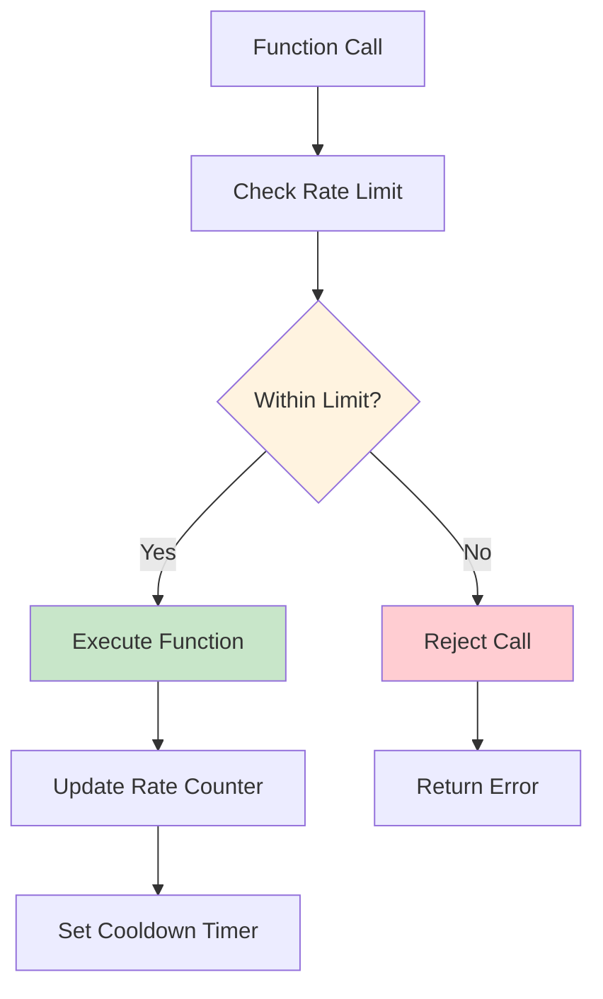

**Rate Limiting Framework:**
```solidity
contract RateLimited {
    struct RateLimit {
        uint256 maxCalls;
        uint256 windowSize;
        mapping(address => uint256) calls;
        mapping(address => uint256) windowStart;
    }
    
    mapping(bytes4 => RateLimit) public rateLimits;
    mapping(address => mapping(bytes4 => uint256)) public lastCall;
    
    event RateLimitExceeded(address indexed user, bytes4 indexed selector);
    event RateLimitConfigured(bytes4 indexed selector, uint256 maxCalls, uint256 window);
    
    modifier rateLimit(bytes4 selector) {
        _checkRateLimit(selector);
        _;
        _updateRateLimit(selector);
    }
    
    function _checkRateLimit(bytes4 selector) internal view {
        RateLimit storage limit = rateLimits[selector];
        if (limit.maxCalls == 0) return; // No limit set
        
        uint256 currentWindow = block.timestamp / limit.windowSize;
        uint256 userWindow = limit.windowStart[msg.sender];
        
        if (currentWindow > userWindow) {
            // New window, reset counter
            return;
        }
        
        require(
            limit.calls[msg.sender] < limit.maxCalls,
            "Rate limit exceeded"
        );
    }
    
    function _updateRateLimit(bytes4 selector) internal {
        RateLimit storage limit = rateLimits[selector];
        if (limit.maxCalls == 0) return;
        
        uint256 currentWindow = block.timestamp / limit.windowSize;
        uint256 userWindow = limit.windowStart[msg.sender];
        
        if (currentWindow > userWindow) {
            // New window
            limit.windowStart[msg.sender] = currentWindow;
            limit.calls[msg.sender] = 1;
        } else {
            // Same window
            limit.calls[msg.sender]++;
        }
        
        lastCall[msg.sender][selector] = block.timestamp;
    }
    
    function configureRateLimit(
        bytes4 selector,
        uint256 maxCalls,
        uint256 windowSize
    ) external onlyRole(DEFAULT_ADMIN_ROLE) {
        rateLimits[selector].maxCalls = maxCalls;
        rateLimits[selector].windowSize = windowSize;
        
        emit RateLimitConfigured(selector, maxCalls, windowSize);
    }
}
```

## 🔒 Sprint 2: Enhanced vRDAT Security (Week 2-3)

### 1. Complete Non-Transferability Implementation

```solidity
contract SecurevRDAT is ERC20Votes, ERC20Permit, AccessControl, EmergencyPausable {
    bytes32 public constant MINTER_ROLE = keccak256("MINTER_ROLE");
    bytes32 public constant BURNER_ROLE = keccak256("BURNER_ROLE");
    
    error NonTransferableToken();
    error InvalidDelegation();
    
    // Block ALL transfer methods completely
    function transfer(address, uint256) public pure override returns (bool) {
        revert NonTransferableToken();
    }
    
    function transferFrom(address, address, uint256) public pure override returns (bool) {
        revert NonTransferableToken();
    }
    
    function approve(address, uint256) public pure override returns (bool) {
        revert NonTransferableToken();
    }
    
    function increaseAllowance(address, uint256) public pure override returns (bool) {
        revert NonTransferableToken();
    }
    
    function decreaseAllowance(address, uint256) public pure override returns (bool) {
        revert NonTransferableToken();
    }
    
    // Override internal transfer to ensure no transfers possible
    function _transfer(address, address, uint256) internal pure override {
        revert NonTransferableToken();
    }
    
    // Only allow delegation (no token movement)
    function delegate(address delegatee) public override whenNotPaused {
        address delegator = _msgSender();
        
        // Prevent delegation loops
        require(!_hasDelegationLoop(delegator, delegatee), "Delegation loop detected");
        
        _delegate(delegator, delegatee);
    }
    
    function _hasDelegationLoop(address delegator, address delegatee) internal view returns (bool) {
        address current = delegatee;
        uint256 depth = 0;
        uint256 constant MAX_DELEGATION_DEPTH = 10;
        
        while (current != address(0) && depth < MAX_DELEGATION_DEPTH) {
            if (current == delegator) return true;
            current = delegates(current);
            depth++;
        }
        
        return depth >= MAX_DELEGATION_DEPTH;
    }
    
    // Safe minting with validation
    function mint(address to, uint256 amount) external onlyRole(MINTER_ROLE) whenNotPaused {
        require(to != address(0), "Invalid recipient");
        require(amount > 0, "Invalid amount");
        
        _mint(to, amount);
    }
    
    // Safe burning with validation
    function burn(address from, uint256 amount) external onlyRole(BURNER_ROLE) whenNotPaused {
        require(from != address(0), "Invalid address");
        require(balanceOf(from) >= amount, "Insufficient balance");
        
        _burn(from, amount);
    }
}
```

### 2. MEV Protection for Governance

```mermaid
sequenceStart
    participant User
    participant CommitReveal
    participant Governance
    participant Timelock
    
    User->>CommitReveal: commitVote(hashedVote)
    Note over CommitReveal: Commit phase<br/>24 hours
    User->>CommitReveal: revealVote(proposalId, support, nonce, salt)
    CommitReveal->>Governance: recordVote(user, support, votingPower)
    Governance->>Timelock: queueExecution(proposal)
    Note over Timelock: 48 hour delay
    Timelock->>Governance: executeProposal()
```

**MEV-Protected Governance:**
```solidity
contract MEVProtectedGovernance is AccessControl, ReentrancyGuard {
    struct VoteCommitment {
        bytes32 commitment;
        uint256 commitTime;
        bool revealed;
    }
    
    mapping(address => mapping(uint256 => VoteCommitment)) public commitments;
    mapping(address => uint256) public userNonces;
    
    uint256 public constant COMMIT_DURATION = 24 hours;
    uint256 public constant REVEAL_DURATION = 48 hours;
    
    event VoteCommitted(address indexed voter, uint256 indexed proposalId, bytes32 commitment);
    event VoteRevealed(address indexed voter, uint256 indexed proposalId, uint8 support);
    
    function commitVote(
        uint256 proposalId,
        bytes32 commitment
    ) external nonReentrant {
        require(_isVotingActive(proposalId), "Voting not active");
        require(
            commitments[msg.sender][proposalId].commitment == bytes32(0),
            "Already committed"
        );
        
        commitments[msg.sender][proposalId] = VoteCommitment({
            commitment: commitment,
            commitTime: block.timestamp,
            revealed: false
        });
        
        emit VoteCommitted(msg.sender, proposalId, commitment);
    }
    
    function revealVote(
        uint256 proposalId,
        uint8 support,
        uint256 nonce,
        bytes32 salt
    ) external nonReentrant {
        VoteCommitment storage commitment = commitments[msg.sender][proposalId];
        
        require(commitment.commitment != bytes32(0), "No commitment found");
        require(!commitment.revealed, "Already revealed");
        require(
            block.timestamp >= commitment.commitTime + COMMIT_DURATION,
            "Commit phase not ended"
        );
        require(
            block.timestamp <= commitment.commitTime + COMMIT_DURATION + REVEAL_DURATION,
            "Reveal phase ended"
        );
        require(nonce == userNonces[msg.sender], "Invalid nonce");
        
        bytes32 hash = keccak256(abi.encode(
            msg.sender, proposalId, support, nonce, salt
        ));
        require(hash == commitment.commitment, "Invalid reveal");
        
        commitment.revealed = true;
        userNonces[msg.sender]++;
        
        _castVote(proposalId, support);
        emit VoteRevealed(msg.sender, proposalId, support);
    }
}
```

## 🔧 Sprint 3: Oracle Security & Economic Protection (Week 3-4)

### 1. Robust Oracle Integration

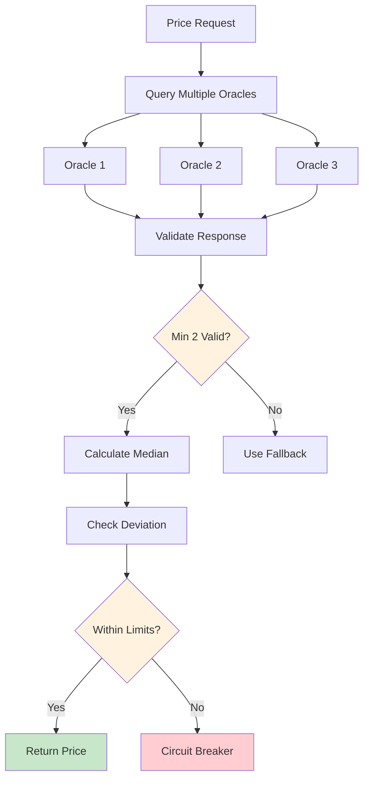

**Secure Oracle System:**
```solidity
contract SecureOracle is AccessControl, EmergencyPausable {
    struct PriceFeed {
        AggregatorV3Interface oracle;
        uint256 heartbeat; // Max update frequency
        bool active;
    }
    
    PriceFeed[] public priceFeeds;
    uint256 public constant MAX_PRICE_DEVIATION = 500; // 5%
    uint256 public constant MIN_VALID_RESPONSES = 2;
    uint256 public fallbackPrice;
    uint256 public fallbackTimestamp;
    
    event PriceUpdated(uint256 price, uint256 timestamp);
    event OracleFailed(address indexed oracle, string reason);
    event FallbackActivated(uint256 price);
    
    function getSecurePrice() external view returns (uint256, bool) {
        uint256[] memory validPrices = new uint256[](priceFeeds.length);
        uint256 validCount = 0;
        
        for (uint256 i = 0; i < priceFeeds.length; i++) {
            if (!priceFeeds[i].active) continue;
            
            try priceFeeds[i].oracle.latestRoundData() returns (
                uint80, int256 price, uint256, uint256 updatedAt, uint80
            ) {
                if (
                    price > 0 && 
                    block.timestamp - updatedAt <= priceFeeds[i].heartbeat
                ) {
                    validPrices[validCount] = uint256(price);
                    validCount++;
                }
            } catch {
                // Oracle failed, skip
                continue;
            }
        }
        
        if (validCount >= MIN_VALID_RESPONSES) {
            uint256 medianPrice = _calculateMedian(validPrices, validCount);
            
            // Check for extreme deviation
            if (_isReasonablePrice(medianPrice)) {
                return (medianPrice, true);
            }
        }
        
        // Fallback to last known good price
        if (block.timestamp - fallbackTimestamp <= 1 hours) {
            return (fallbackPrice, false);
        }
        
        revert("No valid price available");
    }
    
    function _calculateMedian(
        uint256[] memory prices,
        uint256 length
    ) internal pure returns (uint256) {
        // Sort prices
        for (uint256 i = 0; i < length - 1; i++) {
            for (uint256 j = 0; j < length - i - 1; j++) {
                if (prices[j] > prices[j + 1]) {
                    uint256 temp = prices[j];
                    prices[j] = prices[j + 1];
                    prices[j + 1] = temp;
                }
            }
        }
        
        if (length % 2 == 0) {
            return (prices[length / 2 - 1] + prices[length / 2]) / 2;
        } else {
            return prices[length / 2];
        }
    }
    
    function _isReasonablePrice(uint256 price) internal view returns (bool) {
        if (fallbackPrice == 0) return true; // First price
        
        uint256 deviation = price > fallbackPrice 
            ? ((price - fallbackPrice) * 10000) / fallbackPrice
            : ((fallbackPrice - price) * 10000) / fallbackPrice;
            
        return deviation <= MAX_PRICE_DEVIATION;
    }
}
```

## 📋 Sprint Planning & Implementation Tranches

### Phase 1: Security Foundation (Sprints 1-2, Weeks 1-4)
1. **Sprint 1**: Enhanced Access Control & Emergency Systems
   - Timelocked role changes
   - Emergency pause mechanisms
   - Rate limiting framework
   
2. **Sprint 2**: vRDAT Security & MEV Protection
   - Complete non-transferability
   - Delegation loop prevention
   - Commit-reveal governance

### Phase 2: Economic Security (Sprints 3-4, Weeks 5-8)
3. **Sprint 3**: Oracle Security & Price Protection
   - Multi-oracle integration
   - Price deviation protection
   - Fallback mechanisms
   
4. **Sprint 4**: Anti-Gaming & Final Integration
   - Enhanced staking protection
   - Gaming pattern detection
   - Full system integration testing

### Phase 3: Audit Preparation (Sprints 5-6, Weeks 9-12)
5. **Sprint 5**: Formal Verification Preparation
   - Invariant definition
   - Property-based testing
   - Mathematical proofs
   
6. **Sprint 6**: Final Security Hardening
   - Penetration testing
   - Economic attack simulations
   - Audit documentation

---

## 🚀 V2 Beta Deployment Strategy

### Contract Deployment Order (Days 1-4)
1. **Gnosis Safe** (Multi-sig treasury)
2. **RDAT** (Main token contract)
3. **vRDAT** (Soul-bound governance token)
4. **Staking** (Simplified staking)
5. **MigrationBridge** (V1→V2 bridge)

### Off-chain Infrastructure (Days 2-6)
1. **Supabase Setup**
   - User identity tables with encryption
   - Data contribution metadata
   - Quality validation system
   
2. **Snapshot Configuration**
   - Create rdatadao.eth space
   - Configure vRDAT strategy
   - Set quadratic counting parameters
   
3. **Analytics Integration**
   - PostHog event tracking
   - Custom dashboards
   - Conversion funnels

### Testing & Launch (Days 7-13)
1. **Testnet Testing** (Days 7-8)
   - Migration flow validation
   - Staking functionality
   - Governance voting tests
   
2. **Community Beta** (Days 9-11)
   - Limited user testing
   - Bug bounty program
   - Feedback integration
   
3. **Mainnet Launch** (Days 12-13)
   - Phased rollout
   - 24/7 monitoring
   - Emergency response ready

### Success Metrics
- ✅ 50%+ of V1 holders migrate in first month
- ✅ $1M+ TVL in staking within 2 weeks
- ✅ 100+ governance participants
- ✅ Zero critical security incidents

---

**Document Version**: 4.0  
**Created**: November 2024  
**Last Updated**: August 2025  
**Status**: V2 Beta Sprint Ready - 13-Day Implementation Plan  
**Sprint Duration**: August 5-18, 2025  
**Deployment**: Phased approach with progressive decentralization