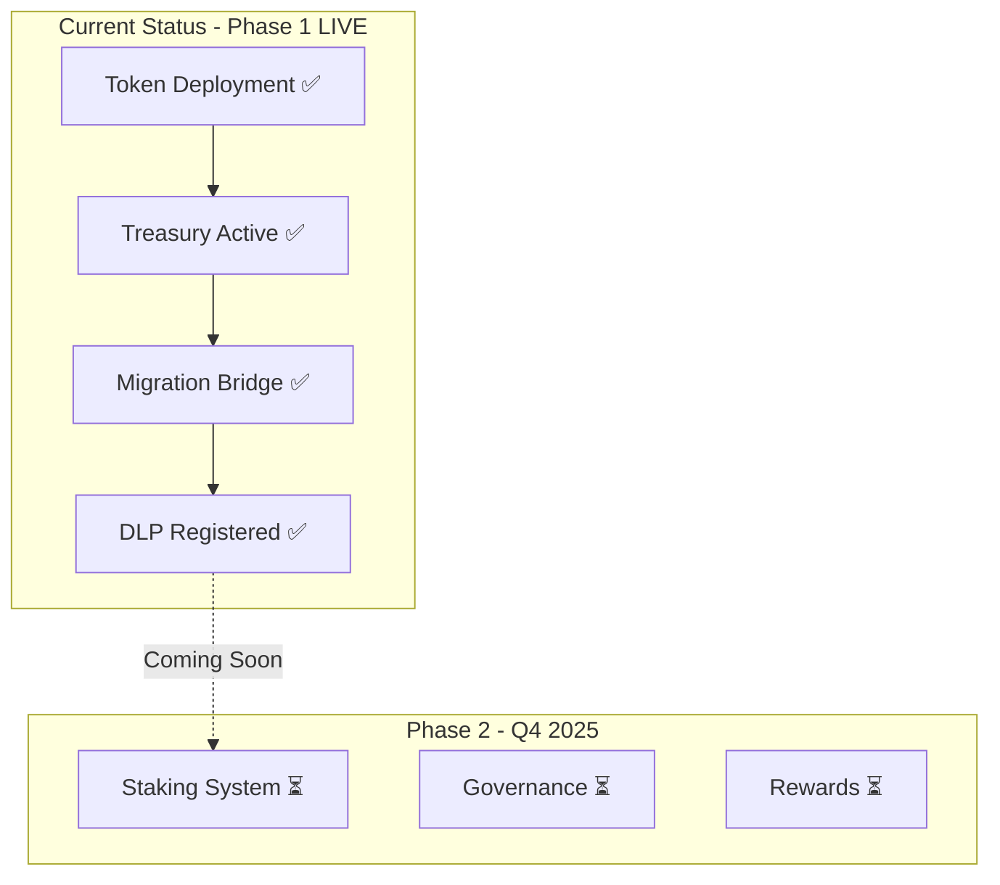
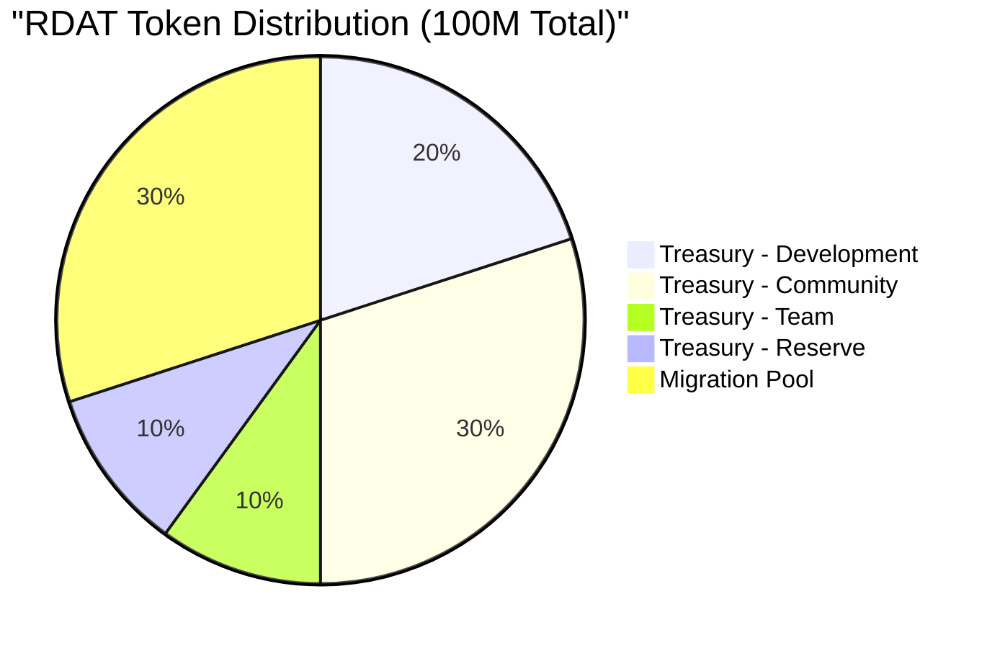
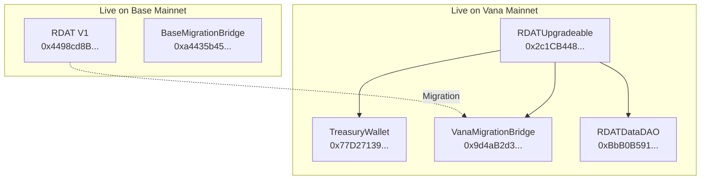
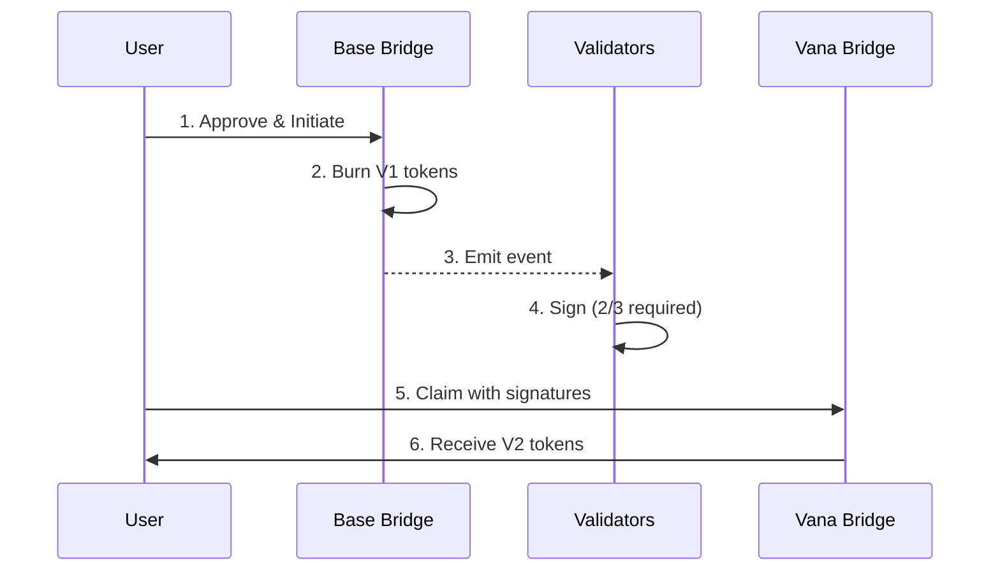
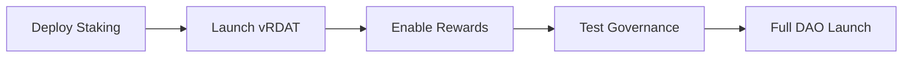
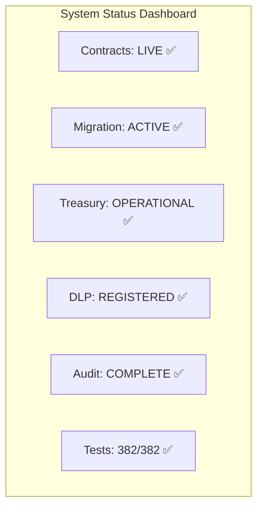

# 📋 RDAT V2 Current System Specifications

**Last Updated**: September 20, 2025
**Version**: 3.2 - Mainnet Live
**Status**: Production Deployed ✅
**Audit**: Hashlock Complete ✅

## 🎯 Executive Summary

RDAT V2 is now live on mainnet with a focused Phase 1 implementation. The system successfully migrated from Base to Vana network with an expanded token supply (30M → 100M) and established the foundation for future staking, governance, and rewards features.



## 💰 Current Token Economics

### **Deployed Token Model**


### **RDAT Token (Deployed)**
- **Total Supply**: 100,000,000 RDAT (fixed, immutable)
- **Contract**: `0x2c1CB448cAf3579B2374EFe20068Ea97F72A996E`
- **Network**: Vana (Chain ID: 1480)
- **Features Deployed**:
  - ✅ ERC-20 standard functions
  - ✅ UUPS upgradeability
  - ✅ Pausable (72hr auto-expiry)
  - ✅ Access control (multisig)
  - ✅ DLP integration (ID: 40)
  - ✅ Fixed supply (no minting)

### **vRDAT Token (Not Yet Deployed)**
- **Status**: Developed, tested, awaiting Phase 2 deployment
- **Purpose**: Soul-bound governance token
- **Timeline**: Q4 2025

## 🏗️ Deployed Architecture

### Current System Components



### Deployed Contracts Summary

| Contract | Address | Network | Purpose | Status |
|----------|---------|---------|---------|--------|
| RDATUpgradeable | `0x2c1CB448cAf3579B2374EFe20068Ea97F72A996E` | Vana | Main token | Live ✅ |
| TreasuryWallet | `0x77D2713972af12F1E3EF39b5395bfD65C862367C` | Vana | 70M vesting | Live ✅ |
| VanaMigrationBridge | `0x9d4aB2d3fb25D414dba1d9D22200356b5984D35E` | Vana | V2 minting | Live ✅ |
| RDATDataDAO | `0xBbB0B59163b850dDC5139e98118774557c5d9F92` | Vana | DLP integration | Live ✅ |
| BaseMigrationBridge | `0xa4435b45035a483d364de83B9494BDEFA8322626` | Base | V1 burning | Live ✅ |

## 🔄 Active Migration System

### Current Migration Status
- **Pool Size**: 30,000,000 RDAT allocated
- **Migration Ratio**: 1:1 (V1:V2)
- **Process**: Cross-chain with 2/3 validator signatures
- **Status**: OPEN and processing migrations

### Migration Flow (Active)


## 🛡️ Security Features (Implemented)

### Access Control Matrix
| Role | Current Holder | Capabilities |
|------|---------------|--------------|
| DEFAULT_ADMIN_ROLE | `0xe4F7Eca807C57311e715C3Ef483e72Fa8D5bCcDF` (3/5 multisig) | Full control |
| PAUSER_ROLE | Same multisig (2/5 required) | Emergency pause |
| UPGRADER_ROLE | Same multisig (3/5 required) | UUPS upgrades |
| VALIDATOR_ROLE | 3 validators | Sign migrations |

### Security Measures Deployed
- ✅ **Hashlock Audit**: Complete with all findings remediated
- ✅ **Multisig Governance**: 3/5 for critical, 2/5 for pause
- ✅ **Emergency Pause**: 72-hour auto-expiry protection
- ✅ **Fixed Supply**: No minting capability post-deployment
- ✅ **Reentrancy Guards**: On all external calls
- ✅ **Challenge Period**: 6 hours for migrations
- ✅ **Admin Override**: After 7 days for stuck migrations

## 📊 Current System Metrics

### Token Metrics
```javascript
{
  "totalSupply": "100,000,000 RDAT",
  "treasuryBalance": "70,000,000 RDAT",
  "migrationPoolBalance": "30,000,000 RDAT",
  "circulatingSupply": "Variable based on migration",
  "holders": "Growing daily"
}
```

### DLP Integration
- **DLP ID**: 40
- **Registry**: `0x4D59880a924526d1dD33260552Ff4328b1E18a43`
- **Status**: Active and registered
- **Purpose**: Data contribution rewards (future)

## 🚧 Not Yet Deployed (Phase 2)

### Staking System
- **Status**: ✅ Developed, ✅ Tested, ⏳ Awaiting deployment
- **Features**: NFT positions, time locks, multipliers
- **Timeline**: Q4 2025

### Governance System
- **Status**: ✅ Developed, ✅ Tested, ⏳ Awaiting deployment
- **Features**: On-chain voting, timelock, vRDAT-based
- **Timeline**: Q1 2026

### Rewards System
- **Status**: ✅ Architecture complete, ⏳ Implementation pending
- **Features**: Modular rewards, multiple tokens, revenue sharing
- **Timeline**: Q4 2025 - Q1 2026

## 📋 Specification Compliance

### What Was Delivered vs. Planned

| Feature | Planned | Delivered | Status |
|---------|---------|-----------|--------|
| Fixed Supply Token | 100M | 100M | ✅ Match |
| Treasury Allocation | 70M | 70M | ✅ Match |
| Migration Bridge | 30M | 30M | ✅ Match |
| UUPS Upgradeable | Yes | Yes | ✅ Match |
| DLP Integration | Yes | Yes (ID: 40) | ✅ Match |
| Staking System | Phase 1 | Phase 2 | ⏳ Deferred |
| vRDAT Token | Phase 1 | Phase 2 | ⏳ Deferred |
| Governance | Phase 1 | Phase 2 | ⏳ Deferred |
| Rewards Manager | Phase 1 | Phase 2 | ⏳ Deferred |

### VRC-20 Compliance
- **Status**: Minimal compliance achieved
- **Features Implemented**:
  - ✅ Standard ERC-20 interface
  - ✅ Pausable functionality
  - ✅ Access control
  - ⏳ Advanced features deferred to Phase 2

## 🔄 Current Operations

### Active Processes
1. **Token Transfers**: Fully operational on Vana
2. **V1→V2 Migration**: Processing daily with validator signatures
3. **Treasury Management**: Multisig controlled, vesting active
4. **DLP Registration**: Active with ID 40

### Administrative Actions Available
```solidity
// Treasury Operations (Live)
executeDAOProposal(address to, uint256 amount, string reason)
withdrawPenalties()

// Migration Management (Live)
addValidator(address validator)
removeValidator(address validator)
processMigration(address user, uint256 amount, bytes32 id, bytes[] signatures)

// Emergency Functions (Live)
pause()
unpause()
```

## 📈 Phase Transition Plan

### Current Phase 1 (Complete ✅)
- Token deployment
- Treasury setup
- Migration bridge
- DLP registration
- Security audit

### Upcoming Phase 2 (Q4 2025)


### Future Phase 3 (2026)
- Advanced DLP features
- Cross-chain expansion
- Liquidity provisions
- Partnership integrations

## 🔍 Technical Specifications

### Smart Contract Standards
- **Solidity Version**: 0.8.19
- **Framework**: Foundry
- **Libraries**: OpenZeppelin 4.9.0
- **Pattern**: UUPS Proxy

### Network Specifications
| Network | Chain ID | RPC | Block Time | Gas Token |
|---------|----------|-----|------------|-----------|
| Vana | 1480 | https://rpc.vana.org | ~2s | VANA |
| Base | 8453 | https://mainnet.base.org | ~2s | ETH |

### Gas Costs (Actual)
| Operation | Gas Used | Cost (VANA) | Cost (USD) |
|-----------|----------|-------------|------------|
| Transfer | ~65,000 | 0.00325 | ~$0.13 |
| Migration Init | ~150,000 | 0.0075 | ~$0.30 |
| Migration Claim | ~200,000 | 0.01 | ~$0.40 |
| Treasury Proposal | ~100,000 | 0.005 | ~$0.20 |

## ✅ Current System Health



## 📝 Specification Validation

### Delivered Features
1. ✅ **Fixed Supply**: 100M RDAT, no minting
2. ✅ **Cross-chain Migration**: Base → Vana operational
3. ✅ **Treasury Vesting**: 70M under multisig control
4. ✅ **DLP Integration**: Registered as ID 40
5. ✅ **Security**: Audited, multisig, emergency pause
6. ✅ **Upgradeability**: UUPS pattern implemented

### Deferred to Phase 2
1. ⏳ Staking positions (NFT-based)
2. ⏳ vRDAT governance token
3. ⏳ Rewards distribution system
4. ⏳ On-chain governance voting
5. ⏳ Revenue collection and sharing
6. ⏳ Advanced DLP features

## 🔗 References

### Documentation
- [Architecture](./ARCHITECTURE.md) - System design
- [Contracts](./CONTRACTS.md) - Contract details
- [Security](./SECURITY.md) - Security model
- [Phase 2 Roadmap](./PHASE_2_ROADMAP.md) - Future plans

### External Links
- [Vana Explorer - Token](https://vanascan.io/address/0x2c1CB448cAf3579B2374EFe20068Ea97F72A996E)
- [Base Explorer - V1](https://basescan.org/token/0x4498cd8Ba045E00673402353f5a4347562707e7D)
- [Migration dApp](https://migration.rdatadao.org)

---

**Note**: This document reflects the actual deployed system as of September 20, 2025. For planned features, see [PHASE_2_ROADMAP.md](./PHASE_2_ROADMAP.md).