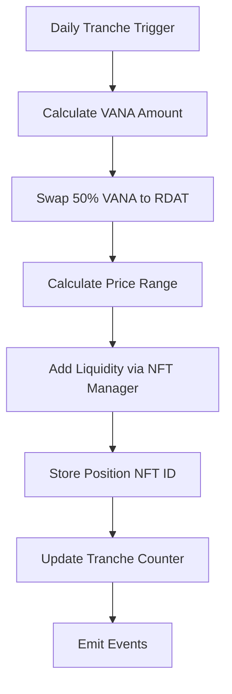

# VRC14 Liquidity Module Design

## Overview
The VRC14LiquidityModule implements the Vana VRC-14 liquidity-based DLP incentives by converting VANA rewards into liquidity over 90 daily tranches and distributing LP tokens to stakers.

## Architecture Decision: Uniswap V3

### Why Uniswap V3?
1. **Concentrated Liquidity**: More capital efficient than V2
2. **Range Orders**: Can provide liquidity at specific price ranges
3. **Better Price Discovery**: Active trading pairs on Vana
4. **NFT Positions**: Each liquidity position is an NFT (easier tracking)
5. **Fee Tiers**: Can choose appropriate fee tier (0.3% recommended)

## Design Specifications

### Core Components

```solidity
contract VRC14LiquidityModule is IRewardModule, AccessControl {
    // Uniswap V3 interfaces
    ISwapRouter public immutable swapRouter;
    INonfungiblePositionManager public immutable positionManager;
    IUniswapV3Pool public immutable rdatVanaPool;
    
    // Token addresses
    IERC20 public immutable vanaToken;
    IERC20 public immutable rdatToken;
    
    // Program parameters
    uint256 public constant TRANCHES = 90;
    uint256 public constant TRANCHE_DURATION = 1 days;
    uint24 public constant POOL_FEE = 3000; // 0.3%
    
    // State tracking
    uint256 public currentTranche;
    uint256 public lastExecutionTime;
    uint256 public totalVanaAllocated;
    uint256 public vanaPerTranche;
    
    // LP tracking
    uint256[] public tranchePositionIds; // NFT token IDs
    mapping(uint256 => uint256) public positionLiquidity;
    mapping(address => mapping(uint256 => uint256)) public userTrancheShares;
}
```

### Key Functions

1. **initializeProgram(uint256 vanaAmount)**
   - Sets total VANA allocation
   - Calculates per-tranche amount
   - Requires VANA transfer to contract

2. **executeDailyTranche()**
   - Swaps 50% VANA for RDAT
   - Adds liquidity to pool
   - Records NFT position ID
   - Updates tranche tracking

3. **claimLPRewards(address user, uint256 stakeId)**
   - Calculates user's proportional share
   - Transfers LP NFT ownership (or tracks shares)
   - Integrates with StakingManager

### Execution Flow



## Implementation Considerations

### 1. Price Impact Mitigation
- **Random Execution Time**: Within daily window to prevent MEV
- **TWAP Orders**: Split large swaps if needed
- **Slippage Protection**: Max 2% slippage on swaps

### 2. Liquidity Range Strategy
- **Full Range**: Initial implementation (0 to ∞)
- **Future**: Dynamic ranges based on current price ±50%

### 3. Security Measures
- **Reentrancy Guards**: On all external calls
- **Access Control**: Only authorized executors
- **Emergency Pause**: Can halt execution
- **Max Slippage**: Hardcoded limits

### 4. Integration Points
- **StakingManager**: For stake weights
- **RewardsManager**: For distribution orchestration
- **ProofOfContribution**: For quality scores (future)

## Information Needed

### 🔴 Critical Information Required:

1. **Vana Network Specifics**:
   - Uniswap V3 deployment addresses on Vana
   - VANA token contract address
   - Existing RDAT-VANA pool address (if any)
   - Preferred fee tier for new pool

2. **Execution Parameters**:
   - Who triggers daily tranches? (Keeper, anyone, specific role?)
   - Slippage tolerance preferences
   - Initial liquidity range strategy

3. **Distribution Logic**:
   - How to calculate staker shares? (stake amount, duration, or both?)
   - Should LP tokens be transferable or locked?
   - Vesting period for LP token claims?

### 🟡 Nice to Have:

1. **Economic Parameters**:
   - Expected VANA allocation size
   - Target APR for liquidity providers
   - Fee collection strategy

2. **Technical Preferences**:
   - Use Chainlink Keepers for automation?
   - Oracle for price feeds?

## Proposed Implementation Plan

### Phase 1: Core Module (2-3 hours)
- Basic contract structure
- Uniswap V3 integration
- Tranche execution logic

### Phase 2: Distribution System (1-2 hours)
- Share calculation
- Claim mechanism
- Integration with StakingManager

### Phase 3: Security & Testing (2 hours)
- Comprehensive tests
- Security validations
- Gas optimization

## Next Steps

1. Confirm Uniswap V3 addresses on Vana
2. Define execution trigger mechanism
3. Implement core module
4. Write comprehensive tests

## Sample Implementation Preview

```solidity
function executeDailyTranche() external nonReentrant {
    require(block.timestamp >= lastExecutionTime + TRANCHE_DURATION, "Too early");
    require(currentTranche < TRANCHES, "Program complete");
    
    uint256 vanaAmount = vanaPerTranche;
    uint256 halfVana = vanaAmount / 2;
    
    // 1. Swap half VANA for RDAT
    uint256 rdatReceived = _swapVanaForRdat(halfVana);
    
    // 2. Add liquidity
    (uint256 tokenId, uint128 liquidity,,) = _addLiquidity(
        halfVana,
        rdatReceived
    );
    
    // 3. Store position
    tranchePositionIds.push(tokenId);
    positionLiquidity[tokenId] = liquidity;
    
    // 4. Update state
    currentTranche++;
    lastExecutionTime = block.timestamp;
    
    emit TrancheExecuted(currentTranche, tokenId, liquidity);
}
```

---

**Ready to proceed with implementation once critical information is provided.**