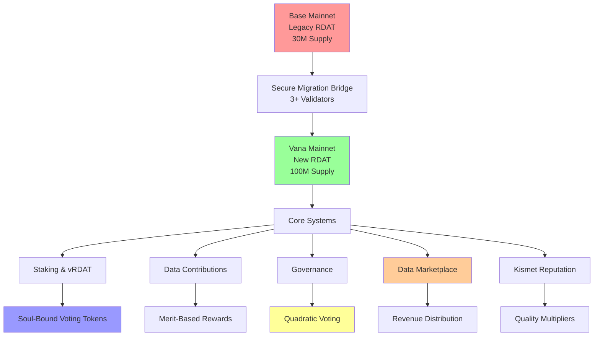
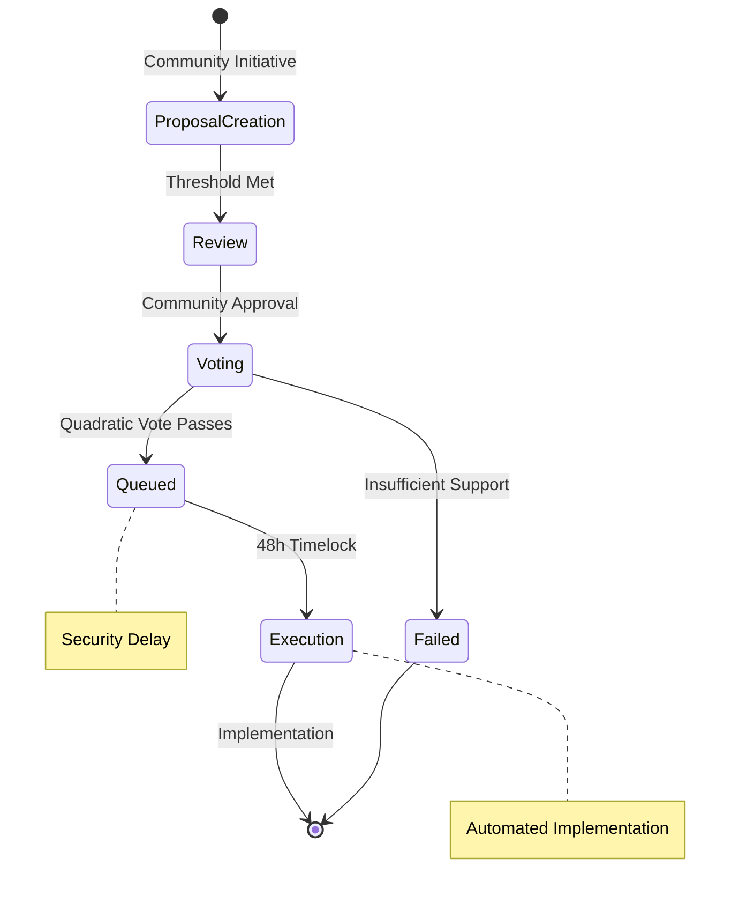

# 📊 r/datadao Whitepaper: Democratic Data Economy Through Fair Tokenomics

**Version**: 1.1  
**Date**: August 2025  
**Authors**: r/datadao Core Team  
**Abstract**: A comprehensive framework for democratizing data ownership through modular rewards architecture, proportional governance distribution, and sustainable tokenomics.

> **V2 Beta Update (August 2025)**: Implementation now includes 11 core contracts with modular rewards architecture, reducing risk from $85M+ to ~$10M. Key innovations include separated staking/rewards layers, proportional vRDAT distribution (days/365), and dynamic reward rate adjustment for 2-year sustainability. See CONTRACTS_SPEC.md for technical details.

---

## 🎯 Executive Summary

r/datadao represents a paradigm shift in data economics, establishing the first truly democratic data marketplace where contributors are fairly compensated, consumers access high-quality datasets, and governance decisions reflect community consensus rather than plutocratic control.

### Key Innovations

- **Soul-Bound Governance**: Non-transferable vRDAT tokens prevent vote buying while maintaining democratic participation
- **Quadratic Voting**: Mathematical fairness preventing whale dominance through quadratic cost scaling (Cost = Votes²)
- **Merit-Based Rewards**: Quality-driven compensation with Kismet reputation multipliers (up to 1.5x)
- **Cross-Chain Migration**: Secure multi-validator bridge with incentive bonuses (up to 5%)
- **VRC Compliance**: Deep integration with Vana's data licensing protocols for sustainable economics
- **Revenue Distribution**: 50% to stakers, 30% to treasury, 20% to contributors
- **Security Mechanisms**: Multi-sig controls, emergency pause (72hr auto-expiry), and circuit breakers
- **Flash Loan Protection**: 48-hour voting delays and position locking during governance

### Market Opportunity

The global data market, valued at $274 billion in 2022, is projected to reach $790 billion by 2030. Yet 99% of data creators receive no compensation while tech giants capture trillion-dollar valuations. r/datadao addresses this fundamental inequity through democratic redistribution of data value.

---

## 🌐 Vision: Democratizing the Data Economy

### The Problem: Data Inequality

Current data ecosystems exhibit extreme centralization:
- **Contributors**: Users generate valuable data but receive no compensation
- **Aggregators**: Platforms extract maximum value while providing minimal returns
- **Consumers**: Pay premium prices for data with questionable quality and provenance
- **Governance**: Centralized decision-making excludes stakeholder voices

### Our Solution: Democratic Data Commons

r/datadao creates a self-governing data economy where:
- **Fair Compensation**: Contributors earn rewards proportional to data quality and utility
- **Democratic Governance**: Quadratic voting ensures all voices matter, not just the wealthy
- **Quality Assurance**: Multi-factor scoring drives continuous improvement
- **Transparent Operations**: All decisions and distributions happen on-chain
- **Sustainable Growth**: Token mechanics align long-term ecosystem health with participant success

---

## 🏗️ System Architecture

### Multi-Chain Foundation



### Ecosystem Components

1. **Base Layer**: Secure migration with multi-validator consensus and 6-hour challenge periods
2. **Staking Layer**: Triple-layer architecture (Token + Staking + Rewards) with immutable StakingManager, upgradeable RewardsManager, and pluggable reward modules for unlimited flexibility
3. **Contribution Layer**: Decentralized validation with Kismet reputation multipliers
4. **Governance Layer**: Quadratic voting with flash loan protection and proposal bonds
5. **Marketplace Layer**: Dynamic pricing oracle with automated revenue distribution
6. **Security Layer**: Multi-sig controls, emergency pauses, and circuit breakers

---

## 💰 Tokenomics: Fair Distribution by Design

### RDAT Token Distribution (100M Total Supply)

| Allocation | Amount | Percentage | Purpose | Vesting |
|------------|--------|-------------|---------|---------|
| **Migration Reserve** | 30M | 30% | V1 holder migration | 100% at TGE |
| **Future Rewards** | 30M | 30% | Staking & data contributions | Phase 3 locked |
| **Treasury & Ecosystem** | 25M | 25% | DAO operations & partnerships | 10% TGE, 6mo cliff |
| **Liquidity & Staking** | 15M | 15% | DEX liquidity & incentives | 33% at TGE |

### Token Utility & Value Accrual

#### Primary Utilities
- **Data Access**: Consumers pay RDAT for premium datasets
- **Governance Rights**: Staking RDAT generates vRDAT for voting
- **Quality Staking**: Contributors stake RDAT to signal data quality
- **Network Security**: Validators stake RDAT for consensus participation

#### Value Accrual Mechanisms
- **Fixed Supply**: 100M cap ensures no dilution
- **Utility Demand**: Growing data marketplace increases token demand
- **Staking Rewards**: Long-term holders earn from pre-allocated pools
- **Quality Premiums**: High-quality data commands premium pricing

### vRDAT: Soul-Bound Governance Tokens

#### Distribution Formula (Anti-Gaming Design)
```
vRDAT = Staked_RDAT × (Lock_Days / 365)
```

- **Base Distribution**: 1:1 vRDAT ONLY for 365-day locks
- **Proportional System**: Shorter locks receive proportionally less
- **Lock Period Ratios**:
  - 365 days: 100% (1:1 ratio)
  - 180 days: 49.3% (0.493:1 ratio)
  - 90 days: 24.7% (0.247:1 ratio)
  - 30 days: 8.3% (0.083:1 ratio)

#### Anti-Gaming Mechanics
This proportional system prevents several attack vectors:
- **Sequential Staking**: 12x 30-day stakes = 12 × 8.3% = 99.6% (less than one 365-day stake)
- **Quick Unlock/Relock**: No benefit since ratio is based on lock duration
- **Sybil Attacks**: Splitting stakes across addresses provides no advantage
- **Optimal Strategy**: Always stake for maximum duration for governance power

#### Non-Transferable Properties
- **Vote Buying Prevention**: Tokens cannot be sold or transferred
- **Democratic Protection**: Prevents plutocratic capture of governance
- **Merit-Based Power**: Voting power earned through participation, not purchase
- **Long-term Alignment**: Rewards sustained community engagement

---

## 🗳️ Governance: Quadratic Democracy in Action

### Quadratic Voting Mechanics

Traditional voting systems suffer from plutocratic control where wealth equals power. r/datadao implements quadratic voting to ensure democratic fairness:

#### Cost Structure
```solidity
function calculateVoteCost(uint256 votes) public pure returns (uint256) {
    return votes * votes; // n² cost
}
```

**Example**: To cast 10 votes costs 100 vRDAT, while 100 votes costs 10,000 vRDAT

#### Security Mechanisms
- **Proposal Bonds**: 1000 RDAT required (refunded if >10% participation)
- **Emergency Governance**: 24-hour fast track for security issues
- **Multi-sig Controls**: 3-of-5 signatures for critical operations
- **Flash Loan Protection**: 48-hour delay after staking before voting

#### Democratic Benefits
- **Diminishing Returns**: Expensive to cast many votes on single issues
- **Broad Participation**: Cheaper for many people to express moderate preferences
- **Minority Protection**: Small groups can effectively advocate for important issues
- **Economic Efficiency**: Voting power scales with preference intensity, not just wealth

### Governance Structure



#### Proposal Types
1. **Parameter Changes**: Adjust system variables (fees, rewards, etc.)
2. **Treasury Allocations**: Fund development, partnerships, marketing
3. **Protocol Upgrades**: Implement new features or improvements
4. **Policy Decisions**: Set community standards and guidelines
5. **Emergency Actions**: Respond to critical security or operational issues

#### Delegation System
- **Representative Democracy**: Users can delegate voting power to trusted experts
- **Flexible Mandates**: Delegate specific topics or all governance decisions
- **Override Rights**: Delegators can vote directly on issues they care about
- **Performance Tracking**: Transparent delegate voting history and alignment metrics

---

## 📊 Data Contribution Framework

### Merit-Based Reward System

#### Quality Scoring Matrix

| Factor | Weight | Measurement | Impact |
|--------|---------|-------------|---------|
| **Freshness** | 25% | Data recency vs relevance window | Higher rewards for timely data |
| **Uniqueness** | 30% | Novelty detection algorithms | Premium for exclusive datasets |
| **Completeness** | 20% | Field population and structure | Bonus for comprehensive records |
| **Accuracy** | 20% | Cross-validation and verification | Quality multiplier up to 300% |
| **Utility** | 5% | Consumer demand and usage | Market-driven value assessment |

#### Reward Calculation
```solidity
function calculateReward(uint256 contributionId) external view returns (uint256) {
    // Base reward: 1 RDAT per MB
    uint256 baseReward = (dataSize * BASE_REWARD_PER_MB) / 1e6;
    
    // Kismet reputation multiplier (1.0x - 1.5x)
    uint256 kismetMultiplier = kismetScore.calculateRewardMultiplier(contributor);
    
    // Quality multiplier (0-300%)
    uint256 qualityMultiplier = (qualityScore * 3);
    
    // First submitter bonus
    uint256 duplicateMultiplier = isFirstSubmitter ? 100 : 10;
    
    return (baseReward * kismetMultiplier * qualityMultiplier * duplicateMultiplier) / 1000000;
}
```

#### Kismet Reputation Integration
- **Bronze Tier** (0-2500): 1.0x multiplier
- **Silver Tier** (2501-5000): 1.1x multiplier  
- **Gold Tier** (5001-7500): 1.25x multiplier
- **Platinum Tier** (7501-10000): 1.5x multiplier

### Anti-Gaming Protection

#### Sybil Resistance
- **Identity Verification**: Reddit account ownership proof with character ID
- **Staking Requirements**: Minimum RDAT stake for contribution eligibility
- **Rate Limiting**: 24-hour cooldown between submissions
- **Pattern Detection**: Statistical anomaly detection for gaming attempts
- **Multi-Validator Consensus**: 5+ validators required for quality scores

#### Quality Assurance
- **Decentralized Validation**: Consensus mechanism with 3+ validator threshold
- **Algorithmic Scoring**: Privacy-preserving quality assessment
- **Economic Penalties**: Stake slashing for low-quality or spam submissions
- **Appeal Process**: Community-driven dispute resolution
- **First Submitter Rewards**: 100% for original, 10% for duplicates

---

## 🔒 Security & Trust Framework

### Multi-Layer Security Model

#### Smart Contract Security
- **OpenZeppelin Standards**: Battle-tested contract templates
- **Formal Verification**: Mathematical proofs of critical functions
- **Multi-Signature Controls**: Distributed control over sensitive operations
- **Time-Locked Upgrades**: 48-hour delays for system changes
- **Emergency Pauses**: Circuit breakers for anomaly response

#### Economic Security
- **Quadratic Cost Scaling**: Exponentially expensive vote concentration
- **Soul-Bound Tokens**: Non-transferable governance preventing manipulation
- **Oracle Redundancy**: Multiple price feeds with deviation protection
- **Slashing Mechanisms**: Economic penalties for malicious behavior

#### Operational Security
- **Decentralized Infrastructure**: IPFS for censorship-resistant storage
- **Cross-Chain Validation**: Multi-validator consensus for migration
- **Privacy Compliance**: GDPR-compliant data handling
- **Audit Transparency**: Public audit results and remediation tracking

### Trust Mechanisms

#### Reputation Systems
- **Contributor Scores**: Historical quality and reliability metrics
- **Validator Performance**: Consensus participation and accuracy tracking
- **Delegate Alignment**: Voting history vs delegator preferences
- **Community Standing**: Peer-reviewed contribution to ecosystem health

#### Transparency Measures
- **On-Chain Governance**: All decisions recorded immutably
- **Public Metrics**: Real-time dashboard of system health and performance
- **Open Source**: Complete codebase available for community review
- **Regular Reporting**: Quarterly ecosystem health and financial reports

---

## 🌍 Economic Model & Sustainability

### Revenue Streams

#### Primary Revenue
1. **Data Marketplace Fees**: 2-5% on all data sales (dynamic based on volume)
2. **License NFT Sales**: Personal, Commercial, Enterprise data licenses
3. **Network Fees**: Transaction fees with 50/30/20 distribution model
4. **Staking Rewards**: Dual rewards from emission pool + marketplace fees

#### Revenue Distribution Model
```solidity
// All marketplace and network fees distributed as follows:
uint256 public constant STAKER_SHARE = 5000;    // 50% to stakers
uint256 public constant TREASURY_SHARE = 3000;  // 30% to treasury
uint256 public constant CONTRIBUTOR_SHARE = 2000; // 20% to contributors
```

#### Transition to Sustainability
- **Phase 1**: Fixed reward pool (30M RDAT) + marketplace fees
- **Phase 2**: Decreasing emissions + increasing fee share
- **Phase 3**: 100% fee-based rewards (post-depletion)

### Cost Structure

#### Operational Costs
- **Infrastructure**: IPFS storage, compute resources, bandwidth
- **Development**: Core team salaries, contractor payments
- **Security**: Audits, bug bounties, monitoring services
- **Legal & Compliance**: Regulatory compliance, legal advisory

#### Token Economics
- **Fixed Supply**: 100M tokens (all minted at deployment)
- **Fee Distribution**: 20% of fees to contributor pool
- **Liquidity Bootstrapping**: Initial liquidity from treasury allocation
- **Migration Process**: 1:1 swap with 1-year claim deadline
- **Staking Multipliers**: 1x (30d) to 1.75x (365d) for sustainable rewards

### Sustainability Metrics

#### Financial Health
- **Revenue Growth**: 20% quarterly growth target
- **Cost Efficiency**: Decreasing cost per user and transaction
- **Treasury Runway**: Minimum 2-year operational funding
- **Token Price Stability**: Reduced volatility through utility demand

#### Ecosystem Growth
- **User Acquisition**: 50% monthly growth in active contributors
- **Data Volume**: 100% quarterly growth in quality datasets
- **Governance Participation**: 30% of token holders actively voting
- **Developer Adoption**: Growing ecosystem of third-party applications

---

## 🚀 Implementation Roadmap

### Phase 1: Foundation (Q1 2025)
- ✅ **Migration System**: Seamless Base-to-Vana token transition
- ✅ **Basic Staking**: Simple staking with vRDAT distribution
- ✅ **Governance Core**: Quadratic voting implementation
- 🔄 **Security Audit**: Professional security assessment

### Phase 2: Data Economy (Q2 2025)
- 📋 **Contribution Platform**: Merit-based data submission system
- 📋 **Quality Scoring**: Automated and community-driven assessment
- 📋 **Reward Distribution**: Fair compensation for contributors
- 📋 **Consumer Interface**: Easy data discovery and purchase

### Phase 3: Advanced Governance (Q3 2025)
- 📋 **Delegation System**: Representative democracy features
- 📋 **Proposal Templates**: Standardized governance processes
- 📋 **Cross-Chain Expansion**: Multi-chain governance capabilities
- 📋 **Advanced Analytics**: Comprehensive ecosystem metrics

### Phase 4: Ecosystem Maturity (Q4 2025)
- 📋 **API Marketplace**: Third-party developer integrations
- 📋 **Enterprise Solutions**: Large-scale data partnerships
- 📋 **Global Expansion**: International compliance and localization
- 📋 **DAO Autonomy**: Full community control transition

---

## 📈 Market Analysis & Competitive Positioning

### Market Landscape

#### Traditional Data Markets
- **Centralized Platforms**: High fees, low quality assurance, no contributor rewards
- **Enterprise Solutions**: Expensive, limited access, poor transparency
- **Research Datasets**: Academic silos, restricted access, outdated information

#### Blockchain Data Projects
- **Ocean Protocol**: Focus on enterprise, complex tokenomics, limited governance
- **Streamr**: Streaming data emphasis, technical complexity barriers
- **Basic Attention Token**: Single-use case, centralized control

### r/datadao Advantages

#### Technical Differentiation
- **Quadratic Governance**: First implementation of fair voting in data economy
- **Soul-Bound Tokens**: Novel approach preventing governance manipulation
- **Merit-Based Rewards**: Quality-driven compensation unlike competitors
- **Cross-Chain Architecture**: Seamless multi-chain operation

#### Economic Innovation
- **Fair Distribution**: 60% of tokens for community vs typical 10-20%
- **Sustainable Tokenomics**: Fixed supply with fee-based rewards
- **Democratic Control**: Community governance vs centralized management
- **Transparent Operations**: Full on-chain activity vs opaque corporations

### Go-to-Market Strategy

#### Phase 1: Community Building
- **Reddit Integration**: Leverage existing r/datadao community
- **Content Creator Programs**: Incentivize early adopters and influencers
- **Developer Relations**: Build ecosystem of third-party tools
- **Educational Content**: Webinars, tutorials, and documentation

#### Phase 2: Data Partnerships
- **Research Institutions**: Academic partnerships for dataset contribution
- **Content Platforms**: Integration with social media and publishing
- **Enterprise Pilots**: Proof-of-concept implementations
- **Government Relations**: Public sector transparency initiatives

#### Phase 3: Market Expansion
- **Geographic Expansion**: International compliance and localization
- **Vertical Integration**: Industry-specific data marketplaces
- **Platform Partnerships**: Integration with existing data tools
- **Acquisition Strategy**: Strategic purchases of complementary projects

---

## ⚖️ Legal & Regulatory Framework

### Compliance Strategy

#### Regulatory Alignment
- **Securities Law**: Utility token design minimizing security characteristics
- **Data Protection**: GDPR, CCPA, and international privacy law compliance
- **Financial Regulations**: Anti-money laundering and know-your-customer procedures
- **Tax Optimization**: Structure supporting contributor tax efficiency

#### Legal Structure
- **DAO Formation**: Legal wrapper providing limited liability protection
- **Intellectual Property**: Open-source licensing with contributor protections
- **Terms of Service**: Clear user agreements and dispute resolution
- **International Operations**: Multi-jurisdiction compliance framework

### Risk Mitigation

#### Technical Risks
- **Smart Contract Bugs**: Comprehensive auditing and formal verification
- **Oracle Failures**: Multi-source price feeds with fallback mechanisms
- **Scalability Issues**: Layer 2 solutions and cross-chain architecture
- **Security Breaches**: Multi-signature controls and emergency procedures

#### Economic Risks
- **Token Volatility**: Managed through vesting schedules and fixed supply
- **Market Competition**: First-mover advantage and network effects
- **Regulatory Changes**: Flexible architecture supporting compliance updates
- **Economic Attacks**: Game-theoretic analysis and penalty mechanisms

#### Operational Risks
- **Team Dependency**: Decentralization roadmap reducing single points of failure
- **Technology Obsolescence**: Upgradeable architecture supporting evolution
- **Community Governance**: Education and tooling supporting effective participation
- **Partnership Risks**: Diversified partnership portfolio and legal protections

---

## 🌟 Conclusion: Building the Future of Fair Data

r/datadao represents more than a tokenomics experiment—it's a blueprint for democratic data ownership in the digital age. By combining cutting-edge governance mechanisms with fair economic incentives, we create a sustainable ecosystem where all participants benefit from the value they create.

### Key Innovations

1. **Mathematical Fairness**: Quadratic voting ensures democratic participation regardless of wealth
2. **Merit-Based Economics**: Quality-driven rewards incentivize valuable contributions
3. **Soul-Bound Governance**: Non-transferable tokens prevent plutocratic capture
4. **Cross-Chain Architecture**: Seamless multi-blockchain operation
5. **Sustainable Tokenomics**: Long-term value creation through utility demand

### Vision for Impact

#### Short-Term (1-2 Years)
- **10,000+ Active Contributors**: Vibrant community of data creators
- **1TB+ Quality Data**: Comprehensive, verified datasets
- **$10M+ Contributor Rewards**: Fair compensation for value creation
- **50+ Enterprise Partnerships**: Real-world adoption and usage

#### Medium-Term (3-5 Years)
- **Global Data Standard**: r/datadao protocols adopted industry-wide
- **$1B+ Data Economy**: Self-sustaining marketplace ecosystem
- **100+ Countries**: International expansion and compliance
- **Democratic Governance**: Full community control and autonomy

#### Long-Term (5+ Years)
- **Data Rights Revolution**: Fundamental shift in data ownership paradigms
- **Economic Democracy**: Model for other industries and applications
- **Global Commons**: Shared data infrastructure benefiting humanity
- **Sustainable Future**: Proof that fair economics can scale globally

### Call to Action

The transition from data extraction to data democracy requires collective action. We invite:

- **Contributors**: Share your data and earn fair rewards
- **Consumers**: Access high-quality datasets with transparent provenance
- **Developers**: Build the tools and applications of tomorrow
- **Governance Participants**: Help guide our democratic future
- **Partners**: Collaborate on expanding the data commons

Together, we can build an economy where data creates value for everyone, not just a privileged few. The future of fair data starts now.

---

## 📚 Appendices

### Appendix A: Technical Specifications
*Detailed smart contract architecture and implementation details*

### Appendix B: Economic Modeling
*Mathematical analysis of tokenomics and sustainability projections*

### Appendix C: Security Analysis
*Comprehensive threat modeling and mitigation strategies*

### Appendix D: Legal Framework
*Regulatory compliance documentation and legal opinions*

### Appendix E: Market Research
*Competitive analysis and market opportunity assessment*

---

**Document Information**
- **Version**: 1.0
- **Date**: November 2024  
- **Authors**: r/datadao Core Team
- **Review**: Community Review Period (30 days)
- **Approval**: Governance Vote Required
- **License**: Creative Commons Attribution 4.0 International

**Contact Information**
- **Website**: https://rdatadao.org
- **Documentation**: https://docs.rdatadao.org
- **Community**: https://discord.gg/rdatadao
- **Governance**: https://gov.rdatadao.org
- **Code**: https://github.com/rdatadao

---

*This whitepaper represents the current vision and technical specifications for r/datadao. All proposals are subject to community governance and may evolve based on stakeholder feedback and market conditions. Past performance does not guarantee future results. Participants should conduct their own research and understand the risks involved in decentralized systems.*