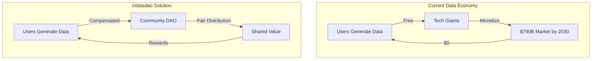
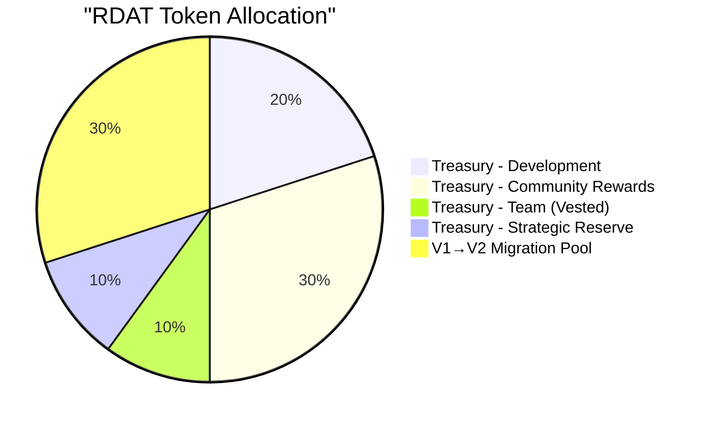
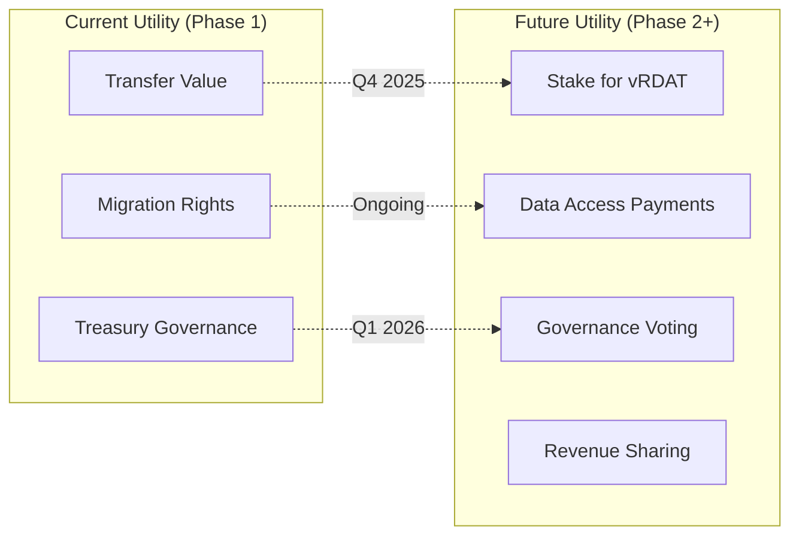
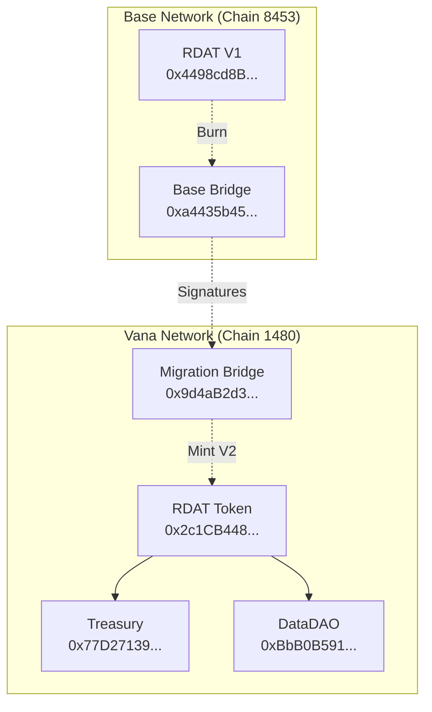
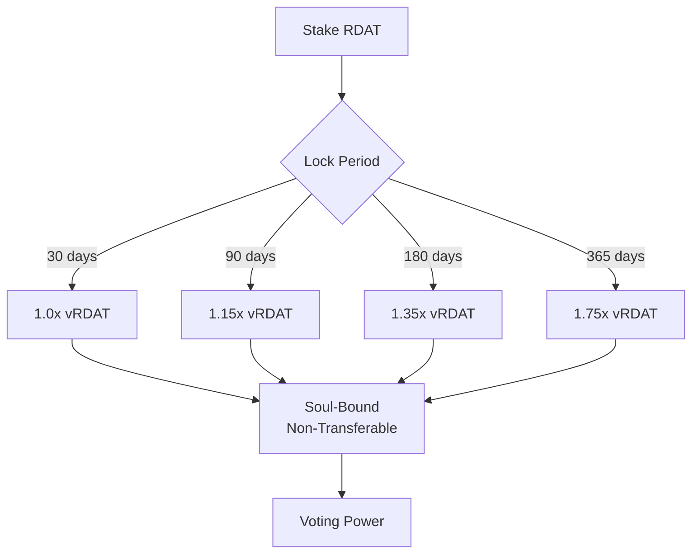
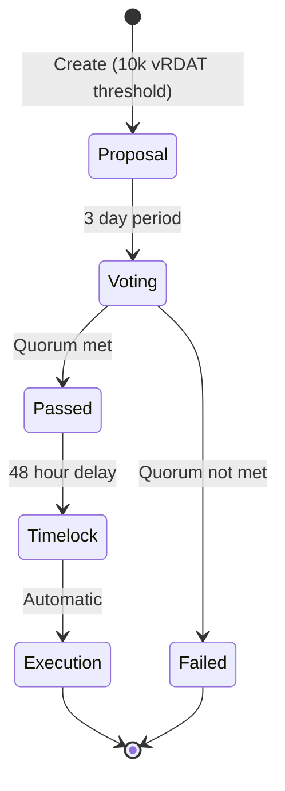
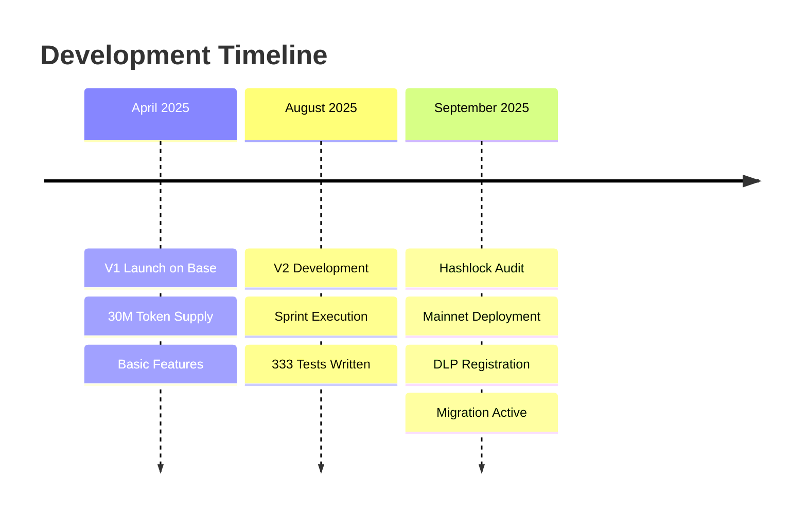
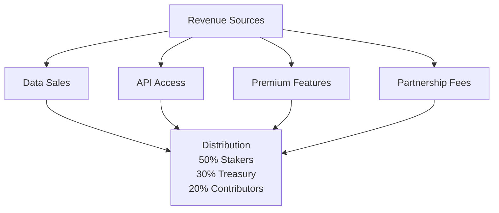

# 📊 r/datadao Whitepaper: Democratic Data Economy

**Version**: 2.0 - Production Release
**Last Updated**: September 20, 2025
**Authors**: r/datadao Core Team
**Status**: Phase 1 Live on Mainnet ✅

> **Abstract**: r/datadao democratizes data ownership through a community-governed ecosystem where Reddit users can monetize their data contributions. Built on Vana network with a fixed supply of 100M RDAT tokens, the protocol enables fair compensation, democratic governance, and sustainable value distribution.

---

## 🎯 Executive Summary

r/datadao has successfully launched on mainnet, establishing the foundation for a democratic data marketplace. Phase 1 delivers core token infrastructure, cross-chain migration, and treasury management, with staking and governance features planned for Phase 2.

### Current Achievements (September 2025)
- ✅ **100M RDAT** deployed with fixed supply (no inflation)
- ✅ **Cross-chain migration** from Base to Vana operational
- ✅ **DLP Integration** registered (ID: 40) for data rewards
- ✅ **Hashlock audit** completed with all findings remediated
- ✅ **Multisig governance** with 3/5 threshold for security

### Upcoming Features (Q4 2025 - Q1 2026)
- ⏳ Soul-bound vRDAT governance tokens
- ⏳ NFT-based staking with time-lock multipliers
- ⏳ On-chain quadratic voting
- ⏳ Modular rewards distribution
- ⏳ Revenue sharing mechanisms

---

## 🌐 Vision & Problem Statement

### The Data Inequality Crisis

The global data market will reach $790 billion by 2030, yet data creators receive no compensation while platforms capture trillion-dollar valuations. r/datadao redistributes this value democratically.

### Our Solution: Community-Owned Data Commons

r/datadao creates an ecosystem where:
- **Contributors** earn RDAT for quality data submissions
- **Validators** ensure data integrity through consensus
- **Consumers** access verified datasets at fair prices
- **Governance** remains democratic through quadratic voting
- **Value** flows back to the community, not corporations

---

## 💰 Token Economics

### RDAT Token Distribution (100M Total Supply)

### Detailed Allocation

| Allocation | Amount (RDAT) | Percentage | Purpose | Status |
|------------|---------------|------------|---------|--------|
| **Migration Pool** | 30,000,000 | 30% | V1 holder 1:1 swap | Live ✅ |
| **Community Rewards** | 30,000,000 | 30% | Future staking/data rewards | Phase 3 locked |
| **Development Fund** | 20,000,000 | 20% | Protocol development | DAO controlled |
| **Team Allocation** | 10,000,000 | 10% | Core team compensation | 6mo cliff + 18mo vesting |
| **Strategic Reserve** | 10,000,000 | 10% | Partnerships & emergency | Multisig controlled |

### Token Utility

### Value Accrual Mechanisms

1. **Fixed Supply**: No inflation, all 100M minted at deployment
2. **Utility Demand**: Required for data access and governance
3. **Staking Rewards**: Long-term holders earn from treasury pools
4. **Revenue Distribution**: Protocol fees flow to stakers (50%), treasury (30%), contributors (20%)
5. **Network Effects**: More data → more consumers → higher token demand

---

## 🏗️ Technical Architecture

### Current System (Phase 1 - Live)

### Migration Process

1. **User initiates** on Base network
2. **V1 tokens burned** (sent to 0xdead)
3. **Validators sign** (2/3 required)
4. **User claims** on Vana with signatures
5. **V2 tokens minted** at 1:1 ratio

### Security Model

- **Multisig Control**: 3/5 signers for critical operations
- **Emergency Pause**: 72-hour auto-expiry protection
- **Audit Complete**: Hashlock security review passed
- **Challenge Period**: 6-hour window for migration disputes
- **No Minting**: Fixed supply prevents inflation attacks

---

## 🗳️ Governance Framework (Phase 2)

### Planned vRDAT Distribution

### Quadratic Voting (Coming Q1 2026)

Traditional voting: 1 token = 1 vote (plutocracy)
Quadratic voting: Cost = Votes² (democracy)

**Example**:
- 1 vote = 1 vRDAT
- 10 votes = 100 vRDAT
- 100 votes = 10,000 vRDAT

This ensures:
- Small holders have meaningful voice
- Large holders can't dominate
- Preference intensity is expressed
- Sybil attacks are costly

### Governance Process

---

## 📈 Roadmap & Milestones

### Completed Milestones ✅

### Upcoming Milestones

| Phase | Timeline | Features | Status |
|-------|----------|----------|--------|
| **Phase 2A** | Q4 2025 | Staking system, vRDAT tokens, NFT positions | Development |
| **Phase 2B** | Q1 2026 | On-chain governance, quadratic voting | Planning |
| **Phase 3** | Q2 2026 | Data marketplace, reward distribution | Design |
| **Phase 4** | H2 2026 | Cross-chain expansion, advanced DLP | Research |

### Key Performance Indicators

**Current Metrics** (September 2025):
- Total Supply: 100,000,000 RDAT ✅
- Migration Pool: 30,000,000 RDAT ✅
- DLP ID: 40 ✅
- Audit Status: Complete ✅

**Target Metrics** (December 2025):
- Total Value Locked: 30M RDAT
- Active Stakers: 1,000+
- Governance Proposals: 10+
- Migration Completion: 50%+

---

## 🌟 Competitive Analysis

### r/datadao Advantages

| Feature | r/datadao | Traditional Data Markets | Web3 Competitors |
|---------|-----------|-------------------------|------------------|
| **Data Ownership** | User-owned ✅ | Platform-owned ❌ | Mixed 🔄 |
| **Value Distribution** | Community 100% ✅ | Platform 100% ❌ | Variable 🔄 |
| **Governance** | Democratic ✅ | Centralized ❌ | Token-weighted 🔄 |
| **Supply Model** | Fixed 100M ✅ | N/A | Inflationary ❌ |
| **Audit Status** | Hashlock ✅ | N/A | Variable 🔄 |
| **Network** | Vana (specialized) ✅ | Traditional cloud ❌ | Ethereum (expensive) ❌ |

### Unique Value Propositions

1. **First Reddit-focused data DAO** with direct community benefits
2. **Fixed supply tokenomics** preventing dilution
3. **Soul-bound governance** preventing plutocracy
4. **Vana DLP integration** for specialized data rewards
5. **Cross-chain migration** preserving V1 holder value

---

## 💼 Business Model

### Revenue Streams

### Sustainability Mechanisms

1. **No inflation**: Fixed supply ensures long-term value
2. **Treasury reserves**: 70M RDAT for ecosystem growth
3. **Revenue generation**: Multiple income streams
4. **Vesting schedules**: Prevents dump scenarios
5. **Staking incentives**: Reduces circulating supply

---

## 🔒 Risk Analysis & Mitigation

### Technical Risks

| Risk | Likelihood | Impact | Mitigation |
|------|------------|--------|------------|
| Smart contract bug | Low | High | Hashlock audit complete ✅ |
| Bridge vulnerability | Low | High | 2/3 validator consensus ✅ |
| Governance attack | Low | Medium | Quadratic voting (Phase 2) |
| Liquidity crisis | Medium | Medium | Treasury reserves available |

### Market Risks

| Risk | Likelihood | Impact | Mitigation |
|------|------------|--------|------------|
| Low adoption | Medium | High | Reddit community engagement |
| Regulatory changes | Medium | Medium | Compliance monitoring |
| Competition | High | Medium | First-mover advantage |
| Token volatility | High | Low | Fixed supply stability |

### Mitigation Strategies

1. **Security**: Continuous audits and bug bounties
2. **Liquidity**: Strategic treasury deployment
3. **Adoption**: Community incentives and education
4. **Compliance**: Legal counsel and flexibility
5. **Competition**: Rapid innovation and user focus

---

## 📊 Financial Projections

### Conservative Growth Scenario

| Metric | Q4 2025 | Q1 2026 | Q2 2026 | Q4 2026 |
|--------|---------|---------|---------|---------|
| **TVL** | 10M RDAT | 20M RDAT | 30M RDAT | 50M RDAT |
| **Active Users** | 500 | 1,000 | 2,500 | 10,000 |
| **Data Contributions** | 10k/mo | 25k/mo | 50k/mo | 100k/mo |
| **Revenue** | $10k/mo | $25k/mo | $50k/mo | $100k/mo |
| **Token Price** | $0.10 | $0.15 | $0.25 | $0.50 |

### Bull Case Scenario

With successful Phase 2 launch and viral adoption:
- TVL could reach 75M RDAT by Q4 2026
- User base could exceed 50,000 active participants
- Monthly revenue could reach $500k+
- Token price could reach $1-2 range

---

## 🤝 Team & Advisors

### Core Team
- **Development**: Experienced Solidity engineers with DeFi background
- **Product**: Data economy specialists from Web2 and Web3
- **Community**: Reddit power users and DAO operators
- **Security**: Audited by Hashlock, ongoing security reviews

### Key Partners
- **Vana Network**: DLP infrastructure and support
- **Base Network**: Migration bridge cooperation
- **Gnosis Safe**: Multisig infrastructure
- **Reddit Communities**: r/cryptocurrency, r/ethereum support

---

## 📝 Legal Disclaimer

This whitepaper is for informational purposes only and does not constitute financial advice or a securities offering. RDAT tokens are utility tokens for the r/datadao ecosystem. Participation involves risk, and users should conduct their own research.

### Regulatory Compliance
- Utility token classification (not a security)
- No promise of profits from efforts of others
- Decentralized governance structure
- Community-driven development

---

## 🔮 Conclusion

r/datadao represents a paradigm shift in data ownership, returning value to the creators who generate it. With Phase 1 successfully deployed, a clear roadmap to full decentralization, and a committed community, we are building the foundation for a truly democratic data economy.

### Join the Revolution
- **Website**: [rdatadao.org](https://rdatadao.org)
- **Discord**: [discord.gg/rdatadao](https://discord.gg/rdatadao)
- **Twitter**: [@rdatadao](https://twitter.com/rdatadao)
- **GitHub**: [github.com/rdatadao](https://github.com/rdatadao)

---

**"Your data, your value, your voice."**

*Last Updated: September 20, 2025*
*Version: 2.0 - Production Release*