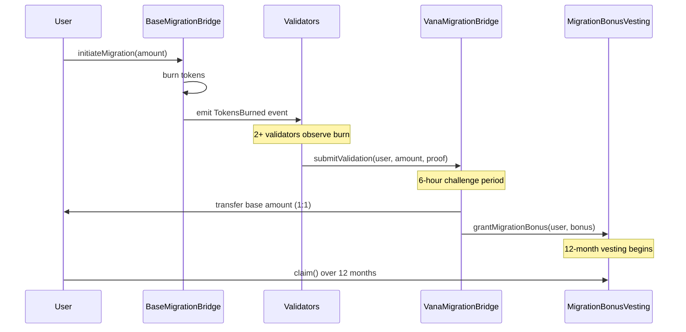

# 🌉 Migration Architecture Documentation

**Version**: 1.0  
**Date**: August 6, 2025  
**Status**: Implemented and Tested

## 📋 Overview

The RDAT V1→V2 migration system enables cross-chain token migration from Base to Vana with built-in security measures and incentive mechanisms. The architecture separates concerns between token exchange and bonus distribution.

## 🏗️ Architecture Components

### 1. **BaseMigrationBridge** (Base Chain)
- Burns V1 RDAT tokens
- Emits events for validator monitoring
- Implements daily migration limits
- Emergency pause capability

### 2. **VanaMigrationBridge** (Vana Chain)
- Releases V2 RDAT tokens (1:1 exchange)
- Multi-validator consensus (2-of-3 minimum)
- 6-hour challenge period
- Coordinates with bonus vesting contract

### 3. **MigrationBonusVesting** (Vana Chain)
- Manages migration bonus distribution
- 12-month linear vesting (no cliff)
- Separate funding from migration reserve
- Automatic beneficiary management

## 💰 Token Allocation Strategy

### **Migration Reserve (30M RDAT)**
- **Purpose**: 1:1 exchange for existing Base holders
- **Source**: Pre-allocated in RDAT initialize()
- **Distribution**: Direct transfer on validated migration

### **Bonus Incentives (2-3M RDAT estimated)**
- **Purpose**: Early migration incentives
- **Source**: Liquidity & Staking allocation (NOT migration reserve)
- **Distribution**: 12-month linear vesting

## 🔄 Migration Flow



## 🎯 Incentive Structure

| Migration Period | Bonus Rate | Example (10K RDAT) | Vesting |
|-----------------|------------|-------------------|---------|
| Week 1-2 | 5% | 500 RDAT | 12 months |
| Week 3-4 | 3% | 300 RDAT | 12 months |
| Week 5-8 | 1% | 100 RDAT | 12 months |
| After Week 8 | 0% | 0 RDAT | N/A |

## 🔒 Security Features

### **Multi-Validator Consensus**
- Minimum 3 validators deployed
- 2-of-3 consensus required
- Validators can be added/removed by admin
- Each validation is recorded on-chain

### **Challenge Period**
- 6-hour window after consensus
- Any validator can challenge suspicious migrations
- Challenged migrations are permanently blocked
- Admin can resolve disputes if needed

### **Daily Limits**
- Default: 300,000 RDAT per day
- Configurable by admin
- Prevents large-scale exploitation
- Resets every 24 hours

### **Burn Hash Tracking**
- Each Base burn transaction tracked
- Prevents double-spending
- Permanent on-chain record
- Cross-referenced by validators

## 📊 Implementation Status

### **Completed** ✅
- BaseMigrationBridge contract
- VanaMigrationBridge contract
- MigrationBonusVesting contract
- Multi-validator consensus mechanism
- Challenge period implementation
- Daily limit enforcement
- Deployment scripts

### **Test Coverage**
- BaseMigrationBridge: 13/13 tests passing
- VanaMigrationBridge: 15/15 tests passing
- CrossChainMigration: 2/4 tests passing
- MigrationBonusVesting: Implementation complete

## 🚀 Deployment Considerations

### **Validator Setup**
1. Deploy with initial 3 validators
2. Validators should be:
   - Geographically distributed
   - Run by different entities
   - Monitoring Base chain 24/7
   - Using secure infrastructure

### **Funding Requirements**
1. **Migration Bridge**: 30M RDAT from migration reserve
2. **Bonus Vesting**: 2-3M RDAT from liquidity allocation
3. **Gas Reserves**: ETH/VANA for validator operations

### **Configuration**
```solidity
// Recommended initial settings
DAILY_LIMIT = 300,000 RDAT
MIN_VALIDATORS = 3
CHALLENGE_PERIOD = 6 hours
BONUS_RATES = [500, 300, 100, 0] // basis points
```

## 🔍 Monitoring & Operations

### **Key Metrics to Track**
- Daily migration volume
- Bonus utilization rate
- Validator response times
- Challenge frequency
- Gas costs per migration

### **Emergency Procedures**
1. **Pause Migrations**: Both bridges can be paused
2. **Update Validators**: Add/remove as needed
3. **Adjust Limits**: Modify daily caps if required
4. **Resolve Challenges**: Admin intervention possible

## 📝 Key Design Decisions

### **Why Separate Bonus Vesting?**
- **Clarity**: 30M reserve is strictly for 1:1 exchange
- **Flexibility**: Bonus funding can be adjusted
- **Transparency**: Clear allocation sources
- **Sustainability**: Prevents reserve depletion

### **Why 12-Month Vesting?**
- **Alignment**: Long-term holder incentives
- **Protection**: Prevents immediate dumping
- **Fairness**: Equal treatment for all migrants
- **Simplicity**: No cliff reduces complexity

### **Why Multi-Validator?**
- **Decentralization**: No single point of failure
- **Security**: Consensus prevents fraud
- **Reliability**: System continues if validator fails
- **Trust**: Multiple parties verify migrations

## ✅ Summary

The migration architecture successfully balances security, user experience, and economic incentives. By separating the migration reserve from bonus allocations and implementing robust security measures, the system ensures a smooth transition for V1 holders while protecting the protocol from exploitation.