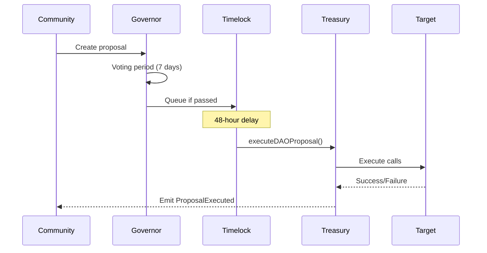

# Treasury Execution Flow Documentation

## Overview

The TreasuryWallet contract manages 70M RDAT tokens with sophisticated vesting schedules and DAO-controlled distribution mechanisms. This document details the execution flow for treasury operations.

## Contract Architecture

```
┌──────────────────────────────────────────────────────┐
│                  TreasuryWallet                       │
├──────────────────────────────────────────────────────┤
│ Balance: 70,000,000 RDAT                            │
│                                                      │
│ Roles:                                              │
│ - DEFAULT_ADMIN_ROLE (Multisig)                     │
│ - EXECUTOR_ROLE (Governor/Timelock)                 │
│                                                      │
│ Key Functions:                                      │
│ - createVestingSchedule()                          │
│ - executeDAOProposal()                             │
│ - checkAndRelease()                                 │
│ - emergencyWithdraw()                              │
└──────────────────────────────────────────────────────┘
```

## Execution Flow for DAO Proposals

### Step 1: Proposal Creation (Off-Chain)

```solidity
// Proposal structure
struct Proposal {
    uint256 proposalId;
    address[] targets;      // Contract addresses to call
    uint256[] values;       // ETH amounts (usually 0)
    bytes[] calldatas;      // Encoded function calls
    string description;     // Human-readable description
}
```

### Step 2: Governance Vote

1. **Proposal Submission**
   - Submitted through Governor contract
   - Must meet proposal threshold
   - 1-day voting delay

2. **Voting Period** (7 days)
   - vRDAT holders vote with quadratic cost
   - Requires quorum to pass

3. **Timelock Queue** (48 hours)
   - Successful proposals enter timelock
   - Allows time for security review

### Step 3: Treasury Execution

```solidity
function executeDAOProposal(
    uint256 proposalId,
    address[] calldata targets,
    uint256[] calldata values,
    bytes[] calldata calldatas
) external onlyRole(EXECUTOR_ROLE)
```

**Security Checks:**
- ✅ Caller must have EXECUTOR_ROLE (Governor/Timelock)
- ✅ Proposal must match governance vote
- ✅ Arrays must have matching lengths
- ✅ Total value must not exceed balance

**Execution Process:**
1. Validate proposalId matches governance
2. Iterate through each target/calldata pair
3. Execute each call with specified value
4. Emit ProposalExecuted event
5. Revert entire transaction if any call fails

### Step 4: Common Treasury Operations

#### 4.1 Token Distribution
```solidity
// Example: Distribute 1M RDAT to development fund
targets[0] = RDAT_TOKEN_ADDRESS;
values[0] = 0;
calldatas[0] = abi.encodeWithSignature(
    "transfer(address,uint256)",
    DEVELOPMENT_FUND,
    1_000_000e18
);
```

#### 4.2 Create Vesting Schedule
```solidity
// Example: Create team vesting
targets[0] = TREASURY_WALLET_ADDRESS;
values[0] = 0;
calldatas[0] = abi.encodeWithSignature(
    "createVestingSchedule(address,uint256,uint256,uint256,uint256,uint256,bool)",
    teamMember,        // beneficiary
    totalAmount,       // total allocation
    tgeUnlock,        // immediate release
    cliffDuration,    // 6 months
    vestingDuration,  // 18 months
    0,                // start time (immediate)
    false             // not phase3 gated
);
```

#### 4.3 Emergency Actions
```solidity
// Example: Emergency pause
targets[0] = EMERGENCY_PAUSE_ADDRESS;
values[0] = 0;
calldatas[0] = abi.encodeWithSignature("emergencyPause()");
```

## Security Considerations

### Access Control Matrix

| Role | Can Execute | Typical Holder |
|------|------------|----------------|
| DEFAULT_ADMIN_ROLE | createVestingSchedule, admin functions | 3/5 Multisig |
| EXECUTOR_ROLE | executeDAOProposal | Governor + Timelock |
| No Role | checkAndRelease (for self) | Any beneficiary |

### Risk Mitigations

1. **Arbitrary Call Risk**
   - **Issue**: executeDAOProposal can call any contract
   - **Mitigation**: EXECUTOR_ROLE restricted to Governor+Timelock
   - **Additional**: 48-hour timelock allows intervention

2. **Reentrancy Protection**
   - All critical functions use reentrancy guards
   - State changes before external calls

3. **Value Transfer Limits**
   - Cannot send more ETH than contract holds
   - RDAT transfers limited by balance

4. **Proposal Validation**
   - ProposalId must match governance system
   - Arrays must have matching lengths

### Emergency Procedures

```solidity
function emergencyWithdraw(address token, uint256 amount) 
    external 
    onlyRole(DEFAULT_ADMIN_ROLE)
```

**When to Use:**
- Contract migration required
- Critical security incident
- Recovery from stuck tokens

**Requirements:**
- 3/5 multisig approval
- Documented reason
- Community notification

## Integration with Governance



## Best Practices

### For Proposal Creators

1. **Test on Testnet First**
   - Deploy identical setup on testnet
   - Execute proposal end-to-end
   - Verify expected outcomes

2. **Clear Documentation**
   - Detailed description in proposal
   - Explain each target and calldata
   - Include simulation results

3. **Batch Related Actions**
   - Group related operations
   - Single proposal for coherent changes
   - Reduces governance overhead

### For Executors

1. **Verify Before Execution**
   - Match proposal to governance vote
   - Check contract addresses
   - Simulate transaction

2. **Monitor Execution**
   - Watch for events
   - Verify state changes
   - Document outcomes

3. **Emergency Response**
   - Have pause mechanism ready
   - Monitor for anomalies
   - Quick communication channels

## Common Patterns

### Pattern 1: Quarterly Distribution
```solidity
// Distribute Q1 2025 allocations
address[] memory targets = new address[](3);
uint256[] memory values = new uint256[](3);
bytes[] memory calldatas = new bytes[](3);

// Development: 2M RDAT
targets[0] = RDAT_TOKEN;
calldatas[0] = abi.encodeWithSignature(
    "transfer(address,uint256)",
    DEV_FUND,
    2_000_000e18
);

// Marketing: 1M RDAT
targets[1] = RDAT_TOKEN;
calldatas[1] = abi.encodeWithSignature(
    "transfer(address,uint256)",
    MARKETING_FUND,
    1_000_000e18
);

// Community: 3M RDAT
targets[2] = RDAT_TOKEN;
calldatas[2] = abi.encodeWithSignature(
    "transfer(address,uint256)",
    COMMUNITY_FUND,
    3_000_000e18
);
```

### Pattern 2: Vesting Setup
```solidity
// Setup team vesting for 5 members
for (uint i = 0; i < teamMembers.length; i++) {
    targets[i] = TREASURY_WALLET;
    calldatas[i] = abi.encodeWithSignature(
        "createVestingSchedule(address,uint256,uint256,uint256,uint256,uint256,bool)",
        teamMembers[i],
        allocations[i],
        allocations[i] * 25 / 100,  // 25% TGE
        6 * 30 days,                // 6 month cliff
        18 * 30 days,               // 18 month vesting
        block.timestamp,
        false
    );
}
```

### Pattern 3: Contract Upgrade Funding
```solidity
// Fund new contract deployment
targets[0] = RDAT_TOKEN;
calldatas[0] = abi.encodeWithSignature(
    "transfer(address,uint256)",
    NEW_CONTRACT,
    INITIAL_FUNDING
);

// Approve spending
targets[1] = RDAT_TOKEN;
calldatas[1] = abi.encodeWithSignature(
    "approve(address,uint256)",
    NEW_CONTRACT,
    SPENDING_LIMIT
);
```

## Monitoring and Alerts

### Events to Monitor

```solidity
event ProposalExecuted(uint256 indexed proposalId, bool success);
event VestingScheduleCreated(address indexed beneficiary, uint256 amount);
event TokensReleased(address indexed beneficiary, uint256 amount);
event EmergencyWithdrawal(address token, uint256 amount);
```

### Key Metrics

- Total RDAT in treasury
- Active vesting schedules
- Released vs locked amounts
- Proposal execution success rate
- Emergency withdrawal history

## Appendix: Error Messages

| Error | Meaning | Resolution |
|-------|---------|------------|
| `AccessControlUnauthorizedAccount` | Missing required role | Use correct account/multisig |
| `InvalidProposalArrays` | Mismatched array lengths | Ensure targets/values/calldatas match |
| `InsufficientBalance` | Not enough tokens/ETH | Check treasury balance |
| `ProposalExecutionFailed` | Target call reverted | Debug individual call |
| `VestingScheduleNotFound` | Invalid beneficiary | Check vesting schedule exists |

## Conclusion

The treasury execution flow provides a secure, transparent mechanism for DAO-controlled fund management. The combination of:
- Multi-signature admin control
- Governance voting requirements
- 48-hour timelock delays
- Comprehensive event logging

Ensures that treasury operations are both flexible and secure, protecting the DAO's assets while enabling effective fund deployment.

---

**Last Updated**: August 7, 2024
**Version**: 1.0
**Status**: Production Ready