# r/datadao Smart Contract Workflow Sequence Diagrams

## Table of Contents
1. [Migration Workflows](#1-migration-workflows)
2. [Staking Workflows](#2-staking-workflows)
3. [Governance Workflows](#3-governance-workflows)
4. [Contribution Workflows](#4-contribution-workflows)
5. [Admin Workflows](#5-admin-workflows)
6. [Front-End Integration Points](#6-front-end-integration-points)

---

## 1. Migration Workflows

### 1.1 Complete V1 to V2 Token Migration

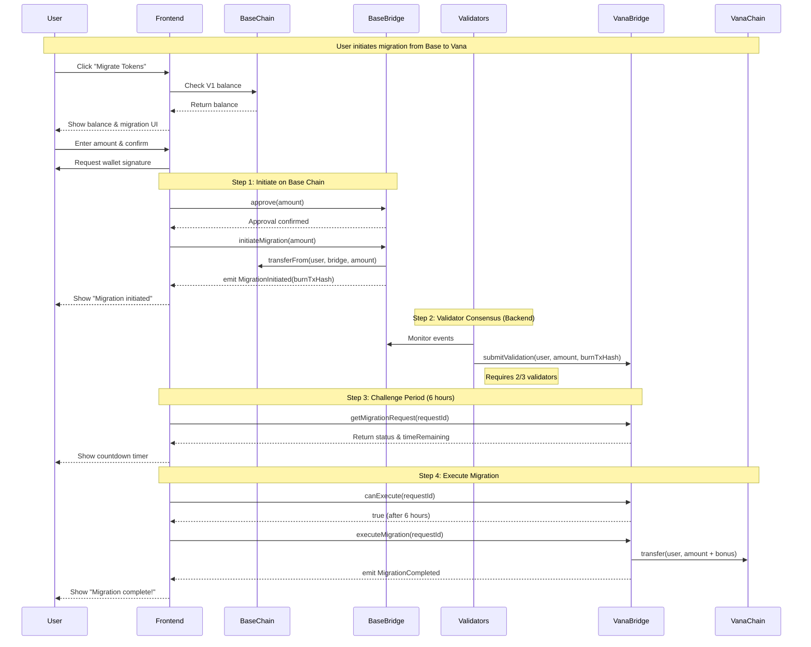

### 1.2 Migration with Early Bird Bonus

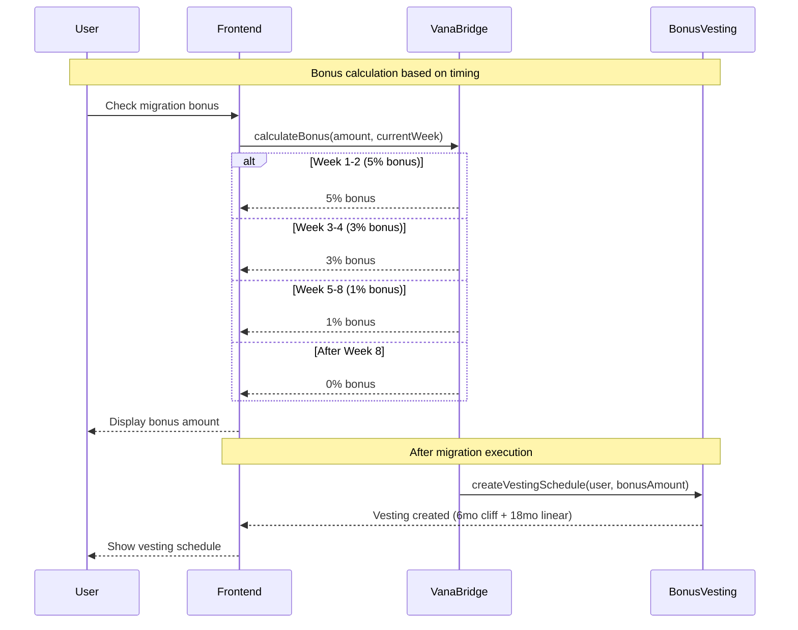

---

## 2. Staking Workflows

### 2.1 User Stakes Tokens

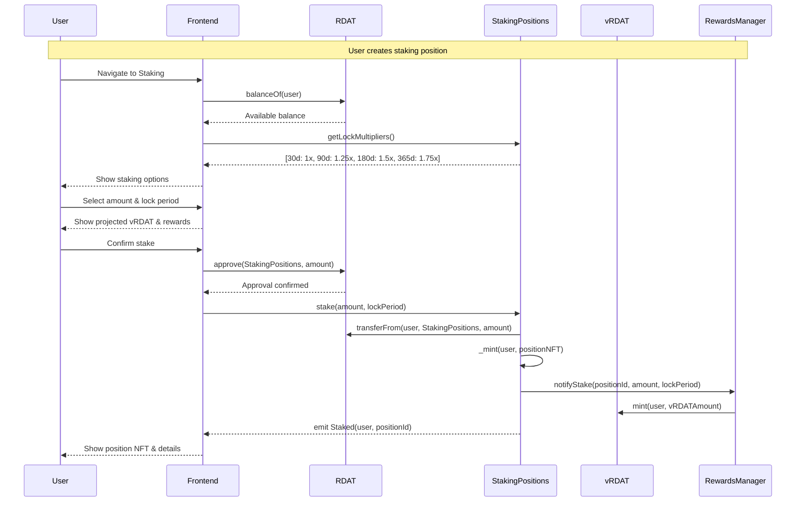

### 2.2 User Unstakes After Lock Period

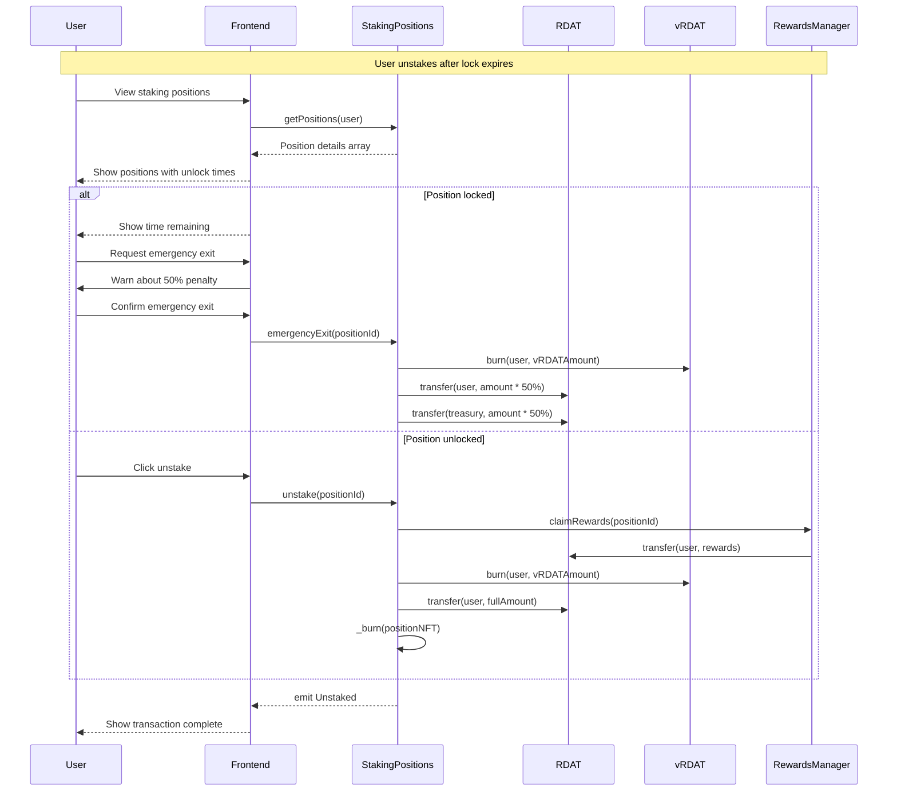

### 2.3 Claiming Staking Rewards

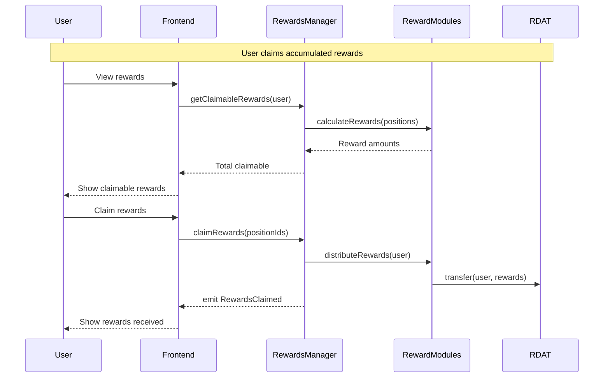

---

## 3. Governance Workflows

### 3.1 Creating a Governance Proposal

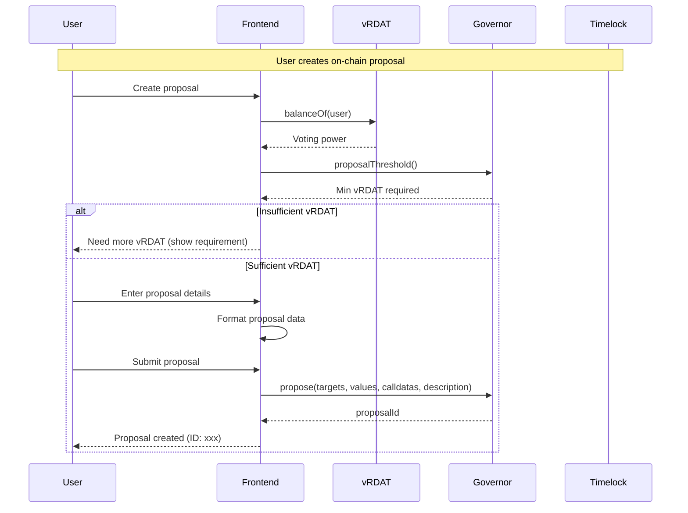

### 3.2 Quadratic Voting on Proposals

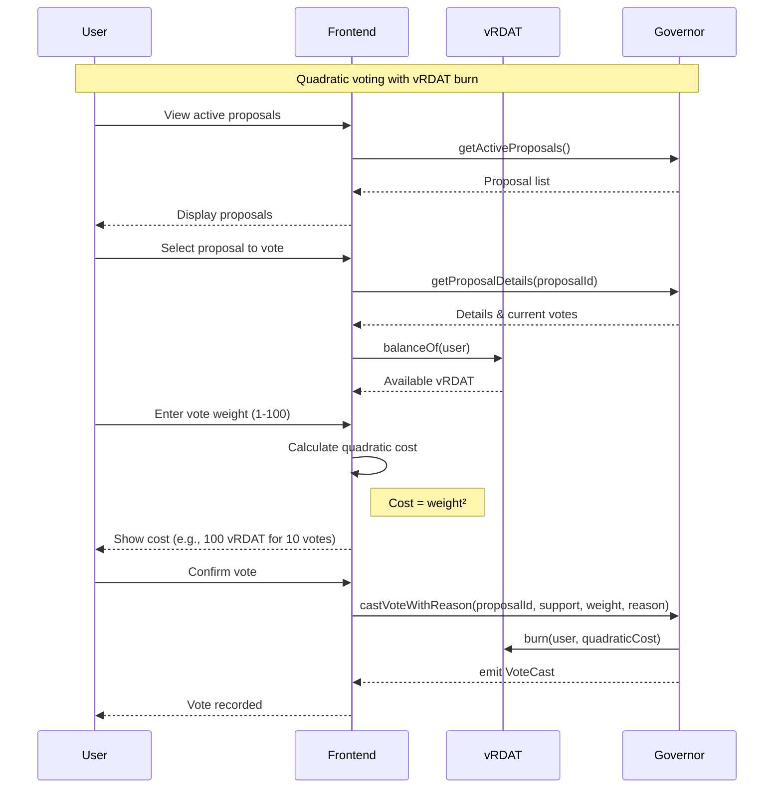

### 3.3 Proposal Execution

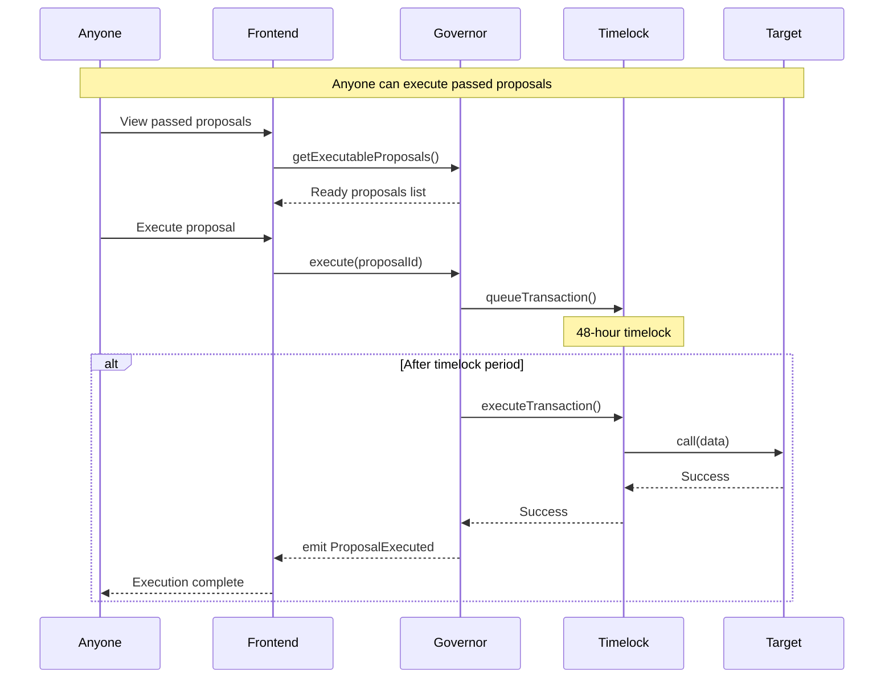

---

## 4. Contribution Workflows

### 4.1 Reddit Data Contribution & Validation

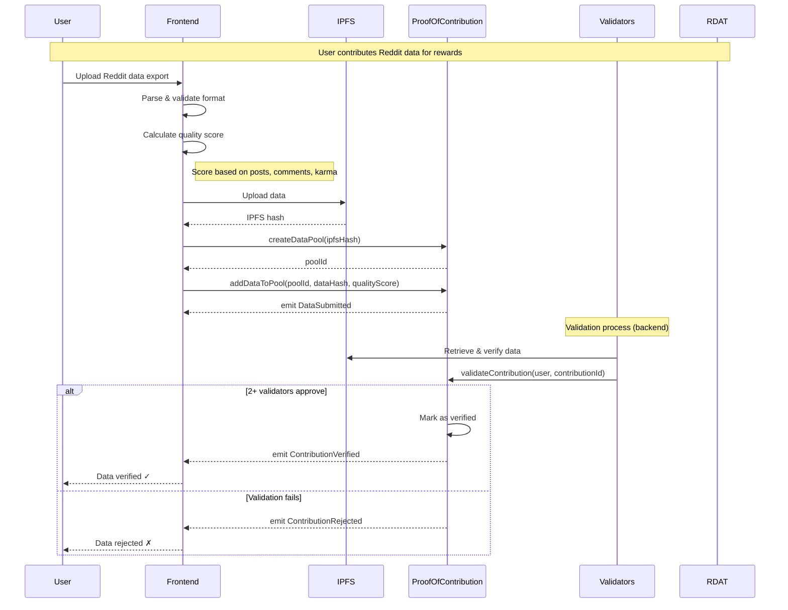

### 4.2 Kismet-Based Reward Distribution

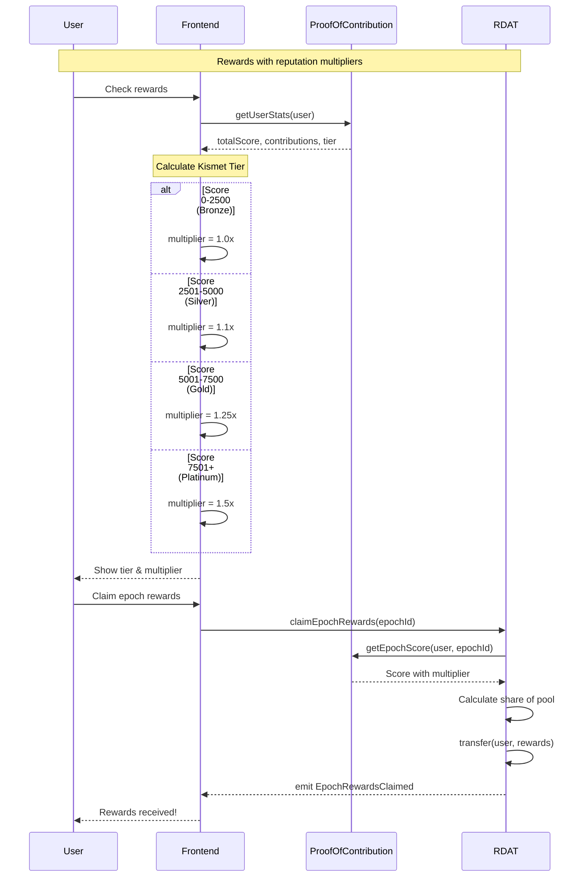

---

## 5. Admin Workflows

### 5.1 Emergency Pause

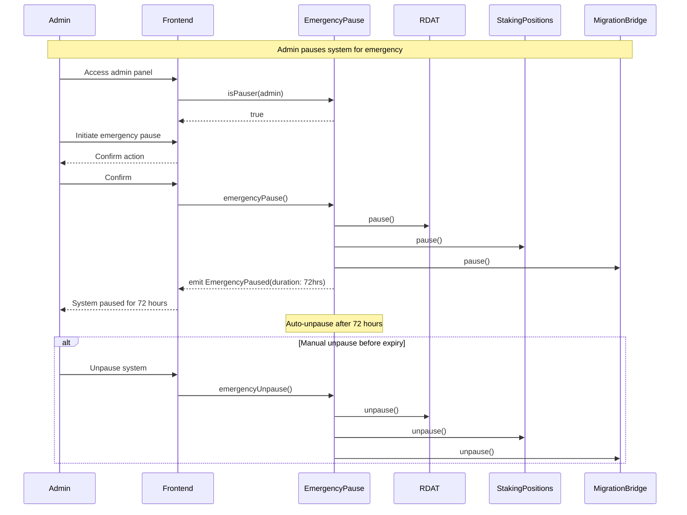

### 5.2 Contract Upgrade (UUPS)

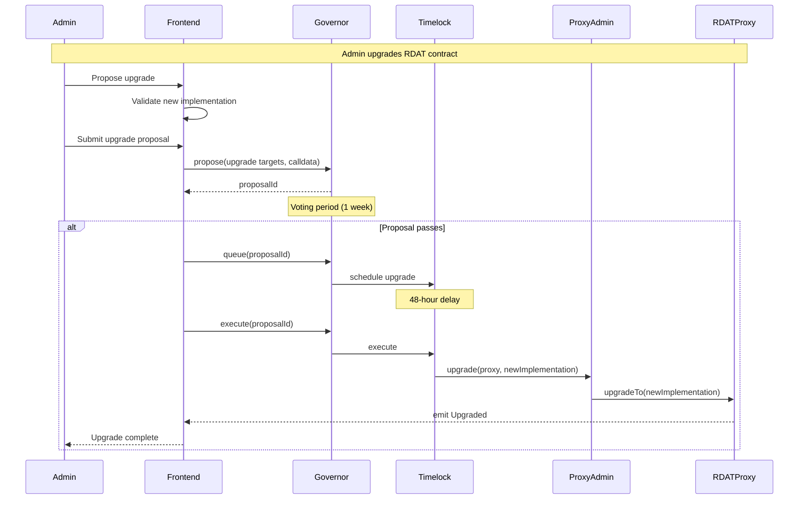

### 5.3 Treasury Distribution

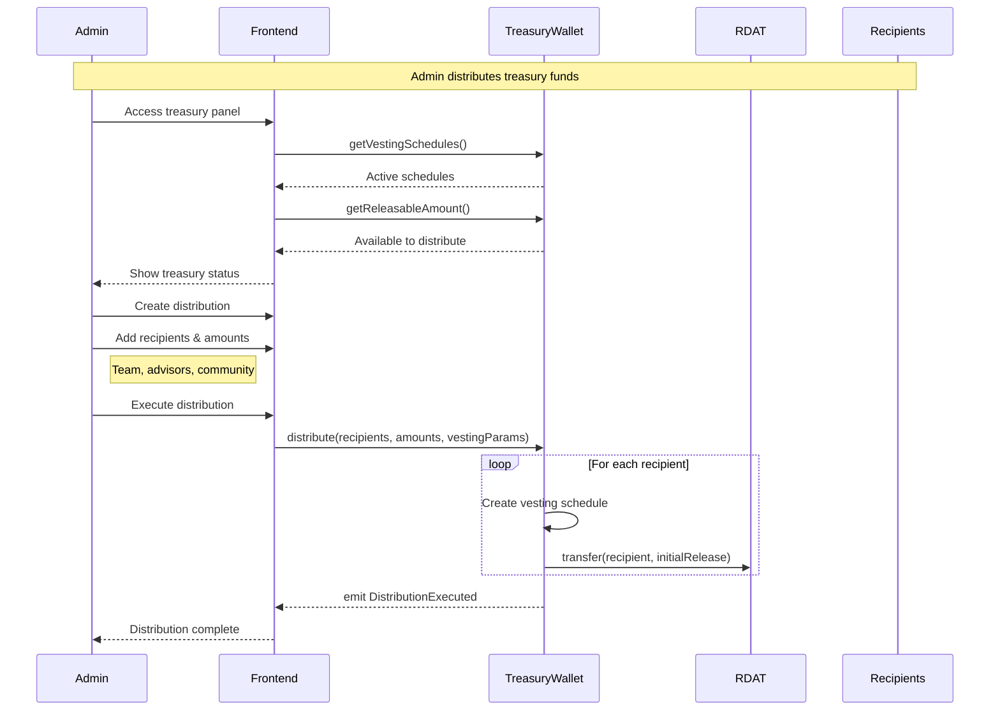

### 5.4 Validator Management

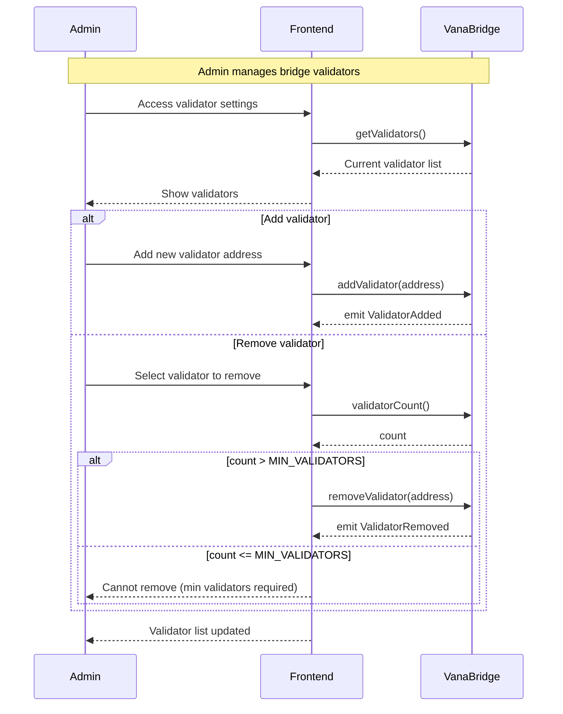

---

## 6. Front-End Integration Points

### 6.1 Key Smart Contract Interactions

| Workflow | Contract | Key Methods | Events to Monitor |
|----------|----------|-------------|-------------------|
| **Migration** | BaseMigrationBridge | `initiateMigration()` | `MigrationInitiated` |
| | VanaMigrationBridge | `executeMigration()`, `calculateBonus()` | `MigrationCompleted` |
| **Staking** | StakingPositions | `stake()`, `unstake()`, `emergencyExit()` | `Staked`, `Unstaked` |
| | RewardsManager | `claimRewards()`, `getClaimableRewards()` | `RewardsClaimed` |
| **Governance** | Governor | `propose()`, `castVote()`, `execute()` | `ProposalCreated`, `VoteCast` |
| | vRDAT | `balanceOf()`, `burn()` | `Transfer` |
| **Contribution** | ProofOfContribution | `createDataPool()`, `addDataToPool()` | `DataSubmitted`, `ContributionVerified` |
| | RDAT | `claimEpochRewards()` | `EpochRewardsClaimed` |
| **Admin** | EmergencyPause | `emergencyPause()`, `emergencyUnpause()` | `EmergencyPaused` |
| | TreasuryWallet | `distribute()`, `checkAndRelease()` | `DistributionExecuted` |

### 6.2 Frontend State Management

```typescript
// Key state to track
interface UserState {
  // Balances
  rdatBalance: BigNumber;
  vrdatBalance: BigNumber;
  v1TokenBalance: BigNumber;
  
  // Positions
  stakingPositions: Position[];
  migrationStatus: MigrationStatus;
  
  // Rewards
  claimableRewards: BigNumber;
  epochParticipation: Map<number, boolean>;
  kismetTier: 'Bronze' | 'Silver' | 'Gold' | 'Platinum';
  
  // Governance
  votingPower: BigNumber;
  activeProposals: Proposal[];
  delegatedTo: Address;
}

interface SystemState {
  paused: boolean;
  currentEpoch: number;
  migrationDeadline: Date;
  dailyMigrationLimit: BigNumber;
  dailyMigrationUsed: BigNumber;
}
```

### 6.3 Critical User Flows

1. **First-Time User**:
   - Connect wallet → Check V1 balance → Migrate → Stake → Participate in governance

2. **Returning User**:
   - Check positions → Claim rewards → Vote on proposals → Manage stakes

3. **Data Contributor**:
   - Submit data → Wait for validation → Check tier → Claim epoch rewards

4. **Admin**:
   - Monitor system → Respond to emergencies → Execute treasury operations → Manage validators

### 6.4 Error Handling

```typescript
// Common errors to handle
enum ContractError {
  INSUFFICIENT_BALANCE = "Insufficient balance",
  MIGRATION_DEADLINE_PASSED = "Migration deadline passed",
  POSITION_LOCKED = "Position still locked",
  DAILY_LIMIT_EXCEEDED = "Daily migration limit exceeded",
  NOT_AUTHORIZED = "Not authorized",
  PAUSED = "System is paused",
  INVALID_LOCK_PERIOD = "Invalid lock period",
  ALREADY_CLAIMED = "Already claimed",
  BELOW_MIN_STAKE = "Below minimum stake",
  CHALLENGE_PERIOD_ACTIVE = "Challenge period active"
}
```

### 6.5 Event Monitoring Setup

```javascript
// Critical events to monitor
const eventFilters = {
  // Migration events
  migrationInitiated: baseBridge.filters.MigrationInitiated(),
  migrationCompleted: vanaBridge.filters.MigrationCompleted(),
  
  // Staking events
  staked: stakingPositions.filters.Staked(),
  unstaked: stakingPositions.filters.Unstaked(),
  
  // Governance events
  proposalCreated: governor.filters.ProposalCreated(),
  voteCast: governor.filters.VoteCast(),
  proposalExecuted: governor.filters.ProposalExecuted(),
  
  // System events
  emergencyPaused: emergencyPause.filters.EmergencyPaused(),
  upgraded: proxy.filters.Upgraded()
};
```

---

## Implementation Checklist

### Frontend Components Needed

- [ ] **Migration Widget**: Balance check, amount input, bonus calculator, status tracker
- [ ] **Staking Dashboard**: Position cards, lock period selector, rewards tracker
- [ ] **Governance Portal**: Proposal list, voting interface, delegation manager
- [ ] **Contribution Hub**: Data upload, quality scorer, tier display
- [ ] **Admin Panel**: Emergency controls, treasury manager, validator settings
- [ ] **User Profile**: Balance overview, position summary, reward history

### Required Integrations

- [ ] **Wallet Connection**: MetaMask, WalletConnect, Coinbase Wallet
- [ ] **Multi-chain Support**: Base & Vana network switching
- [ ] **IPFS**: Data storage for contributions
- [ ] **Event Indexer**: Real-time updates via events
- [ ] **Price Feeds**: For USD value displays
- [ ] **Analytics**: User behavior tracking

### Security Considerations

- [ ] Input validation on all user inputs
- [ ] Proper error handling and user feedback
- [ ] Transaction confirmation dialogs
- [ ] Slippage protection for swaps
- [ ] Rate limiting on API calls
- [ ] Secure admin authentication

---

## Appendix: Contract Addresses

```javascript
// Mainnet Addresses (to be deployed)
const contracts = {
  base: {
    v1Token: "0x...",
    baseMigrationBridge: "0x..."
  },
  vana: {
    rdatToken: "0x...",
    vrdatToken: "0x...",
    stakingPositions: "0x...",
    vanaMigrationBridge: "0x...",
    governor: "0x...",
    treasuryWallet: "0x...",
    rewardsManager: "0x...",
    proofOfContribution: "0x...",
    emergencyPause: "0x..."
  }
};
```